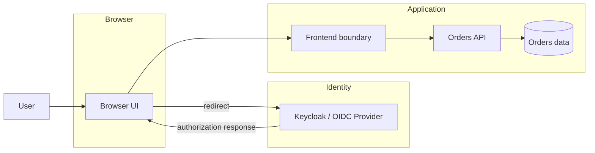
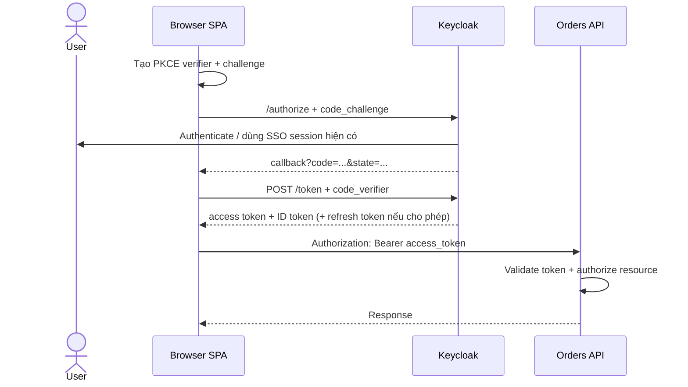
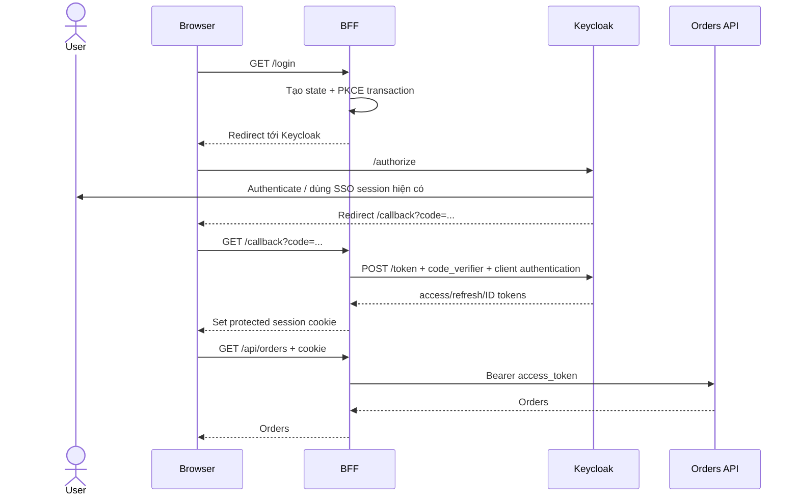
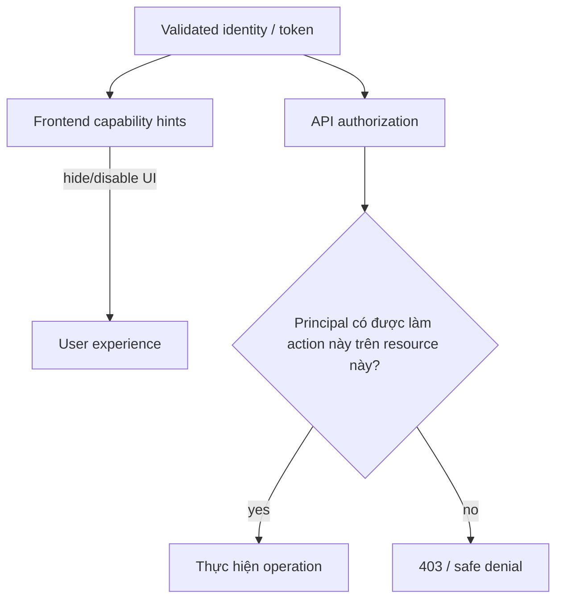

# Kiến trúc Xác thực Frontend: SPA vs BFF với OIDC & Keycloak

## Khủng hoảng production & TL;DR

Một đội frontend hoàn tất migration sang OIDC và mọi thứ chạy tốt ở development. Khi lên production, SPA lưu refresh token sống lâu trong browser persistence. Về sau một third-party widget có lỗ hổng XSS. JavaScript độc hại giờ có thể đọc token và replay nó bên ngoài browser, ngay cả sau khi tab đã đóng.

Sai lầm kiến trúc không phải là "dùng OAuth". Vấn đề là team chưa trả lời rõ **component nào sở hữu OAuth credential, component nào gọi API, và injected script có thể đánh cắp hay khiến browser tự gửi loại authority nào**.

> 💡 **Quy tắc bỏ túi:** Chọn browser authentication architecture bằng cách quyết định **token nằm ở đâu, ai thực hiện code exchange và refresh, API call được authorize thế nào, và bạn chấp nhận browser threat nào**.

- **Direct SPA:** browser là OAuth client, dùng Authorization Code + PKCE, nhận token rồi gọi API trực tiếp.
- **BFF:** Backend for Frontend phía server là OAuth client, giữ access/refresh token khỏi browser JavaScript và cho browser một protected cookie session.
- **HttpOnly không phải CSRF defense.** Nó ngăn JavaScript đọc cookie; browser vẫn có thể tự gắn cookie vào request.
- **Frontend role check là UX, không phải security boundary.** API vẫn phải validate credential và authorize action/resource cụ thể.
- **Sai lầm chí mạng:** chọn token storage vì tiện trước khi xác định trust boundary và threat model.

## Mục tiêu hệ thống và ràng buộc

Giả sử có React hoặc Next.js frontend, Keycloak là OpenID Provider / Authorization Server và Orders API.

Ta cần browser login qua Keycloak, UI biết trạng thái authenticated, API call được authorize, refresh không cần interactive login lặp lại, logout có scope rõ, và failure signal đủ tốt để debug.

Điểm khó là câu "user đã login" có thể đang nói về nhiều state khác nhau.

<TermBox term="Browser authentication architecture">
**Browser authentication architecture** xác định component nào là OAuth/OIDC client, token hoặc session identifier nằm ở đâu, và authenticated action từ browser đi tới protected API bằng đường nào.

**Tại sao quan trọng:** Direct SPA và BFF có thể dùng cùng một Keycloak realm nhưng expose credential trước các browser threat rất khác nhau.
</TermBox>

## Các trust boundary chính



Đừng gom tất cả thành một "auth service" mơ hồ. Keycloak authenticate và phát protocol credential. Frontend tạo user experience. API bảo vệ business resource.

## Kiến trúc A: direct SPA là OAuth client

Với direct SPA, browser code xử lý OAuth/OIDC transaction.



RFC 10017 mô tả browser-based OAuth client là public client: browser code không thể giữ client secret khỏi user hoặc khỏi malicious JavaScript chạy trong origin. Authorization Code + PKCE là baseline hiện tại cho browser; client identifier không phải secret.

### Frontend sở hữu gì?

SPA cần đủ state để correlate redirect transaction, hoàn thành code + PKCE exchange, biết UI đang authenticated hay không, refresh theo behavior của provider/library và attach access token vào đúng API.

Keycloak JavaScript adapter dùng OIDC, hỗ trợ Authorization Code flow và tài liệu hiện tại ghi S256 là PKCE method mặc định khi bật PKCE.

### Browser threat có ý nghĩa gì?

Nếu access hoặc refresh token hiện diện với JavaScript, malicious JavaScript chạy trong origin có thể truy cập cùng authority trong memory hoặc thực hiện call thay user.

Persist credential trong localStorage hoặc sessionStorage kéo dài exposure window vì value vẫn JavaScript-readable. Hướng dẫn session hiện tại của OWASP cảnh báo không lưu authentication token hay session ID ở đó.

Điều này không có nghĩa mọi SPA đều bắt buộc thành BFF. Nghĩa là token exposure phải là architectural trade-off tường minh, không phải implementation detail bị che giấu.

## Kiến trúc B: Backend for Frontend là OAuth client

Trong BFF pattern, OAuth responsibility chuyển sang server component thuộc frontend application.

<TermBox term="Backend for Frontend (BFF)">
Trong OAuth pattern này, **Backend for Frontend** là server-side component đóng vai confidential OAuth client, giữ OAuth access/refresh token trong backend session context và forward API request kèm access token phù hợp.

**Tại sao quan trọng:** browser JavaScript nhận session interface thay vì reusable OAuth bearer credential.
</TermBox>



RFC 10017 giao ba responsibility cốt lõi cho BFF: nó là confidential OAuth client, quản lý token trong session gắn với cookie và forward resource-server request với đúng access token.

Nhờ vậy browser không cần nhận OAuth bearer token.

## BFF chuyển rủi ro sang chỗ khác; nó không xóa rủi ro

BFF giảm direct token exposure cho browser JavaScript, nhưng browser request giờ authenticate bằng cookie.

<TermBox term="CSRF">
**Cross-Site Request Forgery (CSRF)** là kiểu tấn công khiến browser gửi authenticated request mà user không chủ ý.

**Tại sao quan trọng:** HttpOnly ngăn JavaScript đọc cookie nhưng browser vẫn tự attach cookie đủ điều kiện vào request. State-changing endpoint authenticate bằng cookie vì vậy cần CSRF defense có chủ đích.
</TermBox>

Với BFF session cookie, RFC 10017 yêu cầu Secure và HttpOnly, khuyến nghị SameSite=Strict, Path=/, không đặt Domain, cùng HTTP-set cookie prefix nơi hỗ trợ. OWASP cũng xem SameSite là defense in depth và nhấn mạnh nhiều deployment vẫn cần CSRF token hoặc origin-bound defense tương đương.

```text
HttpOnly   -> script không đọc được cookie
Secure     -> cookie chỉ gửi qua secure transport
SameSite   -> giới hạn cross-site cookie sending
CSRF check -> xác minh request intent cho state-changing operation
```

Secure cookie không đồng nghĩa với authorized business operation.

## So sánh theo responsibility

| Câu hỏi | Direct SPA | BFF |
| --- | --- | --- |
| OAuth client | Browser application | Server-side BFF |
| Client secret | Không thể confidential | Có thể bảo vệ server-side |
| PKCE | Có | Có trong RFC 10017 BFF flow |
| Access token visible cho browser JS | Có | Không theo thiết kế |
| Refresh token visible cho browser JS | Tùy provider/library | Không theo thiết kế |
| API call | Browser → API | Browser → BFF → API |
| Browser auth state | Token/session state trong app | Cookie session |
| Browser risk chính | token exposure khi injected JS chạy | CSRF/session-riding và action do XSS gây ra |
| CORS pressure | Thường có nếu browser → API cross-origin | Thường giảm với same-origin BFF |
| Operational cost | topology đơn giản hơn | thêm server/proxy/session component |

RFC 10017 trình bày BFF, token-mediating backend và browser OAuth client theo mức bảo mật giảm dần, đồng thời nêu rõ complexity trade-off. Đây không phải mệnh lệnh universal rằng mọi application đều phải dùng BFF.

## Trace một login bằng DevTools

Khi debug, đừng nghĩ "Keycloak redirect nhiều quá". Hãy trace từng boundary.

### Direct SPA

1. **Navigation tới /authorize**
   - kiểm client_id và exact redirect_uri;
   - kiểm response_type=code;
   - kiểm scope có openid nếu dùng OIDC;
   - kiểm PKCE challenge và method;
   - quan sát state và nonce khi dùng.

2. **Callback**
   - browser quay về với authorization code sống ngắn;
   - với Authorization Code flow, đừng chờ access token xuất hiện trong URL;
   - verify application state correlation.

3. **Token request**
   - exchange code + code_verifier;
   - browser client không được giả vờ bundled client secret là confidential.

4. **API call**
   - Authorization: Bearer access_token;
   - nếu fail, tách token validation khỏi business authorization.

### BFF

1. browser gọi /login trên BFF;
2. BFF tạo OAuth transaction rồi redirect tới Keycloak;
3. callback code đi qua browser về BFF;
4. BFF token exchange server-side;
5. browser nhận session cookie, không nhận OAuth access token;
6. browser gọi BFF kèm cookie;
7. BFF lấy hoặc refresh access token rồi gọi API.

Sequence này đặc biệt hữu ích khi browser Network panel **không thấy** /token: với BFF, điều đó có thể hoàn toàn đúng vì exchange xảy ra server-to-server.

## UI authorization và API authorization là hai việc khác nhau

Frontend có thể dùng claim để quyết định render nút "Approve refund" hay không. Đó là UX tốt. Nó không phải enforcement.



User có thể gọi API mà không bấm nút của bạn. API phải tự verify principal, token purpose/audience và application-specific permission.

## Refresh là một phần của architecture

Đừng gắn refresh vào sau khi login đã xong.

Với direct SPA, refresh behavior phụ thuộc provider/library và việc browser-held refresh token có được cho phép không. Keycloak JavaScript adapter expose token refresh qua adapter API.

Với BFF, backend associate refresh token với server-side session và có thể refresh access token mà không expose refresh token cho JavaScript.

Dù pattern nào, access-token expiry không đồng nghĩa logout, refresh failure cần explicit session outcome và permission change có thể cần revocation mạnh hơn việc chỉ chờ expiry.

## Logout có nhiều scope

Mental model hữu ích gồm ba lớp:

```text
1. UI state            -> frontend không còn hiển thị authenticated state
2. Application session -> credential/cookie local của SPA/BFF được clear
3. IdP / SSO session   -> Keycloak login session kết thúc khi flow đã chọn yêu cầu
```

Chỉ clear React state không revoke server session. Clear một application session cũng không tự động logout mọi application nối SSO.

## Production micro-scenario: "secure cookie" nhưng không có CSRF boundary

Một team migrate từ browser token sang BFF và set đúng session cookie thành Secure; HttpOnly. Họ nghĩ browser giờ an toàn vì injected JavaScript không đọc được credential. BFF expose POST /api/payments/refund và authenticate chỉ bằng cookie. Không có CSRF token hay Origin/Referer validation.

- **Hậu quả:** Browser của user đang login có thể bị dụ gửi authenticated state-changing request từ attacker-controlled site khi cookie policy và request shape cho phép.
- **Nguyên nhân cốt lõi:** Team nhầm credential confidentiality (HttpOnly) với request-intent validation.
- **Cách khắc phục chuẩn:** Bảo vệ session cookie, dùng SameSite policy phù hợp, enforce CSRF defense cho state-changing cookie-authenticated endpoint và vẫn authorize action/resource ở API.

## Kiểm tra mental model

> **Tình huống:** Frontend hide Admin tab nếu decoded access token không có admin role. User không nhìn thấy tab. Admin API đã được bảo vệ chưa?

<details>
<summary>Xem giải thích chi tiết</summary>

Chưa.

Frontend check cải thiện UX nhưng logic frontend nằm trong vùng attacker kiểm soát. Caller có thể bypass UI và gửi request trực tiếp. API phải validate access token theo expected issuer/audience/profile và enforce authorization policy cho resource được yêu cầu.

</details>

## Checklist review kiến trúc

- [ ] **Ownership:** Component nào là OAuth/OIDC client?
- [ ] **Threat model:** Browser JavaScript có đọc được reusable bearer credential không?
- [ ] **Flow:** Browser OAuth có dùng Authorization Code + PKCE không?
- [ ] **Secrets:** Confidential client credential có chỉ nằm server-side không?
- [ ] **Redirect:** Redirect URI có được register đủ chặt không?
- [ ] **Session:** Nếu dùng BFF cookie, Secure, HttpOnly, SameSite, Path và Domain có được chọn có chủ đích không?
- [ ] **CSRF:** State-changing endpoint authenticate bằng cookie có chống forged cross-site request không?
- [ ] **CORS:** Nếu browser gọi API cross-origin, origin và credentials có được cấu hình chủ đích không?
- [ ] **Tokens:** ID Token có được tách khỏi API access token không?
- [ ] **Validation:** API có validate issuer, audience/resource, time, signature/key và token profile không?
- [ ] **Authorization:** API có authorize action/resource cụ thể sau authentication không?
- [ ] **Refresh:** Refresh-token ownership và failure behavior có rõ không?
- [ ] **Logout:** UI, application-session và IdP/SSO logout scope có được phân biệt không?
- [ ] **Evidence:** Có trace được authorize, callback, token/session establishment, API call, refresh và logout không?

## Các bài Atlas liên quan

- [OAuth 2.0 & OpenID Connect](/vi/docs/backend-engineering/oauth-and-oidc) dạy protocol primitive phía sau cả hai kiến trúc.
- [Keycloak Thực chiến](/vi/docs/backend-engineering/keycloak-in-practice) ánh xạ protocol sang realm, client, role, client scope và mapper.
- [Cẩm nang Debug Auth](/vi/docs/backend-engineering/auth-debugging-field-guide) biến lỗi 401, 403, CORS, redirect mismatch, issuer và audience thành workflow debug theo boundary.
- [Cookies và Sessions](/vi/docs/web-platform/cookies-and-sessions) giải thích cookie/session behavior trong browser.
- [Same-Origin Policy và CORS](/vi/docs/web-platform/same-origin-and-cors) giải thích cross-origin browser enforcement.

## Nguồn tham khảo

- [RFC 10017 — OAuth 2.0 for Browser-Based Applications](https://www.rfc-editor.org/rfc/rfc10017.html)
- [RFC 9700 — Best Current Practice for OAuth 2.0 Security](https://www.rfc-editor.org/rfc/rfc9700.html)
- [OWASP Session Management Cheat Sheet](https://cheatsheetseries.owasp.org/cheatsheets/Session_Management_Cheat_Sheet.html)
- [OWASP Cross-Site Request Forgery Prevention Cheat Sheet](https://cheatsheetseries.owasp.org/cheatsheets/Cross-Site_Request_Forgery_Prevention_Cheat_Sheet.html)
- [Keycloak JavaScript Adapter](https://www.keycloak.org/securing-apps/javascript-adapter)
- [OpenID Connect Core 1.0](https://openid.net/specs/openid-connect-core-1_0-18.html)
