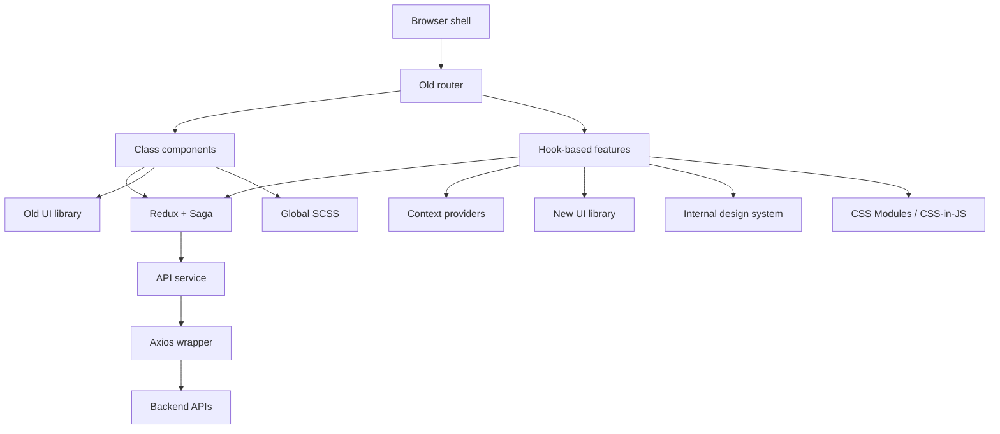
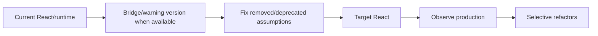
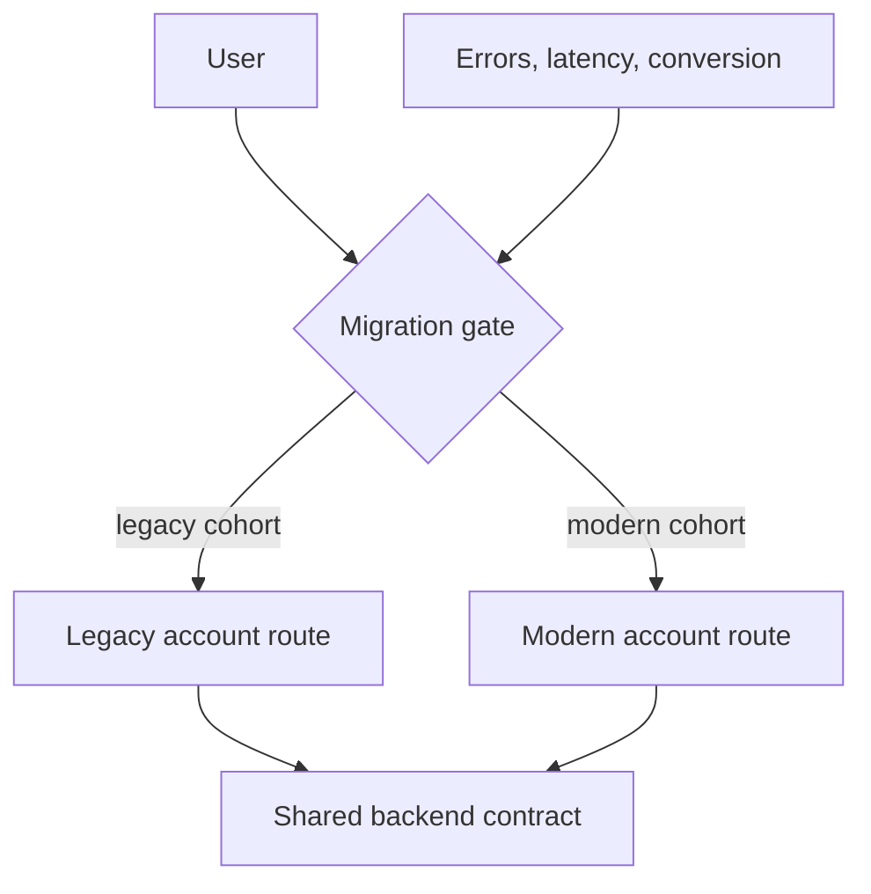

# Modernizing a Seven-Year-Old React Application

## Production crisis & TL;DR

Assume you inherit a seven-year-old commerce frontend that has survived three companies, five teams, and several architectural fashions.

It contains:

- React class components and newer hooks;
- Redux, Redux Saga, Context, and local state;
- two UI libraries plus an internal design system;
- global SCSS, CSS Modules, and CSS-in-JS;
- an old router and a new routing helper;
- one abandoned date library;
- one beta rich-text editor on a business-critical publishing path;
- an Axios wrapper around another API wrapper;
- custom feature flags no one wants to remove;
- sparse automated tests;
- a large browser bundle;
- production behavior that only a few long-tenured engineers can explain.

The correct response is **not** "rewrite it in modern React." The correct response is to reduce uncertainty and migration risk in a deliberate sequence.

> 💡 **Rule of thumb:** Modernize the system by **making each next change safer than the previous one**. Build evidence, isolate boundaries, remove blockers, migrate vertical slices, and delete temporary compatibility code as soon as its job is finished.

### The modernization sequence

```mermaid
flowchart LR
  P0[0 Observe] --> P1[1 Stabilize]
  P1 --> P2[2 Dependency cleanup]
  P2 --> P3[3 Boundary cleanup]
  P3 --> P4[4 React/toolchain upgrade]
  P4 --> P5[5 State rationalization]
  P5 --> P6[6 Feature migration]
  P6 --> P7[7 Delete compatibility code]
  P7 --> P8[8 Prevent relapse]
```



The phases overlap in practice, but the ordering principle matters: **do not increase architectural ambition faster than your evidence improves.**

<TermBox term="Modernization program">
A **modernization program** is a sequence of changes that improves the ability to evolve an existing system while preserving important production behavior.

**Why it matters:** success is measured by safer change, reduced blockers, and clearer ownership—not by the percentage of files rewritten.
</TermBox>

## The starting architecture

The application initially looks like this:



This is not automatically "bad architecture." It is an architecture with too many overlapping ownership models and migration constraints.

The first job is to discover which overlaps create real cost.

## Phase 0: Observe before changing

The team spends the first iteration producing four artifacts.

### A. Runtime and dependency ledger

For every important package:

- current version;
- target version or disposition;
- peer/runtime constraints;
- maintenance status;
- critical-route reachability;
- owner;
- migration option: keep, upgrade, wrap, replace, delete.

### B. State ownership map

The team discovers:

- search filters exist in Redux and URL query parameters;
- product results live in Redux and a query cache;
- modal visibility is global;
- authenticated profile is copied into three stores;
- checkout workflow legitimately spans routes and needs shared client coordination.

### C. Critical-journey evidence

The team protects:

- login;
- search/filter;
- checkout;
- order confirmation;
- account permissions;
- publishing in the beta editor.

### D. Production baseline

They record:

- JavaScript error rate;
- API failure rate;
- bundle/chunk size;
- Core Web Vitals for top routes;
- checkout conversion;
- publishing success;
- deployment and rollback frequency.

No modernization claim is accepted without a before/after signal.

## Phase 1: Stabilize before upgrading

The team does **not** start with React.

First it removes uncontrolled change:

- pin the beta editor version;
- document why it is still used;
- add a rollback owner;
- add a characterization test around publish/save behavior;
- remove truly unused packages;
- stop adding new dependencies without an owner/purpose note;
- add browser traces for critical E2E failures;
- create one runbook for production rollback.

<TermBox term="Stabilization">
**Stabilization** reduces uncontrolled variables before a migration: versions become explicit, critical behavior gains evidence, and rollback/ownership become clear.

**Why it matters:** an upgrade is easier to diagnose when the dependency graph and production behavior are not moving underneath it.
</TermBox>

The goal is not a perfect test suite. It is enough evidence to distinguish "the migration changed behavior" from "the old system was already unstable."

## Phase 2: Clean dependency blockers

The team classifies dependencies:

| Dependency | Decision | Reason |
| --- | --- | --- |
| abandoned date library | Wrap then replace | small API, easy seam |
| beta editor | Keep temporarily | critical path; replacement cost high; pin and monitor |
| old router | Upgrade | target React compatibility blocker |
| duplicate utility library | Delete | unused after import graph audit |
| old test adapter | Replace | depends on removed React internals |
| internal Axios wrapper | Collapse | forwards another wrapper without app semantics |

A critical detail: **the beta editor is not replaced first merely because it is beta.**

The team has stronger React/router blockers and insufficient evidence to replace publishing safely. The beta risk is managed while higher-leverage blockers are removed.

## Phase 3: Restore useful boundaries

The team identifies two categories of abstraction:

1. **boundaries that protect application semantics**;
2. **indirection that only forwards library APIs**.

It keeps:

```text
loadCurrentUser()
formatOrderDate()
submitOrder()
trackCheckoutStarted()
```

because these expose application meaning.

It collapses:

```text
useAppQuery(options) -> useQuery(options)
apiService -> axiosService -> axios
ButtonController -> ButtonService -> ButtonFactory
```

when those layers provide no meaningful isolation.

The important outcome is **change locality**: one product change should stop requiring navigation through unrelated layers.

## Phase 4: Upgrade React and the toolchain

Now the team has:

- known blockers;
- critical journey evidence;
- a smaller dependency graph;
- fewer accidental wrappers;
- production baselines.

The React upgrade is treated as a compatibility project.



The team does **not** convert every class component to hooks during the runtime cutover.

Instead it:

- fixes removed APIs;
- updates React DOM entry points;
- updates router/test packages in compatible slices;
- uses Strict Mode to surface lifecycle bugs;
- runs codemods only for mechanical transformations;
- keeps stable class components where they are not blockers.

The deployment can be rolled back independently from later state-management work.

## Phase 5: Rationalize state ownership

After runtime stability, the team attacks Redux sprawl feature by feature.

### Search feature

Before:

```text
Redux filters
 + URL filters
 + local drawer copy
 + query cache request key
```

After:

```text
URL = authoritative search/filter state
query cache = remote product results
component state = drawer open/closed
Redux = no search ownership
```

### Checkout

Checkout remains partly in Redux because:

- it spans routes;
- optimistic transitions matter;
- several distant features coordinate;
- action history aids debugging.

The store setup moves to Redux Toolkit first. Then remote data leaves generic Redux slices. Derived totals become selectors. Old saga logic is removed only after behavior is covered.

The metric is not "Redux lines removed." It is **fewer competing writable sources of truth**.

## Phase 6: Migrate features vertically

With the platform upgraded, the team modernizes product capabilities route by route.



For each slice:

1. define the user journey;
2. define old/new contract compatibility;
3. add the new implementation;
4. route an internal or small cohort;
5. compare errors, latency, and business outcome;
6. expand rollout;
7. remove the old path;
8. remove the flag and adapter.

Feature flags are rollout controls, not permanent architecture.

## Phase 7: Delete compatibility code aggressively

Every migration creates temporary code:

- adapters;
- dual state bridges;
- route gates;
- feature flags;
- old package versions;
- compatibility types.

Temporary code becomes new debt when nobody owns its deletion.

The team keeps a deletion ledger:

```text
adapter              last caller      delete when
-------------------------------------------------------
legacyCartAdapter    checkout-v1      cohort = 100%
oldDateBridge        report-route     route migrated
newAccountFlag       account route    2 weeks stable
reduxProfileMirror   legacy header    header removed
```

Deleting compatibility code is part of "done," not optional cleanup.

## Phase 8: Prevent relapse

Modernization has failed if the codebase starts accumulating the same problems again.

The team adds lightweight guardrails:

- dependency additions require purpose and owner;
- prerelease production dependencies require explicit rationale;
- duplicated global state is challenged in review;
- compatibility adapters require deletion conditions;
- critical route E2E coverage is maintained;
- bundle and error budgets are monitored;
- architecture rules focus on boundaries, not stylistic uniformity.

Do not create a heavyweight governance committee. The goal is to make the healthy path easier than the old accidental one.

## How progress is measured

Track outcomes, not rewritten-file counts.

Useful measures:

- number of target-runtime blockers;
- unsupported/deprecated critical dependencies;
- duplicate state owners;
- average files touched per common product change;
- critical journey pass/recovery confidence;
- bundle size and route performance;
- production error rate;
- deployment lead time;
- rollback time;
- count of temporary migration adapters/flags still alive.

A modernization program should eventually **reduce the amount of special migration machinery**.

## Production micro-scenario: the rewrite that never catches up

A separate team spends nine months rebuilding the frontend in a new repository. Meanwhile the legacy app receives pricing changes, new permissions, three checkout experiments, and regulatory copy updates. At cutover, the new app is hundreds of behavior changes behind and must ship a giant reconciliation release.

- **Impact:** months of engineering investment produce a high-risk launch and a long period of dual maintenance.
- **Root cause:** the rewrite separated modernization from the continuously changing product, so production learning accumulated only in the old system.
- **Correct pattern:** migrate vertical slices through explicit seams, release them into production early, and let each completed slice retire corresponding legacy behavior.

## Failure modes to watch

### Modernization becomes a style crusade

Symptom: class components, naming conventions, and file layout dominate the roadmap.

Correction: prioritize compatibility, ownership, delivery friction, security, and production risk.

### Old and new architectures coexist forever

Symptom: every feature has a v1/v2 flag, two data models, and an adapter.

Correction: every bridge needs an owner and deletion condition.

### Tests block all change

Symptom: team decides the whole app must reach a coverage target before upgrading.

Correction: protect the migration seam and critical journeys first.

### New abstractions recreate old indirection

Symptom: the new code introduces a generic "platform layer" before repeated needs exist.

Correction: prefer concrete product semantics; extract only after stable repetition or real variation emerges.

## Check your mental model

> **Scenario:** Six months into migration, 70% of users are on the new account route. Error rate and task completion are healthy. The team wants to start another large route before deleting the old account implementation, flag, and adapter because "cleanup can wait." Is that healthy?

<details>
<summary>Show the reasoning</summary>

Usually no.

The migration has not fully reduced complexity until the old path and temporary routing machinery are removed. Starting more migrations while finished slices retain compatibility scaffolding increases the number of architectures the team must operate simultaneously. Complete the cutover, observe the agreed stability window, then delete the old path and flag before expanding the migration inventory.

</details>

## Modernization walkthrough checklist

- [ ] **Baseline:** Capture runtime, dependency, state, journey, and production evidence before changing architecture.
- [ ] **Stabilize:** Pin risky prereleases, add ownership, and protect critical behavior.
- [ ] **Blockers:** Remove compatibility blockers before aesthetic refactors.
- [ ] **Boundaries:** Preserve abstractions that isolate real semantics; collapse pass-through indirection.
- [ ] **React:** Keep runtime upgrade independently releasable from optional component rewrites.
- [ ] **State:** Reduce competing writable owners feature by feature.
- [ ] **Slices:** Migrate complete user journeys through observable gates.
- [ ] **Rollout:** Compare old/new production signals and keep rollback explicit.
- [ ] **Deletion:** Remove old implementations, flags, adapters, and package versions after cutover.
- [ ] **Guardrails:** Prevent new prerelease, global-state, dependency, and abstraction debt from silently accumulating.
- [ ] **Outcomes:** Measure safer change and reduced blockers, not rewritten-file percentage.

## Related Atlas lessons

- [Legacy Frontend Assessment](/docs/frontend-engineering/legacy-frontend-assessment)
- [React Modernization](/docs/frontend-engineering/react-modernization)
- [Dependency Archaeology](/docs/frontend-engineering/dependency-archaeology)
- [Redux Everywhere](/docs/frontend-engineering/redux-everywhere)
- [De-Overengineering the Frontend](/docs/frontend-engineering/de-overengineering-frontend)
- [Incremental Frontend Migration](/docs/frontend-engineering/incremental-frontend-migration)
- [Safety Nets for Legacy Frontend Upgrades](/docs/frontend-engineering/legacy-frontend-safety-nets)
- [Frontend Modernization Decision Guide](/docs/engineering-judgment/decision-guides/frontend-modernization-upgrade-replace-wrap-delete)

## Sources

- [React 19.3](https://react.dev/blog/2026/09/09/react-19-3)
- [React 19 Upgrade Guide](https://react.dev/blog/2024/04/25/react-19-upgrade-guide)
- [Redux — Migrating to Modern Redux](https://redux.js.org/usage/migrating-to-modern-redux)
- [Martin Fowler — Strangler Fig](https://martinfowler.com/bliki/StranglerFigApplication.html)
- [Playwright — Tracing](https://playwright.dev/docs/api/class-tracing)
- [npm — Using deprecated packages](https://docs.npmjs.com/using-deprecated-packages/)
