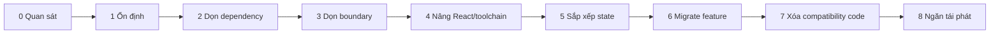
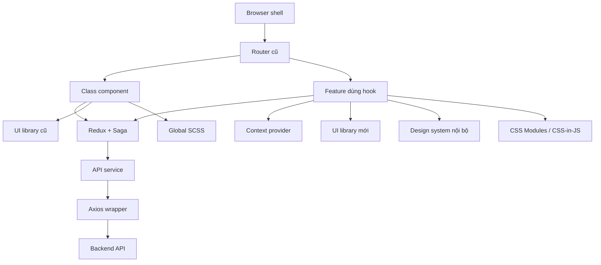
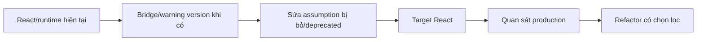
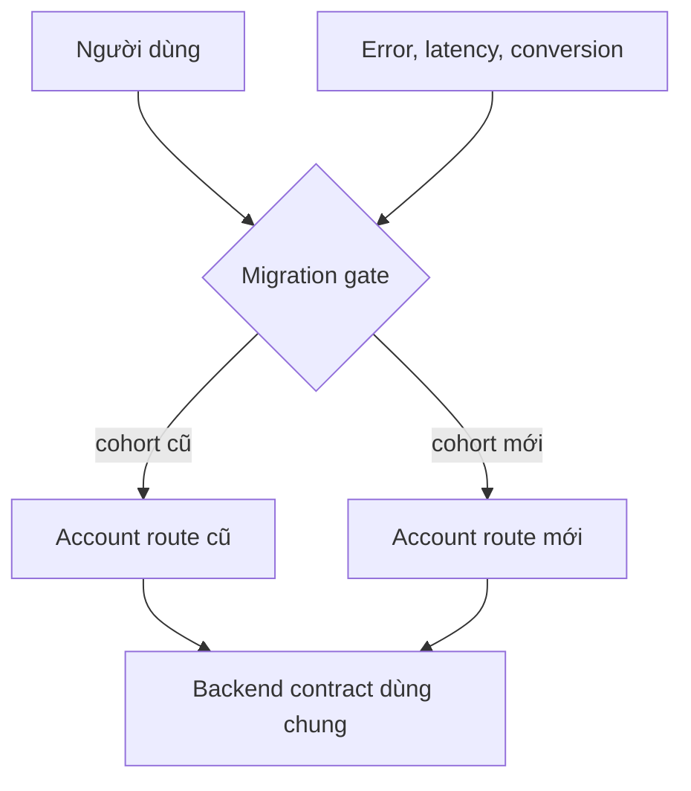

# Modernize một Ứng dụng React Bảy Năm Tuổi

## Khủng hoảng production & tóm tắt

Giả sử bạn tiếp quản một frontend commerce bảy năm tuổi đã đi qua ba công ty, năm team và nhiều làn sóng kiến trúc.

Nó có:

- React class component nằm cạnh hook mới;
- Redux, Redux Saga, Context và local state;
- hai UI library cộng một design system nội bộ;
- global SCSS, CSS Modules và CSS-in-JS;
- router cũ và helper routing mới;
- một date library bị bỏ bảo trì;
- một rich-text editor beta trên đường publishing quan trọng;
- Axios wrapper bọc một API wrapper khác;
- feature flag tự viết không ai muốn xóa;
- automated test thưa;
- browser bundle lớn;
- behavior production chỉ vài engineer lâu năm giải thích được.

Phản ứng đúng **không phải** "rewrite bằng React hiện đại". Phản ứng đúng là giảm uncertainty và migration risk theo thứ tự có chủ đích.

> 💡 **Quy tắc thực hành:** Modernize hệ thống bằng cách **làm cho mỗi thay đổi tiếp theo an toàn hơn thay đổi trước**. Xây bằng chứng, cô lập boundary, gỡ blocker, migrate vertical slice và xóa compatibility code tạm ngay khi hoàn thành nhiệm vụ.

### Chuỗi modernization



Các phase có thể chồng nhau, nhưng nguyên tắc thứ tự quan trọng: **đừng tăng tham vọng kiến trúc nhanh hơn tốc độ bằng chứng được cải thiện.**

<TermBox term="Chương trình modernization">
Một **chương trình modernization** là chuỗi thay đổi giúp một hệ thống đang tồn tại dễ tiến hóa hơn trong khi giữ behavior production quan trọng.

**Tại sao quan trọng:** thành công được đo bằng thay đổi an toàn hơn, ít blocker hơn và ownership rõ hơn, không phải tỷ lệ file được rewrite.
</TermBox>

## Kiến trúc ban đầu

Ứng dụng ban đầu trông như sau:



Đây không tự động là "kiến trúc tệ". Đây là kiến trúc có quá nhiều ownership model và migration constraint chồng nhau.

Việc đầu tiên là tìm overlap nào thật sự tạo chi phí.

## Phase 0: Quan sát trước khi sửa

Team dành iteration đầu tạo bốn artifact.

### A. Sổ runtime và dependency

Với mỗi package quan trọng:

- version hiện tại;
- target version hoặc disposition;
- peer/runtime constraint;
- maintenance status;
- critical-route reachability;
- owner;
- lựa chọn migration: giữ, nâng, bọc, thay, xóa.

### B. Bản đồ ownership state

Team phát hiện:

- search filter tồn tại trong Redux và URL query parameter;
- product result nằm trong Redux và query cache;
- modal visibility là global;
- authenticated profile bị copy vào ba store;
- checkout workflow thật sự span nhiều route và cần shared client coordination.

### C. Bằng chứng critical journey

Team bảo vệ:

- login;
- search/filter;
- checkout;
- order confirmation;
- account permission;
- publishing qua beta editor.

### D. Baseline production

Team ghi:

- JavaScript error rate;
- API failure rate;
- bundle/chunk size;
- Core Web Vitals cho route chính;
- checkout conversion;
- publishing success;
- deployment và rollback frequency.

Không claim modernization nào được chấp nhận nếu không có tín hiệu trước/sau.

## Phase 1: Ổn định trước khi nâng

Team **không** bắt đầu bằng React.

Trước tiên nó giảm uncontrolled change:

- pin version beta editor;
- ghi vì sao vẫn dùng;
- gán rollback owner;
- thêm characterization test quanh publish/save behavior;
- xóa package thật sự unused;
- ngừng thêm dependency mới nếu không có purpose và owner;
- bật browser trace cho critical E2E failure;
- tạo một runbook rollback production.

<TermBox term="Ổn định hóa">
**Ổn định hóa** giảm biến số không kiểm soát trước migration: version trở nên explicit, critical behavior có evidence và rollback/ownership rõ.

**Tại sao quan trọng:** upgrade dễ diagnose hơn khi dependency graph và production behavior không tiếp tục đổi bên dưới.
</TermBox>

Mục tiêu không phải test suite hoàn hảo. Mục tiêu là đủ evidence để phân biệt "migration đổi behavior" với "hệ thống cũ vốn đã unstable."

## Phase 2: Dọn dependency blocker

Team phân loại dependency:

| Dependency | Quyết định | Lý do |
| --- | --- | --- |
| date library bị bỏ | Bọc rồi thay | API nhỏ, seam dễ |
| beta editor | Giữ tạm | critical path; replacement cost cao; pin và theo dõi |
| router cũ | Nâng | chặn target React compatibility |
| utility library trùng | Xóa | không dùng sau import-graph audit |
| test adapter cũ | Thay | phụ thuộc React internal đã bị bỏ |
| Axios wrapper nội bộ | Thu gọn | chỉ forward wrapper khác, không có app semantics |

Chi tiết quan trọng: **beta editor không bị thay đầu tiên chỉ vì nó là beta.**

Team còn blocker React/router mạnh hơn và chưa đủ evidence để thay publishing an toàn. Beta risk được quản lý trong khi blocker leverage cao hơn được gỡ.

## Phase 3: Khôi phục boundary hữu ích

Team chia abstraction thành hai nhóm:

1. **boundary bảo vệ application semantics**;
2. **indirection chỉ forward API library**.

Team giữ:

```text
loadCurrentUser()
formatOrderDate()
submitOrder()
trackCheckoutStarted()
```

vì chúng expose nghĩa của ứng dụng.

Team thu gọn:

```text
useAppQuery(options) -> useQuery(options)
apiService -> axiosService -> axios
ButtonController -> ButtonService -> ButtonFactory
```

khi layer không tạo isolation có ý nghĩa.

Outcome quan trọng là **change locality**: một product change ngừng yêu cầu đi qua nhiều layer không liên quan.

## Phase 4: Nâng React và toolchain

Lúc này team đã có:

- blocker đã biết;
- critical journey evidence;
- dependency graph nhỏ hơn;
- ít wrapper vô tình hơn;
- production baseline.

React upgrade được xem là compatibility project.



Team **không** đổi mọi class component sang hook trong runtime cutover.

Thay vào đó:

- sửa API đã bị loại bỏ;
- update React DOM entry point;
- update router/test package theo slice tương thích;
- dùng Strict Mode để làm lộ lifecycle bug;
- chỉ dùng codemod cho transformation cơ học;
- giữ class component ổn định nếu không chặn upgrade.

Deployment này có thể rollback độc lập với state-management work sau đó.

## Phase 5: Sắp xếp state ownership

Sau khi runtime ổn, team xử lý Redux sprawl theo từng feature.

### Search feature

Trước:

```text
Redux filters
 + URL filters
 + local drawer copy
 + query cache request key
```

Sau:

```text
URL = authoritative search/filter state
query cache = remote product results
component state = drawer mở/đóng
Redux = không còn sở hữu search
```

### Checkout

Checkout vẫn ở một phần Redux vì:

- nó span nhiều route;
- optimistic transition quan trọng;
- nhiều feature xa nhau phối hợp;
- action history hữu ích khi debug.

Store setup chuyển sang Redux Toolkit trước. Sau đó remote data rời generic Redux slice. Derived total thành selector. Saga cũ chỉ bị xóa sau khi behavior được bảo vệ.

Metric không phải "số dòng Redux bị xóa". Nó là **ít nguồn sự thật writable cạnh tranh hơn**.

## Phase 6: Migrate feature theo vertical slice

Khi platform đã nâng, team modernize product capability route theo route.



Với mỗi slice:

1. định nghĩa user journey;
2. định nghĩa old/new contract compatibility;
3. thêm implementation mới;
4. route internal hoặc cohort nhỏ;
5. so error, latency và business outcome;
6. mở rộng rollout;
7. xóa old path;
8. xóa flag và adapter.

Feature flag là rollout control, không phải architecture vĩnh viễn.

## Phase 7: Xóa compatibility code quyết liệt

Mỗi migration tạo code tạm:

- adapter;
- dual-state bridge;
- route gate;
- feature flag;
- package version cũ;
- compatibility type.

Code tạm trở thành debt mới khi không ai sở hữu việc xóa.

Team giữ deletion ledger:

```text
adapter              caller cuối       xóa khi
-------------------------------------------------------
legacyCartAdapter    checkout-v1       cohort = 100%
oldDateBridge        report-route      route đã migrate
newAccountFlag       account route     ổn định 2 tuần
reduxProfileMirror   legacy header     header bị xóa
```

Xóa compatibility code là một phần của "done", không phải cleanup tùy chọn.

## Phase 8: Ngăn tái phát

Modernization thất bại nếu codebase bắt đầu tích tụ cùng loại vấn đề.

Team thêm guardrail nhẹ:

- dependency mới cần purpose và owner;
- prerelease dependency production cần rationale rõ;
- duplicated global state bị challenge trong review;
- compatibility adapter phải có deletion condition;
- critical route E2E được duy trì;
- bundle và error budget được monitor;
- architecture rule tập trung boundary, không ép style đồng nhất.

Không tạo governance committee nặng nề. Mục tiêu là làm healthy path dễ hơn accidental path cũ.

## Đo progress thế nào

Đo outcome, không đo số file rewrite.

Metric hữu ích:

- số target-runtime blocker;
- dependency critical unsupported/deprecated;
- duplicate state owner;
- số file trung bình cần sửa cho product change phổ biến;
- confidence cho critical journey và recovery;
- bundle size và route performance;
- production error rate;
- deployment lead time;
- rollback time;
- số migration adapter/flag tạm còn sống.

Modernization program cuối cùng phải **giảm lượng migration machinery đặc biệt**.

## Tình huống production: rewrite không bao giờ bắt kịp

Một team riêng dành chín tháng build lại frontend trong repository mới. Trong lúc đó legacy app nhận pricing change, permission mới, ba checkout experiment và regulatory copy update. Tới cutover, app mới thiếu hàng trăm behavior change và phải ship một reconciliation release khổng lồ.

- **Hậu quả:** nhiều tháng đầu tư engineering tạo ra launch rủi ro cao và giai đoạn dual maintenance dài.
- **Nguyên nhân cốt lõi:** rewrite tách modernization khỏi product đang thay đổi liên tục, nên production learning chỉ tích tụ trong hệ thống cũ.
- **Cách khắc phục chuẩn:** migrate vertical slice qua seam rõ, release sớm vào production và để mỗi slice hoàn tất retire behavior cũ tương ứng.

## Failure mode cần theo dõi

### Modernization biến thành cuộc chiến style

Dấu hiệu: class component, naming convention và layout folder chiếm roadmap.

Cách sửa: ưu tiên compatibility, ownership, delivery friction, security và production risk.

### Kiến trúc cũ và mới cùng sống mãi

Dấu hiệu: mọi feature có flag v1/v2, hai data model và adapter.

Cách sửa: mọi bridge cần owner và deletion condition.

### Test chặn mọi thay đổi

Dấu hiệu: team quyết định cả app phải đạt coverage target trước khi nâng.

Cách sửa: bảo vệ migration seam và critical journey trước.

### Abstraction mới tái tạo indirection cũ

Dấu hiệu: code mới tạo "platform layer" tổng quát trước khi có nhu cầu lặp lại ổn định.

Cách sửa: ưu tiên product semantics cụ thể; chỉ extract khi repetition hoặc variation thật đã rõ.

## Kiểm tra mental model

> **Tình huống:** Sáu tháng sau migration, 70% user đã dùng account route mới. Error rate và task completion tốt. Team muốn bắt đầu route lớn khác trước khi xóa account implementation cũ, flag và adapter vì "cleanup để sau". Có khỏe không?

<details>
<summary>Xem giải thích chi tiết</summary>

Thường là không.

Migration chưa thật sự giảm complexity cho tới khi old path và routing machinery tạm bị xóa. Mở thêm migration trong khi slice đã gần xong vẫn giữ compatibility scaffold làm tăng số kiến trúc team phải vận hành cùng lúc. Hoàn tất cutover, quan sát stability window đã thống nhất, rồi xóa old path và flag trước khi tăng inventory migration.

</details>

## Checklist walkthrough modernization

- [ ] **Baseline:** Capture runtime, dependency, state, journey và production evidence trước khi đổi architecture.
- [ ] **Ổn định:** Pin prerelease rủi ro, thêm ownership và bảo vệ behavior critical.
- [ ] **Blocker:** Gỡ compatibility blocker trước aesthetic refactor.
- [ ] **Boundary:** Giữ abstraction cô lập semantics thật; thu gọn indirection chỉ forward.
- [ ] **React:** Giữ runtime upgrade releasable độc lập khỏi rewrite component tùy chọn.
- [ ] **State:** Giảm writable owner cạnh tranh theo từng feature.
- [ ] **Slice:** Migrate user journey hoàn chỉnh qua gate observable.
- [ ] **Rollout:** So old/new production signal và giữ rollback rõ.
- [ ] **Xóa:** Gỡ implementation cũ, flag, adapter và package version sau cutover.
- [ ] **Guardrail:** Ngăn prerelease, global-state, dependency và abstraction debt mới tích tụ âm thầm.
- [ ] **Outcome:** Đo thay đổi an toàn hơn và blocker ít hơn, không đo tỷ lệ file rewrite.

## Các bài Atlas liên quan

- [Đánh giá Frontend Cũ](/vi/docs/frontend-engineering/legacy-frontend-assessment)
- [Modernize React](/vi/docs/frontend-engineering/react-modernization)
- [Khảo cổ Dependency](/vi/docs/frontend-engineering/dependency-archaeology)
- [Redux Khắp Nơi](/vi/docs/frontend-engineering/redux-everywhere)
- [Giảm Over-Engineering Frontend](/vi/docs/frontend-engineering/de-overengineering-frontend)
- [Migration Frontend Tăng dần](/vi/docs/frontend-engineering/incremental-frontend-migration)
- [Lưới An toàn cho Nâng cấp Frontend Cũ](/vi/docs/frontend-engineering/legacy-frontend-safety-nets)
- [Hướng dẫn Quyết định Modernization Frontend](/vi/docs/engineering-judgment/decision-guides/frontend-modernization-upgrade-replace-wrap-delete)

## Nguồn tham khảo

- [React 19.3](https://react.dev/blog/2026/09/09/react-19-3)
- [React 19 Upgrade Guide](https://react.dev/blog/2024/04/25/react-19-upgrade-guide)
- [Redux — Migrating to Modern Redux](https://redux.js.org/usage/migrating-to-modern-redux)
- [Martin Fowler — Strangler Fig](https://martinfowler.com/bliki/StranglerFigApplication.html)
- [Playwright — Tracing](https://playwright.dev/docs/api/class-tracing)
- [npm — Using deprecated packages](https://docs.npmjs.com/using-deprecated-packages/)
