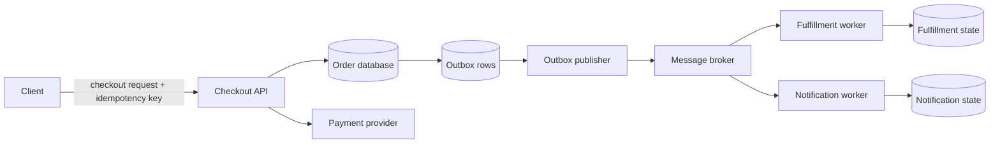

## System goal and constraints

Suppose a user clicks **Place order**. The system needs to create one logical order, charge at most once for one logical payment attempt, survive retries and process crashes, trigger fulfillment/notification work, and retain enough evidence for operators to explain what happened later.

The difficult part is that checkout crosses systems that do not share one transaction:

- the application's database;
- an external payment provider;
- a message broker or other durable event mechanism;
- asynchronous fulfillment and notification consumers.

This walkthrough uses one robust reference shape. It is not the only correct checkout architecture. Smaller systems can use a recoverable database-backed job table instead of a separate broker; larger systems may need reservation, fraud, tax, ledger, or orchestration boundaries.

## First build the happy path

```text
1. client sends one logical checkout command
2. API validates identity, authorization, cart, and pricing
3. application records local checkout/order state
4. application asks payment provider to perform one logical payment attempt
5. confirmed payment becomes durable local state
6. durable publish intent is recorded
7. asynchronous workers perform fulfillment/notification
```

The difficult reliability mechanisms make each arrow recoverable when responses are lost, processes crash, or work is delivered more than once.

<TermBox term="Idempotency">
**Idempotency** means repeating the same logical operation does not create an additional business effect beyond the one intended operation.

**Why it matters here:** clients retry after timeouts, reconnects, or lost responses. A stable checkout idempotency key lets the application recognize “this is the same logical checkout” instead of creating another order merely because the HTTP request was sent again.
</TermBox>

A possible application contract is:

```text
POST /checkouts
Idempotency-Key: 8aeb...f1
```

The application can associate that key with the authenticated actor, logical operation, and a stable request fingerprint. Reusing one key with materially different checkout parameters should not silently merge two purchases.

## High-level flow

<AtlasIllustration id="checkout-consistency-boundaries" />



<TermBox term="Message broker">
A **message broker** is a system that accepts messages/events from producers and makes them available to one or more receivers according to a delivery contract.

**Why it matters here:** publishing work to a broker decouples checkout from fulfillment latency and availability, but requires you to design for asynchronous delivery semantics instead of one synchronous call.
</TermBox>

<TermBox term="Consumer">
A **consumer** is code that receives a message/event and performs the associated downstream work, such as creating fulfillment state or sending a notification.

**Why it matters here:** consumer correctness must match the broker's actual retry/redelivery contract rather than assuming each message is processed exactly once.
</TermBox>

The important boundaries are:

1. **Client → Checkout API:** retries of one logical checkout need one application operation identity.
2. **Checkout API → database:** local order state and local publish intent can share one database transaction.
3. **Checkout API → payment provider:** a timeout can leave the remote outcome unknown.
4. **Database → broker:** these systems commonly do not share one atomic transaction.
5. **Broker → consumers:** redelivery may be possible, so downstream effects need an explicit duplicate strategy.

## 1. Make local state transitions transactional

Inside one transactional database, keep state that must change atomically in one local transaction:

```text
BEGIN
  insert/update checkout idempotency record
  create order in PAYMENT_PENDING state
  write outbox event describing durable publish intent
COMMIT
```

The invariant matters more than the schema: when business state and outbox live in the same transactional database, the durable state change and durable publish intent should commit together.

Do not keep a database transaction open around a slow external payment call just to make source code look atomic. Waiting on another system extends lock/transaction lifetime and still does not create one atomic transaction across your database and the provider.

## 2. Treat payment response loss as an ambiguous outcome

<AtlasIllustration id="payment-ambiguity-window" />

> **Production scenario:** A customer clicks "Place Order" on an unstable mobile 4G connection. The API charges $120 via Stripe, and Stripe responds with success. But before the HTTP response packet reaches the mobile app, the connection drops and the app displays "Request Timeout". Panicking, the customer taps "Place Order" a second time. Without a stable idempotency key tied to that logical cart, the system creates a second order and charges another $120—triggering an immediate customer support incident and chargeback risk.

- **Impact:** The customer is charged twice; support load and chargeback risk spike immediately.
- **Root cause:** Treating a network timeout as proof that the remote charge failed, then retrying under a fresh payment identity.
- **Correct pattern:** Keep one stable payment-attempt identity, mark the outcome as ambiguous/pending on timeout, and reconcile via provider lookup or webhook before creating another charge.

```text
Checkout API -> Payment provider: payment request
Payment provider: operation succeeds
Network: response is lost
Checkout API: timeout
```

### Check yourself: what should a timeout mean?

After a payment request times out, which statement is safest?

1. The charge definitely failed; create a new payment attempt ID and retry.
2. The charge definitely succeeded; mark the order paid immediately.
3. The remote outcome is unknown; reuse or reconcile the same logical payment attempt.

<details>
<summary>Show the reasoning</summary>

- Option 3 is correct.
- A timeout proves only that the caller lacks a definitive response.
- Reusing/reconciling the same payment-attempt identity prevents duplicate side effects when the first charge already succeeded.

</details>

<TermBox term="Ambiguous outcome">
An **ambiguous outcome** occurs when the caller does not know whether a remote side effect happened. A timeout proves that the caller did not receive a definitive result; it does not prove the remote operation failed.

**Why it matters here:** retrying a charge under a fresh identity after an ambiguous timeout can duplicate the payment.
</TermBox>

A useful payment state machine distinguishes at least `PAYMENT_PENDING`, `PAID`, and `PAYMENT_FAILED`, plus any provider/business state such as `PAYMENT_REQUIRES_ACTION` that the flow requires.

<TermBox term="Reconciliation">
**Reconciliation** is the process of querying or comparing durable records to determine the real outcome after the synchronous request path could not establish it reliably.

**Why it matters here:** after an ambiguous payment timeout, the system can use the provider's documented idempotency or operation-lookup contract to discover whether the payment succeeded instead of guessing from the network error.
</TermBox>

The application needs a stable identity for one logical payment attempt and must follow the selected provider's documented retry/reconciliation behavior. Stripe is one concrete provider with an `Idempotency-Key` contract; other providers may expose different operation IDs, persistence windows, or reconciliation APIs.

## 3. Keep API idempotency and payment idempotency separate

**Checkout/API idempotency** asks:

> Has the application already accepted this logical checkout command from this actor?

**Payment-provider idempotency** asks:

> What does this provider guarantee if the same logical payment attempt is retried after an uncertain network outcome?

One checkout can legitimately contain more than one payment attempt—for example a new attempt after a definitive decline—while retries of one attempt should retain that attempt's stable identity.

## 4. Use a transactional outbox for durable publication

Suppose the application commits an order as paid and then separately publishes `OrderPaid`. A crash between those actions leaves durable business state without a durable downstream notification. Publishing first creates the opposite problem: consumers can see an event for a state transition that later rolls back.

<TermBox term="Transactional outbox">
A **transactional outbox** stores the business-state change and a durable record of “publish this event” in the same local database transaction. A separate publisher later reads committed outbox rows and sends them to the messaging system.

**Why it matters here:** it closes the crash gap between committing local business state and recording the intent to publish, without pretending the application database and external broker share one distributed atomic transaction.
</TermBox>

```text
BEGIN
  update orders set status = 'PAID'
  insert into outbox(event_id, type, payload, status) values (...)
COMMIT
```

The outbox does **not** automatically create exactly-once end-to-end effects. A publisher can send an event successfully and crash before recording its own progress, causing the same logical event to be sent again.

### Check yourself: where does the crash gap remain?

Suppose the app updates the order to `PAID` in one transaction, then in a later statement publishes `OrderPaid` to the broker with no outbox row. The process crashes after the DB commit and before the publish completes.

What durable inconsistency can remain?

<details>
<summary>Show the reasoning</summary>

- The order is durably `PAID`, but no durable publish intent exists.
- Downstream fulfillment may never start unless some other recovery path notices the paid order.
- A transactional outbox closes this gap by committing business state and publish intent together; it still requires idempotent consumers because publication can be retried.

</details>

## 5. Design consumers from the selected delivery contract

<TermBox term="At-least-once delivery">
**At-least-once delivery** means the system aims to deliver a message one or more times, so duplicate delivery is possible.

**Why it matters here:** if a consumer performs a non-idempotent side effect twice, a duplicate message can become a duplicate business action. Delivery guarantees describe message transfer, not automatically exactly-once business effects.
</TermBox>

Do not teach one queue guarantee as if it applied to every broker. **When the selected broker or delivery mode can redeliver**, consumer logic must remain correct under that duplicate behavior.

Amazon SQS standard queues are a concrete example: AWS documents **Amazon SQS at-least-once delivery** and explains that redundant stored copies can deliver the same message more than once. Other brokers, queue types, subscriptions, or transaction modes can have different guarantees.

If duplicate delivery is possible, a consumer should be able to answer:

> Have I already applied event `event_id` to this business side effect?

Common controls include a processed-event/inbox table with a unique event ID, a business uniqueness constraint, idempotent upsert/state-transition logic, or a downstream provider idempotency contract.

<TermBox term="Acknowledgement / redelivery">
An **acknowledgement** tells a broker that a delivery has been handled according to that broker's contract. **Redelivery** is another delivery attempt of a message that the broker still considers unfinished or eligible for another attempt.

**Why it matters here:** a consumer can perform its business effect and crash before the acknowledgement completes. If the selected delivery mode can redeliver, the same logical message can then arrive again.
</TermBox>

## Request and transaction boundaries

| Boundary | What can be atomic? | What needs explicit recovery? |
| --- | --- | --- |
| API idempotency record + local order state | One local database transaction when stored together | Client retry after response loss |
| Local order + local outbox row | One local database transaction when stored together | Publisher retry/progress |
| Application + payment provider | Not one local database transaction | Provider-specific idempotency/reconciliation |
| Outbox publisher + external broker | Commonly not the same transaction as the app DB | Possible duplicate publication / retry |
| Broker + consumer business side effect | Depends on selected integration | Redelivery handling when the selected contract permits duplicates |

The architecture becomes easier to reason about when every boundary states its actual atomicity and retry contract instead of hiding them inside one long imperative function.

## Failure modes

### Duplicate checkout request

**Control:** stable application operation identity, explicit key/fingerprint rules, and a uniqueness constraint where the logical operation is stored.

### Payment succeeds but the application times out

**Control:** do not retry under a fresh payment identity by default. Reuse/reconcile the existing payment attempt according to the provider's contract.

### Database state commits but the process crashes before broker publish

<AtlasIllustration id="dual-write-vs-outbox" />

**Control:** store the outbox publish intent in the same local database transaction as the business transition, then let a later publisher continue.

- **Impact:** Paid orders never trigger fulfillment/email because the process died after commit and before broker publish.
- **Root cause:** Treating “update DB, then publish” as two independent writes creates a crash window with no durable recover intent.
- **Correct pattern:** Commit order state + outbox row together; publish asynchronously from committed outbox rows.

### Publisher sends and crashes before recording progress

**Control:** stable event IDs, idempotent downstream effects where duplicates are possible, bounded retry/backoff, and visibility into aged/stuck outbox rows.

### Consumer performs work but does not complete acknowledgement

If the selected broker/delivery mode supports redelivery, the same message may arrive again. Make the business effect safe under that duplicate using event identity, uniqueness constraints, or idempotent state transitions.

### Dependency outage creates a retry storm

<AtlasIllustration id="retry-storm-vs-jitter" />

<TermBox term="Backoff and jitter">
**Backoff** increases the delay between retries after repeated failure. **Jitter** adds variation so many clients do not retry at exactly the same moments.

**Why it matters here:** immediate synchronized retries can amplify a dependency outage into a retry storm and prevent recovery.
</TermBox>

Use explicit timeouts, bounded retry budgets, backoff/jitter where appropriate, concurrency limits, and an operational recovery path.

<TermBox term="Dead-letter path">
A **dead-letter path** is a place or process for messages that cannot be completed successfully after the normal retry policy.

**Why it matters here:** it prevents one repeatedly failing message from retrying forever without visibility and gives operators a defined inspection/recovery workflow when the selected messaging system supports such a mechanism.
</TermBox>

## Security and trust boundaries

- authenticate the caller and authorize the cart/customer/order being changed;
- never trust client-submitted price totals as authoritative—derive chargeable amounts from trusted server-side pricing state;
- scope application idempotency keys to the correct actor/operation;
- keep payment credentials and webhook secrets outside source code;
- verify provider callbacks/webhooks using that provider's documented authenticity mechanism;
- minimize sensitive payment/personal data in logs, traces, queues, and outbox payloads;
- do not treat possession of an internal message as evidence of end-user authorization.

“Internal” components still cross trust boundaries.

## Observability

<TermBox term="Correlation identifier">
A **correlation identifier** is a stable identifier carried or recorded across related steps so operators can connect logs, traces, messages, retries, and state transitions that belong to one logical operation.

**Why it matters here:** a checkout can move from one HTTP request into payment reconciliation, outbox publication, broker delivery, and several consumer attempts. One transient trace is not always enough to explain that whole lifecycle.
</TermBox>

Useful identifiers include request/trace ID, checkout/order ID, application idempotency key or safe reference/hash, payment attempt/provider operation ID, outbox event ID, and broker delivery identifiers when available.

Useful metrics include checkout success/failure/unknown-outcome rate, payment latency/timeouts, count and age of unpublished outbox rows, publish retries, broker backlog/oldest-message age, consumer failure/redelivery/dead-letter counts, and time from confirmed payment to fulfillment completion.

Logs should record state transitions and correlation IDs without leaking credentials, payment data, or unnecessary personal information.

## Scaling and cost

This reference design adds components; an outbox publisher, broker, and consumers all create operational cost. That cost is justified when downstream work must survive process failure, be retried independently, absorb bursts, or be decoupled from checkout latency. A smaller system may meet the same requirements with a transactional database and recoverable jobs table.

<TermBox term="Poison message/event">
A **poison message/event** is a message that repeatedly fails processing because its data or the consumer's handling cannot succeed under normal retry conditions.

**Why it matters here:** repeated retries of one permanently failing item can waste capacity, hide useful work behind it, or generate noisy incidents. The system needs an explicit quarantine, dead-letter, or manual-recovery strategy where relevant.
</TermBox>

Scaling questions include payment concurrency, broker fan-out, outbox publisher throughput, ordering scope, poison-event handling, and the backlog age that becomes operationally unacceptable.

Prefer the simplest durable mechanism that satisfies the actual recovery and throughput requirements.

## Alternatives

This architecture can be simplified or expanded depending on constraints:

- **Database-backed job table:** useful when one transactional database plus recoverable workers provides enough durability without a separate broker.
- **Workflow/orchestration engine:** useful when a long-running business process has many explicit states, timers, compensations, and operator-visible recovery needs.
- **Provider/event-driven integration:** useful only when the provider contracts and ownership model fit the required durability, idempotency, and reconciliation semantics.

Do not add components merely because they appear in the reference diagram.

## Check your mental model

> **Scenario:** A developer wants to ensure checkout database records and payment charges never drift apart. They write this implementation:
>
> ```ts
> await db.transaction(async (tx) => {
>   await tx.orders.create({ id, status: 'PENDING' });
>   const charge = await paymentGateway.chargeCard({ amount, token }); // external network call
>   await tx.orders.update({ id, status: 'PAID', chargeId: charge.id });
> });
> ```
>
> The developer reasons: *"By wrapping the external payment API call inside `db.transaction()`, if the payment fails, the database will cleanly roll back and no inconsistent order will exist."*
>
> **What critical vulnerabilities does this design introduce in production?**

<details>
<summary>Show the reasoning</summary>

**Why this pattern is dangerous in distributed production systems:**

1. **Zero distributed atomicity:** A local database transaction cannot roll back an external payment provider. If `paymentGateway.chargeCard()` takes 8 seconds, successfully charges the customer's credit card, and then the database transaction times out or crashes during the subsequent `update()`, the database transaction rolls back. **The customer's card has been charged, but your database has zero record of the order or payment!**
2. **Database connection pool exhaustion:** Holding a database transaction and row locks open while waiting for external network I/O (which can easily take 1–5 seconds or hang during provider latency spikes) exhausts database worker connections. Under moderate checkout traffic, this takes down the entire database cluster for all other application services.
3. **Correct architectural pattern:**
   - Keep database transactions **strictly local and sub-millisecond**: write the order as `PAYMENT_PENDING` and commit immediately.
   - Perform the external payment call outside of any DB transaction, passing a unique idempotency key.
   - When the payment responds (or via webhook/reconciliation), commit a second local transaction to transition the order state to `PAID` and write the outbox event.
</details>

## Review checklist

Use this checklist during architecture design reviews before approving a checkout implementation:

- [ ] **Operation identity:** Are unique idempotency keys required for every logical checkout and payment attempt?
- [ ] **Local atomicity:** Are business state changes and durable publish intent (outbox rows) committed together in one fast, local database transaction?
- [ ] **No remote calls inside DB transactions:** Are all external network calls (payment APIs, email, third-party services) executed strictly outside of database transactions?
- [ ] **Timeout ambiguity handling:** Is there an explicit reconciliation strategy (provider query or webhook) when a payment request times out?
- [ ] **Duplicate delivery defense:** Are downstream fulfillment and notification consumers idempotent when the broker redelivers events?
- [ ] **Retry limits and backoff:** Do retry loops enforce explicit bounds, exponential backoff with jitter, and dead-letter queue routing?
- [ ] **End-to-end correlation:** Does every log, trace, and outbox event carry a stable correlation ID linking the HTTP request to downstream async consumers?
- [ ] **Data boundary security:** Are cardholder secrets and raw credentials strictly kept out of logs, traces, and internal message payloads?
- [ ] **Minimal durable shape:** Is the architecture as simple as possible (e.g. database job table vs. multi-cluster message broker) for the actual traffic volume?

## Related concepts

This walkthrough applies **API Design**, **Idempotency**, **Database Transactions**, **Transactional Outbox**, **Partial Failure**, **Retries and Backoff**, **Delivery Semantics**, **Message Queues**, **Background Jobs**, **Logs/Metrics/Traces**, and **Threat Modeling**. Use the [Backend Systems](/docs/learning-paths/backend-systems) path to place these concepts in a broader learning sequence.

## Sources

- [Stripe — Idempotent requests](https://docs.stripe.com/api/idempotent_requests)
- [AWS Prescriptive Guidance — Transactional outbox pattern](https://docs.aws.amazon.com/prescriptive-guidance/latest/cloud-design-patterns/transactional-outbox.html)
- [Amazon SQS — at-least-once delivery](https://docs.aws.amazon.com/AWSSimpleQueueService/latest/SQSDeveloperGuide/standard-queues-at-least-once-delivery.html)
- [AWS Builders' Library — Timeouts, retries, and backoff with jitter](https://aws.amazon.com/builders-library/timeouts-retries-and-backoff-with-jitter/)