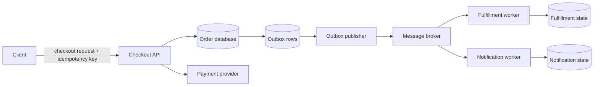

## System goal and constraints

Suppose a user clicks **Place order**. The product needs to create one logical order, charge at most once for that logical checkout intent, survive retries and process crashes, trigger fulfillment/notification work, and give operators enough evidence to explain what happened later.

The hard part is not the happy-path sequence. The hard part is that checkout crosses boundaries that do not share one transaction:

- the application's database;
- an external payment system;
- a message broker or durable event mechanism;
- asynchronous fulfillment and notification consumers.

A timeout at one boundary does not tell us whether the remote side performed the operation. Messages can be delivered more than once. A process can crash after committing state but before publishing an event. Users can double-click or retry after a poor network response.

This walkthrough shows **one robust reference shape** for those problems. It is not the only correct checkout architecture. A small product may choose fewer components; a large marketplace may need additional reservation, fraud, tax, ledger, and orchestration boundaries.

## High-level flow



The important boundaries are more useful than the boxes:

1. **Client → Checkout API:** duplicate/retried requests must represent one logical operation.
2. **Checkout API → database:** local order state and publish intent can share one database transaction.
3. **Checkout API → payment provider:** network outcome can be ambiguous, so payment calls need a provider-supported or application-defined idempotency strategy.
4. **Database → message broker:** these systems usually do not share an atomic transaction; a durable outbox bridges that gap.
5. **Broker → consumers:** delivery may be at least once, so consumers must be safe under redelivery.

## 1. Define one logical checkout intent

The client should not create a fresh logical operation every time it retransmits the same checkout request.

One common contract is:

```text
POST /checkouts
Idempotency-Key: 8aeb...f1
```

The server associates that key with the authenticated actor, the logical operation, and a stable request fingerprint or checkout intent. A retry with the same key can return the previous/current result rather than creating a second order.

This is stronger than "disable the button after one click." UI prevention improves experience, but it cannot protect against browser retries, mobile network reconnects, proxy behavior, or a user repeating a request from another client.

The API must define what key reuse means. Reusing one key with materially different checkout parameters should be rejected rather than silently treating two different purchases as the same operation.

## 2. Make local state transitions transactional

Inside the application database, keep state that must change atomically inside one local transaction.

A simplified transaction might:

```text
BEGIN
  insert/update checkout idempotency record
  create order in PAYMENT_PENDING state
  write outbox event describing the durable state change
COMMIT
```

The exact schema is less important than the invariant: **the durable business state and the durable intent to publish its event should commit together** when they live in the same transactional database.

Do not put a slow external payment network call inside a database transaction merely to make the code look sequential. Holding database locks/transactions open while waiting on a remote system expands contention and still does not create a true atomic transaction with that external system.

## 3. Treat payment response loss as an ambiguous outcome

Consider this sequence:

```text
Checkout API -> Payment provider: charge/order-payment request
Payment provider: payment succeeds
Network: response is lost
Checkout API: timeout
```

From the API's perspective, **timeout does not mean payment failed**. Retrying a non-idempotent payment operation could charge again.

The payment boundary therefore needs an operation identity that survives retry. Many payment APIs expose idempotency keys specifically for this problem. The application's checkout/payment attempt should keep a stable provider idempotency key for retries of the same logical payment operation.

A robust state machine distinguishes outcomes such as:

- `PAYMENT_PENDING` — outcome not confirmed yet;
- `PAID` — success is confirmed;
- `PAYMENT_FAILED` — a definitive failure is known;
- possibly `PAYMENT_REQUIRES_ACTION` for systems with asynchronous/customer action flows.

When the network outcome is unknown, reconcile using the provider's operation/payment identifier or safe idempotent retry semantics instead of inventing success/failure from a timeout alone.

## 4. Keep API idempotency and payment idempotency separate

They solve related but different duplicate problems.

**Checkout/API idempotency** answers:

> Have I already accepted this logical checkout command from this caller?

**Payment-provider idempotency** answers:

> If I retry this remote payment operation after an uncertain network outcome, will the provider repeat the side effect?

Often one checkout key derives or maps to one payment-attempt key, but do not assume every downstream operation shares the same lifecycle. A checkout may have multiple legitimate payment attempts after a definitive decline, while retries of one attempt should remain idempotent.

## 5. Use a transactional outbox for durable publication

Suppose the application commits an order as paid and then executes:

```text
publish OrderPaid
```

If the process crashes between the database commit and broker publish, the durable order exists but downstream systems never hear about it.

Reversing the order is also unsafe: publishing before the database commit can expose an event for state that later rolls back.

A **transactional outbox** stores the event/publish intent in the same database transaction as the business-state update:

```text
BEGIN
  update orders set status = 'PAID'
  insert into outbox(event_id, type, payload, status) values (...)
COMMIT
```

A separate publisher reads committed outbox rows and sends them to the broker. After a successful send it records progress or otherwise makes the row eligible for eventual cleanup.

The outbox does not magically create exactly-once end-to-end delivery. A publisher can send a message and crash before recording that the send succeeded, which means the same event can be published again. That is why downstream idempotency remains part of the design.

## 6. Design consumers for redelivery

Assume a fulfillment consumer receives `OrderPaid`, performs work, but crashes before acknowledging the message. Many durable messaging systems will redeliver it.

The consumer should be able to answer:

> Have I already applied event `event_id` to this side effect?

Common approaches include:

- a processed-event/inbox table with a unique event identifier;
- business-level unique constraints such as one fulfillment record per order;
- idempotent upsert/state transitions;
- provider-side idempotency for any further external side effect.

The useful mental model is **at-least-once delivery + idempotent effect**, not "the queue promises our business logic runs exactly once."

## Request and transaction boundaries

A checkout request often crosses several distinct correctness boundaries:

| Boundary | What can be atomic? | What needs explicit recovery? |
| --- | --- | --- |
| API idempotency record + local order state | One local database transaction | Client retry after response loss |
| Local order + local outbox row | One local database transaction | Outbox publisher retry |
| Application + payment provider | Not one local transaction | Idempotent payment operation + reconciliation |
| Outbox publisher + broker | Usually not one transaction | Duplicate publication / retry |
| Broker + consumer side effect | Usually not one transaction | Redelivery + idempotent consumer |

The architecture becomes easier to reason about when these boundaries are explicit instead of hidden behind one long imperative function.

## Failure modes

### Duplicate checkout request

**Symptom:** the client sends the same logical checkout twice.

**Control:** stable API idempotency key, request identity/fingerprint rules, and a unique database constraint around the logical operation.

### Payment succeeds but the application times out

**Symptom:** the application cannot tell whether the remote payment completed.

**Control:** do not retry blindly with a new payment identity. Reuse the same payment-operation idempotency identity or reconcile the existing provider object before deciding the state transition.

### Database state commits but the process crashes before broker publish

**Symptom:** durable order state changes, but no downstream event is visible.

**Control:** transactional outbox makes publish intent durable in the same local transaction, so a later publisher can continue.

### Publisher sends and crashes before marking the outbox row sent

**Symptom:** the event may be published again.

**Control:** stable event IDs plus idempotent downstream effects. The publisher should retry with bounded backoff and expose stuck/aged rows operationally.

### Consumer performs work but fails before acknowledging

**Symptom:** broker redelivers the same event.

**Control:** consumer inbox/processed-event identity, unique business constraints, or idempotent state transitions.

### Dependency outage creates a retry storm

**Symptom:** many checkout/publisher/consumer retries amplify load on a failing payment provider, database, or broker.

**Control:** timeouts, bounded retries, exponential backoff with jitter where appropriate, concurrency limits, dead-letter/manual-recovery strategy, and visibility into retry age/count.

## Security and trust boundaries

A reliable checkout that is insecure is still incorrect.

Treat each boundary explicitly:

- authenticate the caller and authorize access to the cart/customer/order being changed;
- never trust client-submitted price totals as authoritative—calculate chargeable amounts from trusted server-side product/pricing state;
- validate that an idempotency key is scoped to the correct authenticated actor/operation;
- keep payment credentials and webhook secrets outside source code and expose them only to components that need them;
- verify authenticity of provider callbacks/webhooks using the provider's supported verification mechanism;
- minimize sensitive payment data in application logs, traces, queues, and outbox payloads;
- protect internal event consumers from treating arbitrary broker messages as trusted user authorization.

The trust boundary does not disappear because two components are "internal." Ask which identity each component acts for and what evidence authorizes each state transition.

## Observability

Checkout observability must survive the synchronous-to-asynchronous transition.

Useful correlation identifiers include:

- request/trace ID;
- checkout/order ID;
- application idempotency key or a safe hash/reference to it;
- payment attempt/provider operation ID;
- outbox event ID;
- message ID and consumer attempt count.

Propagate trace context through supported HTTP/messaging boundaries where practical, but do not rely on traces alone. Durable business identifiers are still necessary because incidents can outlive trace retention and because retries may produce multiple execution traces for one logical checkout.

Useful metrics include:

- checkout success/failure/unknown-outcome rate;
- payment latency and timeout rate;
- count/age of unpublished outbox rows;
- publish retry count;
- broker backlog/oldest-message age;
- consumer failure/redelivery/dead-letter counts;
- time from payment confirmation to fulfillment completion.

Logs should record state transitions and correlation IDs without leaking secrets or unnecessary personal/payment data.

## Scaling and cost

This design deliberately adds components: an outbox publisher, broker, and consumers have operational cost.

That cost is justified when downstream work must survive process failure, be retried independently, absorb bursts, or be decoupled from checkout latency. It may be unnecessary for a small system where a single database plus a recoverable background-jobs table already provides the needed durability.

Scaling questions include:

- Can payment concurrency overwhelm the provider or database connection pool?
- Does broker fan-out create more downstream work than dependencies can absorb?
- Can outbox polling/CDC keep up with commit volume?
- Does ordering matter globally, per customer, per order, or not at all?
- Can one poisoned event block a partition/consumer group?
- Which backlog age is acceptable before customers perceive the system as broken?

Prefer the simplest durable mechanism that meets the recovery and throughput requirements. A database-backed job/outbox worker can be easier to operate than a separate broker at small scale.

## Alternatives

### Synchronous side effects only

For very simple systems, the API can perform payment and other work synchronously and store enough state to retry/reconcile later. This keeps infrastructure small but lengthens request latency and couples availability to every synchronous dependency.

### Database-backed job table without a separate broker

The application can atomically write local state plus durable jobs, then workers claim rows. This preserves many outbox benefits with fewer moving parts. A broker becomes more attractive when fan-out, independent consumers, buffering, routing, or ecosystem integration justify it.

### Workflow/saga orchestration

When checkout spans many long-running business steps—inventory reservation, fraud review, payment authorization/capture, shipping, compensation—a workflow engine or explicit saga can make state transitions and retries more visible. It adds its own operational/model complexity and should solve a real workflow need.

### Provider event/webhook as the payment source of truth

Some payment flows are inherently asynchronous. The application can model payment as pending and use authenticated provider events plus reconciliation to drive final state. API responses can still be useful, but the state machine must handle events arriving later or more than once.

## Review checklist

Before approving a checkout design, ask:

- What identifies one logical checkout, and what happens on duplicate submission?
- What identifies one payment attempt across retries?
- What state represents an unknown payment outcome?
- Which local state transitions share one database transaction?
- Can a committed state change lose its downstream notification?
- What happens when publication or consumption is duplicated?
- Which retry loops have timeouts, limits, backoff, and visibility?
- Which business identifiers correlate synchronous and asynchronous work?
- How are prices, identities, provider callbacks, and secrets validated?
- Where can sensitive data accidentally enter logs/events/traces?
- What backlog/reconciliation dashboards let operators recover without guessing?
- Could a simpler durable job-table design meet the same requirements?

## Related concepts

This walkthrough connects [Backend Systems](/docs/learning-paths/backend-systems) concepts that are often learned separately: **API Design**, **Idempotency**, **Database Transactions**, **Partial Failure**, **Retries and Backoff**, **Delivery Semantics**, **Message Queues**, the **Transactional Outbox**, and **Logs, Metrics, and Traces**.

## Sources

- [Idempotent requests — Stripe API Reference](https://docs.stripe.com/api/idempotent_requests)
- [Transactional outbox pattern — AWS Prescriptive Guidance](https://docs.aws.amazon.com/prescriptive-guidance/latest/cloud-design-patterns/transactional-outbox.html)
- [Transactions — PostgreSQL documentation](https://www.postgresql.org/docs/current/tutorial-transactions.html)
- [Signals and observability concepts — OpenTelemetry](https://opentelemetry.io/docs/concepts/signals/)
