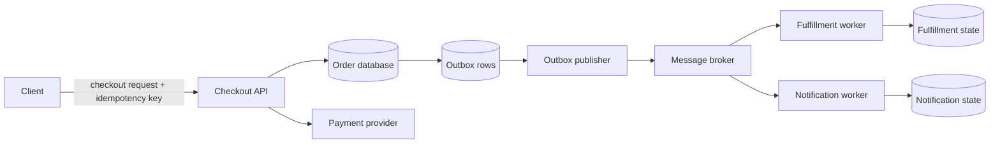

## System goal and constraints

Suppose a user clicks **Place order**. The system needs to create one logical order, charge at most once for one logical payment attempt, survive retries and process crashes, trigger fulfillment/notification work, and retain enough evidence for operators to explain what happened later.

The difficult part is that checkout crosses boundaries that do not share one transaction:

- the application's database;
- an external payment provider;
- a message broker or durable event mechanism;
- asynchronous fulfillment and notification consumers.

A timeout at a remote boundary does not prove whether the remote side performed the operation. An outbox publisher can send an event and crash before recording that send. Some broker/delivery modes can deliver the same message more than once. Users and clients can also retry requests after losing a response.

This walkthrough shows **one robust reference shape** for those problems. It is not the only correct checkout architecture. A smaller system may use a database-backed job table instead of a separate broker; a marketplace may need additional reservation, fraud, tax, ledger, and orchestration boundaries.

## High-level flow



The important boundaries are more useful than the boxes:

1. **Client → Checkout API:** retries of one logical checkout command need one application-level operation identity.
2. **Checkout API → database:** local order state and local publish intent can share one database transaction.
3. **Checkout API → payment provider:** network outcome can be ambiguous, so retry behavior must follow the selected provider's idempotency/reconciliation contract.
4. **Database → message broker:** these systems commonly do not share one atomic transaction; a durable transactional outbox can bridge that gap.
5. **Broker → consumers:** verify the selected delivery contract. If it can redeliver, consumer side effects must remain correct under duplicate delivery.

## 1. Define one logical checkout intent

The client should not create a fresh logical operation every time it retransmits the same checkout request.

One possible application contract is:

```text
POST /checkouts
Idempotency-Key: 8aeb...f1
```

The application can associate that key with the authenticated actor, a logical operation, and a stable request fingerprint. A retry with the same valid key can then return or resume the existing operation rather than creating a second order.

This is stronger than "disable the button after one click." UI prevention can reduce accidental duplicates but cannot protect against response loss, client reconnects, or another retrying caller.

The application must define its own key contract. In particular, reusing one key with materially different checkout parameters should not silently merge two purchases.

Stripe is one concrete provider example of a more specific idempotency contract: its API accepts an `Idempotency-Key`, saves the result associated with a key, returns that saved result on a retry, and checks that repeated requests use matching parameters. Do not assume every payment provider implements exactly the same persistence window, parameter rules, or supported operations.

## 2. Make local state transitions transactional

Inside one transactional database, keep state that must change atomically in one local transaction.

A simplified transaction might be:

```text
BEGIN
  insert/update checkout idempotency record
  create order in PAYMENT_PENDING state
  write outbox event describing the durable state change
COMMIT
```

The invariant is more important than the schema: **when the business state and outbox live in the same transactional database, the durable state change and durable publish intent should commit together.**

Do not keep a database transaction open around a slow external payment call merely to make the source code look atomic. Waiting on another system extends lock/transaction lifetime and still does not create one atomic transaction across your database and the provider.

## 3. Treat payment response loss as an ambiguous outcome

Consider:

```text
Checkout API -> Payment provider: payment request
Payment provider: operation succeeds
Network: response is lost
Checkout API: timeout
```

From the checkout API's perspective, **timeout does not mean payment failed**. Retrying the remote side effect under a new identity could duplicate it.

The application therefore needs a stable identity for one logical payment attempt and must follow the provider's documented retry/reconciliation behavior. With Stripe, for example, retries using the same idempotency key can replay the stored result for that operation. A different provider may expose an operation resource, request token, reconciliation API, or another contract.

A useful application state machine distinguishes at least:

- `PAYMENT_PENDING` — no definitive outcome is known yet;
- `PAID` — success is confirmed;
- `PAYMENT_FAILED` — a definitive failure is known;
- possibly `PAYMENT_REQUIRES_ACTION` where the provider/business flow needs later user or asynchronous action.

When the network outcome is unknown, reconcile or retry according to the selected provider contract instead of deriving success/failure from the timeout itself.

## 4. Keep API idempotency and payment idempotency separate

They address different duplicate boundaries.

**Checkout/API idempotency** asks:

> Has the application already accepted this logical checkout command from this actor?

**Payment-provider idempotency** asks:

> What does this provider guarantee if the same logical payment attempt is retried after an uncertain network outcome?

The identifiers may be related, but their lifecycle does not need to be identical. One checkout can legitimately contain more than one payment attempt—for example, a new attempt after a definitive decline—while retries of one attempt should keep that attempt's stable identity.

## 5. Use a transactional outbox for durable publication

Suppose the application commits an order as paid, then separately does:

```text
publish OrderPaid
```

A process crash between those actions leaves durable order state without a durable downstream notification.

Publishing before the database commit has the opposite problem: consumers may observe an event for a state transition that later rolls back.

A **transactional outbox** stores the business-state change and publish intent in the same local transaction:

```text
BEGIN
  update orders set status = 'PAID'
  insert into outbox(event_id, type, payload, status) values (...)
COMMIT
```

A publisher later reads committed outbox rows and sends them to the chosen delivery system.

The outbox removes the gap between **database commit** and **durable publish intent**; it does not automatically create exactly-once end-to-end effects. AWS's transactional-outbox guidance explicitly notes that the relay/publisher can publish a message more than once, for example when it sends successfully and then fails before recording progress. Stable event identity and idempotent consumers are still necessary where duplicates are possible.

## 6. Design consumers from the selected delivery contract

Do not teach one queue guarantee as if it applied to every broker.

**When the selected broker or delivery mode can redeliver**, the consumer must remain correct if the same logical event is received more than once.

Amazon SQS standard queues are a concrete example: AWS documents **at-least-once delivery** and warns that a message can be delivered more than once because redundant message copies may not all be removed after a receive/delete sequence. Other brokers, queue types, subscriptions, or transaction modes can have different guarantees. Read the contract you actually operate.

If duplicate delivery is possible, a consumer should be able to answer:

> Have I already applied event `event_id` to this business side effect?

Common controls include:

- a processed-event/inbox table with a unique event identifier;
- a business uniqueness constraint such as one fulfillment record per order;
- idempotent upsert/state-transition logic;
- a downstream provider idempotency contract for another external side effect.

The general mental model is:

```text
selected delivery contract
        +
explicit duplicate/retry handling where needed
        +
idempotent business effect when duplicates are possible
```

That is more reliable than assuming the broker makes business logic execute exactly once.

## Request and transaction boundaries

A checkout request crosses several different correctness boundaries:

| Boundary | What can be atomic? | What needs explicit recovery? |
| --- | --- | --- |
| API idempotency record + local order state | One local database transaction when stored together | Client retry after response loss |
| Local order + local outbox row | One local database transaction when stored together | Publisher retry/progress |
| Application + payment provider | Not one local database transaction | Provider-specific idempotency/reconciliation |
| Outbox publisher + external broker | Depends on selected systems; commonly not the same transaction as the app DB | Possible duplicate publication / retry |
| Broker + consumer business side effect | Depends on broker/consumer storage integration | Redelivery handling when the selected contract permits duplicates |

The architecture becomes easier to reason about when each boundary states its actual atomicity and retry contract instead of hiding them inside one long imperative function.

## Failure modes

### Duplicate checkout request

**Symptom:** the client sends the same logical checkout more than once.

**Control:** stable application operation identity, explicit key/fingerprint rules, and a uniqueness constraint where the logical operation is stored.

### Payment succeeds but the application times out

**Symptom:** the application does not know whether the provider completed the payment operation.

**Control:** do not retry under a fresh payment identity by default. Reuse/reconcile the existing payment attempt according to the provider's documented contract.

### Database state commits but the process crashes before broker publish

**Symptom:** durable business state changes, but no downstream event was durably scheduled.

**Control:** store the outbox publish intent in the same local database transaction as the business transition, then let a later publisher continue.

### Publisher sends and crashes before recording progress

**Symptom:** the same logical event can be sent again.

**Control:** stable event IDs, idempotent downstream effects where duplicates are possible, bounded retry/backoff, and operational visibility into aged/stuck outbox rows.

### Consumer performs work but does not complete the broker acknowledgement

**Symptom:** **if the selected broker/delivery mode supports redelivery**, the same message may be delivered again.

**Control:** make the business effect safe under that duplicate using inbox/processed-event identity, uniqueness constraints, or idempotent state transitions.

### Dependency outage creates a retry storm

**Symptom:** checkout, publisher, or consumer retry loops amplify load on a failing provider, database, broker, or downstream API.

**Control:** explicit timeouts, bounded retry budgets, backoff/jitter where appropriate, concurrency limits, and a documented dead-letter/manual-recovery path where the selected messaging system supports it.

## Security and trust boundaries

A reliable checkout that is insecure is still incorrect.

Treat each boundary explicitly:

- authenticate the caller and authorize access to the cart/customer/order being changed;
- never trust client-submitted price totals as authoritative—derive chargeable amounts from trusted server-side pricing state;
- scope an application idempotency key to the correct actor/operation;
- keep payment credentials and webhook secrets outside source code and expose them only where required;
- verify provider callbacks/webhooks using that provider's documented authenticity mechanism;
- minimize sensitive payment/personal data in logs, traces, queues, and outbox payloads;
- do not treat possession of an internal message as evidence of end-user authorization.

"Internal" components still cross trust boundaries. Each state transition should have an identity and authorization reason that operators can explain.

## Observability

Checkout observability must survive the synchronous-to-asynchronous transition.

Useful correlation identifiers include:

- request/trace ID;
- checkout/order ID;
- application idempotency key or a safe reference/hash;
- payment attempt/provider operation ID;
- outbox event ID;
- broker/message delivery identifier and consumer attempt information when available.

Propagate trace context through supported HTTP/messaging boundaries where practical, but do not rely on traces alone. Durable business identifiers remain useful because one logical checkout can produce multiple retry/reconciliation traces and incidents can outlive trace retention.

Useful metrics include:

- checkout success/failure/unknown-outcome rate;
- payment latency and timeout rate;
- count/age of unpublished outbox rows;
- publish retry count;
- broker backlog/oldest-message age where exposed;
- consumer failure/redelivery/dead-letter counts where those concepts exist in the selected system;
- time from confirmed payment to fulfillment completion.

Logs should record state transitions and correlation IDs without leaking credentials, payment data, or unnecessary personal information.

## Scaling and cost

This reference design adds components: an outbox publisher, broker, and consumers all create operational cost.

That cost is justified when downstream work must survive process failure, be retried independently, absorb bursts, or be decoupled from checkout latency. It can be unnecessary when a smaller system can meet the same durability/recovery requirements with a transactional database plus a recoverable jobs table.

Scaling questions include:

- Can payment concurrency overwhelm the provider or database connection pool?
- Can broker fan-out create more downstream work than dependencies can absorb?
- Can outbox polling or change-data-capture keep up with commit volume?
- Does ordering matter globally, per customer, per order, or not at all?
- What happens to poison messages/events under the selected delivery system?
- Which backlog age makes fulfillment operationally unacceptable?

Prefer the simplest durable mechanism that satisfies the actual recovery and throughput requirements.

## Alternatives

### Synchronous side effects only

A simple system can perform payment and other required work synchronously while persisting enough state to reconcile uncertain outcomes later. This reduces components but puts more dependencies on the request's latency/availability path.

### Database-backed job table without a separate broker

The application can atomically write local business state plus durable job rows, then have workers claim those rows. This can provide the required durability with fewer systems when fan-out, independent consumer ecosystems, or broker-specific routing/buffering are unnecessary.

### Workflow/saga orchestration

When checkout spans many long-running business states—inventory reservation, fraud review, authorization/capture, shipping, compensation—a workflow engine or explicit saga can make state, timeout, and retry behavior explicit. Use it when the workflow complexity justifies another operational/runtime abstraction.

### Provider event/webhook as payment confirmation

Some payment flows are inherently asynchronous. The application can keep payment pending and use authenticated provider events plus reconciliation to drive final state. The state machine must still define duplicate/out-of-order event handling according to that provider's event contract.

## Review checklist

Before approving a checkout design, ask:

- What identifies one logical checkout, and what happens on duplicate submission?
- What identifies one payment attempt across retries?
- Which provider contract defines payment retry and reconciliation behavior?
- What state represents an unknown payment outcome?
- Which local state transitions share one database transaction?
- Can committed business state lose its durable publish intent?
- Can the selected publish/delivery path duplicate an event/message, and where?
- Which consumer effects are idempotent when duplicates are possible?
- Which retry loops have timeout, limit/backoff, and operational visibility?
- Which durable identifiers correlate synchronous and asynchronous work?
- How are prices, identities, provider callbacks, and secrets validated?
- Could a database-backed job design satisfy the same durability requirements with fewer systems?

## Related concepts

This walkthrough connects [Backend Systems](/docs/learning-paths/backend-systems) concepts that are often learned separately: **API Design**, **Idempotency**, **Database Transactions**, **Partial Failure**, **Retries and Backoff**, **Delivery Semantics**, **Message Queues**, the **Transactional Outbox**, and **Logs, Metrics, and Traces**.

## Sources

- [Idempotent requests — Stripe API Reference](https://docs.stripe.com/api/idempotent_requests)
- [Transactional outbox pattern — AWS Prescriptive Guidance](https://docs.aws.amazon.com/prescriptive-guidance/latest/cloud-design-patterns/transactional-outbox.html)
- [Amazon SQS at-least-once delivery — AWS documentation](https://docs.aws.amazon.com/AWSSimpleQueueService/latest/SQSDeveloperGuide/standard-queues-at-least-once-delivery.html)
- [Transactions — PostgreSQL documentation](https://www.postgresql.org/docs/current/tutorial-transactions.html)
- [Signals and observability concepts — OpenTelemetry](https://opentelemetry.io/docs/concepts/signals/)
