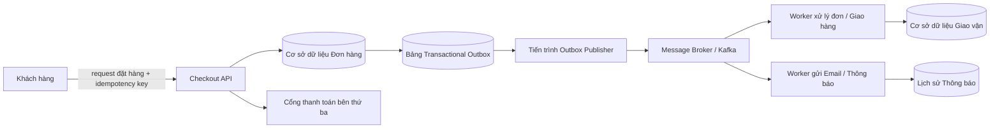

## Mục tiêu hệ thống và Ràng buộc kỹ thuật

Giả sử một khách hàng nhấn nút **Đặt hàng (Place order)**. Hệ thống cần tạo đúng một đơn hàng logic duy nhất, chỉ trừ tiền tối đa một lần cho một lần thanh toán, sống sót an toàn qua các lần retry mạng hoặc sự cố sập tiến trình (process crash), kích hoạt các tác vụ giao vận/gửi email thông báo, và lưu trữ đầy đủ bằng chứng kiểm toán (audit log) để kỹ sư có thể giải trình mọi sự cố phát sinh.

Điểm phức tạp cốt lõi là luồng thanh toán phải vắt qua nhiều hệ thống **không thể chia sẻ chung một transaction ACID**:

- Cơ sở dữ liệu nghiệp vụ của ứng dụng;
- Cổng thanh toán bên thứ ba (Stripe, VNPAY, Momo);
- Hệ thống điều phối thông điệp (Message Broker) hoặc hàng đợi sự kiện;
- Các tiến trình xử lý ngầm (Workers) thực hiện giao hàng và thông báo.

Bài phân tích này trình bày một **mô hình kiến trúc tham chiếu chuẩn mực**. Nó không phải là thiết kế duy nhất cho mọi quy mô. Các hệ thống nhỏ có thể dùng bảng job trong database thay vì dựng cụm Kafka/RabbitMQ riêng; trong khi các sàn thương mại điện tử khổng lồ có thể cần thêm các tầng giữ chỗ tồn kho (reservation), chống gian lận (fraud), và sổ cái tài chính (ledger).

## Luồng xử lý lý tưởng (Happy Path)

```text
1. Client gửi lệnh thanh toán logic kèm Idempotency Key
2. API xác thực danh tính, giỏ hàng và giá cả trên máy chủ
3. Ứng dụng ghi nhận trạng thái đơn hàng cục bộ (PAYMENT_PENDING)
4. Gọi cổng thanh toán thực hiện trừ tiền cho lần thanh toán này
5. Nhận kết quả thành công -> Cập nhật trạng thái PAID vào DB cục bộ
6. Ghi nhận sự kiện phát hành (Outbox Event) cùng trong transaction đó
7. Các worker bất đồng bộ tiêu thụ sự kiện để giao hàng và gửi email
```

Những cơ chế tạo nên độ tin cậy cao sẽ đảm bảo từng mũi tên ở trên có thể phục hồi an toàn khi mất gói tin, sập server hoặc thông điệp bị gửi trùng lặp nhiều lần.

<TermBox term="Idempotency">
**Tính bất biến (Idempotency)** là đặc tính đảm bảo rằng việc thực thi lại nhiều lần cùng một thao tác logic sẽ không tạo ra bất kỳ tác dụng phụ ngoài ý muốn nào so với lần thực thi đầu tiên.

**Ý nghĩa thực tiễn:** Khách hàng thường bấm nút đặt hàng lại khi mạng bị đơ. Một Idempotency Key ổn định giúp hệ thống nhận diện "đây vẫn là một đơn hàng cũ" thay vì trừ tiền lần thứ hai.
</TermBox>

Hợp đồng API chuẩn mực:

```text
POST /checkouts
Idempotency-Key: 8aeb...f1
```

## Sơ đồ kiến trúc tổng thể

<AtlasIllustration id="checkout-consistency-boundaries" />



<TermBox term="Message broker">
**Hệ thống điều phối thông điệp (Message broker)** là phần mềm nhận các sự kiện từ bên xuất bản (Producer) và phân phối chúng đến các bên tiêu thụ (Consumer) theo hợp đồng phân phát định sẵn.

**Ý nghĩa thực tiễn:** Sử dụng broker giúp tách biệt luồng thanh toán khỏi độ trễ và sự cố của khâu giao hàng/gửi mail, nhưng đòi hỏi kỹ sư phải làm việc với ngữ nghĩa chuyển phát bất đồng bộ thay vì gọi hàm đồng bộ.
</TermBox>

Năm ranh giới hoạt động quan trọng:

1. **Client → Checkout API:** Cơ chế retry của client cần được quy về một định danh đơn hàng logic duy nhất qua `Idempotency-Key`.
2. **Checkout API → Database:** Trạng thái đơn hàng và sự kiện xuất bản (Outbox) phải được bảo vệ trong cùng một giao dịch ACID nội bộ.
3. **Checkout API → Cổng thanh toán:** Sự cố timeout mạng sẽ để lại trạng thái mơ hồ không rõ bên kia đã trừ tiền hay chưa.
4. **Database → Message Broker:** Hai hệ thống này không dùng chung transaction ACID; quá trình chuyển phát từ DB sang broker có thể xảy ra trùng lặp.
5. **Message Broker → Workers:** Thông điệp có thể bị phân phát nhiều hơn một lần (At-least-once delivery), do đó worker xử lý phải có cơ chế phòng chống trùng lặp (deduplication).

## 1. Giao dịch nguyên tử cho trạng thái cục bộ

Bên trong một cơ sở dữ liệu quan hệ, các thay đổi trạng thái bắt buộc phải đi cùng nhau cần được bọc trong một transaction duy nhất:

```sql
BEGIN;
  -- 1. Kiểm tra hoặc ghi nhận Idempotency Key
  INSERT INTO idempotency_keys (key, user_id, status) VALUES ('8aeb...f1', 123, 'IN_PROGRESS');
  -- 2. Tạo đơn hàng ở trạng thái chờ thanh toán
  INSERT INTO orders (id, user_id, total, status) VALUES ('ord_99', 123, 500000, 'PAYMENT_PENDING');
  -- 3. Ghi sự kiện vào bảng Outbox
  INSERT INTO outbox_events (event_id, type, payload) VALUES ('evt_01', 'OrderCreated', '{"orderId":"ord_99"}');
COMMIT;
```

**Tuyệt đối không giữ mở transaction database trong khi gọi HTTP sang cổng thanh toán bên thứ ba!** Việc chờ đợi một dịch vụ bên ngoài sẽ giữ chặt khóa dòng (row locks) và vét cạn connection pool của cơ sở dữ liệu, có thể kéo sập toàn bộ hệ thống khi cổng thanh toán phản hồi chậm.

## 2. Khoảng mơ hồ khi mất phản hồi thanh toán

<AtlasIllustration id="payment-ambiguity-window" />

### Tình huống thực tế: Khách hàng bị trừ tiền 2 lần trên mạng 4G chập chờn

Một khách hàng bấm "Đặt hàng" khi đang đi trên tàu xe với sóng 4G không ổn định. Hệ thống gọi sang cổng thanh toán Stripe và trừ thành công $120. Tuy nhiên, trước khi gói tin HTTP 200 từ Stripe kịp bay về đến máy chủ của bạn, đường truyền mạng bị ngắt quãng. Mã nguồn máy chủ bắt được lỗi `Connection Timeout`.

Khách hàng thấy màn hình báo lỗi, hoảng hốt nhấn nút "Đặt hàng" thêm lần nữa. Vì hệ thống không liên kết một Idempotency Key duy nhất cho giỏ hàng đó, máy chủ tạo một đơn hàng mới và gửi lệnh trừ tiếp $120 sang Stripe! Khách hàng bị trừ tổng cộng $240, dẫn đến khiếu nại gay gắt và nguy cơ bị phạt chargeback.

- **Hậu quả:** Trải nghiệm khách hàng đổ vỡ, tổn hại uy tín thương hiệu, phát sinh chi phí xử lý khiếu nại ngân hàng.
- **Nguyên nhân cốt lõi:** Đồng nhất lỗi timeout mạng với việc "giao dịch đã thất bại", sau đó tự động retry bằng một mã giao dịch hoàn toàn mới.
- **Cách khắc phục chuẩn:**
  1. Giữ nguyên **Payment Idempotency Key** gắn chặt với đợt thanh toán logic đó.
  2. Khi gặp timeout, chuyển trạng thái đơn hàng sang `PAYMENT_AMBIGUOUS` (hoặc `PENDING`).
  3. Kích hoạt quy trình đối soát (Reconciliation): gọi API truy vấn trạng thái giao dịch (`GET /charges/{id}`) hoặc chờ Webhook từ nhà cung cấp thanh toán để chốt kết quả cuối cùng trước khi quyết định trừ tiền lại.

### Tự kiểm tra: timeout nghĩa là gì?

Sau khi request thanh toán bị timeout, phát biểu nào an toàn nhất?

1. Charge chắc chắn thất bại; tạo Payment Attempt ID mới rồi trừ lại.
2. Charge chắc chắn thành công; đánh dấu đơn `PAID` ngay.
3. Kết quả phía xa chưa biết; tái sử dụng hoặc đối soát cùng một lượt thanh toán logic.

<details>
<summary>Xem giải thích chi tiết</summary>

- Đáp án đúng là 3.
- Timeout chỉ chứng minh caller chưa nhận được xác nhận dứt khoát.
- Giữ cùng identity của lượt thanh toán và đối soát giúp tránh side effect trùng khi lần trừ đầu đã thành công.

</details>

<TermBox term="Ambiguous outcome">
**Kết quả mơ hồ (Ambiguous outcome)** xảy ra khi phía gọi không biết thao tác ở phía nhận có thực sự diễn ra hay chưa. Timeout chỉ chứng minh bạn không nhận được kết quả; nó không chứng minh thao tác bên kia đã thất bại.
</TermBox>

<TermBox term="Reconciliation">
**Đối soát (Reconciliation)** là quá trình truy vấn hoặc so sánh các bản ghi dữ liệu đáng tin cậy để xác định kết quả thực tế sau khi luồng request đồng bộ không thể xác nhận trạng thái.
</TermBox>

## 3. Phân tách Idempotency tầng API và Idempotency tầng Cổng thanh toán

- **Idempotency tầng API Checkout:** Trả lời câu hỏi: *"Ứng dụng đã tiếp nhận lệnh đặt hàng logic này từ khách hàng chưa?"*
- **Idempotency tầng Cổng thanh toán:** Trả lời câu hỏi: *"Cổng thanh toán cam kết gì khi lệnh trừ tiền này được gửi lại sau một sự cố mạng chập chờn?"*

Một đơn hàng logic có thể chứa nhiều lượt thanh toán khác nhau (ví dụ: thẻ đầu tiên bị từ chối do hết hạn, khách nhập thẻ thứ hai). Do đó, mỗi lượt thử thanh toán cần có một Payment Attempt ID riêng biệt, nhưng việc retry của cùng một lượt thử thì bắt buộc phải tái sử dụng nguyên vẹn ID đó.

## 4. Mô hình Transactional Outbox

<AtlasIllustration id="dual-write-vs-outbox" />

<TermBox term="Transactional outbox">
**Transactional outbox** là mẫu thiết kế lưu trữ sự thay đổi dữ liệu nghiệp vụ và bản ghi "cần gửi sự kiện này" trong **cùng một giao dịch cơ sở dữ liệu cục bộ**. Một tiến trình Publisher riêng biệt sau đó sẽ đọc các dòng Outbox đã commit và đẩy chúng sang hệ thống message broker.

**Ý nghĩa thực tiễn:** Triệt tiêu hoàn toàn khoảng trống rủi ro sập nguồn giữa việc ghi database và gửi message, mà không cần dùng đến các giao thức phân tán nặng nề như 2-Phase Commit (2PC).
</TermBox>

```sql
BEGIN;
  UPDATE orders SET status = 'PAID' WHERE id = 'ord_99';
  INSERT INTO outbox_events (event_id, type, payload, status)
  VALUES ('evt_123', 'OrderPaid', '{"orderId":"ord_99"}', 'PENDING');
COMMIT;
```

Lưu ý: Transactional Outbox đảm bảo chuyển phát sự kiện **ít nhất một lần (At-least-once)**, chứ không tự động mang lại hiệu ứng exactly-once. Nếu publisher gửi thành công sang Kafka nhưng bị sập trước khi kịp cập nhật trạng thái dòng outbox, sự kiện đó sẽ được gửi lại lần thứ hai.

### Tự kiểm tra: khoảng trống crash còn ở đâu?

Giả sử ứng dụng cập nhật đơn sang `PAID` trong một transaction, rồi ở câu lệnh sau mới publish `OrderPaid` sang broker mà không có dòng outbox. Process sập sau khi DB commit và trước khi publish xong.

Mâu thuẫn bền vững nào có thể còn lại?

<details>
<summary>Xem giải thích chi tiết</summary>

- Đơn đã `PAID` bền vững, nhưng không có ý định publish bền vững.
- Fulfillment/email phía sau có thể không bao giờ chạy trừ khi có đường phục hồi khác phát hiện đơn đã thanh toán.
- Transactional outbox khép khoảng trống này bằng cách commit trạng thái nghiệp vụ và ý định publish cùng lúc; consumer vẫn phải idempotent vì sự kiện có thể bị gửi lại.

</details>

### Kịch bản thực tế: Dual-write khiến đơn đã trả tiền nhưng không bao giờ giao

Một service commit `orders.status = 'PAID'` rồi gọi `broker.publish('OrderPaid')` như hai bước độc lập. Process restart ngay sau commit DB. Không có outbox, không có job phục hồi.

- **Hậu quả:** Khách đã bị trừ tiền; fulfillment/email không chạy; đơn “treo” ở trạng thái đã trả tiền nhưng chưa giao.
- **Nguyên nhân cốt lõi:** Giả định “ghi DB rồi publish” luôn hoàn tất cả hai bước dù process có thể chết giữa chừng.
- **Cách khắc phục chuẩn:** Ghi trạng thái đơn + dòng outbox trong cùng transaction cục bộ; publisher đọc outbox đã commit để gửi lại an toàn.

## 5. Thiết kế Worker phía sau Message Broker

<TermBox term="At-least-once delivery">
**Chuyển phát ít nhất một lần (At-least-once delivery)** nghĩa là hệ thống đảm bảo thông điệp sẽ đến đích một hoặc nhiều lần; do đó hiện tượng trùng lặp thông điệp là điều hoàn toàn có thể xảy ra trong thực tế.
</TermBox>

Các dịch vụ hàng đợi phổ biến (Amazon SQS Standard, RabbitMQ, Kafka) đều hoạt động theo cơ chế At-least-once. Worker tiếp nhận thông điệp bắt buộc phải có tính bất biến (Idempotent Consumer):

- Duy trì một bảng `processed_events` trong database với khóa chính là `event_id`.
- Khi nhận thông điệp, kiểm tra xem `event_id` này đã từng được xử lý thành công hay chưa. Nếu đã xử lý rồi, lập tức bỏ qua (acknowledge và return) mà không thực hiện xuất kho hay gửi email lần thứ hai.

<AtlasIllustration id="retry-storm-vs-jitter" />

<TermBox term="Backoff and jitter">
**Backoff** là cơ chế tăng dần khoảng thời gian chờ giữa các lần retry liên tiếp. **Jitter** là việc cộng thêm một khoảng dao động ngẫu nhiên vào thời gian chờ để ngăn chặn hàng ngàn client cùng retry tại một thời điểm chính xác.
</TermBox>

## Bảng phân vùng ranh giới và Phục hồi lỗi

| Ranh giới | Điều gì có thể thực hiện nguyên tử? | Cơ chế phục hồi bắt buộc khi có lỗi |
| --- | --- | --- |
| Client ➔ Checkout API | Xác thực Idempotency Key và tạo order | Khách hàng bấm gửi lại với cùng Idempotency Key |
| Trạng thái Order ➔ Outbox Event | Giao dịch ACID cục bộ trên cùng cơ sở dữ liệu | Tự động rollback cả hai nếu có lỗi cú pháp/ràng buộc |
| API ➔ Cổng thanh toán bên thứ ba | **Không thể** gom chung vào transaction DB | Sử dụng Payment Idempotency Key, truy vấn đối soát hoặc Webhook |
| Outbox Publisher ➔ Message Broker | Không chung transaction với DB ứng dụng | Tiến trình Publisher thử lại định kỳ theo Exponential Backoff |
| Broker ➔ Worker giao vận/thông báo | Phụ thuộc vào kiến trúc database của worker | Kiểm tra bảng `processed_events` để loại trừ trùng lặp |

## Bài tập củng cố tư duy

> **Tình huống:** Một lập trình viên muốn đảm bảo dữ liệu đơn hàng trong database và giao dịch trừ tiền ở ngân hàng không bao giờ bị lệch nhau. Bạn ấy viết đoạn code sau:
>
> ```ts
> await db.transaction(async (tx) => {
>   await tx.orders.create({ id, status: 'PENDING' });
>   const charge = await paymentGateway.chargeCard({ amount, token }); // Gọi HTTP ra ngoài
>   await tx.orders.update({ id, status: 'PAID', chargeId: charge.id });
> });
> ```
>
> Lập trình viên lập luận: *"Bằng cách bọc lệnh gọi API ngân hàng bên trong `db.transaction()`, nếu ngân hàng báo lỗi, database sẽ tự động rollback sạch sẽ và không có đơn hàng rác nào tồn tại."*
>
> **Đoạn code trên tiềm ẩn những lỗ hổng chết người nào khi chạy trên môi trường production thực tế?**

<details>
<summary>Xem giải thích chi tiết</summary>

Đoạn code này chứa hai lỗi thiết kế kinh điển cực kỳ nguy hiểm:

1. **Ảo tưởng về tính nguyên tử phân tán (Zero Distributed Atomicity):** Transaction database nội bộ không có bất kỳ quyền năng nào để "rollback" một giao dịch đã trừ tiền thành công tại ngân hàng! Giả sử `paymentGateway.chargeCard()` mất 8 giây, tài khoản khách hàng đã bị trừ tiền thành công. Nhưng ngay sau đó, kết nối DB bị timeout hoặc server bị sập khi đang chạy lệnh `update()`. Database sẽ rollback toàn bộ lệnh `create()`. **Hậu quả: Khách hàng mất tiền nhưng trong hệ thống không hề có bất kỳ dấu vết nào về đơn hàng!**
2. **Làm cạn kiệt Connection Pool của Database:** Giữ mở một transaction và lock dòng trong khi chờ đợi một cuộc gọi mạng bên ngoài (vốn có thể mất từ 2-10 giây) sẽ giữ chặt kết nối database. Khi có vài chục người đặt hàng cùng lúc, toàn bộ pool kết nối của cơ sở dữ liệu sẽ bị tê liệt, kéo sập tất cả các tính năng khác của ứng dụng.
3. **Cách khắc phục chuẩn:**
   - Transaction DB phải diễn ra trong **dưới 5 mili-giây**: tạo đơn hàng `PAYMENT_PENDING` và commit ngay lập tức.
   - Gọi API thanh toán bên ngoài **hoàn toàn độc lập bên ngoài transaction**, truyền kèm Payment Idempotency Key.
   - Khi nhận được kết quả thành công, mở transaction thứ hai để cập nhật đơn hàng thành `PAID` và ghi sự kiện vào Outbox.
</details>

## Checklist đánh giá kiến trúc

- [ ] **Định danh thao tác:** Đã bắt buộc truyền `Idempotency-Key` cho mọi request thanh toán logic chưa?
- [ ] **Tính nguyên tử cục bộ:** Thay đổi trạng thái đơn hàng và sự kiện Outbox có được gom chung trong 1 transaction ACID nội bộ không?
- [ ] **Không gọi mạng trong transaction:** Đã loại bỏ hoàn toàn các cuộc gọi HTTP bên thứ ba ra khỏi khối `db.transaction()` chưa?
- [ ] **Xử lý sự cố mất gói tin:** Có cơ chế đối soát tự động (Reconciliation) hoặc xử lý Webhook khi request thanh toán bị timeout không?
- [ ] **Phòng vệ trùng lặp ở Worker:** Các worker xử lý đơn hàng và gửi email có kiểm tra bảng `processed_events` để chống gửi trùng lặp không?
- [ ] **Chiến lược Retry an toàn:** Các luồng gửi lại có áp dụng giới hạn số lần, Exponential Backoff kèm Jitter và đẩy vào Dead-Letter Queue (DLQ) khi thất bại vĩnh viễn không?
- [ ] **Truy vết đầu cuối (Distributed Tracing):** Mỗi log và sự kiện Outbox có mang theo `Correlation-ID` để dễ dàng tra cứu toàn bộ hành trình đơn hàng không?
- [ ] **Bảo mật dữ liệu thẻ:** Dữ liệu nhạy cảm (số thẻ, CVV, mật khẩu) có được loại bỏ tuyệt đối khỏi log, queue và bảng outbox không?

## Nguồn tham khảo chuẩn mực

- [Stripe — Idempotent requests documentation](https://docs.stripe.com/api/idempotent_requests)
- [AWS Prescriptive Guidance — Transactional outbox pattern](https://docs.aws.amazon.com/prescriptive-guidance/latest/cloud-design-patterns/transactional-outbox.html)
- [Amazon SQS — at-least-once delivery](https://docs.aws.amazon.com/AWSSimpleQueueService/latest/SQSDeveloperGuide/standard-queues-at-least-once-delivery.html)
- [AWS Builders' Library — Timeouts, retries, and backoff with jitter](https://aws.amazon.com/builders-library/timeouts-retries-and-backoff-with-jitter/)