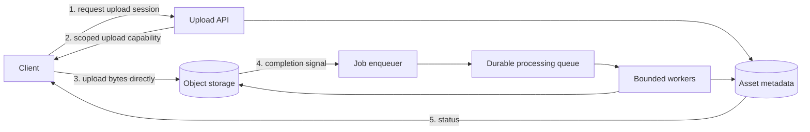
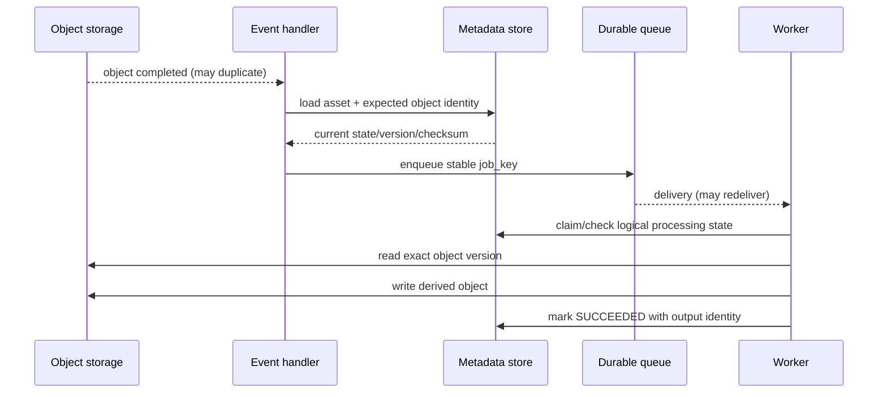
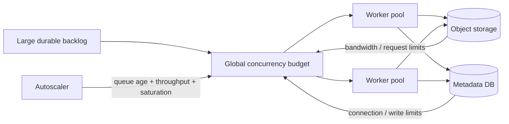

## System goal and constraints

Suppose a product lets users upload images, videos, archives, or documents that need asynchronous processing. The system should accept files from unreliable networks, avoid turning application servers into byte relays, validate untrusted content, run expensive transformations outside the request path, survive duplicate notifications and worker crashes, expose progress, and prevent a burst of large files from overwhelming downstream capacity.

A robust reference shape separates three things that are easy to accidentally collapse:

1. **File bytes** live in object storage.
2. **Business metadata and processing state** live in an application database or equivalent durable metadata store.
3. **Work ownership** lives in a durable background-job mechanism such as a queue.

The architecture below is a reference shape, not a mandatory cloud topology. A small system can use a database-backed job table. A larger system can use managed object storage, a message broker, autoscaled workers, malware scanning, and several derived-output stages. The invariants matter more than the provider names.

## High-level flow



The important boundary is that the application API authorizes and coordinates the upload, but normal file bytes do not have to pass through the API process. That keeps API memory, request duration, and network bandwidth from scaling directly with file size.

A practical lifecycle might be:

```text
CREATED -> UPLOADING -> UPLOADED -> QUEUED -> PROCESSING -> SUCCEEDED
                                                \-> FAILED
                         \-> REJECTED
```

Persist the lifecycle as application state. Do not infer the whole business state only from whether an object happens to exist in a bucket.

## 1. Create an application identity before bytes arrive

Start with a stable application-level identity such as `asset_id`. The API can create metadata like:

```text
asset_id: ast_7f91...
owner_id: usr_42...
input_object_key: uploads/ast_7f91/source
expected_max_bytes: 2_000_000_000
state: UPLOADING
```

The original user filename is display metadata, not a storage identity and not an authorization boundary. Generate the storage key from application-owned identifiers so one user cannot choose a path that collides with another asset.

<TermBox term="Upload capability">
An **upload capability** is a narrowly scoped credential or signed request that lets a client perform a specific storage action for a limited scope and time.

**Why it matters here:** the browser can send large bytes directly to object storage without receiving broad cloud credentials. AWS S3 presigned URLs are one concrete example: the URL uses the permissions of the principal that created it and can grant time-limited upload access to a specific object operation.
</TermBox>

Apply least privilege when issuing that capability:

- allow only the required upload action;
- bind it to the intended object key or narrow prefix;
- keep the lifetime short enough for the upload workflow;
- constrain size, checksum, content headers, or policy fields when the storage mechanism supports those constraints;
- treat the capability as a bearer secret until it expires.

Do not issue a browser credentials that can list the bucket, read other users' objects, delete arbitrary inputs, or write derived-output paths.

## 2. Let large uploads resume instead of restarting from zero

A single request is a poor transport strategy for a multi-gigabyte file on an unstable connection. Object-storage multipart or resumable upload mechanisms let the client retry failed pieces rather than resend the entire file.

AWS S3 multipart upload is one concrete example: parts can be uploaded independently, failed parts can be retried without restarting the whole object, and incomplete multipart uploads must eventually be completed or aborted so abandoned parts do not accumulate storage cost.

The application should distinguish **upload session expiration** from **asset expiration**. A user may abandon an upload after the metadata row exists. Run a cleanup process that finds stale `UPLOADING` assets, aborts provider-specific incomplete uploads where necessary, and marks or removes abandoned metadata according to product policy.

## 3. Bind processing to an immutable input identity

A storage key alone can be a dangerously weak identity if later uploads are allowed to overwrite it.

<TermBox term="Object version identity">
An **object version identity** is the stable tuple that tells a processor exactly which uploaded bytes it is supposed to process. Depending on the storage system, that may include an object key plus a version/generation identifier and an integrity checksum.

**Why it matters here:** a delayed or duplicate notification must not cause a worker to process newer bytes under an older asset/job identity.
</TermBox>

After upload completion, persist enough evidence to bind the business record to the exact input:

```text
asset_id
object_key
object_version_or_generation
size_bytes
checksum
content_type_claim
uploaded_at
```

Verify the checksum or provider integrity result when your workflow requires end-to-end integrity. Do not use a user-supplied filename, content type, or mutable object key as proof that the bytes are the ones you intended to process.

## 4. Treat the completion signal as at least once

A storage completion event is a trigger, not proof that the event will arrive exactly once or in order.

AWS S3 Event Notifications are a concrete example: AWS documents them as **at least once**, and duplicate or out-of-order notifications can occur. Even if another provider has different guarantees, write down the actual delivery contract instead of assuming one universal cloud behavior.

A durable enqueuer can translate the completion signal into a processing job such as:

```text
job_type: PROCESS_ASSET
job_key: ast_7f91:<object-version>
asset_id: ast_7f91
object_key: uploads/ast_7f91/source
object_version: <immutable-version>
checksum: <expected-checksum>
```

Make the enqueue/process path idempotent. A duplicate completion signal should resolve to the same logical processing identity, not create a second independent transformation with conflicting outputs.

If the notification arrives before metadata is ready, or after the asset has moved to a terminal state, the handler should reconcile against durable application state. Do not blindly enqueue every notification as fresh work.



This produces two duplicate boundaries: storage notification delivery and job delivery. Both must be safe.

## 5. Quarantine first; uploaded content is untrusted input

<TermBox term="Quarantine">
A **quarantine** area is a storage location or state where uploaded content is not yet trusted for public serving or normal downstream use.

**Why it matters here:** file extensions and client-provided content types are claims, not security evidence. Parsers can also be attacked by malformed files, decompression bombs, oversized dimensions, or other resource-exhaustion inputs.
</TermBox>

A practical validation stage can apply controls such as:

- authorize who may upload;
- enforce a product-level maximum file size before and after upload where possible;
- allow only file types the product actually needs;
- validate file signatures/content rather than trusting only the `Content-Type` header or extension;
- generate storage names rather than trusting user filenames;
- scan for malware when the risk model calls for it;
- set decompression, image-dimension, parser-time, memory, and temporary-disk budgets;
- keep untrusted originals non-public;
- isolate risky parsers or converters with minimal filesystem/network/cloud permissions.

OWASP's current File Upload guidance explicitly recommends type/signature validation, generated filenames, size limits, authorized uploaders, storage isolation, and defensive content validation. Use those controls according to the file types and threat model rather than applying a ceremonial scanner and declaring the input safe.

A rejected file should have a durable terminal reason such as `REJECTED_UNSUPPORTED_TYPE`, `REJECTED_TOO_LARGE`, or `REJECTED_MALICIOUS_CONTENT`. Operators need to distinguish validation rejection from infrastructure failure.

## 6. Make transformations duplicate-safe and publish outputs only when complete

Workers should process the exact immutable input identity from the job. A robust worker flow is:

```text
1. load asset and verify job identity is still current
2. claim or observe the logical processing attempt
3. stream the input instead of loading arbitrary file sizes into memory
4. validate within explicit resource budgets
5. write output to a unique temporary or versioned derived key
6. verify output creation
7. atomically update metadata to point at the completed output identity
8. acknowledge the job
```

If a worker crashes after step 5 but before step 7, redelivery should not corrupt the business state. The next attempt can detect the prior output, safely overwrite a deterministic versioned output when appropriate, or create a new attempt output and publish exactly one as current.

Do not expose partially written derived files through the final public key if consumers can observe them before processing is complete. Prefer unique/versioned output identities plus an application metadata pointer that changes only after the output is durable.

Retries should target transient failures. Unsupported formats, malicious content, deterministic parser errors, or files that exceed declared product limits should not bounce forever through exponential backoff. Route terminal failures to a visible failed/quarantined state and use a dead-letter or manual-review path where it adds operational value.

## 7. Control pressure before autoscaling becomes an avalanche

Autoscaling workers can improve recovery from bursts, but only if downstream systems and per-worker resources have explicit limits.

A file processor may consume:

- object-storage read/write bandwidth;
- CPU for compression, transcoding, OCR, or scanning;
- memory and temporary disk;
- database connections for metadata updates;
- calls to antivirus, model, media, or document-processing services.

Scale using workload evidence such as **queue age**, backlog depth, publish rate, processing throughput, and worker saturation. Queue depth alone can be misleading when job sizes differ dramatically.

Use **bounded concurrency** inside and across workers. A fleet that instantly starts 1,000 two-gigabyte transforms can be worse than a fleet that drains the backlog steadily while respecting storage, database, CPU, and third-party limits.



Backpressure must change behavior. Depending on the product, the system can cap new uploads, reduce optional transformations, delay lower-priority work, increase capacity deliberately, or tell users that processing is delayed. A dashboard that merely shows an ever-growing backlog is not pressure control.

## 8. Give every boundary least-privilege cloud identity

Cloud IAM should reflect responsibilities, not convenience:

- **Browser/client upload capability:** write only the intended input object for a limited time; no broad bucket credentials.
- **Upload API:** create asset metadata and mint the narrow upload capability; it does not need to read every derived object merely because it issues upload sessions.
- **Event handler/enqueuer:** read the minimum object metadata and application state needed to validate the event, then enqueue work.
- **Processing worker:** read quarantined input identities and write only the intended derived-output area; avoid bucket administration permissions.
- **Serving path:** read only approved outputs after application authorization; do not make the quarantine area public.
- **Cleanup process:** delete abandoned multipart uploads/temp outputs only in its cleanup scope.

Separate identities make blast radius visible. If one image parser is compromised, its worker role should not also be able to mint upload credentials, delete unrelated originals, rewrite user ownership metadata, or administer the entire storage account.

## 9. Correlate evidence across a path that does not share one request trace

Direct client-to-storage upload means the entire lifecycle does not naturally live under one synchronous application trace. Preserve correlation explicitly.

Carry stable identifiers through metadata, events, queue messages, logs, and derived outputs:

```text
asset_id
processing_job_key
object_key + version/generation
processing_attempt_id
trace_id where an application trace exists
```

Useful metrics include:

- upload-session creation and abandonment rate;
- upload bytes and completion latency by size bucket;
- validation/quarantine rejection rate by reason;
- queue age and backlog by job class;
- processing duration and bytes processed;
- retry and redelivery rate;
- worker CPU/memory/temp-disk saturation;
- output success/failure rate;
- time from upload completion to `SUCCEEDED`;
- number of stale/duplicate notifications ignored.

Logs should answer “what happened to `asset_id=...`?” without searching by filename. Traces should cover application-owned spans such as upload-session creation, event handling, queue publishing, and processing dependencies, while logs/metrics bridge the direct storage transfer that may not share the same trace context.

## Production failure: a mutable key and a late notification processed the wrong bytes

> **Scenario:** The application reused `uploads/{user_id}/current.pdf` for every replacement document. Upload A completed and storage emitted a notification. Before that notification was processed, the user uploaded B to the same key, replacing A. The delayed notification for A then reached the worker, which opened the key and read B's bytes while updating A's metadata record.

**Impact:** The system associated the wrong document with the earlier asset, generated derived output from the wrong bytes, and left an audit trail that appeared internally consistent because every component referred to the same mutable storage key.

**Root cause:** The design treated a mutable object key as file identity and assumed completion notifications were unique and ordered. It did not bind the processing job to an immutable object version/generation and checksum.

**Correct pattern:** Generate a unique object identity per upload attempt, persist the exact version/generation and checksum, include that identity in the stable processing job key, ignore stale notifications that do not match current durable state, and make both enqueueing and processing idempotent. If product semantics permit replacement, model replacement as a new asset version rather than silently mutating the bytes behind an old processing identity.

## Failure-boundary walkthrough

| Failure | Durable evidence | Recovery rule |
| --- | --- | --- |
| Client disappears mid-upload | `UPLOADING` asset + provider upload session | expire/abort stale upload and clean orphan parts |
| Upload completes but notification is delayed | object identity + `UPLOADING`/`UPLOADED` metadata | reconcile/listen again; do not declare data lost from notification latency alone |
| Completion notification is duplicated | stable `asset_id + object_version` | enqueue the same logical job idempotently |
| Worker crashes during transformation | queued/redeliverable job + attempt/output state | retry from exact input identity; do not publish partial output |
| File is invalid or malicious | quarantine object + terminal rejection reason | stop automatic retries; retain/delete per security policy |
| Workers fall behind | queue age/backlog + saturation metrics | apply bounded concurrency, autoscale within downstream budgets, throttle intake if needed |
| Metadata update fails after output write | derived output identity exists but asset not current | reconcile on retry; publish one durable output pointer |

The recovery pattern is consistent: first identify what durable evidence exists, then resume from that boundary. Do not infer failure merely from a timeout or missing notification.

## Check your mental model

> **Scenario:** A 4 GB video upload completes. The storage notification is delivered twice. The first worker starts transcoding and crashes after writing one derived file but before updating metadata. A second worker receives the redelivered job. Meanwhile the queue is growing quickly because a customer imported 2,000 videos.
>
> What must be true before you safely increase worker count?

<details>
<summary>Show the reasoning</summary>

First, the duplicate notification and job redelivery must map to one logical processing identity based on the exact uploaded object version/generation. The second worker must be able to detect or safely replace the incomplete prior output without publishing two conflicting results.

Second, the fleet needs explicit resource budgets. The autoscaler should use queue age, throughput, and saturation evidence, while global and per-worker concurrency remain bounded by object-storage bandwidth, temporary disk/memory, metadata-database capacity, and any downstream service limits.

Third, the input remains untrusted. A large file should not bypass size, type/signature, decompression, parser, or quarantine controls merely because the system is under backlog pressure.

Only after correctness and downstream budgets are explicit does “add more workers” become a safe scaling action.
</details>

## Architecture review checklist

- [ ] **Identity:** Does each upload attempt have an application-owned `asset_id` and an immutable object version/generation identity?
- [ ] **Integrity:** Is the expected/observed size and checksum recorded or verified where integrity matters?
- [ ] **Direct upload:** Can large bytes bypass application servers without granting broad storage credentials?
- [ ] **Abandonment:** Are stale multipart/resumable uploads and `UPLOADING` metadata cleaned up deliberately?
- [ ] **Delivery:** Are storage notifications and queue deliveries handled according to their real at-least-once/order contract?
- [ ] **Idempotence:** Do duplicate notifications and job redelivery converge on one logical processing result?
- [ ] **Quarantine:** Are untrusted originals isolated from public/normal serving until validation succeeds?
- [ ] **Validation:** Are file size, signature/type, parser limits, decompression/resource budgets, and malware controls matched to the threat model?
- [ ] **Outputs:** Are derived files published through immutable/versioned identities only after they are complete?
- [ ] **Retries:** Are transient failures retried while deterministic/security rejections stop automatically?
- [ ] **Backpressure:** Do queue age, throughput, and resource saturation drive throttling or capacity actions?
- [ ] **Bounded concurrency:** Can autoscaling increase workers without exceeding storage, database, memory/disk, or downstream limits?
- [ ] **Least privilege:** Does every cloud identity have only the object actions/prefixes and metadata operations it actually needs?
- [ ] **Evidence:** Can operators trace one `asset_id` across upload, notification, queue, worker attempt, derived output, and terminal state using correlation fields?

## Related concepts

This walkthrough connects **Object Storage**, **Cloud Storage Models**, **Background Jobs**, **Message Queues**, **Delivery Semantics**, **Partial Failure**, **Retries and Backoff**, **Cloud IAM**, **Autoscaling**, **Logs/Metrics/Traces**, and **Least Privilege**. Read [Queue vs Event Stream](/docs/engineering-judgment/decision-guides/queue-vs-event-stream) for the messaging ownership decision and [Reliable Checkout](/docs/engineering-judgment/architecture-walkthroughs/reliable-checkout) for another example of recovering across non-atomic boundaries.

## Sources

- [Amazon S3 — Download and upload objects with presigned URLs](https://docs.aws.amazon.com/AmazonS3/latest/userguide/using-presigned-url.html)
- [Amazon S3 — Uploading and copying objects using multipart upload](https://docs.aws.amazon.com/AmazonS3/latest/userguide/mpuoverview.html)
- [Amazon S3 — Event Notifications](https://docs.aws.amazon.com/AmazonS3/latest/userguide/EventNotifications.html)
- [Amazon S3 — Event ordering and duplicate notifications](https://docs.aws.amazon.com/AmazonS3/latest/userguide/notification-how-to-event-types-and-destinations.html)
- [OWASP Cheat Sheet Series — File Upload](https://cheatsheetseries.owasp.org/cheatsheets/File_Upload_Cheat_Sheet.html)
