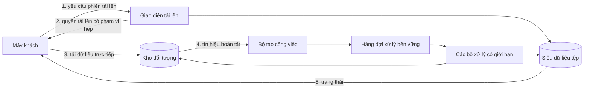
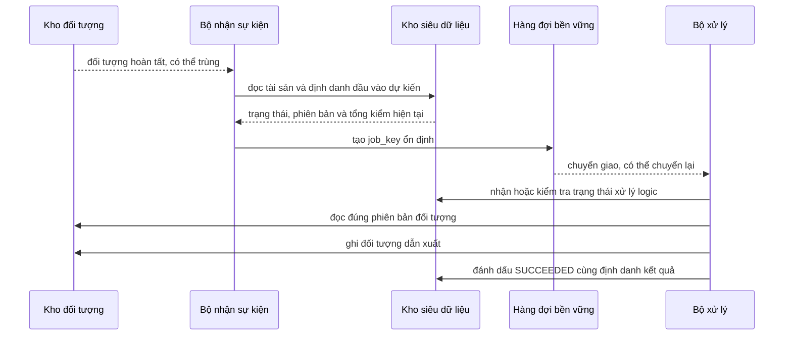
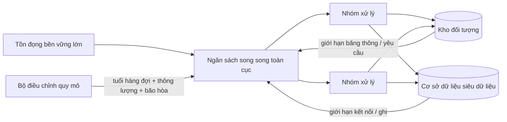

## Mục tiêu hệ thống và các ràng buộc

Giả sử sản phẩm cho phép người dùng tải lên ảnh, video, tệp nén hoặc tài liệu cần xử lý bất đồng bộ. Hệ thống cần nhận tệp qua mạng không ổn định, tránh biến máy chủ ứng dụng thành nơi chuyển tiếp toàn bộ dữ liệu, kiểm tra nội dung không đáng tin, chạy biến đổi tốn tài nguyên ngoài đường xử lý yêu cầu, sống sót qua thông báo trùng và bộ xử lý bị dừng, hiển thị tiến độ, đồng thời ngăn một đợt tệp lớn làm quá tải năng lực phía sau.

Một hình dạng tham chiếu bền vững tách ba thứ rất dễ bị nhập làm một:

1. **Dữ liệu tệp** nằm trong kho đối tượng.
2. **Siêu dữ liệu nghiệp vụ và trạng thái xử lý** nằm trong cơ sở dữ liệu ứng dụng hoặc kho siêu dữ liệu bền vững tương đương.
3. **Quyền sở hữu công việc** nằm trong cơ chế công việc nền bền vững như hàng đợi.

Kiến trúc dưới đây là hình dạng tham chiếu, không phải cấu trúc đám mây bắt buộc. Hệ thống nhỏ có thể dùng bảng công việc trong cơ sở dữ liệu. Hệ thống lớn hơn có thể dùng kho đối tượng được quản lý, hệ thống trung gian truyền tin, các bộ xử lý tự điều chỉnh quy mô, quét mã độc và nhiều giai đoạn tạo kết quả dẫn xuất. Các bất biến quan trọng hơn tên nhà cung cấp.

## Luồng tổng thể



Ranh giới quan trọng là giao diện ứng dụng cho phép và điều phối lần tải lên, nhưng dữ liệu tệp thông thường không cần đi qua tiến trình giao diện. Nhờ vậy bộ nhớ, thời gian yêu cầu và băng thông của giao diện không tăng trực tiếp theo kích thước tệp.

Một vòng đời thực dụng có thể là:

```text
CREATED -> UPLOADING -> UPLOADED -> QUEUED -> PROCESSING -> SUCCEEDED
                                                \-> FAILED
                         \-> REJECTED
```

Hãy lưu vòng đời như trạng thái ứng dụng. Không suy ra toàn bộ trạng thái nghiệp vụ chỉ từ việc một đối tượng có tồn tại trong vùng lưu trữ hay không.

## 1. Tạo định danh ứng dụng trước khi dữ liệu đến

Bắt đầu với một định danh ổn định ở mức ứng dụng như `asset_id`. Giao diện có thể tạo siêu dữ liệu như:

```text
asset_id: ast_7f91...
owner_id: usr_42...
input_object_key: uploads/ast_7f91/source
expected_max_bytes: 2_000_000_000
state: UPLOADING
```

Tên tệp ban đầu do người dùng cung cấp chỉ là siêu dữ liệu hiển thị, không phải định danh lưu trữ và không phải ranh giới phân quyền. Hãy tạo khóa lưu trữ từ định danh do ứng dụng kiểm soát để một người dùng không thể chọn đường dẫn va chạm với tài sản của người khác.

<TermBox term="Quyền tải lên có phạm vi hẹp">
**Quyền tải lên có phạm vi hẹp** là thông tin xác thực hoặc yêu cầu đã ký chỉ cho phép máy khách thực hiện một thao tác lưu trữ cụ thể trong phạm vi và thời gian giới hạn.

**Vì sao quan trọng ở đây:** trình duyệt có thể gửi dữ liệu lớn trực tiếp vào kho đối tượng mà không nhận thông tin xác thực đám mây rộng. Đường dẫn đã ký sẵn của Amazon S3 là một ví dụ cụ thể: quyền của đường dẫn bị giới hạn bởi định danh đám mây đã tạo ra nó và có thể cấp quyền tải một đối tượng trong thời gian hữu hạn.
</TermBox>

Áp dụng đặc quyền tối thiểu khi phát hành quyền đó:

- chỉ cho phép thao tác tải lên cần thiết;
- ràng buộc vào đúng khóa đối tượng hoặc tiền tố rất hẹp;
- giữ thời hạn đủ ngắn cho quy trình tải lên;
- ràng buộc kích thước, tổng kiểm, tiêu đề nội dung hoặc trường chính sách khi cơ chế lưu trữ hỗ trợ;
- xem quyền này như bí mật dạng mang theo cho đến khi hết hạn.

Không cấp cho trình duyệt thông tin xác thực có thể liệt kê toàn bộ vùng lưu trữ, đọc đối tượng của người khác, xóa đầu vào tùy ý hoặc ghi vào vùng kết quả dẫn xuất.

## 2. Cho phép tệp lớn tiếp tục thay vì bắt đầu lại từ đầu

Một yêu cầu duy nhất là chiến lược truyền tải yếu cho tệp nhiều gigabyte trên mạng không ổn định. Cơ chế tải nhiều phần hoặc tải tiếp của kho đối tượng cho phép máy khách thử lại phần bị lỗi thay vì gửi lại toàn bộ tệp.

Tải nhiều phần của Amazon S3 là một ví dụ cụ thể: các phần có thể được tải độc lập, phần lỗi có thể được thử lại mà không khởi động lại cả đối tượng, và phiên tải nhiều phần chưa hoàn tất cuối cùng phải được hoàn tất hoặc hủy để các phần bị bỏ quên không tích lũy chi phí lưu trữ.

Ứng dụng nên phân biệt **hết hạn phiên tải lên** với **hết hạn tài sản**. Người dùng có thể bỏ dở sau khi hàng siêu dữ liệu đã tồn tại. Hãy có tiến trình dọn dẹp tìm các tài sản `UPLOADING` quá hạn, hủy phiên nhiều phần chưa hoàn thành khi cần và đánh dấu hoặc xóa siêu dữ liệu bị bỏ dở theo chính sách sản phẩm.

## 3. Ràng buộc xử lý vào định danh đầu vào bất biến

Chỉ một khóa lưu trữ có thể là định danh nguy hiểm nếu lần tải sau được phép ghi đè cùng khóa.

<TermBox term="Định danh phiên bản đối tượng">
**Định danh phiên bản đối tượng** là bộ thông tin ổn định cho bộ xử lý biết chính xác dữ liệu nào cần xử lý. Tùy hệ thống lưu trữ, bộ này có thể gồm khóa đối tượng, định danh phiên bản hoặc thế hệ và tổng kiểm toàn vẹn.

**Vì sao quan trọng ở đây:** thông báo đến muộn hoặc trùng không được khiến bộ xử lý lấy dữ liệu mới hơn dưới định danh tài sản hoặc công việc cũ.
</TermBox>

Sau khi tải lên hoàn tất, lưu đủ bằng chứng để ràng buộc bản ghi nghiệp vụ với đúng đầu vào:

```text
asset_id
object_key
object_version_or_generation
size_bytes
checksum
content_type_claim
uploaded_at
```

Xác minh tổng kiểm hoặc kết quả kiểm tra toàn vẹn từ nhà cung cấp khi quy trình cần bảo đảm toàn vẹn đầu-cuối. Không dùng tên tệp do người dùng cung cấp, kiểu nội dung do máy khách khai báo hoặc khóa đối tượng có thể thay đổi làm bằng chứng rằng dữ liệu đúng với lần xử lý dự kiến.

## 4. Xem tín hiệu hoàn tất là chuyển giao ít nhất một lần

Thông báo hoàn tất từ kho lưu trữ chỉ là tín hiệu kích hoạt, không phải bằng chứng rằng thông báo sẽ đến đúng một lần hoặc đúng thứ tự.

Thông báo sự kiện của Amazon S3 là ví dụ cụ thể: tài liệu AWS mô tả cơ chế này là chuyển giao **ít nhất một lần**, đồng thời có thể xảy ra thông báo trùng hoặc đến không đúng thứ tự. Nếu nhà cung cấp khác có bảo đảm khác, hãy ghi rõ hợp đồng thật của họ thay vì giả định một hành vi đám mây phổ quát.

Bộ tạo công việc bền vững có thể chuyển tín hiệu hoàn tất thành công việc xử lý như:

```text
job_type: PROCESS_ASSET
job_key: ast_7f91:<object-version>
asset_id: ast_7f91
object_key: uploads/ast_7f91/source
object_version: <immutable-version>
checksum: <expected-checksum>
```

Hãy làm đường tạo và xử lý công việc có khả năng xử lý lặp an toàn. Một tín hiệu hoàn tất trùng phải hội tụ về cùng định danh xử lý logic, không tạo hai lần biến đổi độc lập với kết quả xung đột.

Nếu thông báo đến trước khi siêu dữ liệu sẵn sàng hoặc sau khi tài sản đã ở trạng thái kết thúc, bộ nhận cần đối chiếu với trạng thái ứng dụng bền vững. Không đưa mọi thông báo vào hàng đợi như một công việc mới mà không kiểm tra.



Như vậy có hai ranh giới trùng: chuyển giao thông báo lưu trữ và chuyển giao công việc. Cả hai đều phải an toàn khi lặp.

## 5. Cách ly trước; tệp tải lên là đầu vào không đáng tin

<TermBox term="Vùng cách ly">
**Vùng cách ly** là vị trí hoặc trạng thái lưu trữ nơi nội dung tải lên chưa được tin cậy để phục vụ công khai hoặc dùng bình thường ở phía sau.

**Vì sao quan trọng ở đây:** phần mở rộng và kiểu nội dung do máy khách gửi chỉ là tuyên bố, không phải bằng chứng bảo mật. Bộ phân tích tệp cũng có thể bị tấn công bởi tệp sai cấu trúc, bom giải nén, kích thước ảnh cực lớn hoặc đầu vào làm cạn tài nguyên.
</TermBox>

Một giai đoạn kiểm tra thực dụng có thể áp dụng:

- chỉ người dùng được phép mới được tải lên;
- đặt giới hạn kích thước ở mức sản phẩm trước và sau khi tải lên khi có thể;
- chỉ cho phép các loại tệp sản phẩm thực sự cần;
- kiểm tra chữ ký hoặc nội dung tệp thay vì chỉ tin tiêu đề `Content-Type` hay phần mở rộng;
- sinh tên lưu trữ từ ứng dụng thay vì tin tên tệp người dùng;
- quét mã độc khi mô hình rủi ro yêu cầu;
- đặt ngân sách cho giải nén, kích thước ảnh, thời gian phân tích, bộ nhớ và đĩa tạm;
- giữ bản gốc chưa tin cậy ở trạng thái không công khai;
- cô lập bộ phân tích hoặc bộ chuyển đổi rủi ro với quyền hệ thống tệp, mạng và đám mây tối thiểu.

Hướng dẫn tải tệp hiện hành của OWASP khuyến nghị kiểm tra loại/chữ ký, sinh tên tệp, giới hạn kích thước, xác thực người tải, tách vị trí lưu trữ và kiểm tra nội dung phòng thủ. Hãy áp dụng theo loại tệp và mô hình đe dọa thay vì chạy một công cụ quét mang tính hình thức rồi xem nội dung là an toàn.

Tệp bị từ chối nên có lý do kết thúc bền vững như `REJECTED_UNSUPPORTED_TYPE`, `REJECTED_TOO_LARGE` hoặc `REJECTED_MALICIOUS_CONTENT`. Người vận hành cần phân biệt từ chối do kiểm tra với lỗi hạ tầng.

## 6. Làm biến đổi an toàn khi lặp và chỉ công bố kết quả đã hoàn tất

Bộ xử lý phải dùng đúng định danh đầu vào bất biến trong công việc. Một luồng bền vững là:

```text
1. đọc tài sản và xác minh định danh công việc vẫn là phiên bản hiện tại
2. nhận hoặc quan sát lần xử lý logic
3. đọc luồng dữ liệu thay vì nạp tệp kích thước tùy ý hoàn toàn vào bộ nhớ
4. kiểm tra trong các ngân sách tài nguyên rõ ràng
5. ghi kết quả vào khóa tạm hoặc khóa dẫn xuất có phiên bản riêng
6. xác minh kết quả đã được tạo
7. cập nhật nguyên tử siêu dữ liệu để trỏ đến định danh kết quả hoàn tất
8. xác nhận công việc
```

Nếu bộ xử lý dừng sau bước 5 nhưng trước bước 7, lần chuyển giao lại không được làm hỏng trạng thái nghiệp vụ. Lần tiếp theo có thể phát hiện kết quả trước đó, ghi đè an toàn một kết quả có định danh xác định khi phù hợp, hoặc tạo kết quả cho lần thử mới rồi chỉ công bố một kết quả làm hiện tại.

Không để tệp dẫn xuất chưa hoàn tất xuất hiện dưới khóa công khai cuối cùng nếu bên đọc có thể nhìn thấy nó trước khi xử lý xong. Ưu tiên định danh kết quả duy nhất hoặc có phiên bản và một con trỏ siêu dữ liệu ứng dụng chỉ đổi sau khi kết quả đã bền vững.

Chỉ thử lại lỗi tạm thời. Định dạng không hỗ trợ, nội dung độc hại, lỗi phân tích xác định hoặc tệp vượt giới hạn sản phẩm không nên chạy vô hạn qua cơ chế giãn cách thử lại. Hãy chuyển lỗi kết thúc sang trạng thái thất bại hoặc cách ly nhìn thấy được và dùng thư chết hoặc quy trình xem xét thủ công khi có giá trị vận hành.

## 7. Kiểm soát áp lực trước khi tự điều chỉnh quy mô thành một đợt tràn

Tự tăng số bộ xử lý có thể giúp phục hồi sau đợt tải lớn, nhưng chỉ an toàn khi hệ thống phía sau và tài nguyên mỗi bộ xử lý có giới hạn rõ ràng.

Một bộ xử lý tệp có thể tiêu thụ:

- băng thông đọc/ghi kho đối tượng;
- bộ xử lý trung tâm cho nén, chuyển mã, nhận dạng ký tự hoặc quét;
- bộ nhớ và đĩa tạm;
- kết nối cơ sở dữ liệu để cập nhật siêu dữ liệu;
- lời gọi tới dịch vụ quét mã độc, mô hình, xử lý đa phương tiện hoặc tài liệu.

Điều chỉnh quy mô dựa trên bằng chứng công việc như **tuổi của công việc lâu nhất trong hàng đợi**, độ sâu tồn đọng, tốc độ tạo việc, thông lượng xử lý và mức bão hòa bộ xử lý. Chỉ nhìn độ sâu hàng đợi có thể gây hiểu nhầm khi kích thước công việc khác nhau rất lớn.

Dùng **giới hạn mức song song** bên trong từng bộ xử lý và trên toàn đội. Một đội lập tức khởi chạy 1.000 lần biến đổi tệp 2 GB có thể tệ hơn đội xả tồn đọng đều đặn trong giới hạn băng thông lưu trữ, cơ sở dữ liệu, bộ xử lý trung tâm và dịch vụ phía sau.



Áp lực ngược phải làm hành vi thay đổi. Tùy sản phẩm, hệ thống có thể giới hạn lần tải mới, giảm biến đổi tùy chọn, trì hoãn việc ưu tiên thấp, chủ động tăng năng lực hoặc báo cho người dùng rằng xử lý đang chậm. Bảng theo dõi chỉ cho thấy tồn đọng tăng không phải cơ chế kiểm soát áp lực.

## 8. Cấp định danh đám mây theo đặc quyền tối thiểu cho từng ranh giới

Phân quyền đám mây nên phản ánh trách nhiệm, không phản ánh sự tiện lợi:

- **Quyền tải lên của trình duyệt:** chỉ ghi đúng đối tượng đầu vào trong thời gian giới hạn; không có thông tin xác thực rộng cho cả vùng lưu trữ.
- **Giao diện tải lên:** tạo siêu dữ liệu tài sản và phát hành quyền tải hẹp; không cần đọc mọi kết quả dẫn xuất chỉ vì nó tạo phiên tải.
- **Bộ nhận sự kiện/tạo công việc:** đọc lượng siêu dữ liệu đối tượng và trạng thái ứng dụng tối thiểu cần thiết rồi tạo công việc.
- **Bộ xử lý:** đọc đúng đầu vào cách ly và ghi vào vùng kết quả dẫn xuất dự kiến; tránh quyền quản trị vùng lưu trữ.
- **Đường phục vụ:** chỉ đọc kết quả đã được chấp thuận sau khi ứng dụng phân quyền; không công khai vùng cách ly.
- **Tiến trình dọn dẹp:** chỉ xóa phiên tải bỏ dở hoặc kết quả tạm trong phạm vi dọn dẹp của nó.

Tách định danh làm bán kính ảnh hưởng trở nên rõ ràng. Nếu một bộ phân tích ảnh bị chiếm quyền, vai trò của nó không nên đồng thời có khả năng phát hành quyền tải lên, xóa bản gốc không liên quan, sửa quyền sở hữu người dùng hoặc quản trị toàn bộ tài khoản lưu trữ.

## 9. Giữ dữ liệu tương quan qua một vòng đời không nằm trong một dấu vết yêu cầu duy nhất

Tải trực tiếp từ máy khách sang kho lưu trữ có nghĩa toàn bộ vòng đời không tự nhiên nằm trong một dấu vết đồng bộ của ứng dụng. Hãy giữ tương quan một cách chủ động.

Mang các định danh ổn định qua siêu dữ liệu, sự kiện, thông điệp hàng đợi, bản ghi vận hành và kết quả dẫn xuất:

```text
asset_id
processing_job_key
object_key + version/generation
processing_attempt_id
trace_id khi có dấu vết ứng dụng
```

Các số đo hữu ích gồm:

- tỷ lệ tạo và bỏ dở phiên tải lên;
- số byte tải lên và độ trễ hoàn tất theo nhóm kích thước;
- tỷ lệ từ chối khi kiểm tra hoặc cách ly theo nguyên nhân;
- tuổi của công việc trong hàng đợi và tồn đọng theo loại việc;
- thời gian xử lý và số byte đã xử lý;
- tỷ lệ thử lại và chuyển giao lại;
- mức bão hòa bộ xử lý trung tâm, bộ nhớ và đĩa tạm của bộ xử lý;
- tỷ lệ thành công/thất bại của kết quả;
- thời gian từ khi tải xong đến `SUCCEEDED`;
- số thông báo cũ hoặc trùng bị bỏ qua.

Bản ghi vận hành phải trả lời được “điều gì đã xảy ra với `asset_id=...`?” mà không phải tìm bằng tên tệp. Dấu vết phân tán nên bao phủ các đoạn do ứng dụng sở hữu như tạo phiên tải, nhận sự kiện, phát công việc và các phụ thuộc khi xử lý; bản ghi và số đo nối phần truyền dữ liệu trực tiếp với kho lưu trữ vốn có thể không mang cùng ngữ cảnh dấu vết.

## Sự cố thực tế: khóa có thể thay đổi và thông báo đến muộn khiến xử lý nhầm dữ liệu

> **Tình huống:** Ứng dụng dùng lại `uploads/{user_id}/current.pdf` cho mọi lần thay tài liệu. Lần tải A hoàn tất và kho lưu trữ phát thông báo. Trước khi thông báo đó được xử lý, người dùng tải B vào cùng khóa và thay thế A. Thông báo đến muộn của A sau đó tới bộ xử lý; bộ xử lý mở khóa hiện tại và đọc dữ liệu B nhưng cập nhật bản ghi siêu dữ liệu của A.

**Hậu quả:** Hệ thống gắn nhầm tài liệu vào tài sản cũ, tạo kết quả dẫn xuất từ dữ liệu sai và để lại lịch sử kiểm toán trông có vẻ nhất quán vì mọi thành phần đều tham chiếu cùng một khóa lưu trữ có thể thay đổi.

**Nguyên nhân cốt lõi:** Thiết kế xem khóa đối tượng có thể thay đổi như định danh tệp và giả định thông báo hoàn tất là duy nhất, đúng thứ tự. Công việc xử lý không bị ràng buộc vào phiên bản hoặc thế hệ đối tượng bất biến cùng tổng kiểm.

**Cách khắc phục chuẩn:** Sinh định danh đối tượng duy nhất cho mỗi lần tải, lưu phiên bản hoặc thế hệ chính xác cùng tổng kiểm, đưa định danh đó vào khóa công việc xử lý ổn định, bỏ qua thông báo cũ không khớp trạng thái bền vững hiện tại và làm cả việc tạo lẫn xử lý công việc có khả năng lặp an toàn. Nếu sản phẩm cho phép thay thế, hãy mô hình hóa lần thay như phiên bản tài sản mới thay vì âm thầm đổi dữ liệu phía sau một định danh xử lý cũ.

## Đi qua từng ranh giới lỗi

| Lỗi | Bằng chứng bền vững | Quy tắc phục hồi |
| --- | --- | --- |
| Máy khách biến mất giữa lần tải | tài sản `UPLOADING` + phiên tải từ nhà cung cấp | hết hạn hoặc hủy phiên cũ và dọn các phần mồ côi |
| Tải hoàn tất nhưng thông báo đến chậm | định danh đối tượng + siêu dữ liệu `UPLOADING`/`UPLOADED` | đối chiếu hoặc nhận lại; không kết luận mất dữ liệu chỉ vì thông báo chậm |
| Thông báo hoàn tất bị trùng | `asset_id + object_version` ổn định | tạo cùng một công việc logic theo cách lặp an toàn |
| Bộ xử lý dừng giữa biến đổi | công việc có thể chuyển giao lại + trạng thái lần thử/kết quả | thử lại từ đúng định danh đầu vào; không công bố kết quả dở dang |
| Tệp không hợp lệ hoặc độc hại | đối tượng cách ly + lý do từ chối kết thúc | dừng thử lại tự động; giữ hoặc xóa theo chính sách bảo mật |
| Bộ xử lý chậm hơn đầu vào | tuổi hàng đợi/tồn đọng + số đo bão hòa | giới hạn song song, tăng quy mô trong ngân sách phía sau, giới hạn đầu vào khi cần |
| Cập nhật siêu dữ liệu lỗi sau khi đã ghi kết quả | định danh kết quả tồn tại nhưng tài sản chưa trỏ tới | đối chiếu khi thử lại; chỉ công bố một con trỏ kết quả bền vững |

Mẫu phục hồi luôn giống nhau: xác định bằng chứng bền vững nào đã tồn tại rồi tiếp tục từ ranh giới đó. Không suy ra thất bại chỉ từ hết thời gian chờ hoặc một thông báo bị thiếu.

## Kiểm tra mô hình tư duy

> **Tình huống:** Một video 4 GB tải xong. Thông báo lưu trữ được chuyển giao hai lần. Bộ xử lý đầu tiên bắt đầu chuyển mã rồi dừng sau khi đã ghi một tệp dẫn xuất nhưng trước khi cập nhật siêu dữ liệu. Bộ xử lý thứ hai nhận công việc được chuyển giao lại. Cùng lúc, hàng đợi tăng nhanh vì một khách hàng nhập 2.000 video.
>
> Điều gì phải đúng trước khi tăng số bộ xử lý một cách an toàn?

<details>
<summary>Xem giải thích chi tiết</summary>

Trước hết, thông báo trùng và việc chuyển giao lại công việc phải hội tụ về một định danh xử lý logic dựa trên đúng phiên bản hoặc thế hệ đối tượng đã tải. Bộ xử lý thứ hai phải có khả năng phát hiện hoặc thay thế an toàn kết quả dở dang trước đó mà không công bố hai kết quả xung đột.

Thứ hai, đội xử lý phải có ngân sách tài nguyên rõ ràng. Bộ điều chỉnh quy mô nên dùng tuổi hàng đợi, thông lượng và bằng chứng bão hòa, trong khi mức song song toàn cục và từng bộ xử lý vẫn bị giới hạn bởi băng thông kho đối tượng, đĩa tạm/bộ nhớ, năng lực cơ sở dữ liệu siêu dữ liệu và mọi giới hạn dịch vụ phía sau.

Thứ ba, đầu vào vẫn là dữ liệu không đáng tin. Tệp lớn không được bỏ qua giới hạn kích thước, kiểm tra loại/chữ ký, ngân sách giải nén, giới hạn bộ phân tích hoặc vùng cách ly chỉ vì hệ thống đang có tồn đọng.

Chỉ sau khi tính đúng và ngân sách phía sau đã rõ, “thêm bộ xử lý” mới là hành động mở rộng an toàn.
</details>

## Danh sách kiểm tra kiến trúc

- [ ] **Định danh:** Mỗi lần tải có `asset_id` do ứng dụng sở hữu và định danh phiên bản hoặc thế hệ đối tượng bất biến không?
- [ ] **Toàn vẹn:** Kích thước và tổng kiểm dự kiến/quan sát có được lưu hoặc xác minh khi cần bảo đảm toàn vẹn không?
- [ ] **Tải trực tiếp:** Dữ liệu lớn có thể đi thẳng tới kho đối tượng mà không cấp thông tin xác thực lưu trữ rộng không?
- [ ] **Bỏ dở:** Phiên tải nhiều phần hoặc tải tiếp cũ và siêu dữ liệu `UPLOADING` có được dọn chủ động không?
- [ ] **Chuyển giao:** Thông báo lưu trữ và công việc hàng đợi có được xử lý theo hợp đồng ít nhất một lần và thứ tự thực tế không?
- [ ] **Lặp an toàn:** Thông báo trùng và công việc được chuyển lại có hội tụ về một kết quả xử lý logic không?
- [ ] **Cách ly:** Bản gốc chưa tin cậy có tách khỏi đường phục vụ công khai/bình thường cho đến khi kiểm tra thành công không?
- [ ] **Kiểm tra:** Giới hạn kích thước, chữ ký/loại tệp, giới hạn bộ phân tích, ngân sách giải nén/tài nguyên và kiểm soát mã độc có khớp mô hình đe dọa không?
- [ ] **Kết quả:** Tệp dẫn xuất có chỉ được công bố qua định danh bất biến hoặc có phiên bản sau khi hoàn tất không?
- [ ] **Thử lại:** Lỗi tạm thời có được thử lại trong khi lỗi xác định hoặc từ chối bảo mật dừng tự động không?
- [ ] **Áp lực ngược:** Tuổi hàng đợi, thông lượng và bão hòa tài nguyên có dẫn tới hành động giới hạn hoặc tăng năng lực không?
- [ ] **Giới hạn song song:** Tự tăng số bộ xử lý có thể diễn ra mà không vượt giới hạn kho lưu trữ, cơ sở dữ liệu, bộ nhớ/đĩa hoặc dịch vụ phía sau không?
- [ ] **Đặc quyền tối thiểu:** Mỗi định danh đám mây chỉ có thao tác đối tượng, tiền tố và thao tác siêu dữ liệu thực sự cần không?
- [ ] **Bằng chứng:** Người vận hành có thể theo dấu một `asset_id` qua tải lên, thông báo, hàng đợi, lần xử lý, kết quả dẫn xuất và trạng thái kết thúc bằng các trường tương quan không?

## Khái niệm liên quan

Phân tích này nối **Kho đối tượng**, **Mô hình lưu trữ đám mây**, **Công việc nền**, **Hàng đợi thông điệp**, **Ngữ nghĩa chuyển giao**, **Lỗi từng phần**, **Thử lại có giãn cách**, **Phân quyền đám mây**, **Tự điều chỉnh quy mô**, **Bản ghi/Số đo/Dấu vết** và **Đặc quyền tối thiểu**. Đọc [Hàng đợi hay luồng sự kiện](/vi/docs/engineering-judgment/decision-guides/queue-vs-event-stream) cho quyết định về quyền sở hữu thông điệp và [Luồng thanh toán tin cậy](/vi/docs/engineering-judgment/architecture-walkthroughs/reliable-checkout) cho một ví dụ khác về phục hồi qua các ranh giới không nguyên tử.

## Nguồn tham khảo

- [Amazon S3 — tải xuống và tải lên đối tượng bằng đường dẫn đã ký sẵn](https://docs.aws.amazon.com/AmazonS3/latest/userguide/using-presigned-url.html)
- [Amazon S3 — tải và sao chép đối tượng bằng cơ chế nhiều phần](https://docs.aws.amazon.com/AmazonS3/latest/userguide/mpuoverview.html)
- [Amazon S3 — thông báo sự kiện](https://docs.aws.amazon.com/AmazonS3/latest/userguide/EventNotifications.html)
- [Amazon S3 — thứ tự và thông báo sự kiện trùng](https://docs.aws.amazon.com/AmazonS3/latest/userguide/notification-how-to-event-types-and-destinations.html)
- [OWASP Cheat Sheet Series — tải tệp](https://cheatsheetseries.owasp.org/cheatsheets/File_Upload_Cheat_Sheet.html)
