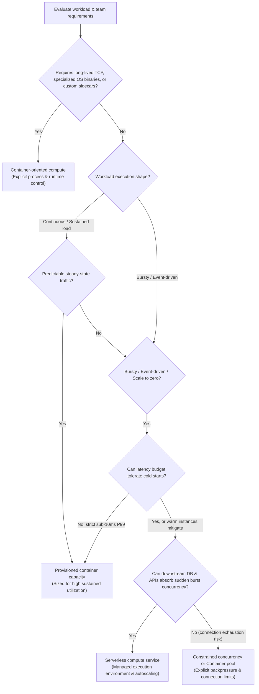

## TL;DR

“Containers vs serverless” combines two different questions. **A container image defines an application/runtime packaging boundary. Serverless describes an operating model in which a managed platform owns more of capacity provisioning and execution-environment lifecycle.** The choices can overlap: some serverless products run container images directly.

Choose the operating model from workload and ownership requirements. Explicit container capacity is useful when you need process/runtime control or deliberately managed capacity. A serverless service is useful when the workload fits that service's execution contract and delegating capacity/host lifecycle removes work the team does not need to own.

The word “serverless” does not guarantee startup latency, concurrency, scaling speed, execution time, networking, local state, or price. **Verify the selected platform's scaling, startup, concurrency, lifecycle, and billing contract before relying on those properties.**

A **container image** defines what runtime artifact you deploy (application code, system libraries, and configuration). **Capacity provisioning**—the operational work of making compute instances, execution slots, or CPU/memory resources available—can either be owned directly by your team or delegated to a cloud service.

## Decision frame

Describe the workload before choosing a compute model:

- Is work request/event driven, continuously running, scheduled, or batch-oriented?
- Does it require long-lived connections, stable process identity, specialized networking, sidecars, unusual binaries, or OS/runtime capabilities?
- What are baseline and peak concurrency, burst size, and acceptable queueing/throttling behavior?
- How much startup/provisioning delay can the latency budget tolerate?
- Must capacity remain warm, or may the service scale toward zero?
- What local state, if any, must survive process/instance replacement?
- Is portability of the runtime image an actual operational requirement?
- Which costs matter: provisioned capacity, request/execution consumption, data transfer, minimum instances, engineering operations time, or all of them?

## Container-oriented compute

A container image packages an application with runtime dependencies and execution configuration according to Open Container Initiative (OCI) standards.

Choose a container-oriented model when explicit control over the process, runtime packages, resource settings, network listeners, worker lifecycle, or companion processes (sidecars) is required. An OCI-compatible image provides a clean packaging boundary, but cloud identity, networking, storage, queues, databases, scaling policy, and deployment automation do not become portable automatically.

Choosing containers does **not** imply self-managing Kubernetes: managed container services can preserve the image/runtime boundary while delegating substantial infrastructure work.

## Serverless compute

Serverless compute delegates capacity provisioning and more of the execution-environment lifecycle to a managed service. The exact contract is product-specific.

<TermBox term="Execution environment">
An **execution environment** is the provider-managed runtime instance/context in which application code executes. Depending on the product, one environment may handle one or many requests over its lifetime and can be created or replaced by the platform.

**Why it matters here:** local memory, filesystem contents, process identity, startup work, and concurrent requests may all be tied to an environment whose lifecycle the application does not control.
</TermBox>

AWS Lambda executes functions in managed execution environments and documents its own concurrency/scaling behavior. Cloud Run runs container workloads but has its own autoscaling, configurable concurrency, minimum-instance, startup, and billing behavior. These products share an operational theme; they do not share one universal runtime contract.

Treat serverless as an **operational abstraction**. For the actual selected platform, verify what creates capacity, how quickly it grows, how many requests/jobs share an instance, startup and shutdown behavior, timeouts/retries, networking and local state, quotas, scaling limits, and billing units.

Autoscaling and scaling to zero can reduce idle capacity cost, but new capacity is not created instantaneously. When work arrives for a service scaled to zero, the platform must initialize a new execution environment before serving traffic.

<TermBox term="Cold start">
A **cold start** is startup work incurred when a platform must create or initialize a new execution environment before it can serve the workload.

**Why it matters here:** startup-sensitive request paths must be validated against the actual service. “Serverless” alone does not tell you how often cold starts occur, how long initialization takes, or which warm/minimum-capacity controls exist.
</TermBox>

> 🖼️ **[Illustration Placeholder: Anatomy of a Cold Start vs Warm Start]**  
> *Mô tả hình minh họa:* Sơ đồ 2 thanh timeline đối chiếu chi tiết:
> - **Cold Start (100ms – vài giây):** Cấp phát tài nguyên sandbox -> Tải image/code bundle -> Khởi tạo Language Runtime -> Chạy top-level initialization code (kết nối DB, load config) -> Xử lý Request.
> - **Warm Start (vài ms):** Tái sử dụng execution environment đã ấm -> Nhận và xử lý Request ngay lập tức.

<TermBox term="Concurrency">
For managed compute, **concurrency** commonly means how many requests or work items can be active in one execution environment or across the service at the same time.

**Why it matters here:** a service that scales to many concurrent workers can overload a database or downstream API much faster than the application expects. Provider concurrency settings and downstream backpressure are one capacity design.
</TermBox>

<DecisionMatrix
  caption="Containers vs serverless decision matrix"
  options={['Container-oriented compute', 'Serverless compute']}
  rows={[
    {
      criterion: 'Runtime/process control',
      values: [
        'Image and process model are explicit; surrounding platform still constrains the workload',
        'Available controls are defined by the selected service contract',
      ],
    },
    {
      criterion: 'Bursty request/event traffic',
      values: [
        'Requires an autoscaling/capacity policy from your platform or orchestrator',
        'Can delegate capacity growth when the selected service supports the required scaling rate and limits',
      ],
    },
    {
      criterion: 'Steady always-on workload',
      values: [
        'Explicit provisioned capacity can be sized around sustained utilization',
        'Can run continuously, but cost and lifecycle depend on minimum instances, billing mode, and service semantics',
      ],
    },
    {
      criterion: 'Startup-sensitive request path',
      values: [
        'Capacity can be kept provisioned/warm under your platform policy',
        'Must be validated against the service startup model and any warm/minimum-capacity controls',
      ],
    },
    {
      criterion: 'Portability boundary',
      values: [
        'Container image/runtime contract is reusable across compatible runtimes; surrounding services are not automatically portable',
        'Provider triggers, lifecycle rules, identity, networking, and integrations may become application dependencies',
      ],
    },
    {
      criterion: 'Infrastructure operations ownership',
      values: [
        'Ranges from substantial on self-managed orchestration to much lower on managed container platforms',
        'Provider owns more host/capacity lifecycle, while the team still owns application limits, configuration, observability, and failure handling',
      ],
    },
    {
      criterion: 'Cost model',
      values: [
        'Often includes provisioned capacity; utilization and platform fees determine economics',
        'Service-specific consumption/minimum-capacity/billing units must be modeled for the actual traffic shape',
      ],
    },
  ]}
/>

## When each model fits

### Prefer container-oriented compute when

- the application needs custom binaries, system packages, runtime behavior, or process topology;
- explicit control over concurrency, long-lived workers, listeners, sidecars, or lifecycle is required;
- sustained utilization makes deliberately provisioned capacity operationally sensible;
- the container image is a portability boundary you actually expect to reuse;
- the organization already has a managed or internal container platform that meets reliability requirements.

### Prefer a serverless service when

- work maps cleanly to the service's supported request, event, job, or worker lifecycle;
- delegating host/capacity management removes meaningful operational work;
- the selected service's scaling limits and startup behavior satisfy latency and burst requirements;
- its concurrency, timeout, networking, state, and shutdown rules fit the application;
- its billing model is acceptable for baseline and peak traffic;
- downstream systems can absorb the concurrency the service may generate.

Do not infer these properties from the word “serverless.” Validate them against the selected platform and configuration.

## These choices can overlap

> 🖼️ **[Illustration Placeholder: Packaging Boundary vs Operating Boundary Matrix]**  
> *Mô tả hình minh họa:* Sơ đồ ma trận 2 trục: Trục ngang là "Packaging Model" (Application Code / Zip vs OCI Container Image) và Trục dọc là "Operating Model" (Self-managed VMs vs Managed Container Cluster vs Serverless Managed Execution Environment). Thể hiện rõ các sản phẩm nằm ở các giao điểm (ví dụ: Cloud Run = Container Packaging + Serverless Operating).

A workload can be both **containerized and serverless**. Cloud Run is a concrete example: the deployment artifact is a container, while Google manages instance lifecycle and autoscaling according to Cloud Run's service contract.

Separate the questions:

1. **How is the runtime packaged and defined?** A container image may answer this.
2. **Who owns capacity, scheduling, scaling, and host lifecycle?** A managed/serverless platform may answer this.

## Failure modes and hidden costs

### Assuming autoscaling is instantaneous or unlimited

Scaling behavior is a service contract, not a synonym for serverless. A burst can still queue, throttle, fail, or overload a downstream dependency.

### Ignoring downstream capacity

> **Production scenario:** A retail team migrated an order-processing webhook from a small container pool to serverless functions. During a flash sale, incoming events spiked 40x. The serverless platform scaled smoothly to 1,500 concurrent execution environments—and promptly saturated the 150-connection limit on the primary transactional database. Every execution began timing out while waiting for a database connection, turning an autoscaling win into an immediate cascading outage.

If compute grows from ten concurrent workers to a thousand, the database, queue, connection pool, or third-party API may not. Treat compute concurrency and downstream backpressure as one capacity design.

> 🖼️ **[Illustration Placeholder: Serverless Downstream Avalanche / Connection Pool Exhaustion]**  
> *Mô tả hình minh họa:* Sơ đồ luồng tải khi có đột biến lưu lượng (traffic burst): 1,500 serverless functions được tạo ra đồng thời -> Mỗi function mở 1 kết nối TCP đến Database -> Vượt quá ngưỡng tối đa (150 connections) của Database -> Database quá tải và trả về Connection Refused / Timeout cho toàn bộ hệ thống.

### Treating portability as binary

A portable container image does not make cloud IAM, databases, queues, storage, service discovery, networking, and deployment policy portable. Define the boundary you expect to move.

### Treating consumption pricing as automatically cheaper

A consumption model can reduce idle-capacity cost, but total cost can be dominated by minimum instances, duration, memory/CPU allocation, data transfer, observability, downstream fan-out, or engineering time. Compare actual workload models, not category slogans.

> 🖼️ **[Illustration Placeholder: Total Cost of Ownership (TCO) Crossover Curve]**  
> *Mô tả hình minh họa:* Đồ thị đường cong chi phí theo thời gian/lưu lượng: Trục hoành là "Request Volume", trục tung là "Monthly Cost ($)". Đường biểu diễn Serverless xuất phát từ 0$ (khi scale to zero) và tăng dốc theo số lượng request; đường biểu diễn Container/VM có chi phí ban đầu cố định (base cost) nhưng đi ngang hoặc tăng rất chậm khi traffic tăng cao. Điểm giao nhau (Crossover Point) là ngưỡng chuyển dịch hiệu quả kinh tế giữa 2 mô hình.

## Practical heuristic

1. **Describe the lifecycle.** Request, event, job, worker, or continuously running service?
2. **List required runtime capabilities.** Separate requirements from preferences for control.
3. **Model baseline, burst, and downstream capacity.** Include acceptable queueing and throttling.
4. **Choose the ownership boundary.** Which infrastructure tasks create enough value for the team to keep?
5. **Verify the selected platform.** Record scaling, startup, concurrency, lifecycle, and billing behavior plus networking, state, quotas, and observability.
6. **Model total engineering economics.** Include platform operations and developer workflow, not only compute price.

## Check your mental model

> **Scenario:** A team is building an internal notifications service. Connected client web applications keep an open WebSocket connection to receive real-time push alerts. The expected traffic is a few messages per hour per connection, with 50,000 idle connected clients at peak.
>
> The lead engineer suggests: *"Let's use on-demand serverless functions without container infrastructure, because message volume is low and we only pay when messages are actually processed."*
>
> **Is this compute model a fit for this workload?**

Show the reasoning

**Why this recommendation is risky:**

While the *message delivery* is sparse and event-driven, the **connection model** is continuously open and stateful:
1. **Connection duration:** WebSockets require long-lived persistent TCP connections. On-demand serverless execution environments usually enforce maximum request timeouts (often 15 minutes or less) and bill by active execution time. Keeping 50,000 serverless environments constantly active just to hold idle TCP sockets would be economically prohibitive and technically fraught.
2. **Process identity & routing:** Pushing an alert to a specific client requires routing the message to the process holding that client's open socket. On-demand functions do not have stable process identities or addressable network endpoints for incoming peer-to-peer pushes unless paired with a specialized managed gateway (such as AWS API Gateway WebSocket API or a pub/sub proxy).

**Better architectures:**
- Use container-oriented workers sized for high network I/O concurrency (where thousands of idle sockets consume minimal memory/CPU in Node.js or Go).
- Or decouple the connection layer by using a dedicated managed connection service (e.g., API Gateway WebSockets, Ably, Pusher) that triggers short-lived serverless functions only when an actual event is published.

## Decision review checklist

Use this checklist during architecture design reviews before committing to a compute platform:

- [ ] **Lifecycle match:** Does the workload execution shape (request, event, long-running job) map to the platform's supported lifecycle without workarounds?
- [ ] **Cold start & latency:** Can the P99 latency budget tolerate cold starts, or have warm/minimum instance costs been factored in?
- [ ] **Downstream backpressure:** Are downstream databases and third-party APIs protected against sudden 10x–100x concurrency spikes?
- [ ] **Connection & process model:** Does the application require long-lived TCP connections, WebSockets, background threads, or local state?
- [ ] **Runtime requirements:** Are custom OS packages, specialized binaries, or sidecars required?
- [ ] **Portability boundary:** Is the container image or application contract portable, and what cloud-specific integrations (IAM, event triggers, networking) would need to be rewritten?
- [ ] **Operational ownership:** Does the team have the operational capacity to manage container orchestration/patching, or is delegating capacity management essential?
- [ ] **Total cost modeling:** Has cost been calculated across both idle baseline and peak burst traffic, including minimum instances, networking, and log ingestion?

## Related concepts

This decision connects **Containers**, **Serverless Compute**, **Autoscaling**, **Cloud Compute**, and **Deployment Strategies**. Use [Cloud Architecture for Software Engineers](/docs/learning-paths/cloud-architecture-for-software-engineers) to place the compute choice alongside networking, IAM, observability, and delivery.

## Sources

- [OCI Image Specification — Open Container Initiative](https://specs.opencontainers.org/image-spec/)
- [Containers — Kubernetes documentation](https://kubernetes.io/docs/concepts/containers/)
- [What is AWS Lambda? — AWS documentation](https://docs.aws.amazon.com/lambda/latest/dg/welcome.html)
- [Lambda scaling behavior — AWS documentation](https://docs.aws.amazon.com/lambda/latest/dg/scaling-behavior.html)
- [What is Cloud Run — Google Cloud documentation](https://cloud.google.com/run/docs/overview/what-is-cloud-run)
- [Maximum concurrent requests per instance — Cloud Run](https://cloud.google.com/run/docs/about-concurrency)
- [Minimum instances — Cloud Run](https://cloud.google.com/run/docs/configuring/min-instances)
- [Billing settings — Cloud Run](https://cloud.google.com/run/docs/configuring/billing-settings)
