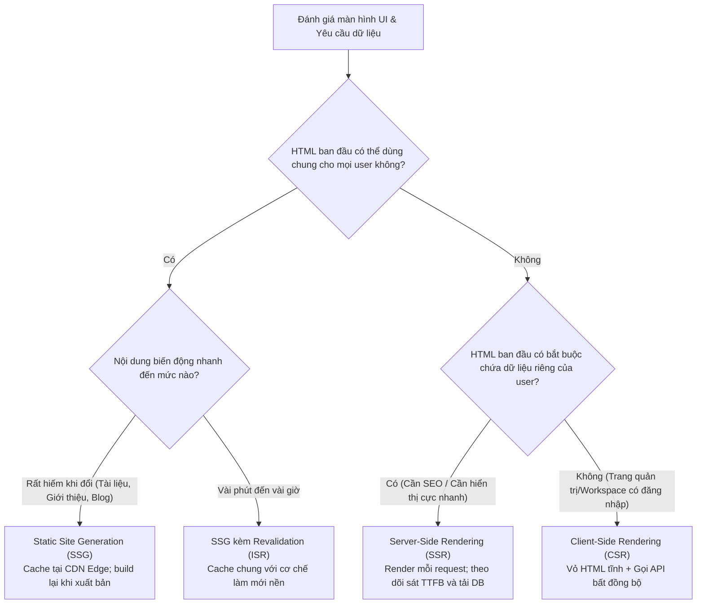

## Tóm tắt nhanh (TL;DR)

Đừng chọn CSR, SSR hay SSG chỉ bằng câu hỏi phương thức nào "hiện đại hơn". Hãy đặt câu hỏi: **khi nào mã HTML hữu ích cần phải xuất hiện, HTML đó có phụ thuộc vào trạng thái tại thời điểm request hay không, sản phẩm chấp nhận dữ liệu cũ (stale) trong bao lâu, cần bao nhiêu JavaScript tải về client, và đội ngũ sẵn sàng vận hành tải tính toán ở build time, request time hay tại trình duyệt?**

Nguyên tắc thực chiến để định hướng:

- **Ưu tiên Static Site Generation (SSG)** khi cùng một bản thể hiện HTML có thể tái sử dụng cho hàng nghìn request và độ tươi mới được duy trì qua cơ chế xuất bản hoặc xác thực lại (revalidation/ISR).
- **Sử dụng Server-Side Rendering (SSR)** khi mã HTML ban đầu bắt buộc phải chứa dữ liệu động tại thời điểm request vốn không thể chia sẻ an toàn qua cache tĩnh.
- **Tập trung vào Client-Side Rendering (CSR)** khi trang web chỉ cần một khung HTML tĩnh ban đầu và phần lớn giá trị tương tác xuất hiện sau khi mã JavaScript và API tải về client.

Đây không phải là những lựa chọn loại trừ lẫn nhau. Các ứng dụng hiện đại ngày nay thường kết hợp linh hoạt cả 3 mô hình theo từng trang (route), từng thành phần (component) và vòng đời dữ liệu.

<TermBox term="CSR / SSR / SSG">
Các thuật ngữ này mô tả **nơi và thời điểm mã HTML hữu ích được sinh ra**:

- **CSR (Client-Side Rendering):** Trình duyệt tự tải và thực thi mã JavaScript để tạo hoặc cập nhật DOM giao diện.
- **SSR (Server-Side Rendering):** Máy chủ tính toán và sinh ra mã HTML đầy đủ cho từng request cụ thể.
- **SSG (Static Site Generation):** Mã HTML được tạo sẵn từ trước (lúc build hoặc revalidate) và tái sử dụng cho các request sau.

**Ý nghĩa thực tiễn:** Quyết định này xoay quanh thời điểm dữ liệu sẵn sàng, khả năng lưu cache, độ trễ mạng và chi phí hạ tầng máy chủ—chứ không phải việc từ viết tắt nào mới nhất.
</TermBox>

## Khung đánh giá quyết định

Trước khi chọn một framework, hãy liệt kê rõ ràng các ràng buộc kỹ thuật:

- Nội dung gì bắt buộc phải có sẵn trong HTML ban đầu trước khi JavaScript kịp chạy?
- Nội dung ban đầu đó là dữ liệu chung (public) hay phụ thuộc vào thông tin định danh của từng người dùng (request-time state)?
- Dữ liệu được phép trễ tối đa bao lâu trước khi người dùng bị cung cấp thông tin sai lệch?
- Trang này là tài liệu để đọc/điều hướng hay là một không gian làm việc tương tác phức tạp, kéo dài (interactive workspace)?
- Những phản hồi nào có thể lưu cache an toàn tại Edge CDN, và yếu tố nào làm thay đổi khóa cache (cache key)?

<TermBox term="Request-time state">
**Trạng thái tại thời điểm request (Request-time state)** là thông tin chỉ được biết, xác thực hoặc lựa chọn khi request thực tế gửi đến—ví dụ: cookie phiên đăng nhập, kết quả phân quyền, vị trí địa lý, hoặc dữ liệu biến động từng giây.

**Ý nghĩa thực tiễn:** Nếu HTML ban đầu thực sự phụ thuộc vào trạng thái này, một bản HTML tĩnh dùng chung sẽ không thể đáp ứng an toàn.
</TermBox>

> 🖼️ **[Illustration Placeholder: Đối chiếu Timeline tải trang của CSR vs SSR vs SSG]**  
> *Mô tả hình minh họa:* Sơ đồ 3 dòng timeline thể hiện các mốc quan trọng: Thời điểm nhận HTML (vỏ rỗng vs DOM đầy đủ), Tải và phân tích bundle JavaScript, Hoàn tất Hydration, và Khả năng tương tác của người dùng (First Contentful Paint vs Time to Interactive / INP).

## So sánh chi tiết các mô hình

### Client-side rendering (CSR)

Với CSR, máy chủ chỉ trả về một vỏ HTML tối thiểu kèm theo các file JavaScript. Trình duyệt tải script, gọi API lấy dữ liệu và tự vẽ giao diện.

CSR là lựa chọn tối ưu khi sản phẩm là dashboard quản trị, công cụ chỉnh sửa hoặc mạng xã hội nội bộ nơi giá trị cốt lõi nằm ở phiên làm việc lâu dài và tương tác phong phú. Đổi lại, trang sẽ phụ thuộc hoàn toàn vào tốc độ tải script và thiết bị của người dùng.

### Server-side rendering (SSR)

Với SSR, máy chủ render mã HTML hoàn chỉnh cho từng request và có thể nhúng sẵn dữ liệu người dùng. Sau khi nhận HTML, trình duyệt tải tiếp JavaScript để kích hoạt khả năng tương tác.

<TermBox term="Hydration">
**Hydration** là quá trình mã nguồn JavaScript ở client "hồi sinh" (gắn các event listeners và logic tương tác) vào cấu trúc HTML tĩnh đã được máy chủ dựng sẵn từ trước.

**Ý nghĩa thực tiễn:** SSR giúp hiển thị nội dung trực quan rất nhanh, nhưng người dùng vẫn có thể bị trễ tương tác (Uncanny Valley) trong lúc chờ đợi JavaScript hoàn tất quá trình hydration.
</TermBox>

> 🖼️ **[Illustration Placeholder: Quá trình Hydration & Khoảng trống Uncanny Valley]**  
> *Mô tả hình minh họa:* Sơ đồ 3 giai đoạn tải trang SSR:  
> 1. Nhận HTML từ Server: Giao diện hiển thị ngay lập tức, user thấy nội dung nhưng bấm nút không ăn do DOM chưa có event listeners.  
> 2. Khoảng trống Uncanny Valley: User bấm nút nhưng giao diện đóng băng do trình duyệt đang bận tải, phân tích và thực thi bundle JavaScript lớn.  
> 3. Hydration hoàn tất: Framework gắn xong event listeners vào DOM; trang web đạt trạng thái tương tác hoàn chỉnh (Time to Interactive).

### Static site generation (SSG) / Prerendering

Với SSG, mã HTML được sinh ra từ trước tại build time hoặc qua cơ chế tái xác thực nền (Incremental Static Regeneration - ISR). Tệp HTML tĩnh sau đó được phân phối tốc độ cao qua Edge CDN mà không tốn tài nguyên render của máy chủ cho từng request.

<TermBox term="Revalidation">
Trong các hệ thống SSG hiện đại, **revalidation (tái xác thực)** là quá trình tự động làm mới hoặc biên dịch lại trang tĩnh ngầm trong nền khi dữ liệu nguồn thay đổi.

**Ý nghĩa thực tiễn:** Trang tĩnh không có nghĩa là "vĩnh viễn không đổi". Vấn đề là chu kỳ revalidate có đáp ứng được ngưỡng chấp nhận dữ liệu cũ của sản phẩm hay không.
</TermBox>

> 🖼️ **[Illustration Placeholder: Vòng đời tái xác thực tĩnh (ISR Lifecycle)]**  
> *Mô tả hình minh họa:* Chu trình ISR tại Edge CDN:  
> - Request 1 (Trúng Cache Fresh): Phục vụ tức thì từ CDN (0ms tính toán backend).  
> - Request 2 (Chạm ngưỡng Stale): Lập tức trả nội dung cũ cho user (stale-while-revalidate), đồng thời kích hoạt ngầm lệnh render trang mới tại server.  
> - Request 3 (Sau khi render xong): CDN cập nhật bản HTML mới và phục vụ cho tất cả các request tiếp theo.

## Ma trận đánh giá quyết định

<DecisionMatrix
  caption="Ma trận so sánh CSR vs SSR vs SSG"
  criterionLabel="Tiêu chí"
  options={['CSR', 'SSR', 'SSG']}
  rows={[
    {
      criterion: 'HTML ban đầu chứa dữ liệu người dùng',
      values: [
        'Vỏ HTML chung; dữ liệu người dùng được tải sau khi script chạy',
        'Có thể nhúng trực tiếp dữ liệu người dùng vào HTML ban đầu',
        'Cần kết hợp tầng dynamic nếu muốn cá nhân hóa ngay lập tức',
      ],
    },
    {
      criterion: 'Độ tươi mới của dữ liệu (Freshness)',
      values: [
        'Client tự fetch dữ liệu mới nhất sau khi khởi chạy',
        'Server fetch dữ liệu mới nhất trong lúc xử lý request',
        'Phụ thuộc vào tần suất publish hoặc chu kỳ tái xác thực (ISR)',
      ],
    },
    {
      criterion: 'Mã HTML hiển thị trước khi script chạy',
      values: [
        'Bị giới hạn trong khung shell tĩnh hoặc màn hình chờ (loading skeleton)',
        'Hiển thị trọn vẹn nội dung khi máy chủ render thành công',
        'Có sẵn tức thì từ tệp tĩnh lưu trên Edge CDN',
      ],
    },
    {
      criterion: 'Phục vụ phiên làm việc tương tác kéo dài',
      values: [
        'Rất tự nhiên; client runtime quản lý toàn bộ state trong phiên',
        'Vẫn cần tải script để hydrate các vùng tương tác',
        'Vẫn cần tải script để kích hoạt các vùng tương tác',
      ],
    },
    {
      criterion: 'Khả năng tái sử dụng cache chung trên CDN',
      values: [
        'Rất cao cho vỏ shell tĩnh; API dữ liệu cá nhân hóa tách riêng',
        'Phụ thuộc vào các tiêu đề HTTP phân nhánh khóa cache (cache key)',
        'Cực kỳ cao vì cùng một bản HTML được phân phối cho mọi người',
      ],
    },
    {
      criterion: 'Tải tính toán trang trên từng request',
      values: [
        'Không tốn tài nguyên render HTML trên server',
        'Tốn CPU/RAM render trên mỗi lượt request (trừ khi có cache)',
        'Bằng không khi phân phối bình thường; chỉ tốn lúc revalidate/build',
      ],
    },
    {
      criterion: 'Gánh nặng vận hành chính',
      values: [
        'Quản lý kích thước bundle, lỗi tải mạng client và hiệu năng API',
        'Áp lực CPU/RAM máy chủ render, độ trễ TTFB và quản lý cache SSR',
        'Tính chính xác của quá trình build và chu kỳ tái xác thực dữ liệu',
      ],
    },
  ]}
/>

## Tình huống thực tế trên Production

### Tình huống: Sự cố sập Catalog khi chuyển vội từ SSG sang SSR

Một đội ngũ thương mại điện tử chuyển toàn bộ trang danh mục sản phẩm từ SSG sang SSR thuần túy nhằm hiển thị nhãn "số lượng tồn kho theo thời gian thực". Khi chạy thử nội bộ, chỉ số TTFB đo được là 180ms, có vẻ rất ổn.

Tuy nhiên vào ngày diễn ra chiến dịch khuyến mãi lớn, máy chủ SSR phải thực hiện 4 truy vấn cơ sở dữ liệu cho mỗi lượt xem trang. Dưới lưu lượng 5,000 req/giây, dàn server SSR làm nghẽn toàn bộ kết nối của database chính. Chỉ số TTFB nhảy vọt từ 180ms lên 9.2 giây, kéo sập toàn bộ website—mặc dù thực tế 95% nội dung mô tả sản phẩm là hoàn toàn giống nhau cho tất cả khách hàng!

- **Hậu quả:** Toàn bộ website ngừng trệ suốt 45 phút giờ vàng mua sắm, thiệt hại nặng nề về doanh thu và chỉ số SEO.
- **Nguyên nhân cốt lõi:** Lạm dụng SSR cho toàn bộ trang chỉ để cập nhật một mẩu dữ liệu nhỏ (số lượng kho), biến việc render HTML thành nút thắt cổ chai trực tiếp trên đường truyền.
- **Cách khắc phục chuẩn:** Áp dụng **Kiến trúc Lai (Hybrid Rendering)**:
  1. Giữ phần khung sản phẩm tĩnh (SSG/ISR) phục vụ tức thì từ CDN với TTFB &lt; 50ms.
  2. Số lượng hàng tồn kho được tải bất đồng bộ tại client (CSR) qua một API cache ngắn hạn (10 giây) hoặc WebSocket.

## Cây quyết định thực hành (Decision Tree)

## Bài tập củng cố tư duy

> **Tình huống:** Một startup SaaS đang xây dựng bảng điều khiển phân tích (Analytics Dashboard) hiển thị biểu đồ từ dữ liệu nội bộ riêng tư của khách hàng. Giám đốc Tiếp thị khăng khăng: *"Chúng ta phải dùng SSR cho toàn bộ các trang dashboard này để Google bot có thể lập chỉ mục (index) các báo cáo và tăng thứ hạng SEO."*
>
> **Bạn sẽ phản biện lập luận này như thế nào trong buổi đánh giá kiến trúc?**

Xem giải thích chi tiết

Lập luận của Giám đốc Tiếp thị đã nhầm lẫn nghiêm trọng giữa các khái niệm kỹ thuật:

1. **Công cụ tìm kiếm không bao giờ lập chỉ mục trang riêng tư:** Googlebot không hề đăng nhập bằng tài khoản của người dùng. Một trang dashboard nằm sau cổng xác thực (auth wall) sẽ không bao giờ xuất hiện trên kết quả tìm kiếm Google công khai, bất kể bạn dùng SSR hay CSR.
2. **Lãng phí tài nguyên máy chủ vô ích:** Ép buộc dùng SSR cho một dashboard dày đặc số liệu sẽ dồn toàn bộ tải tính toán nặng nề lên máy chủ render và database trên từng click chuột của khách hàng.
3. **Kiến trúc chuẩn xác:** Dùng vỏ HTML tĩnh (CSR) phân phối siêu nhanh qua CDN, sau đó client tự gọi API xác thực để lấy dữ liệu vẽ biểu đồ. Hãy dành SSR và SSG cho các trang landing page, trang giới thiệu tính năng và blog công khai nơi SEO thực sự có ý nghĩa.

## Checklist đánh giá quyết định

- [ ] **Nhu cầu thị giác ban đầu:** Nội dung gì bắt buộc phải nhìn thấy trong HTML trước khi JavaScript được thực thi?
- [ ] **Ranh giới dữ liệu:** Dữ liệu nào là công khai (public), dữ liệu nào là riêng tư theo phiên, và dữ liệu nào biến động liên tục?
- [ ] **Ngưỡng chấp nhận dữ liệu cũ:** Sản phẩm cho phép dữ liệu trễ bao lâu, và cơ chế xuất bản/ISR có đáp ứng được không?
- [ ] **Cấu hình khóa cache (Cache Key):** Các phản hồi có thể lưu cache ở đâu, và những cookie/headers nào làm thay đổi nội dung trang?
- [ ] **Ngân sách thực thi tại Client:** Kích thước file bundle và thời gian thực thi JavaScript có đảm bảo chỉ số INP/TBT dưới ngưỡng an toàn không?
- [ ] **Đường găng của Request (Critical Path):** Có truy vấn cơ sở dữ liệu chậm chạp nào bị đặt trực tiếp lên luồng render SSR của người dùng không?
- [ ] **Cô lập rủi ro:** Hệ thống có khả năng giám sát, cô lập và phục hồi độc lập khi máy chủ render, cơ sở dữ liệu hay client gặp sự cố không?

## Nguồn tham khảo chuẩn mực

- [Rendering on the Web — web.dev](https://web.dev/articles/rendering-on-the-web)
- [hydrateRoot — React Documentation](https://react.dev/reference/react-dom/client/hydrateRoot)
- [HTTP caching — MDN](https://developer.mozilla.org/en-US/docs/Web/HTTP/Guides/Caching)
- [Static and Dynamic Rendering — Next.js Learn](https://nextjs.org/learn/dashboard-app/static-and-dynamic-rendering)
