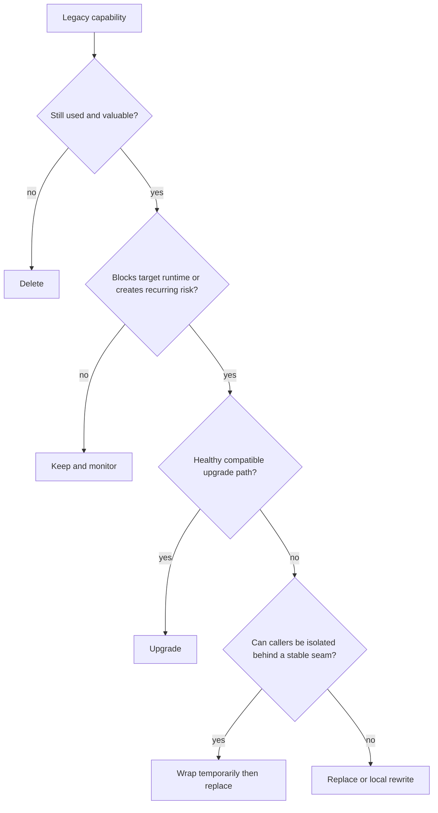
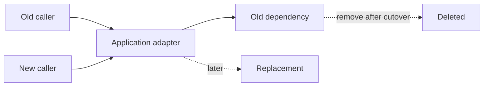
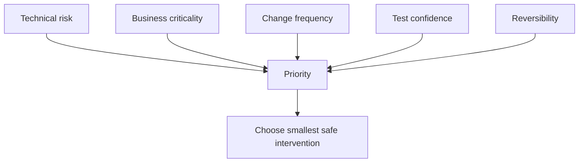

# Frontend Modernization Decision Guide: Upgrade, Replace, Wrap, or Delete?

## TL;DR

Legacy modernization fails when every problem receives the same treatment.

- "Old" does not automatically mean replace.
- "Deprecated" does not automatically mean rewrite today.
- "Beta" does not automatically mean forbidden.
- "Custom wrapper" does not automatically mean keep.
- "We could build it ourselves" does not automatically mean we should.

The useful decision is not **old vs new**. It is: **what is the smallest change that reduces the important risk while preserving reversibility?**

> 💡 **Rule of thumb:** Prefer the option that removes the current blocker with the smallest irreversible commitment. Escalate from keep → upgrade → wrap → replace → local rewrite only when evidence justifies the extra migration surface.

- **Keep** when the capability is stable and does not block the target architecture.
- **Upgrade** when behavior and ownership remain valid but compatibility is stale.
- **Wrap temporarily** when you need a seam to move callers before changing implementation.
- **Replace** when maintenance, compatibility, or product constraints make the current dependency a recurring blocker.
- **Delete** when the capability is unused, duplicated, or no longer part of the product.
- **Fatal pitfall:** choosing a rewrite because the code is embarrassing rather than because the current boundary creates measurable risk.

<TermBox term="Reversibility">
**Reversibility** is how cheaply a change can be undone or redirected if assumptions prove wrong.

**Why it matters:** modernization contains uncertainty. A smaller reversible step usually buys more evidence before you commit to a larger replacement.
</TermBox>

<TermBox term="Migration surface">
The **migration surface** is the set of callers, contracts, tests, operational behaviors, and user journeys that must change or be re-verified for one modernization decision.

**Why it matters:** two solutions with similar code size can have radically different migration risk if one touches every route while the other changes one adapter.
</TermBox>

## Decision frame

For the dependency, module, or subsystem in question, write down:

- Which user journeys depend on it?
- Is it on a critical revenue, auth, publishing, or destructive path?
- Does it block the target React/runtime/build upgrade?
- Is the current behavior well understood and protected by tests?
- Is the upstream package maintained and compatible with your target?
- Does the application depend on library-specific types or behavior at many call sites?
- Is there a stable application-level contract you can introduce?
- Can the change be rolled back independently?
- Is the capability still needed?

## The options

### Keep

Keeping is a valid modernization decision when:

- behavior is stable;
- maintenance burden is low;
- target runtime remains supported;
- security and supply-chain posture are acceptable;
- replacement does not unlock meaningful product or delivery value.

Keeping should still have an owner. "Nobody touched it for years" is not the same as "we intentionally accept it."

### Upgrade

Upgrade when the capability remains appropriate but the version or integration is stale.

Typical examples:

- React-compatible router version exists;
- Redux store setup can move to Redux Toolkit without changing product state ownership yet;
- a library has a supported major version with a documented migration path.

Upgrading is strongest when you can preserve the application contract and change implementation underneath.

### Wrap temporarily

A temporary wrapper is useful when you need to separate **caller migration** from **implementation replacement**.

The wrapper should expose application semantics, not replicate the old library API. It should also have an explicit deletion condition.

### Replace

Replace when the existing package or module creates repeated structural cost:

- unsupported target runtime;
- abandoned or incompatible upstream;
- critical prerelease dependency with no acceptable operating contract;
- security issue that cannot be patched safely;
- library-specific API leaked across the application;
- product requirements now diverge from the tool's model.

Replacement is not automatically a full rewrite. It can be route-local, feature-local, or adapter-local.

### Delete

Deletion is often the highest-leverage modernization move.

Delete when:

- code is unreachable;
- feature usage is effectively zero and product agrees to retire it;
- two libraries perform the same job;
- compatibility scaffolding no longer has callers;
- a derived state or wrapper exists only because older architecture required it.

Do not spend upgrade budget on dead capability.

## Decision matrix

<DecisionMatrix
  caption="Frontend modernization option matrix"
  options={['Keep', 'Upgrade', 'Wrap temporarily', 'Replace', 'Delete']}
  rows={[
    { criterion: 'Primary goal', values: ['Preserve stable capability', 'Restore compatibility/support', 'Create a migration seam', 'Remove structural blocker', 'Remove unnecessary capability'] },
    { criterion: 'Migration surface', values: ['Minimal', 'Usually bounded if contract stays stable', 'Moderate now, enables smaller later cutover', 'Potentially high', 'Low to high depending on hidden consumers'] },
    { criterion: 'Best evidence', values: ['Stable behavior + supported target', 'Upstream migration path + regression evidence', 'Many callers + separable app semantics', 'Recurring incompatibility/maintenance/security cost', 'Usage/reachability evidence'] },
    { criterion: 'Reversibility', values: ['High', 'Usually high with controlled version rollback', 'High if adapter is narrow', 'Lower as callers/contracts move', 'Low if behavior was still needed'] },
    { criterion: 'Common trap', values: ['Ignoring future blockers', 'Bundling refactors into version bump', 'Permanent wrapper tax', 'Big-bang rewrite', 'Deleting based on assumption rather than evidence'] },
  ]}
/>

The matrix is not a scorecard. One option can be right for one route and wrong for another package in the same application.

## Add business criticality before technical elegance

A dead chart library on an internal dashboard and an unsupported payment form package may both be "old." Their migration priority is not equal.

Useful priority dimensions:

- business impact if broken;
- frequency of change;
- compatibility pressure;
- security/supply-chain exposure;
- blast radius;
- test/observability confidence;
- reversibility;
- migration effort.

## When local rewrite is justified

A local rewrite can be rational when:

- the capability is small enough to understand end-to-end;
- current implementation is tightly coupled to an obsolete model;
- behavior can be characterized;
- the new boundary can ship independently;
- rollback is possible;
- the rewrite does not require replacing the entire application shell.

"Rewrite the date input feature" and "rewrite the whole frontend" are fundamentally different risk profiles.

## Production micro-scenario: replacing the form stack everywhere

A team decides their eight-year-old form library is embarrassing and replaces it across 140 forms in one program. The old library was ugly but stable. The new library changes validation timing, dirty-state semantics, and submit behavior. Weeks of UI regressions follow.

- **Impact:** a cosmetic modernization goal expands into a product-wide behavioral migration with difficult rollback.
- **Root cause:** the team evaluated package age and API aesthetics instead of migration surface and business criticality.
- **Correct pattern:** identify whether the old form stack actually blocks target upgrades; if replacement is justified, introduce a feature-level seam and migrate high-change forms first while preserving behavior evidence.

## Check your mental model

> **Scenario:** A deprecated date library is used through one small adapter in 12 routes. It still works on the target runtime, has no active security issue, and the product has higher-risk React and router blockers. Should replacing the date library be phase one?

Show the reasoning

Probably not.

Deprecation is a real maintenance signal, but the adapter already limits migration surface and the library does not block the target runtime. Record the replacement plan and ownership, then prioritize blockers with higher business or compatibility consequence. Modernization sequencing is about risk reduction, not clearing every warning first.

## Decision checklist

- [ ] **Need:** Confirm the capability is still used and valuable.
- [ ] **Criticality:** Identify user journeys and business consequence if it breaks.
- [ ] **Compatibility:** Determine whether it blocks the target runtime or framework.
- [ ] **Health:** Check maintenance, deprecation, prerelease, and security signals.
- [ ] **Coupling:** Measure how widely library-specific contracts leak into application code.
- [ ] **Evidence:** Capture behavior with tests/telemetry before a high-surface change.
- [ ] **Seam:** Prefer a stable application contract when caller migration and implementation replacement can be separated.
- [ ] **Reversibility:** Define rollback before selecting a high-cost replacement.
- [ ] **Scope:** Prefer feature-local replacement over whole-app rewrite.
- [ ] **Deletion:** Remove unused capability instead of upgrading it.

## Sources

- [React 19.3](https://react.dev/blog/2026/09/09/react-19-3)
- [React 19 Upgrade Guide](https://react.dev/blog/2024/04/25/react-19-upgrade-guide)
- [npm — Using deprecated packages](https://docs.npmjs.com/using-deprecated-packages/)
- [GitHub Docs — Dependency review](https://docs.github.com/en/code-security/concepts/supply-chain-security/dependency-review)
- [Martin Fowler — Strangler Fig](https://martinfowler.com/bliki/StranglerFigApplication.html)
