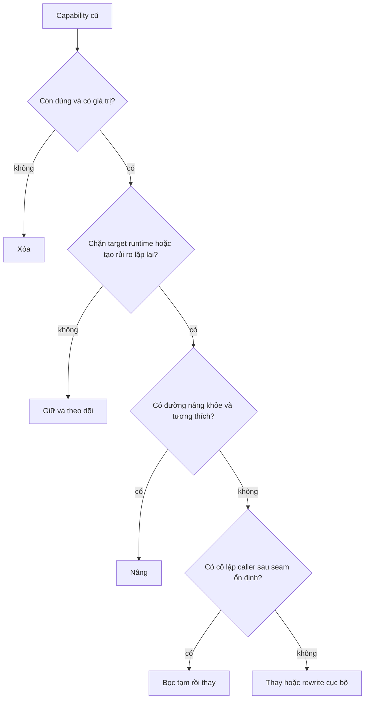
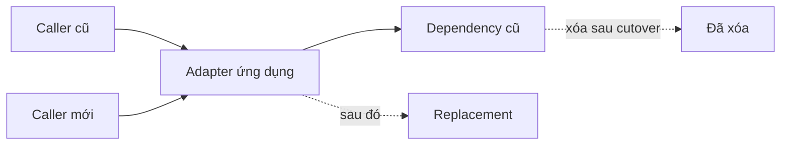
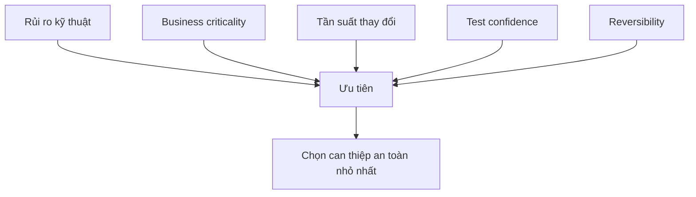

# Hướng dẫn Quyết định Modernization Frontend: Nâng, Thay, Bọc hay Xóa?

## Tóm tắt

Modernization frontend cũ thất bại khi mọi vấn đề đều nhận cùng một cách xử lý.

- "Cũ" không tự động nghĩa là phải thay.
- "Deprecated" không tự động nghĩa là phải rewrite hôm nay.
- "Beta" không tự động nghĩa là cấm dùng.
- "Custom wrapper" không tự động nghĩa là phải giữ.
- "Team tự build được" không tự động nghĩa là nên tự build.

Quyết định hữu ích không phải **cũ hay mới**. Nó là: **thay đổi nhỏ nhất nào giảm rủi ro quan trọng mà vẫn giữ khả năng quay lại?**

> 💡 **Quy tắc thực hành:** Ưu tiên lựa chọn gỡ blocker hiện tại với commitment khó đảo ngược nhỏ nhất. Chỉ tăng từ giữ → nâng → bọc → thay → rewrite cục bộ khi bằng chứng biện minh cho migration surface lớn hơn.

- **Giữ** khi capability ổn định và không chặn kiến trúc mục tiêu.
- **Nâng** khi behavior và ownership vẫn đúng nhưng compatibility đã cũ.
- **Bọc tạm** khi cần seam để di chuyển caller trước khi đổi implementation.
- **Thay** khi maintenance, compatibility hoặc product constraint làm dependency hiện tại liên tục trở thành blocker.
- **Xóa** khi capability không dùng, bị duplicate hoặc không còn thuộc sản phẩm.
- **Sai lầm chí mạng:** chọn rewrite vì code gây xấu hổ thay vì vì boundary hiện tại tạo rủi ro đo được.

<TermBox term="Khả năng đảo ngược">
**Khả năng đảo ngược** mô tả chi phí để quay lại hoặc đổi hướng khi giả định ban đầu sai.

**Tại sao quan trọng:** modernization luôn có uncertainty. Bước nhỏ dễ đảo thường mua thêm bằng chứng trước khi cam kết replacement lớn.
</TermBox>

<TermBox term="Bề mặt migration">
**Bề mặt migration** là tập caller, contract, test, hành vi vận hành và user journey phải đổi hoặc xác minh lại cho một quyết định modernization.

**Tại sao quan trọng:** hai giải pháp có số dòng code gần nhau vẫn có rủi ro khác hẳn nếu một cái chạm mọi route còn cái kia chỉ đổi một adapter.
</TermBox>

## Khung quyết định

Với dependency, module hoặc subsystem đang xét, hãy ghi:

- User journey nào phụ thuộc vào nó?
- Nó có nằm trên đường revenue, auth, publishing hoặc destructive action quan trọng không?
- Nó có chặn target React/runtime/build upgrade không?
- Behavior hiện tại có được hiểu và bảo vệ bằng test không?
- Package upstream có được bảo trì và tương thích target không?
- Application có phụ thuộc library-specific type hoặc behavior ở nhiều call site không?
- Có thể tạo application-level contract ổn định không?
- Thay đổi có rollback độc lập được không?
- Capability này còn cần không?

## Các lựa chọn

### Giữ

Giữ là quyết định modernization hợp lệ khi:

- behavior ổn định;
- maintenance burden thấp;
- target runtime vẫn được hỗ trợ;
- security và supply-chain posture chấp nhận được;
- replacement không mở khóa giá trị product hoặc delivery đáng kể.

Giữ vẫn cần owner. "Nhiều năm không ai đụng" không đồng nghĩa "team chủ đích chấp nhận nó."

### Nâng

Nâng khi capability vẫn phù hợp nhưng version hoặc integration đã cũ.

Ví dụ:

- router có version tương thích target React;
- Redux store setup có thể chuyển sang Redux Toolkit mà chưa cần đổi ownership của product state;
- library có major version được hỗ trợ với migration path rõ.

Nâng mạnh nhất khi giữ được application contract và đổi implementation phía dưới.

### Bọc tạm

Wrapper tạm hữu ích khi cần tách **caller migration** khỏi **implementation replacement**.

Wrapper nên expose semantics của ứng dụng, không copy toàn bộ API library cũ. Nó cũng cần điều kiện xóa rõ.

### Thay

Thay khi package hoặc module hiện tại tạo structural cost lặp lại:

- target runtime không được hỗ trợ;
- upstream bị bỏ hoặc incompatible;
- dependency prerelease quan trọng không có operating contract chấp nhận được;
- security issue không thể patch an toàn;
- API riêng library rò khắp application;
- product requirement đã đi lệch khỏi model của tool.

Replacement không tự động nghĩa full rewrite. Nó có thể chỉ ở một route, feature hoặc adapter.

### Xóa

Xóa thường là modernization có leverage cao nhất.

Xóa khi:

- code không còn reachable;
- feature usage gần như bằng không và product đồng ý retire;
- hai library làm cùng một việc;
- compatibility scaffold không còn caller;
- derived state hoặc wrapper chỉ tồn tại vì kiến trúc cũ từng cần.

Đừng tốn upgrade budget cho capability chết.

## Ma trận quyết định

<DecisionMatrix
  caption="Ma trận lựa chọn modernization frontend"
  options={['Giữ', 'Nâng', 'Bọc tạm', 'Thay', 'Xóa']}
  rows={[
    { criterion: 'Mục tiêu chính', values: ['Giữ capability ổn định', 'Khôi phục compatibility/support', 'Tạo migration seam', 'Gỡ structural blocker', 'Gỡ capability không cần'] },
    { criterion: 'Bề mặt migration', values: ['Tối thiểu', 'Thường được giới hạn nếu contract giữ ổn định', 'Trung bình hiện tại, giúp cutover sau nhỏ hơn', 'Có thể cao', 'Thấp đến cao tùy hidden consumer'] },
    { criterion: 'Bằng chứng tốt nhất', values: ['Behavior ổn định + target được hỗ trợ', 'Upstream migration path + regression evidence', 'Nhiều caller + app semantics có thể tách', 'Compatibility/maintenance/security cost lặp lại', 'Usage/reachability evidence'] },
    { criterion: 'Khả năng đảo ngược', values: ['Cao', 'Thường cao nếu rollback version có kiểm soát', 'Cao nếu adapter hẹp', 'Giảm dần khi caller/contract đã chuyển', 'Thấp nếu behavior thật ra vẫn cần'] },
    { criterion: 'Bẫy thường gặp', values: ['Bỏ qua blocker tương lai', 'Gộp refactor vào version bump', 'Wrapper tồn tại vĩnh viễn', 'Big-bang rewrite', 'Xóa theo giả định thay vì bằng chứng'] },
  ]}
/>

Ma trận không phải hệ thống chấm điểm. Một lựa chọn có thể đúng cho route này và sai cho package khác trong cùng application.

## Đặt business criticality trước technical elegance

Chart library chết trên dashboard nội bộ và payment form package không hỗ trợ có thể đều "cũ". Priority migration của chúng không giống nhau.

Các chiều ưu tiên hữu ích:

- business impact nếu hỏng;
- tần suất thay đổi;
- compatibility pressure;
- security/supply-chain exposure;
- blast radius;
- test/observability confidence;
- reversibility;
- migration effort.

## Khi rewrite cục bộ hợp lý

Rewrite cục bộ hợp lý khi:

- capability đủ nhỏ để hiểu end-to-end;
- implementation hiện tại dính chặt model lỗi thời;
- behavior có thể characterize;
- boundary mới có thể ship độc lập;
- rollback khả thi;
- rewrite không đòi thay cả application shell.

"Rewrite feature date input" và "rewrite toàn frontend" có risk profile hoàn toàn khác.

## Tình huống production: thay form stack ở mọi nơi

Một team thấy form library tám năm tuổi quá xấu và quyết định thay trên 140 form trong một chương trình. Library cũ xấu nhưng ổn định. Library mới đổi validation timing, dirty-state semantics và submit behavior. Nhiều tuần regression UI xảy ra.

- **Hậu quả:** mục tiêu modernization mang tính thẩm mỹ biến thành behavioral migration toàn sản phẩm và khó rollback.
- **Nguyên nhân cốt lõi:** team đánh giá tuổi package và vẻ đẹp API thay vì migration surface và business criticality.
- **Cách khắc phục chuẩn:** xác định form stack cũ có thật sự chặn target upgrade không; nếu replacement hợp lý, tạo seam theo feature và migrate form thay đổi nhiều trước trong khi giữ behavior evidence.

## Kiểm tra mental model

> **Tình huống:** Một date library deprecated được dùng qua một adapter nhỏ ở 12 route. Nó vẫn chạy trên target runtime, không có security issue đang hoạt động và product còn React/router blocker rủi ro cao hơn. Có nên thay date library ở phase một không?

Xem giải thích chi tiết

Có lẽ không.

Deprecation là maintenance signal thật, nhưng adapter đã giới hạn migration surface và library không chặn target runtime. Hãy ghi replacement plan và owner, sau đó ưu tiên blocker có hậu quả business hoặc compatibility cao hơn. Sequencing modernization là giảm rủi ro, không phải xóa mọi warning trước.

## Checklist quyết định

- [ ] **Nhu cầu:** Xác nhận capability còn được dùng và có giá trị.
- [ ] **Criticality:** Xác định user journey và hậu quả business nếu hỏng.
- [ ] **Compatibility:** Xác định nó có chặn target runtime/framework không.
- [ ] **Health:** Kiểm maintenance, deprecation, prerelease và security signal.
- [ ] **Coupling:** Đo mức library-specific contract rò vào application code.
- [ ] **Bằng chứng:** Capture behavior bằng test/telemetry trước thay đổi bề mặt lớn.
- [ ] **Seam:** Ưu tiên application contract ổn định khi có thể tách caller migration khỏi implementation replacement.
- [ ] **Reversibility:** Định nghĩa rollback trước replacement chi phí cao.
- [ ] **Scope:** Ưu tiên replacement cục bộ thay vì rewrite toàn app.
- [ ] **Xóa:** Xóa capability không dùng thay vì nâng nó.

## Nguồn tham khảo

- [React 19.3](https://react.dev/blog/2026/09/09/react-19-3)
- [React 19 Upgrade Guide](https://react.dev/blog/2024/04/25/react-19-upgrade-guide)
- [npm — Using deprecated packages](https://docs.npmjs.com/using-deprecated-packages/)
- [GitHub Docs — Dependency review](https://docs.github.com/en/code-security/concepts/supply-chain-security/dependency-review)
- [Martin Fowler — Strangler Fig](https://martinfowler.com/bliki/StranglerFigApplication.html)
