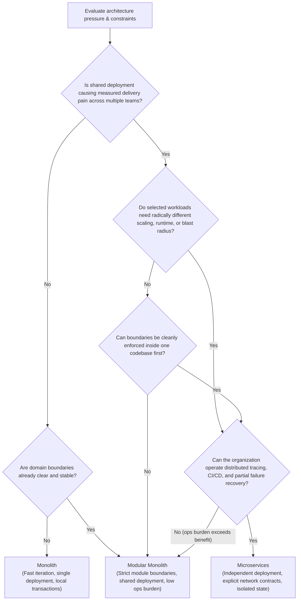

## TL;DR

A monolith, modular monolith, and microservices architecture are not three maturity levels. They place **code, data, deployment, and ownership boundaries** differently.

Start with the least distributed deployment model that meets the real constraints. Improve internal modularity before assuming a network boundary is necessary. Extract a service when **independent deployment creates measurable value**—for example by removing real release coordination, isolating a workload that must scale separately, creating a deliberately operated failure boundary, or giving one team ownership it cannot achieve inside a shared deployment.

The question is not “Can this be a service?” Ask: **which constraint becomes easier after this boundary becomes independently deployed, and how will we measure that improvement?**

<TermBox term="Deployment unit">
A **deployment unit** (or deployable) is a piece of software released and rolled out as one operational unit.

**Why it matters here:** a monolith and modular monolith normally share one deployment unit; microservices create multiple deployment units whose versions, rollouts, failures, and ownership can diverge.
</TermBox>

## Decision frame

Write down the forces before choosing an architecture label:

- How many teams genuinely need independent release schedules?
- Which business capabilities have stable ownership and different change rates?
- Which operations benefit from one local ACID transaction?
- Which workloads need materially different scaling, availability, isolation, or runtime characteristics?
- Can the organization operate multiple independently failing deployments, data stores, dashboards, alerts, compatibility contracts, and on-call surfaces?
- Is current pain caused by coordinated deployment, or poor module boundaries inside the codebase?
- What measurable release-time, runtime, or incident-response outcome would improve if a boundary became a service?

<TermBox term="Independent deployment">
**Independent deployment** means one unit can be released, rolled back, scaled, or evolved without requiring a synchronized release of another unit, subject to their compatibility contracts.

**Why it matters here:** this is one of the main benefits microservices can buy. If the team still coordinates every change across services, the network boundaries may add cost without delivering the intended autonomy.
</TermBox>

> 🖼️ **[Illustration Placeholder: Architectural Boundary Comparison]**  
> *Mô tả hình minh họa:* Sơ đồ trực quan so sánh 3 mô hình kiến trúc: Monolith (tất cả module chung 1 process & 1 DB), Modular Monolith (các module phân tách ranh giới rõ ràng nhưng chung 1 deployment & chia sẻ DB transaction), và Microservices (các service độc lập giao tiếp qua mạng/event với DB riêng biệt).

## The options

### Monolith

A monolith is deployed as one application unit. It can be well modularized or tightly coupled; “monolith” describes deployment shape, not code quality.

Local calls can stay local, transactions can often remain inside one database boundary, and debugging does not inherently cross service networks. The trade-off is that modules share the deployment lifecycle.

### Modular monolith

A modular monolith keeps one deployment while enforcing explicit domain boundaries inside it. Modules expose deliberate interfaces, hide implementation details, and can have ownership/dependency rules even though they ship together.

This is useful when teams need stronger code/domain boundaries but coordinated deployment remains acceptable. It also tests whether a proposed boundary is real: if the boundary cannot stay clean inside one process, putting it behind a network API usually preserves the conceptual coupling while adding distributed-system failure modes.

A modular monolith can be a long-lived final architecture.

### Microservices

A microservices architecture moves selected domain boundaries into independently deployable services, usually with explicit network APIs/events and separately owned state boundaries.

<TermBox term="Partial failure">
**Partial failure** means one part of a distributed operation can fail or become unreachable while other parts remain healthy or may already have completed work.

**Why it matters here:** a remote call can time out without telling the caller whether the other service failed before acting, succeeded but lost the response, or is still working. Network boundaries therefore change correctness, not just deployment topology.
</TermBox>

That deployment independence can matter when teams need separate release schedules, selected workloads need isolated scaling/availability policy, or one capability needs a different runtime lifecycle. The cost is structural: local calls become remote, compatibility spans deployed versions, data consistency can cross transaction boundaries, and observability must correlate work across services.

<DecisionMatrix
  caption="Monolith vs modular monolith vs microservices decision matrix"
  options={['Monolith', 'Modular monolith', 'Microservices']}
  rows={[
    {
      criterion: 'Deployment lifecycle',
      values: [
        'One application deployment',
        'One application deployment; modules still ship together',
        'Selected service boundaries can deploy independently',
      ],
    },
    {
      criterion: 'Domain-boundary enforcement',
      values: [
        'Depends on internal module/dependency discipline',
        'Explicit module interfaces and dependency rules inside one deployment',
        'Internal boundaries plus network/API and deployment contracts',
      ],
    },
    {
      criterion: 'Cross-boundary transaction model',
      values: [
        'Can remain inside one database/transaction boundary when the design permits',
        'Can remain local across modules that share the transactional store',
        'Cross-service workflows usually need explicit distributed consistency/recovery design',
      ],
    },
    {
      criterion: 'Team release autonomy',
      values: [
        'Teams coordinate the shared application release',
        'Code ownership can be separate, but deployment is still coordinated',
        'A team can release its service independently when ownership and compatibility boundaries are real',
      ],
    },
    {
      criterion: 'Failure boundaries',
      values: [
        'One process/deployment failure can affect the application unit',
        'Same deployment failure boundary; modules can still isolate logic/data errors internally',
        'Service failures can be isolated from other processes, while callers must handle partial/ambiguous remote failure',
      ],
    },
    {
      criterion: 'Scaling unit',
      values: [
        'Scale the application deployment',
        'Scale the application deployment',
        'Scale selected services separately when the platform and dependencies support it',
      ],
    },
    {
      criterion: 'Operational work',
      values: [
        'One deployable/runtime surface, plus application dependencies',
        'One deployable plus explicit module-boundary governance',
        'Operational work grows with deployable count, networks, data boundaries, compatibility, telemetry, and ownership surfaces',
      ],
    },
  ]}
/>

**Operational complexity depends on deployment count, infrastructure automation, ownership, data boundaries, reliability requirements, and the maturity of the surrounding platform.** The matrix describes mechanisms, not universal low/medium/high scores.

## When each model fits

### Prefer a monolith when

- one team or a few closely coordinated teams own the product;
- the domain is changing quickly and stable service boundaries are not yet evident;
- coordinated deployment is not causing measurable delivery pain;
- local transaction/debugging simplicity matters more than independent service lifecycle.

A monolith is not permission to create a ball of mud. Explicit modules, tests, dependency rules, and ownership boundaries still matter.

### Prefer a modular monolith when

- domain boundaries and code ownership need stronger enforcement;
- teams can coordinate one deployment;
- you want to reduce coupling before deciding whether independent deployment is necessary;
- important workflows still benefit from local transaction boundaries.

### Prefer microservices when

- independent deployment solves a concrete, measured coordination problem;
- service boundaries align with durable business capabilities and clear owning teams;
- selected workloads require materially different scaling, availability, isolation, or release cadence;
- the organization can operate routing, telemetry, CI/CD, secrets, version compatibility, incident response, and asynchronous consistency across the intended number of services.

Examples of measurable value include shorter release lead time, reduced coordination with unrelated teams, independently enforced capacity/availability objectives, or a smaller runtime blast radius.

<TermBox term="Blast radius">
**Blast radius** is the scope of users, requests, components, or business capabilities affected when something fails.

**Why it matters here:** separating a service can reduce some runtime failure scope, but it can also create new dependency failures. A smaller process boundary does not automatically produce a smaller end-to-end incident.
</TermBox>

> 🖼️ **[Illustration Placeholder: Blast Radius & Failure Cascade Comparison]**  
> *Mô tả hình minh họa:* Sơ đồ trực quan so sánh 2 kịch bản sự cố:
> - **Monolith Failure:** Một bug rò rỉ bộ nhớ (Memory Leak) trong module báo cáo (Reports) khiến cả process ứng dụng bị OOM crash -> Toàn bộ luồng Checkout và Auth của khách hàng bị tê liệt.
> - **Isolated Microservices with Circuit Breaker:** Service Reports gặp sự cố và sập hoàn toàn, nhưng Gateway kích hoạt Circuit Breaker trả về fallback -> Core Checkout & Auth vẫn duy trì 100% SLA.

## Microservices change the consistency and recovery model

> 🖼️ **[Illustration Placeholder: Local ACID Transaction vs Distributed Saga / Outbox Flow]**  
> *Mô tả hình minh họa:* Sơ đồ đối chiếu sự khác biệt khi gọi hàm nội bộ (1 lệnh Commit/Rollback nguyên khối duy nhất trong DB) so với khi phân tán qua mạng (Service A ghi nhận thành công -> Service B gặp sự cố timeout -> Cần cơ chế bù trừ Compensating Action / Saga để khôi phục trạng thái nhất quán).

Inside one process, a normal function call completes under one runtime failure boundary. Across a service boundary, the caller can time out without knowing the remote outcome.

<TermBox term="Eventual consistency">
**Eventual consistency** means related copies or pieces of state are allowed to disagree temporarily and are expected to converge through later processing.

**Why it matters here:** once one workflow spans separately committed service data, a single local transaction may no longer make every piece of state change atomically.
</TermBox>

<TermBox term="Compensating workflow">
A **compensating workflow** performs explicit follow-up work to counteract or repair an earlier committed action when a multi-step distributed workflow cannot simply roll everything back in one transaction.

**Why it matters here:** compensation is recovery logic, not a magic distributed rollback. Its behavior must be designed for the business operation.
</TermBox>

Distributed boundaries introduce design work around timeouts, retry budgets, idempotency, partial failure, delivery semantics, tracing/correlation, eventual consistency, compensation, and compatibility between independently deployed versions.

## Common traps

### Treating microservices as an organizational shortcut

> 🖼️ **[Illustration Placeholder: The "Distributed Monolith" Anti-Pattern]**  
> *Mô tả hình minh họa:* Sơ đồ kiến trúc "Distributed Monolith": 6 microservices bề ngoài được đóng gói thành các deployable riêng biệt, nhưng bên trong bị trói chặt bởi chuỗi gọi đồng bộ HTTP dây chuyền (Service A gọi B -> B gọi C -> C gọi D), dùng chung 1 cơ sở dữ liệu và yêu cầu release đồng loạt (Lockstep deployment). Hậu quả: Độ trễ cộng dồn, tỷ lệ lỗi nhân lên theo cấp số nhân, mất hoàn toàn tính tự chủ mà chi phí vận hành tăng gấp 5 lần.

A network boundary does not create a coherent business boundary or clear ownership. If the model is tightly coupled, service APIs can preserve that coupling while making changes and failures harder to coordinate.

### Mistaking repository size for deployment pressure

A large codebase may need module boundaries, build tooling, ownership, and dependency rules without requiring many deployables.

### Using independent databases as an ideology

> **Production scenario:** A 15-engineer startup split their core application into 12 microservices before finding product-market fit. During a routine user registration flow, the `auth-service` succeeded in creating a credential, but the downstream `profile-service` timed out due to network jitter. Without a distributed transaction or saga recovery mechanism, the user was left in a zombie state—unable to log in and unable to re-register because the email was already taken. The team spent 30% of their engineering sprint time reconciling data across separate databases.

Service-owned data can improve autonomy when a service truly owns its business capability. But cross-service workflows must then model consistency and recovery explicitly.

### Extracting before observing the pressure

Early service boundaries often encode assumptions rather than durable capabilities. A modular codebase lets you gather evidence about ownership, release cadence, scaling, and failure isolation before committing to a network boundary.

## Practical heuristic

Ask these questions in order:

1. **Can better internal module boundaries solve the current problem?** Prefer that when deployment independence is not required.
2. **Which exact boundary needs independent lifecycle?** Name the release, ownership, scaling, availability, or isolation constraint.
3. **What changes when the call/data crosses a network?** Identify timeout, retry, transaction, consistency, and compatibility consequences.
4. **Who operates the new service during an incident?** Include dashboards, alerts, dependencies, runbooks, rollback, and ownership.
5. **How will we know the service boundary paid off?** Define a measurable outcome before extracting it.

The extraction threshold is reached when **independent deployment creates measurable value** that a local module boundary cannot provide at lower cost.

## Check your mental model

> **Scenario:** A team of 6 engineers manages an e-commerce platform deployed as a single monolith. Builds take 12 minutes, and deployments happen once every two days. An engineer proposes: *"Let's break the monolith into 8 microservices immediately so our builds run faster and each developer can deploy independently."*
>
> **How should an architecture reviewer evaluate this proposal?**

Show the reasoning

**Why this proposal is premature and likely counterproductive:**

1. **Team size vs. operational overhead:** A 6-engineer team usually lacks the dedicated platform capacity to operate 8 distinct CI/CD pipelines, service discovery, distributed tracing, independent databases, and separate on-call rotations.
2. **Cheaper solutions to the actual problem:** A 12-minute build and deployment every two days is not severe deployment contention. It can often be improved directly within the monolith (e.g., test parallelization, caching, or modular packaging).
3. **Distribution tax:** Moving to 8 microservices replaces local in-process calls with network requests, introducing latency, partial failure modes, and distributed data consistency challenges that far outweigh the build-time savings.
4. **Better path:** Implement a **Modular Monolith** first: enforce clear boundaries between modules (e.g., catalog, cart, checkout) using package boundaries and lint rules while keeping a single deployable. Extract a specific service only when a concrete boundary demonstrates independent scaling or release requirements.

## Decision review checklist

Use this checklist during architecture design reviews before committing to deployment boundaries:

- [ ] **Boundary stability:** Are the domain boundaries stable enough to defend with interfaces before extracting them across a network?
- [ ] **Measured delivery friction:** Is coordinated deployment actually delaying releases or increasing risk for separate owning teams?
- [ ] **Transaction boundaries:** Which transactions would cross a service boundary, and what is the recovery mechanism if a downstream step fails?
- [ ] **Partial failure handling:** What happens when an upstream service succeeds and a downstream service times out with an ambiguous result?
- [ ] **Cross-service telemetry:** How will correlation IDs, distributed traces, and logs trace a single user action across services?
- [ ] **Incident ownership:** Does each service have a durable owning team with direct on-call and runbook responsibility?
- [ ] **Empirical scaling requirements:** Are independent scaling/availability requirements observed in production metrics or merely speculative?
- [ ] **In-code enforcement first:** Have module boundaries and dependency rules been tested and enforced inside a single deployment before splitting?

## Related concepts

This decision is primarily about **Modularity**, **Domain Boundaries**, **Coupling and Cohesion**, and the point at which **Partial Failure** becomes worth accepting. The [Backend Systems](/docs/learning-paths/backend-systems) path provides the reliability/data concepts that become essential once boundaries are distributed.

## Sources

- [Microservices — Martin Fowler and James Lewis](https://martinfowler.com/articles/microservices.html)
- [MonolithFirst — Martin Fowler](https://martinfowler.com/bliki/MonolithFirst.html)
- [Microservices architecture style — Azure Architecture Center](https://learn.microsoft.com/en-us/azure/architecture/guide/architecture-styles/microservices)
