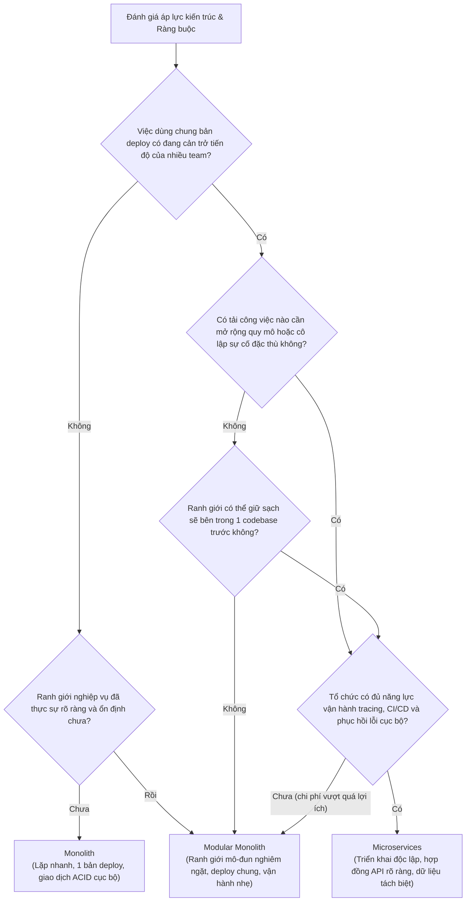

## Tóm tắt nhanh (TL;DR)

Hiếm có hệ thống nào sụp đổ chỉ vì codebase mang danh "Monolith". Nhưng vô số dự án đã rơi vào vũng lầy kiệt quệ khi vội vã xẻ nhỏ hệ thống thành 20 microservices theo trào lưu Big Tech: một tính năng đơn giản đòi hỏi phối hợp phát hành đồng loạt trên 5 repository khác nhau; việc debug lỗi nghiệp vụ trở thành cơn ác mộng dò tìm log phân tán; và chỉ một cú chập chờn mạng nội bộ cũng đủ kéo sập dây chuyền toàn bộ ứng dụng. Kiến trúc phần mềm không phải là bảng xếp hạng danh tiếng—đó là bài toán cân não giữa tính toàn vẹn dữ liệu, chi phí vận hành phân tán và sự tự chủ phát hành thực tế của đội ngũ.

> 💡 **Quy tắc bỏ túi:** Luôn bắt đầu với mô hình triển khai ít phân tán nhất đáp ứng được các ràng buộc kỹ thuật thực tế. Hãy cưỡng chế ranh giới module nghiêm ngặt trong mã nguồn trước khi dựng ranh giới mạng. Chỉ tách microservice khi việc triển khai độc lập tạo ra giá trị đo lường được—chẳng hạn như gỡ bỏ nút thắt release giữa các team, cô lập tải biến động đặc thù hoặc khoanh vùng rủi ro sự cố.

- **Hình thái triển khai không đồng nghĩa với chất lượng mã nguồn:** Monolith hoàn toàn có thể có cấu trúc module mẫu mực và sạch sẽ, trong khi chia microservices cẩu thả sẽ tạo ra một "Monolith phân tán" tệ hại với chi phí vận hành đắt đỏ gấp bội.
- **Lời gọi hàm in-memory giữ trọn giao dịch ACID:** Monolith và Modular Monolith tận dụng bộ nhớ cục bộ và một cơ sở dữ liệu duy nhất, loại bỏ hoàn toàn gánh nặng phải thiết kế Saga, Outbox hay quy trình bù trừ (Compensating workflow) phức tạp.
- **Triển khai độc lập luôn đi kèm "thuế phân tán" (Distribution Tax):** Microservices đem lại sự tự chủ phát hành cho các team lớn hoạt động độc lập, nhưng đòi hỏi hạ tầng tự động hóa cao: CI/CD độc lập, Distributed Tracing, API Gateway và năng lực xử lý lỗi cục bộ (Partial Failure).
- **Gánh nặng vận hành phụ thuộc vào số lượng bản triển khai:** Chi phí giám sát, mạng lưới giao tiếp, bảo mật và áp lực trực on-call tỷ lệ thuận với số lượng tiến trình độc lập thay vì số dòng code.
- **Cạm bẫy chết người:** **Tách microservice khi ranh giới nghiệp vụ chưa ổn định.** Tách dịch vụ khi các domain model còn thay đổi liên tục sẽ dẫn đến thảm họa gọi chéo database, transaction phân tán và phát hành đồng loạt kiểu bậc thang (lockstep deployment)—chịu trọn rủi ro của hệ phân tán mà không thu về được chút tự chủ nào.

<TermBox term="Deployment unit">
**Đơn vị triển khai (Deployment unit)** là một phần mềm được đóng gói, phát hành và vận hành như một thực thể thống nhất.

**Ý nghĩa thực tiễn:** Monolith và Modular Monolith thường chia sẻ chung 1 đơn vị triển khai duy nhất; trong khi Microservices tạo ra nhiều đơn vị triển khai độc lập có phiên bản, chu kỳ rollout, rủi ro lỗi và quyền sở hữu khác nhau.
</TermBox>

## Khung đánh giá quyết định

Hãy làm rõ các lực cản kỹ thuật trước khi gán mác một tên gọi kiến trúc:

- Có bao nhiêu đội ngũ kỹ thuật thực sự cần lịch phát hành (release schedule) độc lập?
- Những mảng nghiệp vụ nào có ranh giới ổn định và tốc độ thay đổi khác biệt rõ rệt?
- Những thao tác nào được hưởng lợi tối đa từ một giao dịch ACID nội bộ?
- Những tải công việc nào đòi hỏi chính sách mở rộng (scaling), tính sẵn sàng hoặc môi trường runtime khác biệt rõ rệt?
- Tổ chức có đủ năng lực vận hành hệ thống nhiều tiến trình phân tán: cơ sở dữ liệu riêng, giám sát phân tán, cảnh báo, hợp đồng tương thích API và lịch trực on-call phức tạp không?
- Nỗi đau hiện tại bắt nguồn từ việc phải phối hợp triển khai, hay do ranh giới mô-đun trong mã nguồn bị lỏng lẻo?

<TermBox term="Independent deployment">
**Triển khai độc lập (Independent deployment)** nghĩa là một đơn vị có thể được phát hành, rollback, mở rộng quy mô hoặc nâng cấp mà không đòi hỏi phải phát hành đồng thời các đơn vị khác, miễn là tuân thủ hợp đồng tương thích giao tiếp.

**Ý nghĩa thực tiễn:** Đây là lợi ích lớn nhất mà Microservices mang lại. Nếu các đội ngũ vẫn phải họp bàn phối hợp triển khai từng tính năng cùng một lúc thì ranh giới mạng chỉ làm tăng thêm chi phí mà không đem lại sự tự chủ.
</TermBox>

<AtlasIllustration id="architecture-boundary-comparison" />

## So sánh chi tiết 3 mô hình

### Monolith (Nguyên khối truyền thống)

Monolith được phát hành như một khối ứng dụng duy nhất. Nó có thể được cấu trúc rất tốt hoặc bị gắn kết chặt chẽ (spaghetti code); "monolith" chỉ hình thái triển khai, không phản ánh chất lượng code.

Các lời gọi hàm diễn ra cục bộ trong bộ nhớ (in-memory), các giao dịch dữ liệu nằm gọn trong một cơ sở dữ liệu ACID, và việc gỡ lỗi không phải đi qua nhiều chặng mạng. Đánh đổi lại là tất cả các mô-đun phải chia sẻ chung một chu kỳ release.

### Modular Monolith (Nguyên khối theo mô-đun)

Modular Monolith giữ nguyên mô hình 1 đơn vị triển khai nhưng áp đặt các ranh giới nghiệp vụ nghiêm ngặt bên trong mã nguồn. Các mô-đun chỉ giao tiếp qua interface định sẵn, ẩn giấu chi tiết cài đặt và kiểm soát chặt chẽ quy tắc phụ thuộc dữ liệu.

Đây là lựa chọn lý tưởng khi tổ chức cần ranh giới phân quyền rõ ràng nhưng việc triển khai chung vẫn hoạt động hiệu quả. Nó cũng là phép thử thực tế: nếu một ranh giới nghiệp vụ không thể giữ sạch sẽ bên trong 1 tiến trình thì việc đẩy nó ra sau một API mạng chỉ biến nó thành một "Monolith phân tán" với đầy đủ các lỗi phức tạp của hệ phân tán.

Modular Monolith hoàn toàn có thể là kiến trúc đích lâu dài của nhiều hệ thống lớn.

### Microservices (Kiến trúc vi dịch vụ)

Microservices tách các ranh giới nghiệp vụ thành các dịch vụ triển khai độc lập, giao tiếp qua API mạng hoặc hàng đợi sự kiện (Event-driven), sở hữu cơ sở dữ liệu riêng biệt.

<TermBox term="Partial failure">
**Lỗi cục bộ (Partial failure)** là hiện tượng một phần trong quy trình phân tán bị sập hoặc mất kết nối trong khi các phần khác vẫn hoạt động bình thường hoặc đã hoàn tất công việc.

**Ý nghĩa thực tiễn:** Một cuộc gọi mạng có thể bị timeout mà không báo cho bên gọi biết dịch vụ bên kia đã bị lỗi trước khi xử lý, đã xử lý thành công nhưng mất phản hồi, hay vẫn đang xử lý dở dang. Ranh giới mạng làm thay đổi hoàn toàn tính đúng đắn của phần mềm.
</TermBox>

## Ma trận đánh giá quyết định

<DecisionMatrix
  caption="Ma trận so sánh Monolith vs Modular Monolith vs Microservices"
  criterionLabel="Tiêu chí"
  options={['Monolith', 'Modular Monolith', 'Microservices']}
  rows={[
    { criterion: 'Vòng đời triển khai', values: ['Một bản triển khai duy nhất cho toàn bộ hệ thống', 'Một bản triển khai duy nhất; các mô-đun phát hành chung', 'Các dịch vụ có thể triển khai và phát hành hoàn toàn độc lập'] },
    { criterion: 'Cưỡng chế ranh giới nghiệp vụ', values: ['Phụ thuộc hoàn toàn vào tính kỷ luật của lập trình viên', 'Cưỡng chế qua interface mô-đun và công cụ phân tích phụ thuộc nội bộ', 'Cưỡng chế qua ranh giới tiến trình, giao thức mạng và hợp đồng API'] },
    { criterion: 'Mô hình giao dịch dữ liệu', values: ['Tận dụng giao dịch ACID cục bộ mạnh mẽ trên 1 cơ sở dữ liệu', 'Giữ được giao dịch ACID cục bộ giữa các mô-đun dùng chung DB', 'Bắt buộc phải áp dụng Saga, Outbox và mô hình Eventual Consistency'] },
    { criterion: 'Tính tự chủ phát hành của đội ngũ', values: ['Các đội ngũ phải phối hợp trong đợt phát hành chung', 'Quyền sở hữu mã nguồn tách bạch nhưng phát hành vẫn theo đợt chung', 'Các đội ngũ tự chủ phát hành dịch vụ của mình bất cứ lúc nào'] },
    { criterion: 'Ranh giới cô lập sự cố (Blast Radius)', values: ['Sự cố tràn bộ nhớ (OOM) hoặc nghẽn thread có thể kéo sập toàn bộ app', 'Cùng chung ranh giới tiến trình; lỗi logic có thể cô lập theo mô-đun', 'Lỗi tiến trình được cô lập; bên gọi phải chủ động xử lý timeout/retry'] },
    { criterion: 'Đơn vị co giãn tải (Scaling Unit)', values: ['Nhân bản toàn bộ ứng dụng trên nhiều instance', 'Nhân bản toàn bộ ứng dụng trên nhiều instance', 'Co giãn độc lập từng dịch vụ có nhu cầu tài nguyên đặc thù'] },
    { criterion: 'Gánh nặng vận hành', values: ['Thấp; quản lý một runtime và một cụm cơ sở dữ liệu', 'Thấp đến trung bình; cần công cụ rà soát ranh giới mô-đun trong CI', 'Rất cao; tăng nhanh theo số lượng service, mạng, telemetry, CI/CD'] },
  ]}
/>

<AtlasIllustration id="blast-radius-comparison" />

## Tình huống thực tế trên Production

### Tình huống: Bẫy "Zombie User" khi tách dịch vụ quá vội vàng

Một startup 15 kỹ sư quyết định chia tách ứng dụng cốt lõi thành 12 microservices ngay từ giai đoạn sơ khởi. Trong quy trình đăng ký tài khoản mới:
1. `auth-service` tạo thành công tài khoản và mật khẩu trong cơ sở dữ liệu xác thực.
2. `auth-service` gọi HTTP sang `profile-service` để tạo hồ sơ người dùng.
3. Do mạng nội bộ chập chờn (network jitter), cuộc gọi đến `profile-service` bị timeout sau 5 giây.

Vì không thiết kế giao dịch phân tán (Saga) hay cơ chế bù trừ (Compensation), hệ thống bỏ dở quy trình và báo lỗi cho người dùng. Khách hàng rơi vào trạng thái "Zombie": họ không thể đăng nhập vì chưa có hồ sơ cá nhân, nhưng cũng không thể đăng ký lại vì email đã bị `auth-service` ghi nhận là đã tồn tại! Đội ngũ kỹ sư đã phải mất tới 30% thời gian làm việc mỗi tuần chỉ để viết script chạy bằng tay nhằm đối soát và dọn dẹp dữ liệu rác giữa 12 database khác nhau.

- **Hậu quả:** Trải nghiệm người dùng tồi tệ, tỷ lệ rơi rụng khách hàng mới cao, đội ngũ kiệt sức vì vận hành thủ công.
- **Nguyên nhân cốt lõi:** Áp dụng ranh giới mạng khi chưa chuẩn bị các giải pháp xử lý lỗi cục bộ (Partial Failure) và tính nhất quán cuối cùng (Eventual Consistency).
- **Cách khắc phục chuẩn:**
  1. Nếu còn ở quy mô nhỏ, giữ quy trình đăng ký trong một **Modular Monolith** để hoàn tất trong 1 giao dịch ACID duy nhất (`BEGIN ... COMMIT`).
  2. Nếu bắt buộc phải tách microservices, triển khai mô hình **Transactional Outbox** và thông điệp sự kiện bất đồng bộ qua message broker (Kafka/RabbitMQ) đảm bảo `profile-service` luôn nhận được thông báo để hoàn thành việc tạo hồ sơ.

<TermBox term="Eventual consistency">
**Tính nhất quán cuối cùng (Eventual consistency)** là mô hình dữ liệu trong đó các bản ghi phân tán có thể tạm thời không khớp nhau, nhưng được đảm bảo sẽ hội tụ về cùng trạng thái chính xác sau một khoảng thời gian xử lý.
</TermBox>

<TermBox term="Compensating workflow">
**Quy trình bù trừ (Compensating workflow)** là chuỗi thao tác được thiết kế có chủ đích để đảo ngược hoặc khắc phục hậu quả của một bước đã commit trước đó khi một mắt xích trong chuỗi phân tán bị đứt gãy.
</TermBox>

<AtlasIllustration id="local-transaction-vs-saga" />

## Bẫy "Distributed Monolith" cần tránh

<AtlasIllustration id="distributed-monolith" />

## Cây quyết định kiến trúc (Decision Tree)

## Bài tập củng cố tư duy

> **Tình huống:** Một đội ngũ gồm 6 kỹ sư quản lý một website thương mại điện tử chạy dưới dạng Monolith duy nhất. Thời gian build kiểm thử mất 12 phút, và việc triển khai diễn ra 2 ngày một lần. Một kỹ sư đề xuất: *"Chúng ta hãy đập Monolith ra làm 8 microservices ngay lập tức để giảm thời gian build và mỗi lập trình viên có thể tự do triển khai độc lập."*
>
> **Là một kỹ sư trưởng đánh giá kiến trúc, bạn sẽ nhận định đề xuất này ra sao?**

Xem giải thích chi tiết

Đề xuất này là vội vã và sẽ mang lại nhiều tác hại hơn là lợi ích:

1. **Quy mô đội ngũ quá nhỏ so với chi phí vận hành:** Đội ngũ 6 người hoàn toàn không đủ nhân lực chuyên trách để vận hành 8 pipeline CI/CD, hệ thống service discovery, distributed tracing, 8 database riêng biệt và 8 lịch trực on-call.
2. **Giải quyết sai vấn đề:** Build 12 phút và release 2 ngày/lần chưa phải là sự tắc nghẽn nghiêm trọng. Vấn đề này có thể giải quyết nhanh chóng và rẻ hơn rất nhiều ngay trong Monolith (chạy song song test, tối ưu cache Docker, hoặc chia tách gói thư viện).
3. **Thuế phân tán (Distribution Tax):** Chia nhỏ thành 8 microservices sẽ thay thế các lời gọi hàm tốc độ nano-giây bằng các request mạng mang theo độ trễ, nguy cơ rớt gói tin và thách thức dữ liệu không nhất quán.
4. **Hướng đi chuẩn xác:** Chuyển sang mô hình **Modular Monolith** trước: vạch rõ ranh giới giữa các module (Catalog, Cart, Checkout) bằng cấu trúc thư mục và lint rules nghiêm ngặt trong cùng 1 dự án. Chỉ tách riêng một module thành microservice khi có nhu cầu mở rộng tải thực tế đã được chứng minh trên production.

## Checklist đánh giá kiến trúc

- [ ] **Độ ổn định của ranh giới:** Ranh giới nghiệp vụ đã đủ ổn định để bảo vệ bằng interface trước khi đẩy nó ra sau mạng chưa?
- [ ] **Ma sát phát hành thực tế:** Việc triển khai chung có thực sự gây trễ tiến độ hay rủi ro cho các nhóm sở hữu khác nhau không?
- [ ] **Ranh giới giao dịch:** Những giao dịch nào sẽ phải vượt qua ranh giới dịch vụ, và cơ chế khôi phục lỗi khi bước sau thất bại là gì?
- [ ] **Xử lý lỗi cục bộ:** Chuyện gì xảy ra khi dịch vụ phía trước thành công nhưng dịch vụ phía sau bị timeout không rõ kết quả?
- [ ] **Khả năng quan sát (Telemetry):** Hệ thống có cơ chế truyền Correlation ID và Distributed Tracing để theo dõi một luồng nghiệp vụ qua các dịch vụ không?
- [ ] **Quyền sở hữu khi có sự cố:** Mỗi dịch vụ có một đội ngũ chịu trách nhiệm trực tiếp với runbook và trực on-call rõ ràng không?
- [ ] **Nhu cầu co giãn tải thực chứng:** Yêu cầu mở rộng độc lập bắt nguồn từ số liệu đo đạc trên production hay chỉ là giả định lý thuyết?
- [ ] **Kiểm nghiệm trong mã nguồn trước:** Các ranh giới mô-đun và quy tắc phụ thuộc đã được kiểm tra và thực thi nghiêm ngặt trong 1 bản triển khai trước khi tách rời chưa?

## Nguồn tham khảo chuẩn mực

- [Microservices — Martin Fowler and James Lewis](https://martinfowler.com/articles/microservices.html)
- [MonolithFirst — Martin Fowler](https://martinfowler.com/bliki/MonolithFirst.html)
- [Microservices architecture style — Azure Architecture Center](https://learn.microsoft.com/en-us/azure/architecture/guide/architecture-styles/microservices)