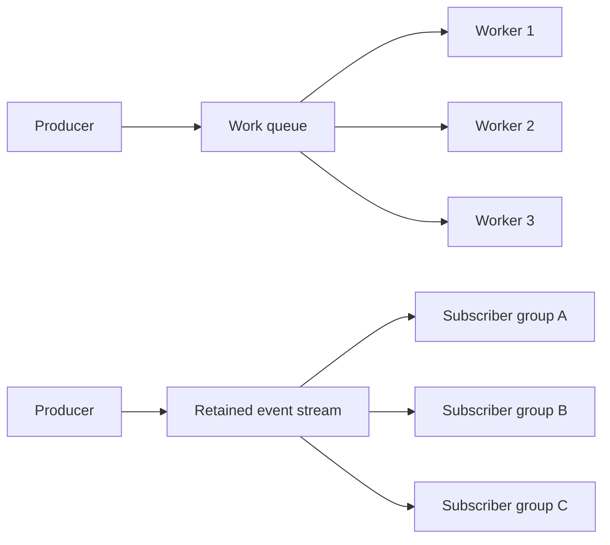

## TL;DR

A **work queue** and an **event stream** can both move records asynchronously, but they answer different ownership questions.

Use a queue when the central question is **which worker should perform this unit of work?** Multiple competing consumers can share one queue so that each delivery is handled by one worker, with acknowledgements and redelivery controlling completion.

Use an event stream when the central question is **which independent subscribers need to observe this fact, now or later?** A retained append-only log lets multiple subscriber groups track their own positions and replay retained history without consuming the record away for other groups.

Do not choose from throughput slogans. The decision changes with **fan-out, replay requirements, retention, ordering scope, delivery semantics, backpressure, and operational ownership**. Queue products can fan out into multiple queues, and stream products can use consumer groups to distribute work. The important distinction is the behavior your system needs, not the product category printed on a homepage.

## Decision frame

Before choosing, write down the contract for the message flow:

- Is the record a **command/job** that should be completed by one worker, or a **fact/event** that multiple independent systems may need to observe?
- Does every subscriber need its own copy, or should workers **compete** for the same work?
- Must a new subscriber be able to replay old records? For how long?
- Is ordering required globally, per customer/order/entity, or not at all?
- What delivery behavior is acceptable when a worker crashes after performing a side effect but before recording completion?
- How will slow consumers create backpressure: queue backlog, consumer lag, throttling, or upstream admission control?
- Is the system comfortable retaining a durable history, including its storage, privacy, schema-evolution, and deletion obligations?
- Who owns partition counts, consumer-group rebalancing, queue topology, dead-letter handling, retention policy, and capacity monitoring?

If those questions are unanswered, “queue vs stream” is premature.

## Two mental models

### Work queue: one unit of work, one successful handler

A work queue is useful when records represent tasks such as resizing an image, sending a notification, running a report, or processing a webhook. Multiple **competing consumers** can pull or receive work from the same queue. A broker commonly tracks whether a delivery is ready, in flight, acknowledged, rejected, or eligible for redelivery.

<TermBox term="Competing consumers">
**Competing consumers** are multiple workers reading from the same logical queue while the messaging system distributes different deliveries among them.

**Why it matters here:** adding workers increases parallelism for one work pool, but those workers do not each receive every message. If three independent business capabilities all need the same fact, putting all three on one competing-consumer queue is the wrong topology.
</TermBox>

Acknowledgements are part of the delivery contract. If a worker fails before acknowledging, many queue systems can make the delivery available again. That improves recoverability but means consumers must be prepared for duplicates when failure happens around a side effect.

### Event stream: retained facts, independent reading positions

An event stream is a retained append-only sequence. Records are kept according to a retention policy rather than being deleted merely because one subscriber read them. Subscribers track a position in the stream; independent groups can advance at different speeds and, while data is still retained, move back to an earlier position for replay.

<TermBox term="Retention">
**Retention** is the policy that determines how long or how much stream data remains available independently of whether a subscriber has already processed it.

**Why it matters here:** replay is only possible while the required history still exists. Longer retention also creates storage, privacy, governance, and schema-compatibility responsibilities.
</TermBox>

A consumer group can distribute partitions among multiple instances so that one logical subscriber scales horizontally. This gives a stream queue-like work-sharing behavior **inside one group**, while separate groups can still consume the same retained records independently.

The diagram shows the default reasoning shape, not a universal implementation rule. A queue broker can fan out one publication into several queues, and some platforms provide both queue and stream data structures.

## Decision matrix

<DecisionMatrix
  caption="Queue vs event stream decision matrix"
  options={['Work queue', 'Retained event stream']}
  rows={[
    {
      criterion: 'Primary ownership question',
      values: [
        'Which worker should complete this unit of work?',
        'Which independent subscriber groups should observe this fact?',
      ],
    },
    {
      criterion: 'Multiple workers for one workload',
      values: [
        'Competing consumers naturally divide deliveries across workers',
        'Instances in one consumer group can divide partitions across workers',
      ],
    },
    {
      criterion: 'Independent fan-out',
      values: [
        'Usually requires separate queues/subscriptions per independent consumer capability',
        'Independent consumer groups can read the same retained records at their own pace',
      ],
    },
    {
      criterion: 'Replay',
      values: [
        'Usually not the default after successful acknowledgement; replay needs another retained source or broker-specific feature',
        'A core fit when consumers can reset position while the required data is still retained',
      ],
    },
    {
      criterion: 'Retention model',
      values: [
        'Backlog is usually work waiting for completion; successful processing commonly removes it from the active queue',
        'Records remain available according to time/size policy independently of one consumer finishing',
      ],
    },
    {
      criterion: 'Ordering and parallelism',
      values: [
        'Parallel competing consumers can make completion order differ from enqueue order; strict order may reduce parallelism',
        'Ordering is commonly scoped to a partition; partitioning defines both order boundaries and parallelism',
      ],
    },
    {
      criterion: 'Failure recovery',
      values: [
        'Acknowledgement/redelivery is central; consumers should tolerate duplicate delivery around failures',
        'Position commits and replay are central; consumers still need idempotence when processing and position updates are not atomic with side effects',
      ],
    },
    {
      criterion: 'Backpressure signal',
      values: [
        'Queue depth, age of oldest work, in-flight deliveries, and worker saturation',
        'Consumer lag, partition skew, processing rate, and retention headroom',
      ],
    },
    {
      criterion: 'Operational burden',
      values: [
        'Queue topology, retry/dead-letter policy, acknowledgement tuning, backlog capacity',
        'Partition strategy, retention/storage, group rebalancing, lag, schema evolution, replay safety',
      ],
    },
  ]}
/>

## When a work queue is the stronger fit

Prefer a queue-oriented design when:

- the record represents a discrete job that should be completed once logically, even if delivery may occur more than once;
- workers are interchangeable and should compete for available work;
- successful completion makes the record operationally uninteresting after audit requirements are satisfied elsewhere;
- delayed retry, dead-letter handling, priorities, per-job scheduling, or bounded in-flight work are central requirements;
- replaying an entire historical sequence is not a core product or recovery workflow;
- the team wants backlog depth and job age to be the primary operational model.

Examples include media conversion, document generation, outbound email jobs, background webhook processing, and batch work items.

## When a retained event stream is the stronger fit

Prefer a stream-oriented design when:

- the record is a durable fact such as `OrderPlaced`, `PaymentCaptured`, or `AccountClosed` that several capabilities may need independently;
- new consumers must bootstrap from historical data or existing consumers must reprocess after a bug fix;
- different subscriber groups need independent progress and failure isolation;
- per-key ordering matters and a partitioning key can express that ordering boundary;
- consumer lag is acceptable and observable as a first-class state;
- retaining history is valuable enough to justify storage, schema evolution, access control, deletion, and replay discipline.

Analytics feeds, audit-oriented integration histories, change-data streams, and multiple independent materialized views are common examples.

## The choices overlap

Treat this as a **semantic decision**, not a product taxonomy.

A queue broker can publish one event to an exchange/topic and route a copy to several independent queues. That provides fan-out while retaining queue-style acknowledgement and backlog semantics per subscriber.

A stream platform can put multiple worker instances in one consumer group. Within that group, partitions are assigned across instances so the group shares work. Separate groups still see the same stream independently.

Some systems, including modern RabbitMQ, expose both queues and stream data structures. Kafka's core abstraction is a partitioned retained log. The architecture question remains: **do you need completion-oriented work ownership, retained subscriber-independent history, or a combination?**

A common hybrid is:

1. publish a durable business fact to a stream;
2. let an independent subscriber translate that fact into a task that belongs on a work queue;
3. process the task with queue-style retries and bounded concurrency.

The hybrid is justified only when both semantics are genuinely needed. Do not duplicate every message into both systems by default.

## Ordering is a scope, not a checkbox

“Preserves order” is incomplete without naming the scope.

With competing queue consumers, a broker can dequeue records in order while workers finish them out of order because processing times differ. Requeueing can also alter observed order. Enforcing a single active consumer can preserve a stronger order but gives up parallelism.

With a partitioned stream, records inside one partition have a defined sequence. Ordering across partitions is not a single total order. The partition key therefore becomes a correctness decision: if all changes for one account must be processed in order, those records need a stable rule that places them in the same ordering domain.

Do not increase partition count, shuffle keys, or add consumers without checking the ordering assumptions that downstream code relies on.

## Delivery semantics do not remove the need for idempotence

A queue acknowledgement means “the consumer has taken responsibility for this delivery” according to the broker's contract. If the process performs a side effect and crashes before acknowledging, redelivery can cause the side effect to run again.

A stream consumer can process a record and then commit its position. If the side effect succeeds but the position update does not, the record can be seen again after restart or rebalance.

Exactly-once claims are always scoped to a particular system boundary and configuration. When a message causes an external effect—charging a card, sending an email, mutating another database—design idempotency or deduplication at that effect boundary instead of assuming the transport makes duplicates impossible.

## Backpressure: backlog and lag are operational state

A healthy asynchronous design makes slowness visible before retention or downstream capacity is exhausted.

For a queue, watch at least:

- ready backlog depth;
- age of the oldest unprocessed job;
- in-flight/unacknowledged work;
- retry and dead-letter rates;
- worker throughput and saturation.

For a stream, watch at least:

- consumer lag by group and partition;
- skew between hot and cold partitions;
- processing throughput versus publish rate;
- time remaining before slow consumers fall outside retention;
- storage growth and retention headroom.

Backpressure should change behavior. Bound concurrency, slow publishers, reject non-critical work, shed load, or increase capacity intentionally. A dashboard that only reports a growing backlog is not a control mechanism.

## Production failure: one queue accidentally became a fan-out bus

> A commerce platform published every `OrderPlaced` record to one durable queue. Email, fraud review, and analytics each ran a consumer against that same queue. The team expected all three capabilities to receive every order event.

**Impact:** Each message went to one of the competing consumers instead of all three. Some orders produced email but no analytics record; others reached fraud review but never triggered email. The inconsistency was intermittent and difficult to reconstruct because successfully acknowledged queue messages were no longer available as a shared replayable history.

**Root cause:** The architecture confused **work sharing** with **subscriber fan-out**. Multiple consumers on one work queue were competing for deliveries, while the business requirement was three independent subscriptions to the same fact.

**Correct pattern:** Make the ownership contract explicit. If retained replay and independent progress matter, publish the business fact to an event stream and give email, fraud, and analytics separate subscriber groups. If queue semantics are preferred, fan the publication out to three independent durable queues so each capability owns its own backlog and acknowledgement state. In either design, make downstream side effects idempotent.

## Practical heuristic

Use these questions in order:

1. **Is this a job or a fact?** If one worker should perform it, start with a queue. If many independent capabilities may observe it, continue toward a stream or fan-out topology.
2. **Must historical replay be a normal operation?** If yes, prefer retained history rather than reconstructing replay from backups or application tables later.
3. **What is the ordering domain?** Define per entity/key/partition ordering explicitly before scaling consumers.
4. **How should failure become visible?** Choose the backlog/lag model your operators can diagnose and control.
5. **Where is completion recorded?** Define acknowledgement or position-commit behavior and what happens when the process crashes between a side effect and that record of progress.
6. **What should a new subscriber see?** Only future work, or retained history from a chosen point?
7. **Can one technology provide both semantics safely?** Prefer a simpler platform when its queue/stream features meet the actual contract; avoid a second messaging system merely for architectural fashion.

## Check your mental model

> **Scenario:** A billing system emits `InvoiceIssued`. Email delivery, the customer ledger projection, and analytics all need the event. Analytics may be offline for several hours and the team wants to rebuild its model from the previous 30 days after logic changes. Email sends must still be rate-limited and retried independently.
>
> Should this be one shared work queue, a retained event stream, or a hybrid?

Show the reasoning

A single shared work queue is the weakest fit because email, ledger, and analytics are independent subscribers, not competing workers for one task.

A retained event stream is a strong source for `InvoiceIssued`: each subscriber group can advance independently, analytics can replay retained history, and the ledger can preserve its own progress.

Email delivery is a separate work-ownership problem. A useful hybrid is to let the email subscriber translate `InvoiceIssued` into a queue job. That queue can enforce bounded concurrency, delayed retries, and dead-letter handling without changing the retained business-event history.

The stream does not make email exactly once. The email worker still needs an idempotency key or another duplicate-suppression rule if duplicate sends are unacceptable.

## Decision review checklist

- [ ] **Ownership:** Is each record a unit of work for one worker, or a fact for independent subscribers?
- [ ] **Fan-out:** If several capabilities need the record, does each have independent delivery/progress state?
- [ ] **Replay:** Is replay required, for what time window, and is that history actually retained?
- [ ] **Ordering:** Is the required ordering scope documented per entity/key/partition rather than assumed globally?
- [ ] **Delivery semantics:** Are acknowledgement or position-commit boundaries explicit, including crash windows around side effects?
- [ ] **Idempotence:** Can handlers safely tolerate redelivery or replay?
- [ ] **Backpressure:** Are backlog/lag thresholds connected to capacity, throttling, or load-shedding actions?
- [ ] **Retention:** Are storage, privacy, deletion, and schema-evolution consequences understood?
- [ ] **Operations:** Does the team know how to diagnose stuck work, hot partitions, dead letters, rebalances, and replay mistakes?
- [ ] **Simplicity:** Can one platform satisfy the required semantics without adding an unnecessary second messaging system?

## Related concepts

This decision guide covers **Message Queues** and **Delivery Semantics**. In the Backend Systems learning path, connect it with idempotency, background jobs, partial failure, retries and backoff, and the transactional outbox. The [Reliable Checkout Flow](/docs/engineering-judgment/architecture-walkthroughs/reliable-checkout) shows why publishing durable facts and running asynchronous side effects require explicit recovery boundaries.

## Sources

- [Apache Kafka documentation — key concepts and partitioned logs](https://kafka.apache.org/documentation/)
- [RabbitMQ queues](https://www.rabbitmq.com/docs/queues)
- [RabbitMQ consumer acknowledgements and publisher confirms](https://www.rabbitmq.com/docs/confirms)
- [RabbitMQ streams](https://www.rabbitmq.com/docs/streams)
