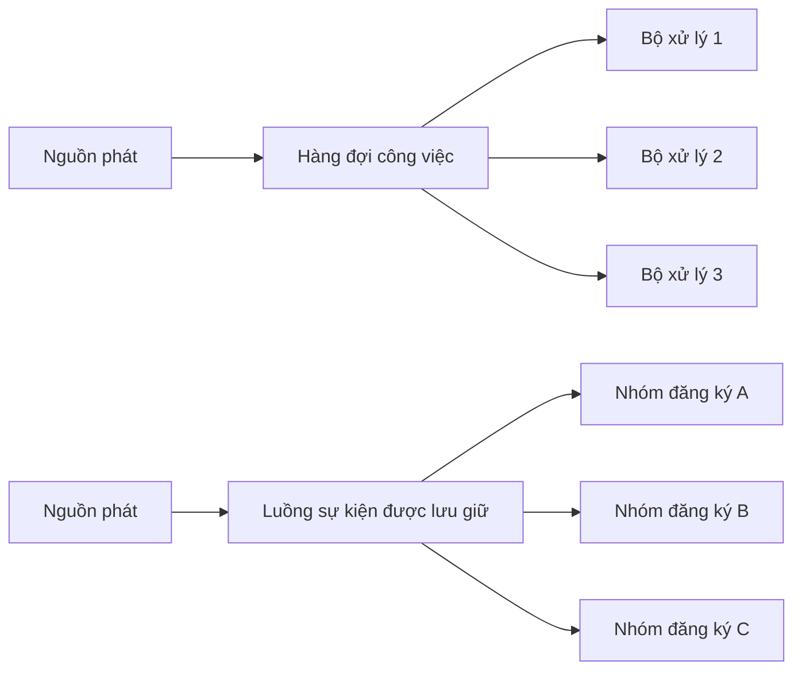

## Tóm tắt

**Hàng đợi công việc** và **luồng sự kiện** đều có thể chuyển bản ghi theo cách bất đồng bộ, nhưng chúng trả lời hai câu hỏi sở hữu khác nhau.

Dùng hàng đợi khi câu hỏi trung tâm là **bộ xử lý nào nên thực hiện đơn vị công việc này?** Nhiều bộ xử lý có thể tranh nhau xử lý cùng một hàng đợi để mỗi lần chuyển giao được một bộ xử lý nhận, còn cơ chế xác nhận và chuyển giao lại quyết định khi nào công việc được xem là hoàn tất.

Dùng luồng sự kiện khi câu hỏi trung tâm là **những nhóm độc lập nào cần quan sát sự kiện này, ngay bây giờ hoặc về sau?** Nhật ký chỉ nối thêm và được lưu giữ cho phép nhiều nhóm theo dõi vị trí riêng, đồng thời phát lại phần lịch sử còn được lưu giữ mà không làm bản ghi biến mất đối với các nhóm khác.

Không chọn dựa trên khẩu hiệu về thông lượng. Quyết định thay đổi theo **nhu cầu phân phối tới nhiều bên, phát lại, thời gian lưu giữ, phạm vi thứ tự, ngữ nghĩa chuyển giao, áp lực ngược và trách nhiệm vận hành**. Hệ thống hàng đợi có thể phân phối một lần xuất bản sang nhiều hàng đợi, còn hệ thống luồng có thể dùng các nhóm đọc để chia công việc. Điều quan trọng là hành vi hệ thống cần, không phải nhãn sản phẩm.

## Khung quyết định

Trước khi chọn, hãy viết rõ hợp đồng của luồng bản ghi:

- Bản ghi là **lệnh/công việc** nên được một bộ xử lý hoàn thành, hay là **sự kiện/sự thật** mà nhiều hệ thống độc lập có thể cần quan sát?
- Mỗi bên đăng ký có cần bản sao riêng, hay nhiều bộ xử lý phải tranh nhau xử lý cùng một nhóm công việc?
- Bên đăng ký mới có cần phát lại dữ liệu cũ không? Trong bao lâu?
- Thứ tự cần được giữ trên toàn bộ luồng, theo khách hàng/đơn hàng/thực thể, hay không bắt buộc?
- Điều gì được chấp nhận nếu bộ xử lý sập sau khi tạo tác dụng phụ nhưng trước khi ghi nhận hoàn tất?
- Bên đọc chậm sẽ tạo áp lực ngược theo cách nào: tồn đọng hàng đợi, độ trễ đọc, giới hạn tốc độ hay kiểm soát đầu vào?
- Hệ thống có sẵn sàng lưu giữ lịch sử lâu dài cùng chi phí lưu trữ, quyền riêng tư, thay đổi lược đồ và nghĩa vụ xóa dữ liệu không?
- Ai chịu trách nhiệm cho số phân vùng, việc phân công lại nhóm đọc, cấu trúc hàng đợi, xử lý thư chết, chính sách lưu giữ và theo dõi dung lượng?

Nếu các câu hỏi này chưa có câu trả lời, việc tranh luận “hàng đợi hay luồng” còn quá sớm.

## Hai mô hình tư duy

### Hàng đợi công việc: một đơn vị công việc, một lần xử lý thành công về mặt logic

Hàng đợi công việc phù hợp khi bản ghi đại diện cho nhiệm vụ như đổi kích thước ảnh, gửi thông báo, tạo báo cáo hoặc xử lý yêu cầu gọi lại. Nhiều bộ xử lý có thể **tranh nhau xử lý** cùng một hàng đợi. Hệ thống trung gian thường theo dõi lần chuyển giao đang chờ, đang được xử lý, đã xác nhận, bị từ chối hay cần chuyển giao lại.

<TermBox term="Các bộ xử lý tranh nhau">
**Các bộ xử lý tranh nhau** là nhiều tiến trình cùng nhận việc từ một hàng đợi logic, trong đó hệ thống trung gian phân phối các lần chuyển giao khác nhau cho từng tiến trình.

**Vì sao quan trọng ở đây:** tăng số bộ xử lý giúp tăng khả năng xử lý song song cho một nhóm công việc, nhưng không có nghĩa mọi bộ xử lý đều nhận mọi bản ghi. Nếu ba năng lực nghiệp vụ độc lập đều cần cùng một sự kiện, đặt cả ba lên một hàng đợi cạnh tranh là sai cấu trúc.
</TermBox>

Cơ chế xác nhận là một phần của hợp đồng chuyển giao. Nếu bộ xử lý hỏng trước khi xác nhận, nhiều hệ thống hàng đợi có thể đưa bản ghi trở lại để xử lý tiếp. Cách này tăng khả năng khôi phục nhưng cũng có nghĩa bộ xử lý phải chịu được bản ghi trùng khi lỗi xảy ra quanh một tác dụng phụ.

### Luồng sự kiện: sự thật được lưu giữ, mỗi nhóm có vị trí đọc riêng

Luồng sự kiện là chuỗi chỉ nối thêm và được lưu giữ. Bản ghi tồn tại theo chính sách lưu giữ thay vì bị xóa chỉ vì một bên đã đọc. Mỗi nhóm theo dõi vị trí riêng trong luồng; các nhóm độc lập có thể tiến với tốc độ khác nhau và, khi dữ liệu còn tồn tại, quay lại vị trí cũ để phát lại.

<TermBox term="Lưu giữ dữ liệu">
**Lưu giữ dữ liệu** là chính sách quyết định dữ liệu của luồng tồn tại trong bao lâu hoặc với dung lượng bao nhiêu, độc lập với việc một bên đăng ký đã xử lý xong hay chưa.

**Vì sao quan trọng ở đây:** chỉ có thể phát lại khi phần lịch sử cần thiết vẫn còn. Lưu lâu hơn cũng kéo theo trách nhiệm về dung lượng, quyền riêng tư, quản trị và khả năng tương thích lược đồ.
</TermBox>

Một nhóm đọc có thể phân chia các phân vùng cho nhiều tiến trình để một bên đăng ký logic mở rộng theo chiều ngang. Nhờ vậy, trong **một nhóm**, luồng có thể chia công việc gần giống hàng đợi; trong khi các nhóm khác vẫn đọc cùng dữ liệu đã lưu giữ một cách độc lập.

Sơ đồ thể hiện hình dạng tư duy mặc định, không phải quy tắc triển khai tuyệt đối. Hệ thống hàng đợi có thể phân phối một lần xuất bản sang nhiều hàng đợi, và một số nền tảng cung cấp cả cấu trúc hàng đợi lẫn cấu trúc luồng.

## Ma trận quyết định

<DecisionMatrix
  caption="Ma trận quyết định hàng đợi và luồng sự kiện"
  options={['Hàng đợi công việc', 'Luồng sự kiện được lưu giữ']}
  rows={[
    {
      criterion: 'Câu hỏi sở hữu chính',
      values: [
        'Bộ xử lý nào nên hoàn thành đơn vị công việc này?',
        'Những nhóm đăng ký độc lập nào nên quan sát sự kiện này?',
      ],
    },
    {
      criterion: 'Nhiều bộ xử lý cho một nhóm việc',
      values: [
        'Các bộ xử lý tranh nhau nhận việc và tự nhiên chia các lần chuyển giao',
        'Các tiến trình trong một nhóm có thể chia các phân vùng để cùng xử lý',
      ],
    },
    {
      criterion: 'Phân phối độc lập tới nhiều bên',
      values: [
        'Thường cần hàng đợi hoặc lượt đăng ký riêng cho từng năng lực độc lập',
        'Các nhóm độc lập có thể đọc cùng dữ liệu đã lưu giữ theo tốc độ riêng',
      ],
    },
    {
      criterion: 'Phát lại',
      values: [
        'Thường không phải hành vi mặc định sau khi xác nhận thành công; cần nguồn lịch sử khác hoặc tính năng riêng của nền tảng',
        'Là trường hợp sử dụng tự nhiên khi có thể đặt lại vị trí đọc trong phần dữ liệu còn được lưu giữ',
      ],
    },
    {
      criterion: 'Mô hình lưu giữ',
      values: [
        'Tồn đọng thường là công việc đang chờ hoàn thành; xử lý thành công thường loại bản ghi khỏi hàng đợi hoạt động',
        'Bản ghi tồn tại theo chính sách thời gian hoặc dung lượng, độc lập với việc một nhóm đã xử lý xong',
      ],
    },
    {
      criterion: 'Thứ tự và song song',
      values: [
        'Nhiều bộ xử lý cạnh tranh có thể hoàn tất khác thứ tự đưa vào; yêu cầu thứ tự nghiêm ngặt thường làm giảm song song',
        'Thứ tự thường được giới hạn trong một phân vùng; cách phân vùng quyết định cả ranh giới thứ tự lẫn mức song song',
      ],
    },
    {
      criterion: 'Khôi phục sau lỗi',
      values: [
        'Xác nhận và chuyển giao lại là trọng tâm; bộ xử lý phải chịu được bản ghi trùng quanh thời điểm lỗi',
        'Ghi nhận vị trí và phát lại là trọng tâm; vẫn cần tính lặp an toàn khi xử lý và cập nhật vị trí không nguyên tử với tác dụng phụ',
      ],
    },
    {
      criterion: 'Tín hiệu áp lực ngược',
      values: [
        'Độ sâu hàng đợi, tuổi công việc lâu nhất, số việc đang xử lý và mức bão hòa bộ xử lý',
        'Độ trễ đọc theo nhóm và phân vùng, độ lệch phân vùng, tốc độ xử lý và phần lưu giữ còn lại',
      ],
    },
    {
      criterion: 'Gánh nặng vận hành',
      values: [
        'Cấu trúc hàng đợi, chính sách thử lại/thư chết, điều chỉnh xác nhận và dung lượng tồn đọng',
        'Chiến lược phân vùng, lưu giữ/dung lượng, phân công lại nhóm, độ trễ đọc, thay đổi lược đồ và an toàn khi phát lại',
      ],
    },
  ]}
/>

## Khi hàng đợi công việc phù hợp hơn

Ưu tiên thiết kế theo hàng đợi khi:

- bản ghi là một công việc rời rạc cần được hoàn thành một lần về mặt logic, dù có thể được chuyển giao nhiều lần;
- các bộ xử lý có thể thay thế lẫn nhau và nên tranh nhau nhận công việc còn trống;
- sau khi hoàn thành, bản ghi không còn giá trị vận hành đáng kể ngoài nhu cầu kiểm toán được đáp ứng ở nơi khác;
- thử lại có trì hoãn, thư chết, độ ưu tiên, lịch chạy từng công việc hoặc giới hạn số việc đang xử lý là yêu cầu trọng tâm;
- phát lại toàn bộ lịch sử không phải quy trình phục hồi hay sản phẩm cốt lõi;
- đội ngũ muốn dùng độ sâu tồn đọng và tuổi công việc làm mô hình vận hành chính.

Các ví dụ gồm chuyển đổi tệp đa phương tiện, tạo tài liệu, gửi thư điện tử, xử lý yêu cầu gọi lại nền và các đơn vị công việc theo lô.

## Khi luồng sự kiện được lưu giữ phù hợp hơn

Ưu tiên thiết kế theo luồng khi:

- bản ghi là một sự thật bền vững như `OrderPlaced`, `PaymentCaptured` hoặc `AccountClosed` mà nhiều năng lực cần độc lập quan sát;
- bên đọc mới phải khởi tạo từ lịch sử hoặc bên đọc hiện tại phải xử lý lại sau khi sửa lỗi;
- các nhóm đăng ký cần tiến độ và miền lỗi độc lập;
- thứ tự theo khóa có ý nghĩa và một khóa phân vùng có thể biểu diễn ranh giới thứ tự đó;
- độ trễ đọc có thể được chấp nhận và theo dõi như một trạng thái hạng nhất;
- giá trị của lịch sử đủ lớn để biện minh cho lưu trữ, thay đổi lược đồ, kiểm soát truy cập, xóa dữ liệu và kỷ luật phát lại.

Nguồn dữ liệu phân tích, lịch sử tích hợp phục vụ kiểm toán, luồng thay đổi dữ liệu và nhiều mô hình chiếu độc lập là những ví dụ thường gặp.

## Hai lựa chọn có thể chồng lấn

Hãy xem đây là **quyết định về ngữ nghĩa**, không phải phân loại sản phẩm.

Hệ thống hàng đợi có thể xuất bản một sự kiện vào điểm phân phối rồi định tuyến bản sao đến nhiều hàng đợi độc lập. Cách này cung cấp phân phối tới nhiều bên nhưng vẫn giữ cơ chế xác nhận và tồn đọng riêng cho từng bên.

Nền tảng luồng có thể đặt nhiều tiến trình vào cùng một nhóm đọc. Bên trong nhóm đó, các phân vùng được chia cho nhiều tiến trình để cùng xử lý. Các nhóm khác vẫn nhìn thấy cùng một luồng một cách độc lập.

Một số hệ thống, trong đó có RabbitMQ hiện đại, cung cấp cả hàng đợi lẫn cấu trúc luồng. Kafka đặt nhật ký có phân vùng và được lưu giữ làm mô hình trung tâm. Câu hỏi kiến trúc vẫn là: **bạn cần quyền sở hữu công việc hướng tới hoàn tất, lịch sử được lưu giữ độc lập giữa các bên đăng ký, hay cả hai?**

Một mô hình kết hợp phổ biến là:

1. xuất bản một sự thật nghiệp vụ bền vững vào luồng;
2. để một bên đăng ký độc lập chuyển sự thật đó thành công việc thuộc về hàng đợi;
3. xử lý công việc bằng cơ chế thử lại và giới hạn song song của hàng đợi.

Chỉ dùng mô hình kết hợp khi thực sự cần cả hai ngữ nghĩa. Không sao chép mọi bản ghi vào hai hệ thống theo mặc định.

## Thứ tự là một phạm vi, không phải một ô đánh dấu

Nói “giữ thứ tự” là chưa đủ nếu không nêu phạm vi.

Với nhiều bộ xử lý cạnh tranh, hệ thống trung gian có thể lấy bản ghi ra theo thứ tự nhưng các tiến trình hoàn tất khác thứ tự vì thời gian xử lý khác nhau. Việc đưa bản ghi trở lại hàng đợi cũng có thể thay đổi thứ tự quan sát được. Ép chỉ một bộ xử lý hoạt động có thể giữ thứ tự mạnh hơn nhưng làm mất khả năng song song.

Với luồng có phân vùng, bản ghi trong cùng một phân vùng có một chuỗi xác định. Các phân vùng khác nhau không tạo thành một thứ tự tổng duy nhất. Vì vậy khóa phân vùng là quyết định về tính đúng: nếu mọi thay đổi của một tài khoản phải được xử lý theo thứ tự, các bản ghi đó cần một quy tắc ổn định để đi vào cùng miền thứ tự.

Không tăng số phân vùng, đổi cách chia khóa hoặc thêm tiến trình đọc mà không kiểm tra giả định thứ tự của mã phía sau.

## Ngữ nghĩa chuyển giao không loại bỏ nhu cầu xử lý lặp an toàn

Xác nhận trên hàng đợi có nghĩa là “bên nhận đã chịu trách nhiệm cho lần chuyển giao này” theo hợp đồng của hệ thống trung gian. Nếu tiến trình tạo tác dụng phụ rồi sập trước khi xác nhận, lần chuyển giao lại có thể khiến tác dụng phụ chạy thêm lần nữa.

Bên đọc luồng có thể xử lý bản ghi rồi mới ghi nhận vị trí. Nếu tác dụng phụ thành công nhưng việc ghi vị trí thất bại, bản ghi có thể xuất hiện lại sau khi khởi động lại hoặc phân công lại.

Mọi tuyên bố “chính xác một lần” đều có phạm vi trong một ranh giới hệ thống và cấu hình cụ thể. Khi bản ghi gây tác dụng bên ngoài—thu tiền, gửi thư hoặc thay đổi cơ sở dữ liệu khác—hãy thiết kế khóa chống trùng hoặc cơ chế lặp an toàn tại chính ranh giới tác dụng đó thay vì giả định phương tiện truyền tải làm bản ghi trùng biến mất.

## Áp lực ngược: tồn đọng và độ trễ đọc là trạng thái vận hành

Thiết kế bất đồng bộ tốt phải làm sự chậm lại trở nên nhìn thấy trước khi phần lưu giữ hoặc năng lực hệ thống phía sau bị cạn.

Với hàng đợi, tối thiểu hãy theo dõi:

- độ sâu công việc sẵn sàng;
- tuổi của công việc chưa xử lý lâu nhất;
- số lần chuyển giao đang chờ xác nhận;
- tỷ lệ thử lại và thư chết;
- thông lượng và mức bão hòa của bộ xử lý.

Với luồng, tối thiểu hãy theo dõi:

- độ trễ đọc theo từng nhóm và phân vùng;
- độ lệch giữa phân vùng nóng và lạnh;
- thông lượng xử lý so với tốc độ xuất bản;
- thời gian còn lại trước khi bên đọc chậm rơi ra ngoài cửa sổ lưu giữ;
- tốc độ tăng dung lượng và phần lưu giữ còn lại.

Áp lực ngược phải làm hành vi thay đổi. Giới hạn mức song song, làm chậm nguồn phát, từ chối công việc không quan trọng, giảm tải hoặc tăng năng lực một cách có chủ đích. Bảng theo dõi chỉ cho thấy tồn đọng tăng lên không phải là cơ chế kiểm soát.

## Sự cố thực tế: một hàng đợi bị dùng nhầm làm kênh phân phối tới nhiều bên

> Một nền tảng thương mại đưa mọi bản ghi `OrderPlaced` vào một hàng đợi bền vững. Gửi thư, kiểm tra gian lận và phân tích dữ liệu mỗi bên đều chạy một tiến trình đọc trên cùng hàng đợi. Đội ngũ kỳ vọng cả ba năng lực đều nhận mọi sự kiện đơn hàng.

**Hậu quả:** Mỗi bản ghi chỉ đi tới một trong các bộ xử lý đang tranh nhau xử lý thay vì cả ba. Một số đơn hàng gửi được thư nhưng thiếu dữ liệu phân tích; đơn khác đến bước kiểm tra gian lận nhưng không gửi thư. Sai lệch xuất hiện ngắt quãng và khó dựng lại vì các bản ghi đã xác nhận thành công không còn là một lịch sử chung để phát lại.

**Nguyên nhân cốt lõi:** Kiến trúc nhầm **chia công việc** với **phân phối độc lập tới nhiều bên đăng ký**. Nhiều bộ xử lý trên một hàng đợi công việc đang tranh nhau nhận bản ghi, trong khi yêu cầu nghiệp vụ là ba lượt đăng ký độc lập tới cùng một sự thật.

**Cách khắc phục chuẩn:** Làm rõ hợp đồng sở hữu. Nếu cần lịch sử được lưu giữ, phát lại và tiến độ độc lập, hãy xuất bản sự thật nghiệp vụ vào luồng sự kiện và cho gửi thư, kiểm tra gian lận, phân tích dữ liệu các nhóm đăng ký riêng. Nếu muốn giữ ngữ nghĩa hàng đợi, hãy phân phối lần xuất bản sang ba hàng đợi bền vững độc lập để mỗi năng lực có tồn đọng và trạng thái xác nhận riêng. Trong cả hai thiết kế, tác dụng phụ phía sau phải xử lý lặp an toàn.

## Heuristic thực dụng

Hãy hỏi theo thứ tự sau:

1. **Đây là công việc hay sự thật?** Nếu một bộ xử lý phải thực hiện, bắt đầu với hàng đợi. Nếu nhiều năng lực độc lập có thể cần quan sát, nghiêng về luồng hoặc cấu trúc phân phối tới nhiều hàng đợi.
2. **Phát lại lịch sử có phải thao tác bình thường không?** Nếu có, ưu tiên lịch sử được lưu giữ thay vì cố dựng lại từ sao lưu hay bảng ứng dụng sau này.
3. **Miền thứ tự là gì?** Xác định rõ thứ tự theo thực thể/khóa/phân vùng trước khi tăng số tiến trình.
4. **Lỗi cần hiện ra như thế nào?** Chọn mô hình tồn đọng hoặc độ trễ đọc mà đội vận hành có thể chẩn đoán và kiểm soát.
5. **Hoàn tất được ghi ở đâu?** Xác định ranh giới xác nhận hoặc ghi vị trí và điều gì xảy ra khi tiến trình sập giữa tác dụng phụ và việc ghi nhận tiến độ.
6. **Bên đăng ký mới cần thấy gì?** Chỉ dữ liệu tương lai hay lịch sử từ một vị trí đã chọn?
7. **Một công nghệ có cung cấp an toàn cả hai ngữ nghĩa không?** Ưu tiên nền tảng đơn giản hơn nếu tính năng hàng đợi/luồng của nó đáp ứng hợp đồng thực tế; không thêm hệ thống thứ hai chỉ vì xu hướng kiến trúc.

## Kiểm tra mô hình tư duy

> **Tình huống:** Hệ thống lập hóa đơn phát `InvoiceIssued`. Gửi thư, mô hình sổ cái của khách hàng và phân tích dữ liệu đều cần sự kiện này. Phân tích dữ liệu có thể ngừng vài giờ và đội ngũ muốn dựng lại mô hình từ 30 ngày trước sau khi sửa logic. Việc gửi thư vẫn cần giới hạn tốc độ và thử lại độc lập.
>
> Nên dùng một hàng đợi công việc chung, một luồng sự kiện được lưu giữ hay mô hình kết hợp?

Xem giải thích chi tiết

Một hàng đợi công việc chung là lựa chọn yếu nhất vì gửi thư, sổ cái và phân tích dữ liệu là các bên đăng ký độc lập, không phải các bộ xử lý tranh nhau cho một công việc.

Luồng sự kiện được lưu giữ là nguồn phù hợp cho `InvoiceIssued`: mỗi nhóm có thể tiến độc lập, phân tích dữ liệu có thể phát lại phần lịch sử còn lưu, còn sổ cái giữ tiến độ riêng.

Gửi thư là bài toán sở hữu công việc khác. Mô hình kết hợp hợp lý là để bên đăng ký gửi thư chuyển `InvoiceIssued` thành một công việc trong hàng đợi. Hàng đợi này có thể giới hạn mức song song, thử lại có trì hoãn và xử lý thư chết mà không làm thay đổi lịch sử sự kiện nghiệp vụ đã lưu giữ.

Luồng không bảo đảm thư chỉ được gửi đúng một lần. Bộ xử lý thư vẫn cần khóa chống trùng hoặc quy tắc tương đương nếu không chấp nhận gửi trùng.

## Danh sách kiểm tra khi ra quyết định

- [ ] **Quyền sở hữu:** Mỗi bản ghi là công việc cho một bộ xử lý hay là sự thật cho nhiều bên đăng ký độc lập?
- [ ] **Phân phối nhiều bên:** Nếu nhiều năng lực cần bản ghi, mỗi năng lực có trạng thái chuyển giao và tiến độ riêng không?
- [ ] **Phát lại:** Có cần phát lại không, trong cửa sổ thời gian nào, và lịch sử đó có thực sự được lưu giữ không?
- [ ] **Thứ tự:** Phạm vi thứ tự có được ghi rõ theo thực thể/khóa/phân vùng thay vì giả định trên toàn hệ thống không?
- [ ] **Ngữ nghĩa chuyển giao:** Ranh giới xác nhận hoặc ghi vị trí có rõ, kể cả cửa sổ lỗi quanh tác dụng phụ không?
- [ ] **Xử lý lặp an toàn:** Bộ xử lý có chịu được chuyển giao lại hoặc phát lại không?
- [ ] **Áp lực ngược:** Ngưỡng tồn đọng/độ trễ đọc có gắn với hành động tăng năng lực, giới hạn tốc độ hoặc giảm tải không?
- [ ] **Lưu giữ:** Hệ quả về dung lượng, quyền riêng tư, xóa dữ liệu và thay đổi lược đồ đã được hiểu chưa?
- [ ] **Vận hành:** Đội ngũ có biết chẩn đoán công việc kẹt, phân vùng nóng, thư chết, phân công lại và lỗi phát lại không?
- [ ] **Đơn giản:** Một nền tảng có đáp ứng đủ ngữ nghĩa cần thiết mà không thêm hệ thống truyền tin thứ hai không?

## Khái niệm liên quan

Cẩm nang này bao phủ **Hàng đợi thông điệp** và **Ngữ nghĩa chuyển giao**. Trong lộ trình Hệ thống phía máy chủ, hãy nối quyết định này với xử lý lặp an toàn, công việc nền, lỗi từng phần, thử lại có giãn cách và hộp thư giao dịch. [Luồng thanh toán tin cậy](/vi/docs/engineering-judgment/architecture-walkthroughs/reliable-checkout) minh họa vì sao xuất bản sự thật bền vững và chạy tác dụng phụ bất đồng bộ cần ranh giới phục hồi rõ ràng.

## Nguồn tham khảo

- [Tài liệu Apache Kafka về các khái niệm cốt lõi và nhật ký có phân vùng](https://kafka.apache.org/documentation/)
- [Tài liệu RabbitMQ về hàng đợi](https://www.rabbitmq.com/docs/queues)
- [Tài liệu RabbitMQ về xác nhận từ bên nhận và xác nhận từ bên phát](https://www.rabbitmq.com/docs/confirms)
- [Tài liệu RabbitMQ về luồng](https://www.rabbitmq.com/docs/streams)
