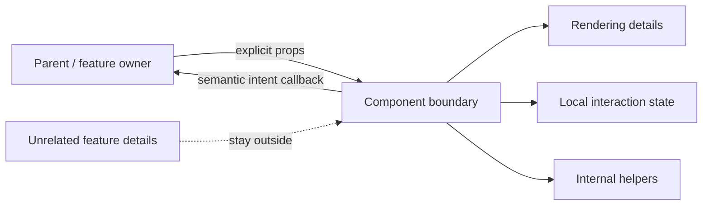
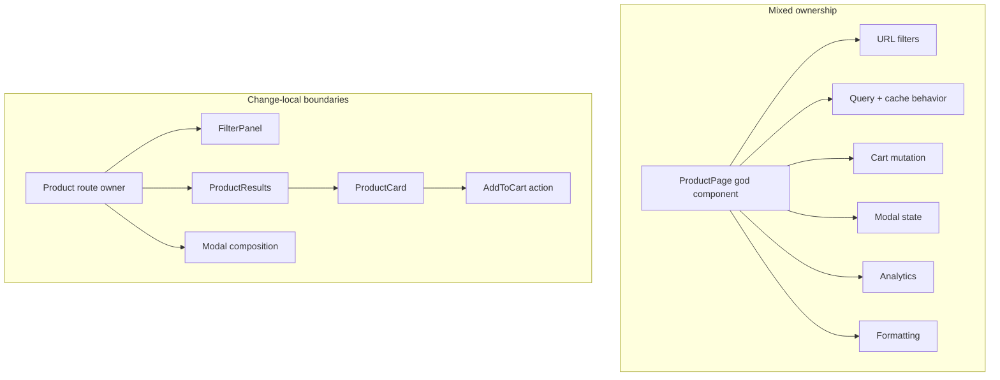
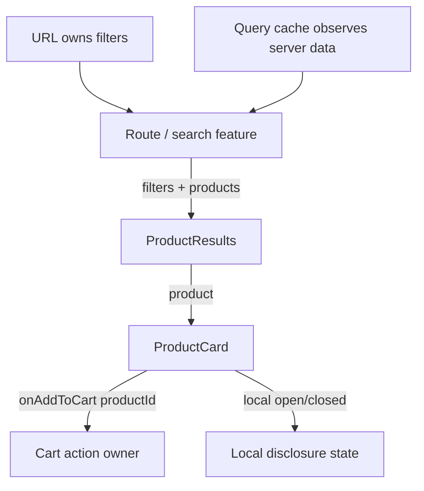

# Component Boundaries: Make Ownership and Interfaces Explicit

## TL;DR

A useful component boundary groups **one cohesive responsibility**, gives changing state/data/actions a clear owner, and exposes a small contract to the rest of the UI.

Do not split a component because it crossed an arbitrary line count or file size. Split when different parts have **different reasons to change**, different owners, or an interface that deserves to become explicit. Keep code together when the pieces change together and jointly enforce one interaction or invariant.

A practical review asks:

- what responsibility does this region own;
- which state, remote observation, and actions belong to it;
- what data must cross into the boundary;
- what user intent must cross back out;
- which changes should remain local when the product evolves.

<TermBox term="Component boundary">
A **component boundary** is a logical ownership and interface boundary inside the UI. It groups cohesive rendering and behavior behind explicit inputs and outputs so callers do not need to know the internal state, markup, or implementation details.
</TermBox>



## Component boundaries are change boundaries

The best signal for a boundary is not visual size. It is **change shape**.

If two pieces repeatedly change together for the same product reason, keeping them together often improves cohesion. If one region changes for pricing rules while another changes for search interaction, forcing them into one component couples unrelated work.

Examples of different reasons to change include:

- a filter panel changes when search behavior changes;
- a price display changes when formatting or promotion rules change;
- an editor toolbar changes when editing commands change;
- a pagination control changes when navigation semantics change;
- a product card layout changes when product presentation changes.

A large component can still be cohesive. A tiny component can still be badly placed. **Line count is evidence to inspect, not a boundary rule.**

<TermBox term="Change locality">
**Change locality** means a product change can usually be implemented and verified inside one small region without forcing unrelated components to understand or coordinate that change. Good boundaries reduce the number of places that must change together.
</TermBox>



## This is different from the Server/Client Components execution boundary

This lesson is about **logical component architecture**. That is different from the Server/Client Components execution boundary.

A component can be a good logical boundary whether it runs on the server, in the browser, or participates in both framework phases. Conversely, adding `'use client'` does not automatically create a good responsibility boundary.

Ask the two questions independently:

- **Execution boundary:** where can this module execute and which code enters the client graph?
- **Component boundary:** what responsibility does this unit own and what contract does the rest of the UI depend on?

Sometimes the boundaries align. They do not have to.

## Start with ownership of state, data, and actions

Component structure becomes easier when ownership is explicit.

For each changing fact, identify one owner:

- local disclosure state may belong to the disclosure component;
- URL filters may belong to the route/navigation owner;
- a form draft may belong to the form feature;
- remote product data remains server-owned even when a frontend query cache observes it;
- a cart mutation may belong to a cart feature action rather than every product card independently.

A child that renders a value does not automatically own that value. Likewise, a parent that can technically hold all state should not automatically own every interaction.

The previous State Models lesson establishes the source of truth. Component boundaries should preserve that ownership instead of creating duplicate writable copies merely to make props shorter.



## Make the contract explicit: data in, intent out

React props are a natural component interface. They make dependencies visible at the call site and let a component receive the minimum information it needs.

For interactive children, callbacks should usually communicate **intent**, not expose the parent's storage mechanism.

Prefer:

```tsx
<ProductCard product={product} onAddToCart={handleAddToCart} />
```

Over a child receiving `setCartItems`, the whole cart store, router internals, analytics clients, and unrelated page state simply because those objects are available.

`onAddToCart(productId)` says what happened. `setCartItems(nextArray)` tells the child how the parent stores data. Semantic events keep the caller free to change implementation later.

<TermBox term="Component contract">
A **component contract** is the set of inputs, events, and composition points that callers rely on. A good contract uses domain or interaction language, exposes less than the implementation knows, and remains stable when internal markup or state management changes.
</TermBox>

## Prefer composition when configuration starts describing structure

Props work well for meaningful data and behavior choices. They become awkward when one component tries to encode many different layouts through flags.

A card API such as this is a warning sign:

```tsx
<Card
  compact
  editable
  showActions
  showPreview
  isAdmin
  withFooter
  horizontal
/>
```

This **boolean prop explosion** often means several responsibilities or variants have been compressed into one component.

Depending on the semantics, better options may include:

- separate named variants with clearer contracts;
- smaller cohesive subcomponents;
- `children` or named composition slots for caller-owned structure;
- a shared primitive underneath distinct feature components.

Composition lets callers provide structure without forcing a reusable component to understand every future product combination.

## A god component is a symptom, not a line-count diagnosis

A "god component" is problematic because it owns too many unrelated decisions, not because it has many JSX lines.

Warning signs include:

- unrelated state machines in one file;
- remote fetching, mutations, navigation, formatting, analytics, and presentation all changing independently;
- many props that only matter in one mode;
- effects that synchronize sibling concerns;
- tests that require setup for unrelated behaviors;
- small UI edits that risk breaking data or workflow logic.

The opposite failure also exists: extracting every heading, wrapper, or three-line fragment into a component can scatter one cohesive responsibility across many files. Boundary quality matters more than component count.

## Context is a dependency channel, not a boundary design

Context can remove repetitive prop passing across a subtree, but it does not decide responsibility for you.

If a component reads several broad contexts, it may become coupled to invisible ambient dependencies even though its prop list looks small. That can make reuse and isolated testing harder.

Use context when the value genuinely belongs to a broad subtree or cross-cutting environment, such as theme, routing context, or feature-level shared state. Before reaching for context just to avoid prop drilling, consider whether explicit props or composition with `children` would make ownership clearer.

A short prop chain is not automatically a design problem. Hidden ownership can be worse than visible plumbing.

## Align data-fetching boundaries with ownership, not mount order

The previous Frontend Data Fetching lesson showed that component mount order should not accidentally determine request scheduling.

The same principle applies here. A deeply nested component should not start owning a remote query merely because it is the first place that renders the data.

A route or feature boundary may coordinate a query, loading/error behavior, and request identity, then pass domain-shaped data to rendering components. A genuinely self-contained interactive widget may own its own query when its lifetime and inputs are local to that widget.

Choose based on data ownership, timing, reuse, and error boundaries—not on which file happens to contain the final JSX.

## Separate orchestration from reusable views when their reasons to change diverge

Sometimes one boundary should coordinate state, navigation, fetching, and actions while another boundary focuses on rendering a reusable view.

For example:

- `ProductSearchRoute` can own URL filters, query identity, and loading/error states;
- `ProductResults` can render a list contract;
- `ProductCard` can render one product and emit semantic intents;
- `AddToCartButton` can own only the local pending/disabled interaction if that behavior is reusable.

This is not a rule to create a "container" for every view. Split only when orchestration and presentation have meaningfully different change patterns or reuse needs.

## Test the stable boundary contract

Good boundaries create useful test seams.

A component test can provide explicit props, trigger a user-visible action, and assert the emitted intent without constructing the entire application. Feature-level tests can exercise the owner that turns that intent into navigation, mutation, or cache invalidation.

If every component test requires mocking global stores, routers, query clients, analytics, permissions, and unrelated services, the component may not have a real boundary even if it lives in its own file.

Testability is not the reason to invent abstraction, but poor isolation is evidence that responsibilities may be mixed.

## Avoid premature abstraction

Two components that look similar today are not necessarily the same responsibility.

Do not create a generic component merely because two blocks share markup. First ask whether they share:

- the same semantic role;
- the same owner;
- the same interaction contract;
- the same reasons to change.

Small duplication is often cheaper than a shared abstraction with a growing matrix of flags. Extract when repeated structure represents the same concept, not only the same pixels.

## Production scenario

An ecommerce `ProductPage` has grown into one component that reads URL filters, fetches catalog results, tracks request state, mutates the cart, opens product modals, checks permissions, formats prices, emits analytics, and renders desktop/mobile variants. New requirements keep adding boolean props and effects because every concern is already reachable from the same file.

**Impact:** a change to search filters can break cart behavior, product-card tests require page-level mocks, loading/error states are duplicated, UI variants accumulate contradictory prop combinations, and reviewers cannot tell which state or action is authoritative.

**Root cause:** the team used one rendering tree as one ownership boundary. Responsibilities with different owners and reasons to change were allowed to share state and dependencies simply because they appeared on the same page.

**Correct pattern:** keep URL/query orchestration at a product-search owner; render results through an explicit list/card contract; emit semantic actions such as `onAddToCart(productId)`; compose modal content rather than encoding every mode as flags; keep local interaction state local; and let shared feature services own cross-cutting cart or analytics behavior. Split at responsibility boundaries, not arbitrary line counts.

## Boundary review

- [ ] **Responsibility:** Can the component's job be described in one cohesive sentence?
- [ ] **Change:** Which product changes should stay local to this boundary?
- [ ] **Ownership:** Who owns each state value, remote observation, and action?
- [ ] **Inputs:** Does the component receive only the data it needs through an explicit contract?
- [ ] **Intent:** Do callbacks describe what happened rather than expose storage internals?
- [ ] **Composition:** Would `children`, slots, or named subcomponents be clearer than more configuration flags?
- [ ] **Context:** Is context serving a genuinely broad dependency instead of hiding ordinary ownership?
- [ ] **Data:** Is query placement based on ownership/timing rather than component mount order?
- [ ] **Testing:** Can the boundary be tested without constructing unrelated application infrastructure?
- [ ] **Reuse:** Does an extracted abstraction share semantics and reasons to change, not just markup?

## Self-check

A 45-line `CheckoutSummary` receives `subtotal`, `tax`, and `onConfirm`, renders them, and emits one confirm intent. A 220-line `CheckoutPage` owns URL state, coupon validation, payment-method selection, analytics, remote mutations, modal state, and three unrelated layout modes. Which one should be split first?

<details>
<summary>Show the reasoning</summary>

The 220-line page deserves boundary review first—not because 220 is a forbidden size, but because it mixes responsibilities with different owners and reasons to change. The 45-line summary already has a small explicit contract and one cohesive job. Splitting it merely to reduce line count could make the design worse. Refactor the page by identifying ownership and contracts, then extract only boundaries that make change more local.

</details>

## Component-boundary checklist

- [ ] Group code by cohesive responsibility and reason to change.
- [ ] Preserve one clear owner for mutable state and remote observations.
- [ ] Treat props, semantic callbacks, and composition points as the public contract.
- [ ] Prefer intent callbacks over exposing setters or broad stores.
- [ ] Use composition when configuration flags start encoding structure.
- [ ] Treat boolean prop explosion and god components as signals to review boundaries.
- [ ] Use context deliberately; do not mistake hidden dependencies for good encapsulation.
- [ ] Keep query/mutation placement aligned with ownership and timing.
- [ ] Extract orchestration from reusable views only when their change patterns diverge.
- [ ] Judge a boundary by change locality and testability, not line count or file size.

## Agent rule

- [ ] Identify the owner and responsibility before extracting or merging components.
- [ ] Name the minimal data-in and semantic-intent-out contract.
- [ ] Preserve existing state and data-fetching ownership instead of creating duplicate writable copies.
- [ ] Prefer composition or explicit variants over adding another unrelated boolean prop.
- [ ] Split only when the new boundary improves change locality, dependency clarity, or independent verification.

## Sources

Primary references verified on **2026-09-16**:

- [React — Thinking in React](https://react.dev/learn/thinking-in-react)
- [React — Passing Props to a Component](https://react.dev/learn/passing-props-to-a-component)
- [React — Sharing State Between Components](https://react.dev/learn/sharing-state-between-components)
- [React — Passing Data Deeply with Context](https://react.dev/learn/passing-data-deeply-with-context)
- [React — Extracting State Logic into a Reducer](https://react.dev/learn/extracting-state-logic-into-a-reducer)
