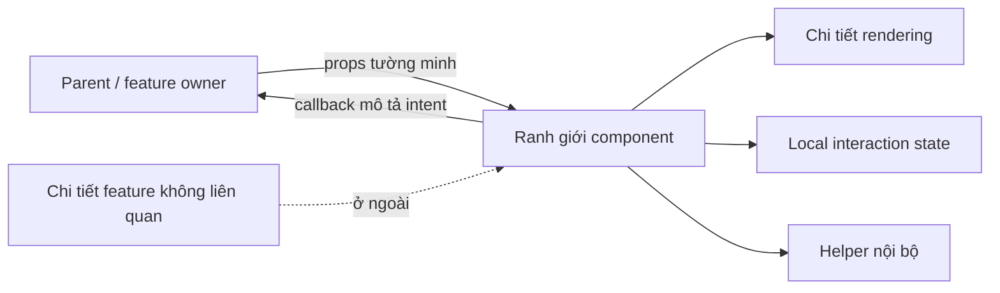
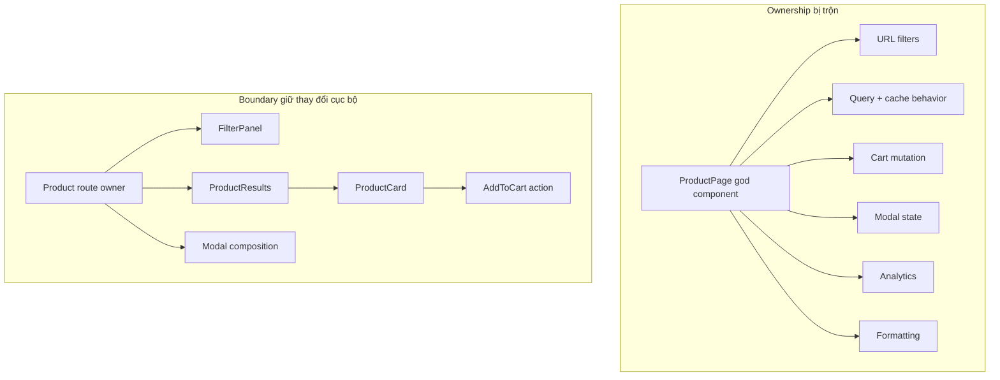
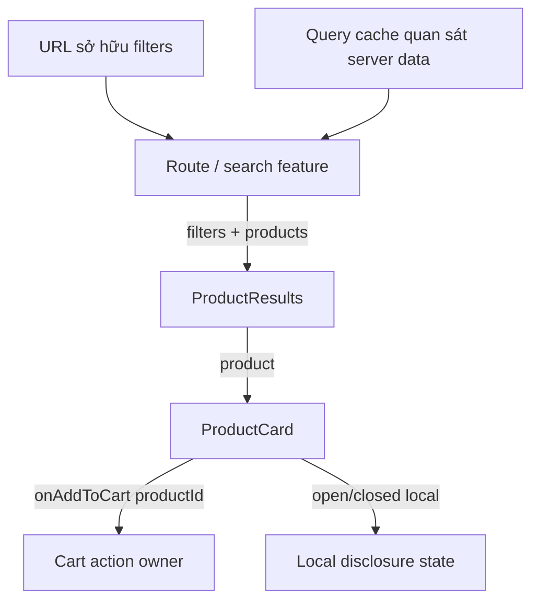

# Ranh giới Component: Làm rõ phạm vi sở hữu và giao diện

## Tóm tắt

Một ranh giới component tốt gom **một trách nhiệm gắn kết**, trao ownership rõ ràng cho state/data/action thay đổi, và chỉ lộ ra một contract nhỏ cho phần còn lại của UI.

Đừng tách component chỉ vì nó vượt một ngưỡng số dòng hay kích thước file tùy ý. Hãy tách khi các phần có **lý do thay đổi khác nhau**, owner khác nhau, hoặc khi interface giữa chúng cần trở nên explicit. Giữ code cùng nhau khi các phần thường thay đổi cùng nhau và cùng enforce một interaction hay invariant.

Một review thực dụng sẽ hỏi:

- vùng này sở hữu trách nhiệm gì;
- state, remote observation và action nào thuộc về nó;
- data nào cần đi vào boundary;
- user intent nào cần đi ngược ra ngoài;
- thay đổi nào nên được giữ cục bộ khi sản phẩm tiến hóa.

<TermBox term="Ranh giới component">
**Ranh giới component** là ranh giới logic về ownership và interface bên trong UI. Nó gom phần render và behavior có cohesion phía sau input/output tường minh để caller không cần biết state, markup hay chi tiết triển khai bên trong.
</TermBox>



## Ranh giới component là ranh giới thay đổi

Tín hiệu tốt nhất để đặt boundary không phải kích thước trực quan. Đó là **hình dạng của thay đổi**.

Nếu hai phần thường thay đổi cùng nhau vì cùng một lý do sản phẩm, giữ chúng cùng nhau thường làm cohesion tốt hơn. Nếu một vùng đổi theo pricing rule còn vùng khác đổi theo search interaction, ép cả hai vào một component sẽ coupling hai loại công việc không liên quan.

Ví dụ các lý do thay đổi khác nhau:

- filter panel thay đổi khi search behavior thay đổi;
- price display thay đổi khi formatting hoặc promotion rule thay đổi;
- editor toolbar thay đổi khi editing command thay đổi;
- pagination control thay đổi khi navigation semantics thay đổi;
- product card layout thay đổi khi cách trình bày product thay đổi.

Một component lớn vẫn có thể cohesive. Một component rất nhỏ vẫn có thể đặt sai chỗ. **Số dòng chỉ là bằng chứng để soi, không phải rule xác định boundary.**

<TermBox term="Change locality">
**Change locality** nghĩa là một thay đổi sản phẩm thường có thể được implement và verify trong một vùng nhỏ mà không buộc các component không liên quan phải hiểu hay phối hợp thay đổi đó. Boundary tốt làm giảm số nơi phải đổi cùng nhau.
</TermBox>



## Đây khác với ranh giới thực thi Server/Client Components

Bài này nói về **kiến trúc component logic**. Nó khác với ranh giới thực thi của Server/Client Components.

Một component có thể là logical boundary tốt dù chạy trên server, trong browser, hoặc tham gia nhiều phase của framework. Ngược lại, thêm `'use client'` không tự động tạo ra một responsibility boundary tốt.

Hãy tách hai câu hỏi:

- **Ranh giới thực thi:** module này có thể chạy ở đâu và code nào đi vào client graph?
- **Ranh giới component:** unit này sở hữu trách nhiệm gì và phần còn lại của UI phụ thuộc contract nào?

Đôi khi hai boundary trùng nhau. Chúng không bắt buộc phải trùng.

## Bắt đầu từ ownership của state, data và action

Cấu trúc component dễ suy luận hơn khi ownership explicit.

Với mỗi fact thay đổi, hãy chỉ định một owner:

- disclosure state local có thể thuộc disclosure component;
- URL filter có thể thuộc route/navigation owner;
- form draft có thể thuộc form feature;
- remote product data vẫn do server sở hữu dù frontend query cache đang quan sát nó;
- cart mutation có thể thuộc cart feature action thay vì mỗi product card tự sở hữu độc lập.

Một child render một value không có nghĩa child tự động sở hữu value đó. Tương tự, việc parent có thể giữ mọi state về mặt kỹ thuật không có nghĩa parent nên sở hữu mọi interaction.

Bài State Models trước đã xác định source of truth. Ranh giới component nên bảo toàn ownership đó thay vì tạo writable copy trùng lặp chỉ để làm props ngắn hơn.



## Làm contract rõ: data đi vào, intent đi ra

Props trong React là interface tự nhiên của component. Chúng làm dependency lộ rõ ở call site và giúp component nhận đúng phần thông tin tối thiểu cần thiết.

Với child có tương tác, callback nên truyền **ý định**, không nên lộ storage mechanism của parent.

Ưu tiên:

```tsx
<ProductCard product={product} onAddToCart={handleAddToCart} />
```

Thay vì cho child nhận `setCartItems`, toàn bộ cart store, router internals, analytics client và page state không liên quan chỉ vì các object đó đang có sẵn.

`onAddToCart(productId)` nói điều gì đã xảy ra. `setCartItems(nextArray)` nói child phải biết parent lưu data như thế nào. Event mang semantics giúp caller tự do đổi implementation về sau.

<TermBox term="Component contract">
**Component contract** là tập input, event và composition point mà caller phụ thuộc. Contract tốt dùng ngôn ngữ domain hoặc interaction, lộ ít hơn những gì implementation biết, và vẫn ổn định khi markup hay state-management nội bộ thay đổi.
</TermBox>

## Ưu tiên composition khi configuration bắt đầu mô tả cấu trúc

Props phù hợp với data có ý nghĩa và lựa chọn behavior rõ ràng. Chúng trở nên khó kiểm soát khi một component cố mã hóa nhiều layout khác nhau bằng flag.

Một API kiểu này là warning sign:

```tsx
<Card
  compact
  editable
  showActions
  showPreview
  isAdmin
  withFooter
  horizontal
/>
```

**Boolean prop explosion** kiểu này thường báo hiệu nhiều responsibility hoặc variant đã bị nén vào một component.

Tùy semantics, lựa chọn tốt hơn có thể là:

- variant có tên với contract rõ hơn;
- subcomponent nhỏ nhưng cohesive;
- `children` hoặc named slot cho structure do caller sở hữu;
- một shared primitive nằm dưới các feature component khác nhau.

Composition cho phép caller cung cấp structure mà không buộc reusable component hiểu mọi tổ hợp sản phẩm trong tương lai.

## God component là triệu chứng, không phải chẩn đoán bằng số dòng

Một "god component" có vấn đề vì nó sở hữu quá nhiều quyết định không liên quan, không phải vì nó có nhiều dòng JSX.

Các tín hiệu cảnh báo:

- nhiều state machine không liên quan trong một file;
- remote fetching, mutation, navigation, formatting, analytics và presentation thay đổi độc lập;
- nhiều prop chỉ có ý nghĩa trong một mode;
- effect dùng để đồng bộ các concern ngang hàng;
- test phải setup nhiều behavior không liên quan;
- chỉnh UI nhỏ nhưng có nguy cơ phá data hoặc workflow logic.

Failure mode ngược lại cũng có: tách mọi heading, wrapper hay fragment ba dòng thành component có thể làm một responsibility cohesive bị rải qua quá nhiều file. Chất lượng boundary quan trọng hơn số lượng component.

## Context là kênh dependency, không phải câu trả lời cho boundary

Context có thể loại bớt việc truyền prop lặp qua một subtree, nhưng nó không quyết định responsibility thay cho bạn.

Nếu một component đọc nhiều broad context, nó có thể coupling với các ambient dependency bị ẩn dù prop list nhìn rất ngắn. Điều đó làm reuse và isolated testing khó hơn.

Dùng context khi value thật sự thuộc một subtree rộng hoặc môi trường cross-cutting, như theme, routing context hay feature-level shared state. Trước khi dùng context chỉ để né prop drilling, hãy xem explicit props hoặc composition bằng `children` có làm ownership rõ hơn không.

Một prop chain ngắn không tự động là design problem. Ownership bị ẩn có thể tệ hơn plumbing nhìn thấy được.

## Căn data-fetching boundary theo ownership, không theo mount order

Bài Frontend Data Fetching trước đã cho thấy component mount order không nên vô tình quyết định request scheduling.

Nguyên tắc tương tự áp dụng ở đây. Một component nằm sâu không nên tự động sở hữu remote query chỉ vì nó là nơi đầu tiên render data đó.

Route hoặc feature boundary có thể phối hợp query, loading/error behavior và request identity rồi truyền domain-shaped data xuống rendering component. Một widget tương tác thật sự self-contained có thể sở hữu query riêng khi lifetime và input của query chỉ thuộc widget đó.

Hãy chọn dựa trên data ownership, timing, reuse và error boundary — không dựa trên file nào chứa JSX cuối cùng.

## Tách orchestration khỏi reusable view khi lý do thay đổi phân kỳ

Đôi khi một boundary nên phối hợp state, navigation, fetching và action, trong khi boundary khác tập trung render một reusable view.

Ví dụ:

- `ProductSearchRoute` có thể sở hữu URL filters, query identity và loading/error state;
- `ProductResults` render list contract;
- `ProductCard` render một product và emit semantic intent;
- `AddToCartButton` chỉ sở hữu local pending/disabled interaction nếu behavior đó thật sự reusable.

Đây không phải rule bắt buộc tạo "container" cho mọi view. Chỉ tách khi orchestration và presentation có change pattern hoặc nhu cầu reuse khác nhau thật sự.

## Kiểm thử stable boundary contract

Boundary tốt tạo ra test seam hữu ích.

Component test có thể truyền props tường minh, kích hoạt user-visible action và assert intent được emit mà không dựng toàn bộ application. Feature-level test có thể kiểm owner biến intent đó thành navigation, mutation hoặc cache invalidation ra sao.

Nếu mỗi component test đều phải mock global store, router, query client, analytics, permission và service không liên quan, component có thể chưa có boundary thật dù đã nằm trong file riêng.

Testability không phải lý do để phát minh abstraction, nhưng isolation kém là bằng chứng responsibility có thể đang bị trộn.

## Tránh abstraction quá sớm

Hai component nhìn giống nhau hôm nay chưa chắc là cùng responsibility.

Đừng tạo generic component chỉ vì hai block share markup. Trước tiên hãy hỏi chúng có share:

- cùng semantic role;
- cùng owner;
- cùng interaction contract;
- cùng lý do thay đổi hay không.

Một chút duplication thường rẻ hơn shared abstraction với ma trận flag ngày càng lớn. Chỉ extract khi cấu trúc lặp lại biểu diễn cùng một concept, không chỉ cùng pixel.

## Tình huống production

Một `ProductPage` ecommerce đã phình thành một component đọc URL filters, fetch catalog result, track request state, mutate cart, mở product modal, kiểm permission, format price, emit analytics và render variant desktop/mobile. Requirement mới cứ tiếp tục thêm boolean prop và effect vì mọi concern đã nằm sẵn trong cùng file.

**Hậu quả:** thay đổi search filter có thể làm hỏng cart behavior, test product card cần page-level mock, loading/error state bị duplicate, UI variant tích lũy các tổ hợp prop mâu thuẫn và reviewer không xác định được state/action nào authoritative.

**Nguyên nhân cốt lõi:** team xem một rendering tree như một ownership boundary duy nhất. Responsibility có owner và lý do thay đổi khác nhau được phép share state/dependency chỉ vì chúng xuất hiện trên cùng page.

**Cách khắc phục chuẩn:** giữ URL/query orchestration ở product-search owner; render result qua list/card contract tường minh; emit semantic action như `onAddToCart(productId)`; compose modal content thay vì encode mọi mode bằng flag; giữ local interaction state ở local; và để shared feature service sở hữu cart/analytics behavior cross-cutting. Tách theo responsibility boundary, không theo số dòng tùy ý.

## Review ranh giới

- [ ] **Trách nhiệm:** Có thể mô tả công việc của component bằng một câu cohesive không?
- [ ] **Thay đổi:** Product change nào nên được giữ cục bộ trong boundary này?
- [ ] **Ownership:** Ai sở hữu từng state value, remote observation và action?
- [ ] **Input:** Component có chỉ nhận data cần thiết qua contract tường minh không?
- [ ] **Intent:** Callback có mô tả điều gì xảy ra thay vì lộ storage internals không?
- [ ] **Composition:** `children`, slot hoặc named subcomponent có rõ hơn việc thêm configuration flag không?
- [ ] **Context:** Context có phục vụ dependency thật sự broad thay vì che ownership thông thường không?
- [ ] **Data:** Query placement có dựa trên ownership/timing thay vì component mount order không?
- [ ] **Kiểm thử:** Có thể test boundary mà không dựng infrastructure không liên quan không?
- [ ] **Reuse:** Abstraction được extract có share semantics và lý do thay đổi, không chỉ markup không?

## Tự kiểm tra

Một `CheckoutSummary` 45 dòng nhận `subtotal`, `tax`, `onConfirm`, render chúng và emit đúng một confirm intent. Một `CheckoutPage` 220 dòng sở hữu URL state, coupon validation, payment-method selection, analytics, remote mutation, modal state và ba layout mode không liên quan. Nên tách cái nào trước?

<details>
<summary>Xem giải thích chi tiết</summary>

`CheckoutPage` 220 dòng đáng được review boundary trước — không phải vì 220 là kích thước bị cấm, mà vì nó trộn nhiều responsibility với owner và lý do thay đổi khác nhau. `CheckoutSummary` 45 dòng đã có contract nhỏ, rõ và một công việc cohesive. Tách nó chỉ để giảm số dòng có thể làm thiết kế tệ hơn. Hãy refactor page bằng cách xác định ownership và contract, rồi chỉ extract boundary nào làm thay đổi cục bộ hơn.

</details>

## Checklist ranh giới component

- [ ] Gom code theo responsibility cohesive và lý do thay đổi.
- [ ] Giữ một owner rõ ràng cho mutable state và remote observation.
- [ ] Xem props, semantic callback và composition point là public contract.
- [ ] Ưu tiên intent callback thay vì lộ setter hoặc broad store.
- [ ] Dùng composition khi configuration flag bắt đầu encode structure.
- [ ] Xem boolean prop explosion và god component là tín hiệu cần review boundary.
- [ ] Dùng context có chủ đích; đừng nhầm hidden dependency với encapsulation tốt.
- [ ] Giữ query/mutation placement khớp ownership và timing.
- [ ] Chỉ tách orchestration khỏi reusable view khi change pattern thật sự phân kỳ.
- [ ] Đánh giá boundary bằng change locality và testability, không bằng số dòng hay kích thước file.

## Agent rule

- [ ] Xác định owner và responsibility trước khi extract hoặc merge component.
- [ ] Đặt tên cho contract tối thiểu: data đi vào và semantic intent đi ra.
- [ ] Bảo toàn ownership của state/data-fetching hiện có thay vì tạo writable copy trùng lặp.
- [ ] Ưu tiên composition hoặc explicit variant thay vì thêm một boolean prop không liên quan nữa.
- [ ] Chỉ tách khi boundary mới cải thiện change locality, dependency clarity hoặc khả năng verify độc lập.

## Nguồn tham khảo

Các nguồn chính được kiểm tra ngày **2026-09-16**:

- [React — Thinking in React](https://react.dev/learn/thinking-in-react)
- [React — Passing Props to a Component](https://react.dev/learn/passing-props-to-a-component)
- [React — Sharing State Between Components](https://react.dev/learn/sharing-state-between-components)
- [React — Passing Data Deeply with Context](https://react.dev/learn/passing-data-deeply-with-context)
- [React — Extracting State Logic into a Reducer](https://react.dev/learn/extracting-state-logic-into-a-reducer)
