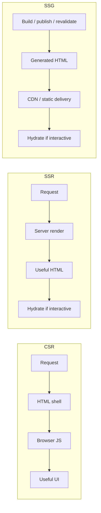
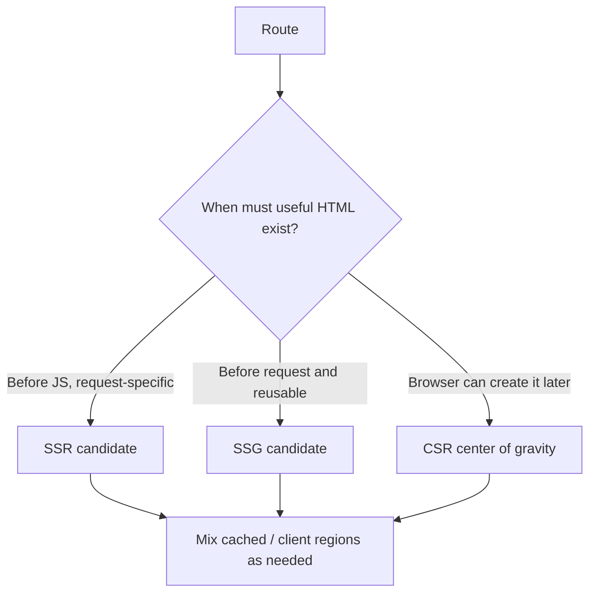
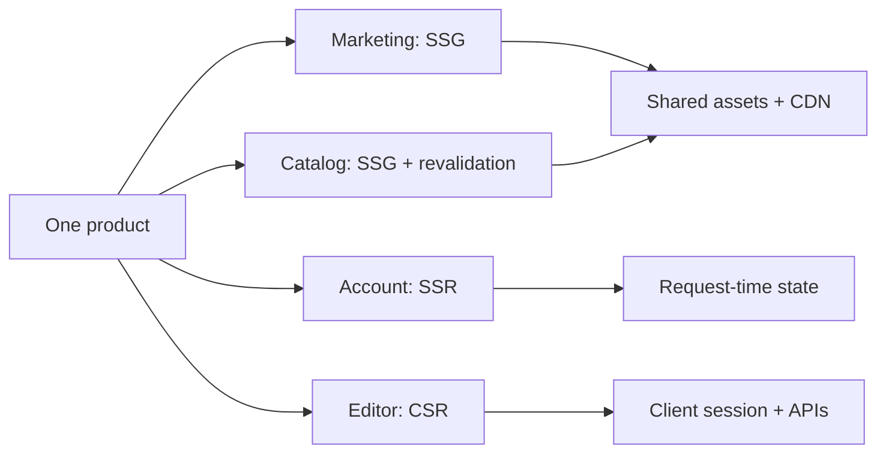

# CSR, SSR, and SSG: When and Where UI Becomes HTML

## TL;DR

An e-commerce storefront launches as a pure client-side rendered Single-Page App (CSR). On Black Friday, search engine crawlers index only empty `

` shells, crashing Google search rankings by 80%, while mobile shoppers on 3G connections stare at a blank white screen for 6.2 seconds before the 2MB JS bundle downloads and parses. The team panics and switches every page to dynamic SSR, only to melt their Node.js cluster under an avalanche of uncacheable request-time renders.

> 💡 **Rule of thumb:** **Choose rendering placement by data freshness and cacheability, not by framework trend.** Use SSG for content that changes with releases or webhooks (infinitely cacheable at edge); use SSR for per-user or highly volatile data that requires SEO or fast First Contentful Paint; use CSR for authenticated dashboards where an empty HTML shell is acceptable and rich client interaction dominates.

- **Foundational question:** Where and when does useful HTML come into existence? In the browser after JavaScript execution (CSR), on the server at request time (SSR), or before requests at build/revalidation time (SSG/ISR).
- **SEO & First Contentful Paint (FCP):** SSG and SSR deliver immediately parseable semantic markup in the first response packet; CSR delivers an empty container, deferring paint until client JS downloads and executes.
- **Hydration requirements:** Both SSR and SSG still ship JavaScript bundles if the rendered HTML requires interactive event listeners—creating a hydration phase where UI looks ready before clicks work.
- **Infrastructure and compute costs:** SSG scales infinitely from edge CDNs for cents; SSR consumes server CPU on every request; CSR pushes compute costs onto user client devices.
- **Fatal pitfall:** Treating rendering strategies as a whole-app binary choice rather than a per-route architectural decision—forcing public marketing/catalog routes into CSR (killing SEO/FCP) or complex private dashboards into SSR (inflating server load with zero caching benefit).

<TermBox term="Rendering placement">
**Rendering placement** is the execution location and time that produces useful HTML: in the browser after JavaScript runs, on the server for a request, or before an individual request during build/publish/revalidation.
</TermBox>

## Client-side rendering: HTML grows in the browser

With **CSR**, the server can return a generic document shell and JavaScript. The browser downloads and executes application code, often fetches data, and creates or updates the useful UI.

CSR fits naturally when the route is a long-lived interactive workspace and the initial document can be generic. But "client-rendered" does not mean "no server": APIs, authentication, authorization, durable state, and trust boundaries still live elsewhere.

The initial user experience depends more heavily on JavaScript download/execution and client data loading. A fast API cannot compensate for a very large bundle that has not executed yet.

## Server-side rendering: HTML is request-time work

With **SSR**, a request reaches a server that produces useful HTML for that request. The render can include request-time information such as authenticated state, locale, cookies, or data that must be current on that request.

That convenience puts rendering on the latency-sensitive request path. Slow upstream calls, render capacity, cache misses, and server failures can directly delay the response.

SSR is therefore not "SSG but fresher." Its defining property is that page generation happens as part of request handling, unless a previously rendered response is reused from a cache.

## Static site generation: HTML exists before the request

With **SSG**, useful HTML is produced before a particular user request—commonly at build, publish, or regeneration time—and then reused across later requests.

This makes shared content highly cacheable and can remove full page generation from the normal request path. The trade-off is freshness: generated output remains valid only while the product can tolerate its age or while publishing/revalidation refreshes it quickly enough.

Static does **not** mean immutable. Revalidation or regeneration can replace generated output while preserving the core property that normal delivery reuses an artifact instead of rendering the whole route for every request.

<TermBox term="Freshness window">
A **freshness window** is how old a rendered representation may become before it is wrong, misleading, or unacceptable for the product. It determines whether shared generated output can be reused safely.
</TermBox>

## Rendering strategy is not the same as data strategy

A route can start from SSG HTML and fetch a live stock badge in the browser. An SSR route can reuse cached public fragments. A CSR workspace can load from server APIs immediately after startup.

The important distinction is **page-generation timing**, not whether the route ever fetches data on the client or server.

## Hydration explains why HTML is not the whole story

Server- or statically-rendered React HTML may already be visible before the application runtime is ready. To make that existing HTML interactive, React can **hydrate** it: client code attaches the component logic to DOM that was rendered earlier.

<TermBox term="Hydration">
**Hydration** attaches client-side application behavior to HTML that already exists from server rendering or static generation. Visible HTML can therefore arrive before every interactive behavior is ready.
</TermBox>

React's `hydrateRoot` expects the initial client output to match the server-rendered HTML. The next lesson treats hydration and mismatch behavior in depth; here, the key point is that SSR/SSG can move HTML earlier without eliminating client JavaScript for interactive regions.

## Choose by route constraints, not app identity

Reason about each route or surface using six questions:

- **Initial usefulness:** what must exist before application JavaScript runs?
- **Personalization:** must initial HTML depend on the current user or request?
- **Freshness:** how old may the representation become?
- **Cacheability:** can many users safely reuse the same response or artifact?
- **Interactivity:** is this primarily a reading surface or a long-lived application workspace?
- **Operational path:** do you want rendering failures at build/revalidation time, request time, browser time, or a deliberate combination?

A product does not need one rendering acronym. The useful design boundary is often the route and the data lifecycle behind it.

## SEO is a requirement signal, not a definition

SSR is not synonymous with SEO, and CSR is not synonymous with "unindexable." Search visibility depends on what crawlers can access and interpret, while rendering strategy also affects latency, cacheability, freshness, and client work.

For public content that should have useful HTML available without waiting for application JavaScript, **either SSR or reusable pre-rendered HTML such as SSG may satisfy that requirement**. Private authenticated routes usually do not become useful search targets merely because they are SSR.

## Production scenario

An e-commerce team adopts SSR for every route because "SSR is better for SEO." Marketing pages, catalog pages, authenticated account screens, and a rich inventory editor all render on every request. Most catalog content changes only a few times per hour.

**Impact:** request-time rendering and data access consume capacity for pages that could be reused, campaign traffic increases TTFB and origin load, and private interactive routes pay SSR cost without receiving meaningful search benefits.

**Root cause:** the team treated a rendering strategy as an application-wide identity and used SEO as a proxy for route requirements instead of analyzing freshness, personalization, cacheability, and interactivity.

**Correct pattern:** classify each route. Pre-render shared stable surfaces and refresh them through publishing/revalidation, use SSR only where useful initial HTML truly depends on request-time state, and center CSR where a generic shell plus a long-lived client session is sufficient. Measure hydration/client cost separately from HTML delivery.

## Self-check

A public product page is identical for all visitors, changes every 30 minutes, and needs useful HTML before application JavaScript runs. Does that requirement alone imply SSR?

Show the reasoning

No. The page is shared and has a bounded freshness window, so SSG with publishing or revalidation may satisfy the requirement while avoiding per-request rendering. SSR becomes stronger when useful HTML needs request-time state that cannot safely be shared.

## Rendering-model checklist

- [ ] State where and when useful HTML is produced.
- [ ] Separate rendering timing from later data fetching.
- [ ] Define the route's freshness and personalization requirements.
- [ ] Identify which HTML responses or artifacts can be reused safely.
- [ ] Account for client JavaScript and hydration before calling the route interactive.
- [ ] Choose per route or surface; do not force one acronym onto the entire product.
- [ ] Treat SEO as one requirement among latency, freshness, caching, and interactivity.

## Agent rule

Before recommending CSR, SSR, or SSG, recover the route's initial-HTML requirement, request-time state, freshness window, cacheability, client interactivity, and operational failure path. Prefer the simplest reusable rendering path that satisfies those constraints, then compose strategies where data lifecycles differ.

## Sources

Primary references verified on **2026-09-15**: [React `createRoot`](https://react.dev/reference/react-dom/client/createRoot), [React `hydrateRoot`](https://react.dev/reference/react-dom/client/hydrateRoot), [Next.js pre-rendering](https://nextjs.org/learn/pages-router/data-fetching-pre-rendering), and [Next.js static and dynamic rendering](https://nextjs.org/learn/dashboard-app/static-and-dynamic-rendering).
