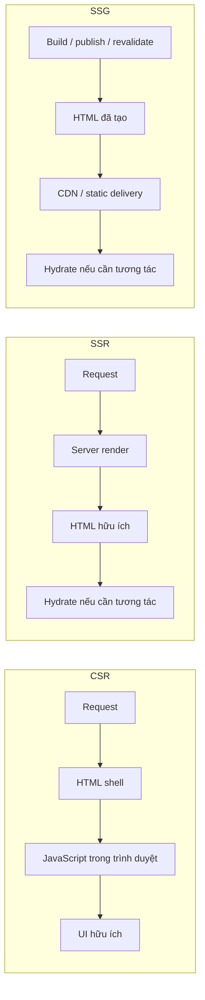
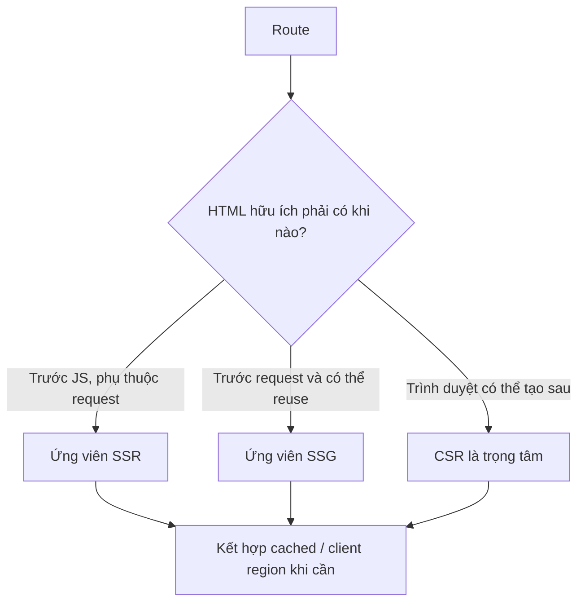
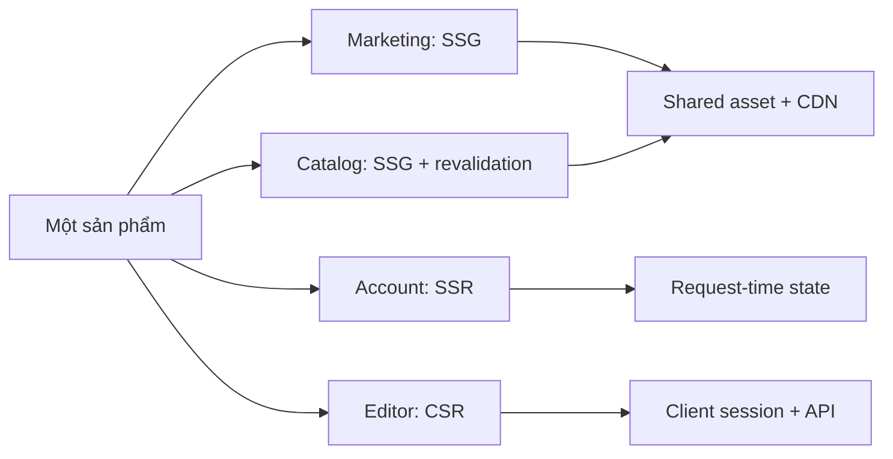

# CSR, SSR và SSG: Nơi nào và khi nào UI biến thành HTML

## Tóm tắt

Một website thương mại điện tử ra mắt dưới dạng Single-Page App với cơ chế render máy khách thuần túy (CSR). Vào ngày siêu sale Black Friday, bot thu thập dữ liệu của Google chỉ quét được vỏ bọc `

` trống rỗng, khiến thứ hạng tìm kiếm rớt thảm hại 80%, trong khi khách hàng dùng mạng 3G phải nhìn màn hình trắng suốt 6,2 giây chờ tải và phân tích gói JS 2MB. Đội ngũ kỹ thuật hoảng loạn chuyển toàn bộ web sang SSR động, khiến cụm máy chủ Node.js bốc cháy và quá tải vì không thể gánh nổi lượng render HTML khổng lồ tại thời điểm request.

> 💡 **Quy tắc bỏ túi:** **Chọn vị trí render dựa trên độ tươi của dữ liệu và khả năng lưu cache, không theo trào lưu framework.** Dùng SSG cho nội dung thay đổi theo đợt phát hành hoặc webhook (lưu cache vô hạn tại CDN edge); dùng SSR cho dữ liệu cá nhân hóa hoặc biến động liên tục cần SEO và First Contentful Paint nhanh; dùng CSR cho trang quản trị nội bộ sau đăng nhập nơi tương tác máy khách chiếm ưu thế.

- **Câu hỏi nền tảng:** HTML hữu ích của một route được tạo ra ở đâu và khi nào? Trong trình duyệt sau khi JavaScript chạy (CSR), trên server tại thời điểm request (SSR), hay trước đó ở build/revalidation time (SSG/ISR).
- **SEO & First Contentful Paint (FCP):** SSG và SSR cung cấp markup ngữ nghĩa ngay trong gói phản hồi đầu tiên; CSR chỉ trả về container rỗng và trì hoãn hiển thị cho đến khi tải xong JS.
- **Yêu cầu Hydration:** Cả SSR và SSG vẫn phải tải bundle JavaScript nếu HTML đã render cần gắn các event listener tương tác—tạo ra giai đoạn hydration nơi giao diện trông có vẻ sẵn sàng nhưng bấm chưa ăn.
- **Chi phí hạ tầng và tính toán:** SSG mở rộng quy mô vô hạn trên CDN edge với chi phí gần như bằng không; SSR tiêu tốn CPU máy chủ trên mỗi request; CSR đẩy toàn bộ chi phí tính toán sang thiết bị người dùng.
- **Cạm bẫy chết người:** Coi chiến lược render như một lựa chọn nhị phân áp dụng cho toàn bộ dự án thay vì quyết định linh hoạt trên từng route—ép các trang bán hàng công khai chạy CSR (giết chết SEO/FCP) hoặc ép trang dashboard nội bộ chạy SSR (làm quá tải server mà không có lợi ích cache).

<TermBox term="Rendering placement">
**Rendering placement** là vị trí thực thi và thời điểm tạo ra HTML hữu ích: trong trình duyệt sau khi JavaScript chạy, trên server cho từng request, hoặc trước request cụ thể ở build/publish/revalidation time.
</TermBox>

## Client-side rendering: HTML lớn lên trong trình duyệt

Với **CSR**, server có thể trả về document shell chung cùng JavaScript. Trình duyệt tải và chạy application code, thường fetch dữ liệu, rồi tạo hoặc cập nhật UI hữu ích.

CSR hợp lý khi route là một workspace tương tác lâu dài và initial document có thể mang tính generic. Nhưng "client-rendered" không có nghĩa là "không cần server": API, authentication, authorization, durable state và trust boundary vẫn nằm ở phía khác.

Trải nghiệm ban đầu phụ thuộc nhiều hơn vào thời gian tải/chạy JavaScript và client data loading. API nhanh không bù được một bundle rất lớn chưa kịp thực thi.

## Server-side rendering: HTML là request-time work

Với **SSR**, request đi tới server và server tạo HTML hữu ích cho request đó. Render có thể dùng request-time state như user đã đăng nhập, locale, cookie hoặc dữ liệu phải mới tại thời điểm request.

Điều này đặt rendering lên latency-sensitive request path. Upstream chậm, thiếu render capacity, cache miss hoặc server failure đều có thể trì hoãn response trực tiếp.

Vì vậy SSR không đơn giản là "SSG nhưng fresh hơn". Thuộc tính định nghĩa của SSR là page generation diễn ra trong quá trình xử lý request, trừ khi một rendered response trước đó được reuse từ cache.

## Static site generation: HTML tồn tại trước request

Với **SSG**, HTML hữu ích được tạo trước một request người dùng cụ thể—thường ở build, publish hoặc regeneration time—rồi được reuse cho các request sau.

Điều này giúp nội dung dùng chung rất dễ cache và có thể loại full page generation khỏi request path thông thường. Đánh đổi là độ mới: output đã tạo chỉ hợp lệ khi sản phẩm còn chấp nhận tuổi của nó hoặc khi publishing/revalidation refresh đủ nhanh.

Static **không** đồng nghĩa immutable. Revalidation hoặc regeneration có thể thay output đã tạo mà vẫn giữ thuộc tính cốt lõi: delivery thông thường reuse artifact thay vì render toàn bộ route cho mọi request.

<TermBox term="Freshness window">
**Freshness window** là khoảng thời gian một rendered representation được phép cũ trước khi trở nên sai, gây hiểu lầm hoặc không còn chấp nhận được với sản phẩm. Nó quyết định mức độ an toàn khi reuse generated output.
</TermBox>

## Rendering strategy không đồng nhất với data strategy

Một route có thể bắt đầu bằng SSG HTML rồi fetch live stock badge trong trình duyệt. Một SSR route có thể reuse public fragment từ cache. Một CSR workspace có thể tải dữ liệu từ server API ngay sau startup.

Điểm quan trọng là **thời điểm page generation**, không phải route có bao giờ fetch dữ liệu ở client hay server hay không.

## Hydration giải thích vì sao HTML chưa phải toàn bộ câu chuyện

React HTML được render ở server hoặc static có thể đã hiển thị trước khi application runtime sẵn sàng. Để biến HTML có sẵn đó thành UI tương tác, React có thể **hydrate**: client code gắn component logic vào DOM đã được tạo trước.

<TermBox term="Hydration">
**Hydration** gắn hành vi phía client vào HTML đã tồn tại từ server rendering hoặc static generation. Vì vậy HTML có thể nhìn thấy trước khi toàn bộ hành vi tương tác sẵn sàng.
</TermBox>

`hydrateRoot` của React kỳ vọng initial client output khớp với server-rendered HTML. Bài kế tiếp sẽ đi sâu vào hydration và mismatch; ở đây mental model quan trọng là SSR/SSG có thể đưa HTML xuất hiện sớm hơn mà không loại bỏ client JavaScript ở các vùng cần tương tác.

## Chọn theo constraint của route, không theo danh tính của app

Hãy suy luận từng route hoặc surface bằng sáu câu hỏi:

- **Initial usefulness:** nội dung nào phải có trước khi application JavaScript chạy?
- **Cá nhân hóa:** initial HTML có phụ thuộc user hoặc request hiện tại không?
- **Độ mới:** representation được phép cũ bao lâu?
- **Cacheability:** nhiều user có thể reuse cùng response hoặc artifact an toàn không?
- **Interactivity:** đây chủ yếu là surface để đọc hay workspace tương tác lâu dài?
- **Operational path:** team muốn rendering failure xảy ra ở build/revalidation time, request time, browser time hay phối hợp có chủ đích?

Một sản phẩm không cần chỉ một rendering acronym. Design boundary hữu ích thường là route và data lifecycle phía sau route đó.

## SEO là requirement signal, không phải định nghĩa rendering

SSR không đồng nghĩa với SEO, và CSR cũng không đồng nghĩa "không index được". Search visibility phụ thuộc crawler có thể truy cập và hiểu gì, trong khi rendering strategy còn tác động latency, cacheability, freshness và client work.

Với public content cần HTML hữu ích mà không phải chờ application JavaScript, **cả SSR lẫn pre-rendered HTML có thể reuse như SSG đều có thể thỏa requirement đó**. Private authenticated route thường không trở thành search target hữu ích chỉ vì chuyển sang SSR.

## Kịch bản production

Một team e-commerce dùng SSR cho mọi route vì "SSR tốt hơn cho SEO". Marketing page, catalog, account đã đăng nhập và inventory editor giàu tương tác đều render trên mỗi request. Phần lớn catalog chỉ thay đổi vài lần mỗi giờ.

**Hậu quả:** request-time rendering và data access tiêu tốn capacity cho những page có thể reuse; campaign traffic làm TTFB và origin load tăng; các private interactive route phải trả chi phí SSR nhưng gần như không nhận lợi ích search tương ứng.

**Nguyên nhân cốt lõi:** team coi rendering strategy là danh tính chung của cả application và dùng SEO thay cho việc phân tích freshness, personalization, cacheability và interactivity của từng route.

**Cách khắc phục chuẩn:** phân loại từng route. Pre-render surface dùng chung và ổn định rồi refresh bằng publishing/revalidation; chỉ dùng SSR khi HTML hữu ích thật sự phụ thuộc request-time state; ưu tiên CSR khi generic shell cùng long-lived client session đã đủ. Đo hydration/client cost tách khỏi HTML delivery.

## Tự kiểm tra

Một product page public giống nhau với mọi visitor, thay đổi mỗi 30 phút và cần HTML hữu ích trước khi application JavaScript chạy. Requirement đó có tự động bắt buộc SSR không?

Xem giải thích chi tiết

Không. Page này dùng chung và có freshness window hữu hạn, nên SSG với publishing hoặc revalidation có thể thỏa requirement mà không phải render mỗi request. SSR mạnh hơn khi useful HTML cần request-time state không thể share an toàn.

## Checklist rendering model

- [ ] Nêu rõ HTML hữu ích được tạo ở đâu và khi nào.
- [ ] Tách rendering timing khỏi data fetching diễn ra sau đó.
- [ ] Xác định freshness và personalization requirement của route.
- [ ] Xác định response hoặc artifact HTML nào có thể reuse an toàn.
- [ ] Tính cả client JavaScript và hydration trước khi gọi route là interactive.
- [ ] Chọn theo route hoặc surface; không ép một acronym lên toàn sản phẩm.
- [ ] Xem SEO là một requirement bên cạnh latency, freshness, caching và interactivity.

## Agent rule

Trước khi đề xuất CSR, SSR hoặc SSG, hãy tìm initial-HTML requirement, request-time state, freshness window, cacheability, client interactivity và operational failure path của route. Ưu tiên rendering path có thể reuse đơn giản nhất mà vẫn thỏa constraint, rồi kết hợp strategy khi data lifecycle khác nhau.

## Nguồn

Nguồn chính kiểm tra ngày **2026-09-15**: [React `createRoot`](https://react.dev/reference/react-dom/client/createRoot), [React `hydrateRoot`](https://react.dev/reference/react-dom/client/hydrateRoot), [Next.js pre-rendering](https://nextjs.org/learn/pages-router/data-fetching-pre-rendering), và [Next.js static and dynamic rendering](https://nextjs.org/learn/dashboard-app/static-and-dynamic-rendering).
