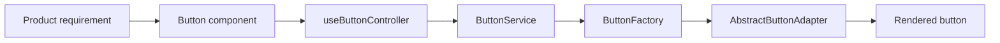
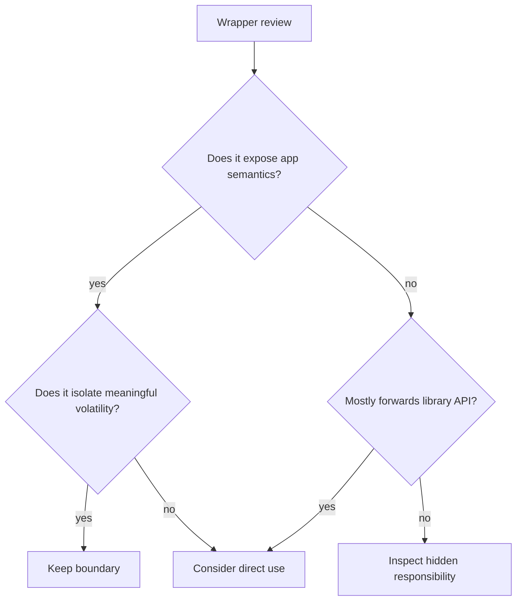
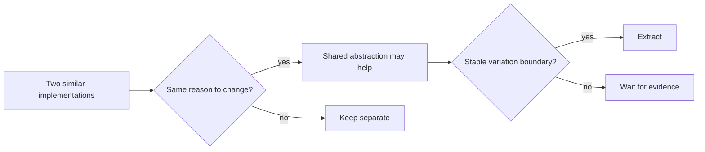

# De-Overengineering the Frontend: Remove Accidental Architecture

## TL;DR

Legacy frontends are not always hard because they lack architecture. Many are hard because architecture accumulated faster than the product changed: wrappers around wrappers, generic hooks with dozens of options, controller/service/repository layers copied from backend patterns, provider trees nobody can explain, internal frameworks around third-party frameworks, and abstractions that require five files to change one label.

The goal is not "delete abstractions." It is to **remove accidental architecture while preserving boundaries that protect real variation, ownership, or risk**.

> 💡 **Rule of thumb:** An abstraction earns its place when it makes an important kind of change more local, safer, or easier to reason about. If it consistently makes simple changes cross more files without isolating real volatility, it is a candidate for collapse.

- Measure abstractions by change locality, not by sophistication.
- Prefer application semantics over framework-shaped wrapper APIs.
- Delete indirection only after identifying what responsibility it currently carries.
- Tolerate small duplication when the alternative is a false shared abstraction.
- **Fatal pitfall:** "simplifying" by flattening boundaries that were actually protecting authorization, data ownership, or independent release risk.

<TermBox term="Accidental complexity">
**Accidental complexity** is complexity introduced by implementation structure rather than by the problem domain itself.

**Why it matters:** modernization should reduce accidental complexity without pretending essential business complexity can be deleted.
</TermBox>

<TermBox term="Change locality">
**Change locality** describes how much of the codebase must be understood and modified to make one coherent product change.

**Why it matters:** a good boundary often reduces the number of unrelated modules touched by a change.
</TermBox>

## The five-file button test

Consider a simple requirement: add a disabled reason tooltip to one button.



If the change genuinely needs those layers, each should protect a distinct concern. More often, several layers only forward parameters.

A useful review question is:

> If this abstraction disappeared, what important kind of change would become harder, riskier, or duplicated?

If nobody can answer, the abstraction may be preserving history rather than capability.

## Wrapper tax compounds

A wrapper is reasonable when it gives the application a stable semantic boundary.

Good examples:

- `formatOrderDate()` hides the date library;
- `loadCurrentUser()` hides authentication/provider details;
- `trackCheckoutStarted()` hides analytics vendor shape.

Weak wrappers merely rename a third-party API:

```ts
export function useAppQuery(options) {
  return useQuery(options);
}
```

If every consumer still knows the underlying library's options, cache keys, error model, and lifecycle, the wrapper has not created an application boundary. It has added another file to navigate.



## Generic APIs can hide product logic

A hook like this may look reusable:

```ts
useEntityManager({
  entityType,
  fetchMode,
  cacheMode,
  optimistic,
  permissions,
  validation,
  tracking,
  errorMode,
  persistence,
  ...
});
```

But a large option surface often means one abstraction is representing several distinct workflows.

Signals of over-generalization:

- many boolean flags create combinatorial behavior;
- only one caller uses most options;
- callers must understand internal sequencing;
- a new feature adds another mode instead of a new focused boundary;
- tests are mostly option-matrix tests rather than product-behavior tests.

Split by product semantics when the workflows no longer share a stable reason to change together.

## Duplication is not automatically debt

Two similar components can be safer than one highly configurable abstraction if their product behavior is diverging.



Do not extract just because two files look similar today. Shared code creates coupling: future changes to one use case can force negotiation with the other.

## Provider trees deserve ownership

Legacy React roots often accumulate providers:

```text
<AuthProvider>
  <ThemeProvider>
    <FeatureFlagProvider>
      <AnalyticsProvider>
        <LegacyStateProvider>
          <QueryProvider>
            <App />
```

The problem is not provider count alone. Ask:

- which provider owns durable application state?
- which merely injects a client object?
- which is route-specific but mounted globally?
- which providers recreate values unnecessarily?
- which are compatibility layers scheduled for deletion?

Move narrow providers closer to the feature boundary when their scope is not application-wide.

## "Clean architecture" can become dirty change locality

Layer names do not guarantee useful architecture.

A frontend flow like:

```text
component
  -> controller
  -> use case
  -> repository interface
  -> repository implementation
  -> API service
  -> HTTP wrapper
```

can be justified for a genuinely complex domain with multiple adapters. But copying backend layering mechanically into every UI request often makes behavior harder to trace.

The durable principles are coupling, cohesion, ownership, and substitutability—not the number of folders named `domain`, `application`, or `infrastructure`.

## Simplify with evidence, not taste

A safe simplification sequence:

1. choose one frequently changed workflow;
2. trace runtime behavior end-to-end;
3. list the layers touched by common changes;
4. identify pass-through layers;
5. preserve tests around observable behavior;
6. collapse one layer;
7. verify bundle, behavior, and ownership;
8. delete dead interfaces/types after consumers disappear.

Do not perform an application-wide "architecture cleanup" before proving the pattern on one vertical slice.

## Production micro-scenario: the universal form engine

A team builds a generic form engine to support every product form. Over four years it grows condition expressions, async validation modes, permission callbacks, analytics hooks, persistence adapters, nested field plugins, and schema transforms. A small checkout requirement requires changes to the engine core and regression testing unrelated admin forms.

- **Impact:** low-risk feature work acquires application-wide blast radius and release anxiety.
- **Root cause:** independent workflows were forced behind one abstraction after superficial structural similarity was mistaken for shared product semantics.
- **Correct pattern:** preserve shared primitives where behavior is truly common, split workflow-specific orchestration behind explicit feature boundaries, and let duplicated composition exist when it improves change locality.

## Check your mental model

> **Scenario:** Two feature teams each have a 40-line table component with 70% similar code. Should you immediately create one configurable `UniversalTable`?

<details>
<summary>Show the reasoning</summary>

Not yet.

Similarity is evidence worth watching, not sufficient proof of a shared abstraction. First ask whether both tables change for the same reasons, whether their accessibility and interaction contracts are genuinely shared, and whether the variation is stable. Premature extraction can turn independent product evolution into coupled option growth.

</details>

## De-overengineering checklist

- [ ] **Trace:** Follow one user workflow through every wrapper, hook, service, provider, and adapter.
- [ ] **Responsibility:** Write one sentence describing what each layer protects.
- [ ] **Pass-through:** Flag layers that mostly rename or forward another API.
- [ ] **Change locality:** Count unrelated modules touched by routine feature changes.
- [ ] **Options:** Review generic APIs with many booleans/modes for hidden workflow divergence.
- [ ] **Providers:** Move feature-scoped providers closer to their consumers where practical.
- [ ] **Duplication:** Allow small duplication when no stable shared reason-to-change exists.
- [ ] **Boundaries:** Preserve seams protecting security, ownership, external volatility, or independent migration.
- [ ] **Vertical slice:** Simplify one workflow before standardizing the pattern.
- [ ] **Deletion:** Remove dead interfaces, adapters, types, and tests after the dependency graph proves they are unreachable.

## Sources

- [React — Choosing the State Structure](https://react.dev/learn/choosing-the-state-structure)
- [React — Sharing State Between Components](https://react.dev/learn/sharing-state-between-components)
- [Martin Fowler — Refactoring](https://martinfowler.com/books/refactoring.html)
- [Martin Fowler — Strangler Fig](https://martinfowler.com/bliki/StranglerFigApplication.html)
