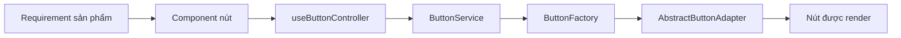
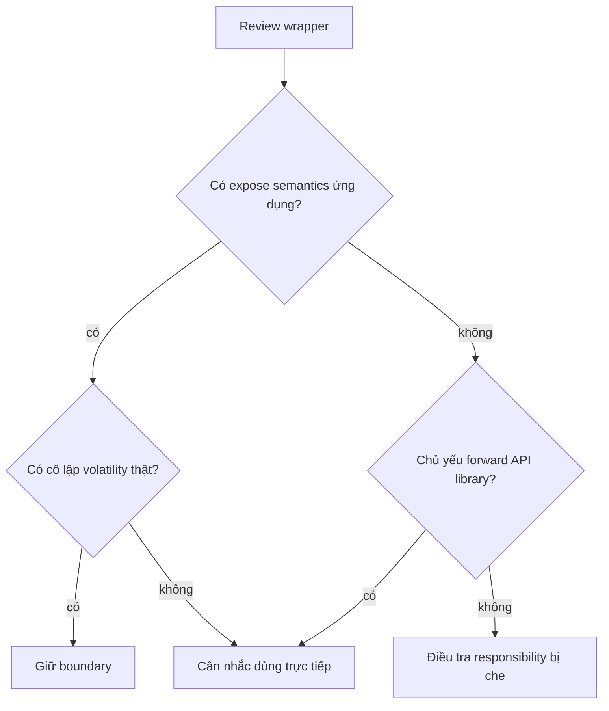
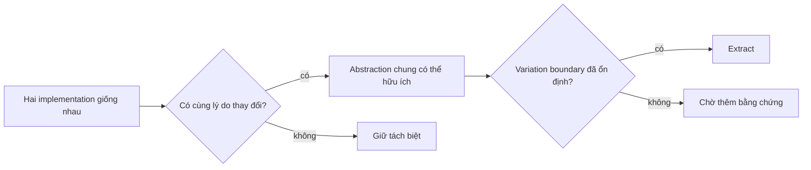

# Giảm Over-Engineering Frontend: Loại bỏ Kiến trúc Vô tình

## Tóm tắt

Frontend cũ không phải lúc nào cũng khó vì thiếu kiến trúc. Nhiều hệ thống khó vì kiến trúc tích tụ nhanh hơn sản phẩm thay đổi: wrapper bọc wrapper, hook tổng quát có hàng chục option, controller/service/repository bê nguyên từ backend, cây provider không ai giải thích được, framework nội bộ bọc framework bên ngoài và abstraction khiến đổi một nhãn phải sửa năm file.

Mục tiêu không phải "xóa abstraction". Mục tiêu là **loại bỏ kiến trúc vô tình nhưng giữ lại boundary đang bảo vệ variation, ownership hoặc rủi ro thật**.

> 💡 **Quy tắc thực hành:** Abstraction xứng đáng tồn tại khi nó làm một loại thay đổi quan trọng trở nên cục bộ hơn, an toàn hơn hoặc dễ suy luận hơn. Nếu nó thường xuyên khiến thay đổi đơn giản phải đi qua nhiều file hơn mà không cô lập volatility thật, hãy xem xét thu gọn nó.

- Đánh giá abstraction bằng tính cục bộ của thay đổi, không phải mức độ tinh vi.
- Ưu tiên semantics của ứng dụng thay vì wrapper mang nguyên hình API của framework.
- Chỉ xóa indirection sau khi hiểu responsibility hiện tại.
- Chấp nhận duplication nhỏ khi alternative là abstraction chia sẻ giả.
- **Sai lầm chí mạng:** "đơn giản hóa" bằng cách làm phẳng boundary vốn đang bảo vệ authorization, ownership dữ liệu hoặc rủi ro release độc lập.

<TermBox term="Độ phức tạp vô tình">
**Độ phức tạp vô tình** là phần complexity do cấu trúc implementation tạo ra chứ không xuất phát từ domain problem thật.

**Tại sao quan trọng:** modernization nên giảm accidental complexity nhưng không giả vờ essential business complexity có thể bị xóa.
</TermBox>

<TermBox term="Tính cục bộ của thay đổi">
**Tính cục bộ của thay đổi** mô tả lượng codebase phải hiểu và sửa để thực hiện một thay đổi sản phẩm có tính thống nhất.

**Tại sao quan trọng:** boundary tốt thường giảm số module không liên quan bị chạm vào.
</TermBox>

## Bài kiểm tra nút bấm năm file

Giả sử requirement nhỏ: thêm tooltip giải thích vì sao một nút bị disable.



Nếu thay đổi thật sự cần từng layer, mỗi layer phải bảo vệ một concern khác nhau. Thường thì vài layer chỉ forward parameter.

Một câu hỏi review hữu ích:

> Nếu abstraction này biến mất, loại thay đổi quan trọng nào sẽ khó hơn, rủi ro hơn hoặc bị duplicate?

Nếu không ai trả lời được, abstraction có thể đang bảo tồn lịch sử hơn là capability.

## Chi phí wrapper cộng dồn

Wrapper hợp lý khi tạo boundary semantics ổn định cho ứng dụng.

Ví dụ tốt:

- `formatOrderDate()` che thư viện ngày tháng;
- `loadCurrentUser()` che chi tiết provider xác thực;
- `trackCheckoutStarted()` che shape của analytics vendor.

Wrapper yếu chỉ đổi tên API bên ngoài:

```ts
export function useAppQuery(options) {
  return useQuery(options);
}
```

Nếu mọi consumer vẫn phải biết option, cache key, error model và lifecycle của library bên dưới thì wrapper chưa tạo application boundary. Nó chỉ thêm một file để điều hướng.



## API tổng quát có thể che product logic

Một hook như sau trông rất reusable:

```ts
useEntityManager({
  entityType,
  fetchMode,
  cacheMode,
  optimistic,
  permissions,
  validation,
  tracking,
  errorMode,
  persistence,
  ...
});
```

Nhưng bề mặt option lớn thường cho thấy một abstraction đang đại diện nhiều workflow khác nhau.

Tín hiệu over-generalization:

- nhiều boolean tạo tổ hợp hành vi lớn;
- chỉ một caller dùng phần lớn option;
- caller phải hiểu sequencing bên trong;
- feature mới luôn thêm mode thay vì boundary tập trung;
- test chủ yếu kiểm ma trận option thay vì hành vi sản phẩm.

Hãy tách theo semantics sản phẩm khi workflow không còn cùng một lý do ổn định để thay đổi.

## Duplication không tự động là debt

Hai component giống nhau đôi khi an toàn hơn một abstraction cực nhiều cấu hình nếu hành vi sản phẩm đang tách hướng.



Đừng extract chỉ vì hai file hôm nay giống nhau. Shared code tạo coupling: thay đổi tương lai của một use case có thể bắt use case kia phải cùng thương lượng.

## Cây provider cần ownership

React root cũ thường tích tụ provider:

```text
<AuthProvider>
  <ThemeProvider>
    <FeatureFlagProvider>
      <AnalyticsProvider>
        <LegacyStateProvider>
          <QueryProvider>
            <App />
```

Vấn đề không phải số provider tự thân. Hãy hỏi:

- provider nào sở hữu state bền vững toàn ứng dụng?
- provider nào chỉ inject client object?
- provider nào chỉ thuộc một route nhưng đang mount global?
- provider nào recreate value không cần thiết?
- provider nào là compatibility layer cần xóa?

Đưa provider hẹp gần feature boundary hơn khi scope không thật sự toàn app.

## "Clean architecture" có thể làm change locality bẩn đi

Tên layer không bảo đảm kiến trúc hữu ích.

Một flow frontend như:

```text
component
  -> controller
  -> use case
  -> repository interface
  -> repository implementation
  -> API service
  -> HTTP wrapper
```

có thể hợp lý với domain phức tạp và nhiều adapter thật. Nhưng copy layering backend một cách máy móc cho mọi request UI thường làm behavior khó trace hơn.

Nguyên tắc bền vững là coupling, cohesion, ownership và substitutability, không phải số folder tên `domain`, `application` hay `infrastructure`.

## Đơn giản hóa bằng bằng chứng, không bằng gu

Một sequence an toàn:

1. chọn một workflow thay đổi thường xuyên;
2. trace runtime behavior từ đầu tới cuối;
3. liệt kê layer bị chạm bởi thay đổi phổ biến;
4. nhận diện pass-through layer;
5. giữ test quanh observable behavior;
6. collapse một layer;
7. verify bundle, behavior và ownership;
8. xóa interface/type chết sau khi consumer biến mất.

Đừng mở chiến dịch "dọn kiến trúc toàn app" trước khi chứng minh pattern trên một vertical slice.

## Tình huống production: form engine dùng cho mọi thứ

Một team xây form engine tổng quát để hỗ trợ mọi form sản phẩm. Sau bốn năm nó có condition expression, nhiều mode async validation, permission callback, analytics hook, persistence adapter, nested field plugin và schema transform. Một requirement nhỏ ở checkout buộc sửa engine core và regression-test cả admin form không liên quan.

- **Hậu quả:** feature ít rủi ro có blast radius toàn ứng dụng và tạo tâm lý sợ release.
- **Nguyên nhân cốt lõi:** các workflow độc lập bị ép sau một abstraction vì similarity cấu trúc bề ngoài bị hiểu nhầm thành shared product semantics.
- **Cách khắc phục chuẩn:** giữ primitive chung nơi behavior thật sự giống nhau, tách orchestration riêng theo feature boundary và chấp nhận duplicated composition khi nó cải thiện change locality.

## Kiểm tra mental model

> **Tình huống:** Hai feature team đều có table component 40 dòng, giống nhau khoảng 70%. Có nên lập tức tạo một `UniversalTable` nhiều cấu hình?

<details>
<summary>Xem giải thích chi tiết</summary>

Chưa.

Similarity là tín hiệu đáng theo dõi nhưng chưa đủ chứng minh abstraction chung. Trước hết hãy hỏi hai table có thay đổi vì cùng lý do không, accessibility và interaction contract có thật sự giống nhau không, và variation đã ổn định chưa. Extract quá sớm có thể biến sự phát triển độc lập thành tăng trưởng option bị coupling.

</details>

## Checklist giảm over-engineering

- [ ] **Trace:** Theo một user workflow qua mọi wrapper, hook, service, provider và adapter.
- [ ] **Responsibility:** Viết một câu mô tả layer đang bảo vệ điều gì.
- [ ] **Pass-through:** Đánh dấu layer chủ yếu đổi tên hoặc forward API khác.
- [ ] **Change locality:** Đếm module không liên quan bị chạm bởi feature change thường ngày.
- [ ] **Option:** Review generic API có nhiều boolean/mode để tìm workflow divergence.
- [ ] **Provider:** Đưa provider theo feature gần consumer hơn khi thực tế cho phép.
- [ ] **Duplication:** Chấp nhận duplication nhỏ khi chưa có reason-to-change chung ổn định.
- [ ] **Boundary:** Giữ seam bảo vệ security, ownership, external volatility hoặc migration độc lập.
- [ ] **Vertical slice:** Đơn giản hóa một workflow trước khi chuẩn hóa pattern.
- [ ] **Xóa bỏ:** Xóa interface, adapter, type và test chết sau khi dependency graph chứng minh không còn reachable.

## Nguồn tham khảo

- [React — Choosing the State Structure](https://react.dev/learn/choosing-the-state-structure)
- [React — Sharing State Between Components](https://react.dev/learn/sharing-state-between-components)
- [Martin Fowler — Refactoring](https://martinfowler.com/books/refactoring.html)
- [Martin Fowler — Strangler Fig](https://martinfowler.com/bliki/StranglerFigApplication.html)
