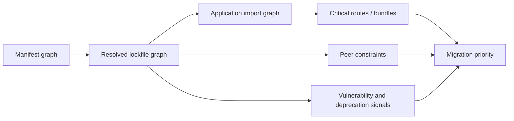
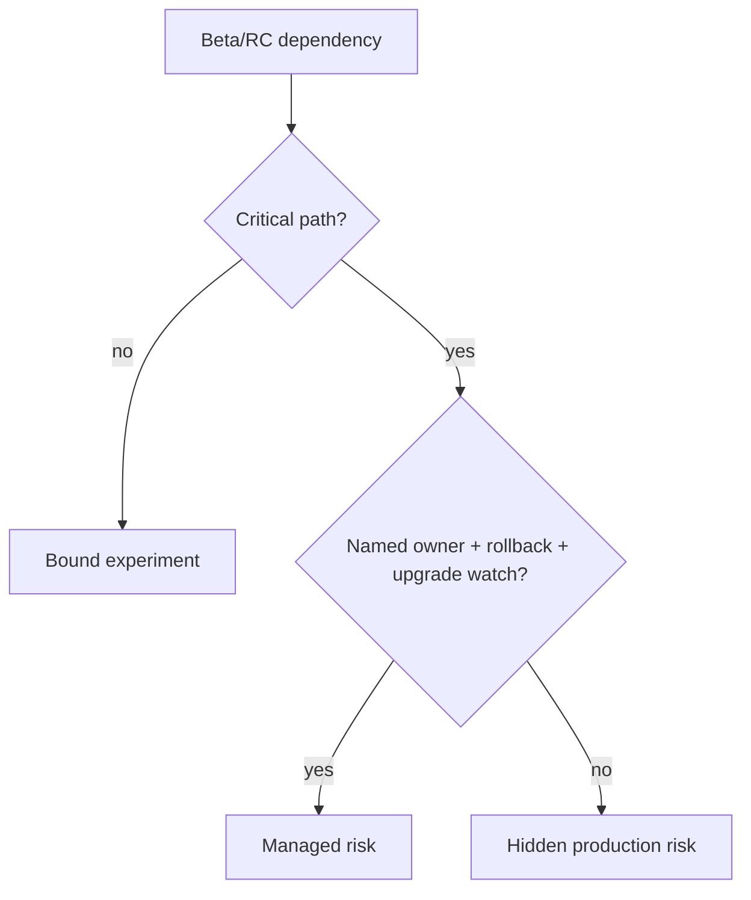
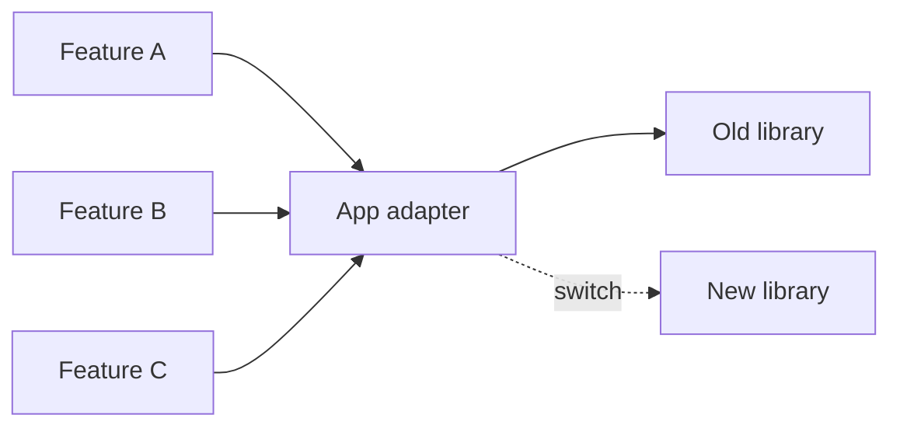

# Dependency Archaeology: Dead Libraries, Prereleases, and Upgrade Chains

## TL;DR

A legacy dependency graph is historical evidence. Packages tell you which problems previous teams solved, which abstractions became infrastructure, and which compatibility constraints now control the upgrade path.

Do not ask only "is this package old?" Ask: **what behavior does it own, who imports it, what does it constrain, what reaches the browser, and how cheaply can we replace it?**

> 💡 **Rule of thumb:** **A dependency is risky because of reachability and consequence, not because its version number looks old.**

- Distinguish direct, transitive, peer, optional, and build-only dependencies.
- Treat deprecated, archived, prerelease, forked, or unmaintained packages as investigation signals.
- Trace packages into critical routes and browser bundles before prioritizing them.
- Upgrade dependency chains in compatibility-aware slices.
- **Fatal pitfall:** mass-updating the lockfile and then debugging hundreds of unrelated failures as one migration.

<TermBox term="Dependency reachability">
**Dependency reachability** describes which runtime, build, route, feature, or browser bundle can actually reach a package through the resolved import/dependency graph.
</TermBox>

<TermBox term="Peer dependency">
A **peer dependency** declares that a package expects its consumer to provide a compatible version of another package, commonly React or a framework binding.

**Why it matters:** a package can install yet still be outside the compatibility range its author supports.
</TermBox>

## Read three graphs, not one list



`package.json` tells you declared intent. The lockfile tells you what was resolved. The import/bundle graph tells you what the application actually executes.

A transitive package with a vulnerability can matter even though you never import it directly. Conversely, a stale direct dependency may be harmless if it is no longer reachable and can simply be removed.

## Build a dependency ledger

For each direct dependency, record:

| Field | Example question |
| --- | --- |
| Capability | Why is this package here? |
| Owner | Which feature/team depends on it? |
| Runtime surface | Browser, server, build, tests, CLI? |
| Stability | Stable, beta, RC, fork, patch? |
| Maintenance | Active, deprecated, archived, dormant? |
| Compatibility | Which React/router/runtime versions constrain it? |
| Reachability | Which critical user journeys execute it? |
| Exit path | Keep, upgrade, wrap, replace, delete? |

npm's deprecation documentation is intentionally nuanced: deprecation warns consumers and can mean a package is no longer maintained or recommended; it does not necessarily mean the currently installed code immediately stops working.

## Prerelease dependencies deserve explicit ownership

A prerelease is not automatically bad. It is a contract that you are accepting more change risk.



For a beta package on a critical path, require at least:

- why stable alternatives are insufficient;
- which version is pinned;
- who watches upstream releases;
- what behavior is covered by tests;
- what rollback or replacement path exists.

Do not let "we tried the beta two years ago" silently turn into permanent infrastructure.

## Detect dead packages without pretending activity equals health

Useful evidence includes:

- explicit npm deprecation;
- repository archived status;
- unresolved compatibility issues;
- releases and maintenance activity;
- security advisories;
- whether the package supports your target runtime;
- whether the surrounding ecosystem has moved to a replacement.

No single metric proves "dead." A mature stable library may release rarely because it is done. A frequently published package may still be risky. Judge the capability and maintenance contract, not GitHub-star aesthetics.

## Peer conflicts reveal migration order

Suppose:

```text
React target
  ├── router binding supports target
  ├── UI library supports target
  ├── old form package requires older React peer range
  └── test adapter requires removed React internals
```

The form package and test adapter are blockers. Upgrading React first and suppressing peer warnings does not remove the unsupported assumptions.

Treat peer constraints as edges in an upgrade graph.

## Replace through seams

Avoid changing every call site while also replacing a library.



A useful adapter exposes application semantics, not the old library's entire API.

Bad:

```ts
export const oldMoment = moment;
```

Better:

```ts
export function formatOrderDate(value: Date): string {
  return format(value, 'yyyy-MM-dd');
}
```

The seam lets you migrate call sites and implementation separately, then delete the seam if it no longer adds value.

## Browser dependency cost is more than package size

A package can hurt through:

- transferred bytes;
- parse/compile/execute work;
- duplicate versions;
- side effects that prevent tree shaking;
- polyfills;
- initialization on every route.

Connect dependency cleanup to the client import graph, not registry package size alone.

## Security signals belong in the same ledger

GitHub dependency review can surface dependency changes in pull requests, while Dependabot alerts identify known vulnerable dependencies in the repository's dependency graph.

These are useful signals, but they do not decide architecture for you. A replacement still needs compatibility, behavior, and rollout evidence.

## Production micro-scenario: the harmless date picker

A team upgrades React successfully in a test branch but production build fails after enabling the new dependency set. The blocker is an old date-picker wrapper used only on one internal route. Its peer range rejects the target React version, while three layers of app code import the wrapper as if it were a platform API.

- **Impact:** a low-usage feature controls the upgrade schedule for the entire application.
- **Root cause:** the dependency's reachability and compatibility constraint were never mapped; its wrapper leaked library-specific types across the codebase.
- **Correct pattern:** isolate the feature behind an application-level date-input contract, replace or upgrade the package locally, then remove the peer blocker before the React cutover.

## Check your mental model

> **Scenario:** Package A has not released in three years but has no known security issue, a tiny stable API, and works on the target runtime. Package B releases weekly but is a beta editor on the application's publishing path. Which deserves more immediate investigation?

<details>
<summary>Show the reasoning</summary>

Package B.

Release frequency is not the risk model. Prerelease stability plus business-critical reachability creates a stronger uncertainty boundary. Package A may still need ownership and health review, but inactivity alone does not prove it is unsafe.

</details>

## Dependency archaeology checklist

- [ ] **Manifest:** Classify every direct dependency by capability and runtime surface.
- [ ] **Resolved graph:** Inspect duplicate/transitive versions and peer constraints.
- [ ] **Reachability:** Connect dependencies to routes, features, and browser bundles.
- [ ] **Deprecation:** Record explicit registry or upstream deprecation signals.
- [ ] **Prerelease:** Name an owner and exit plan for beta/RC packages.
- [ ] **Security:** Review advisories and dependency-change evidence.
- [ ] **Compatibility:** Build target-runtime constraints before upgrading.
- [ ] **Seams:** Wrap replacement candidates behind application semantics where useful.
- [ ] **Deletion:** Remove truly unused packages instead of upgrading them.
- [ ] **Slices:** Upgrade small compatible groups rather than the whole graph at once.

## Sources

- [npm — Deprecating packages](https://docs.npmjs.com/deprecating-and-undeprecating-packages-or-package-versions/)
- [npm — Using deprecated packages](https://docs.npmjs.com/using-deprecated-packages/)
- [GitHub Docs — Dependency review](https://docs.github.com/en/code-security/concepts/supply-chain-security/dependency-review)
- [GitHub Docs — Dependabot alerts](https://docs.github.com/en/code-security/concepts/supply-chain-security/dependabot-alerts)
- [React 19 Upgrade Guide](https://react.dev/blog/2024/04/25/react-19-upgrade-guide)
