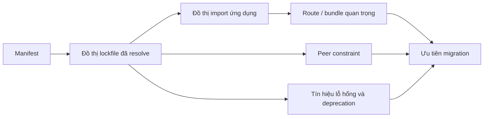
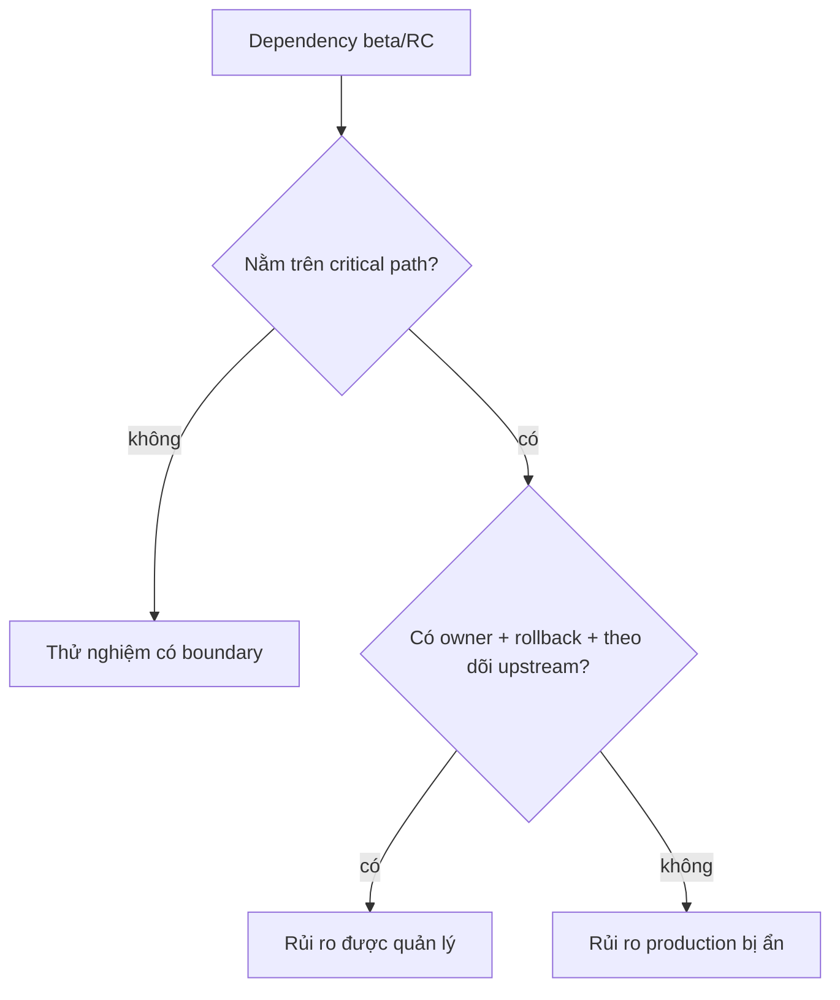
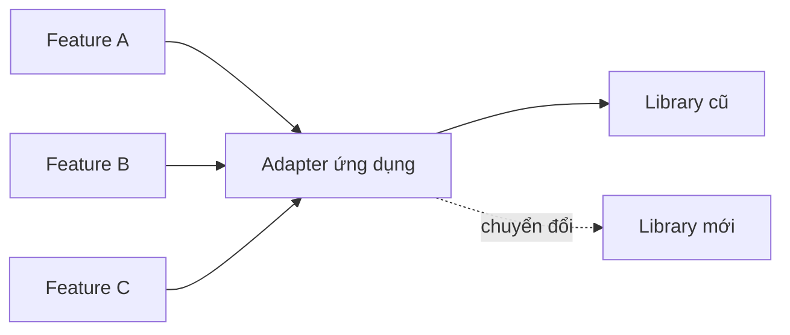

# Khảo cổ Dependency: Thư viện Chết, Prerelease và Chuỗi Nâng cấp

## Tóm tắt

Dependency graph cũ là bằng chứng lịch sử. Package cho biết các team trước đã giải bài toán gì, abstraction nào trở thành hạ tầng và compatibility constraint nào đang điều khiển đường nâng cấp.

Đừng chỉ hỏi "package này có cũ không?". Hãy hỏi: **nó sở hữu hành vi gì, ai import nó, nó khóa phiên bản nào, phần nào tới browser và thay nó tốn bao nhiêu?**

> 💡 **Quy tắc thực hành:** **Dependency rủi ro vì phạm vi ảnh hưởng và hậu quả, không phải vì số phiên bản trông cũ.**

- Phân biệt dependency trực tiếp, bắc cầu, peer, optional và chỉ dùng lúc build.
- Xem deprecated, archived, prerelease, fork hoặc không còn bảo trì như tín hiệu cần điều tra.
- Trace package tới route quan trọng và browser bundle trước khi ưu tiên.
- Nâng dependency chain theo các lát compatibility nhỏ.
- **Sai lầm chí mạng:** mass-update lockfile rồi debug hàng trăm failure không liên quan như một migration duy nhất.

<TermBox term="Phạm vi dependency">
**Phạm vi dependency** mô tả runtime, build, route, feature hoặc browser bundle nào thật sự có thể chạm tới package qua đồ thị dependency/import đã resolve.
</TermBox>

<TermBox term="Peer dependency">
**Peer dependency** khai báo rằng package mong consumer cung cấp một phiên bản tương thích của dependency khác, thường là React hoặc framework binding.

**Tại sao quan trọng:** package có thể cài được nhưng vẫn nằm ngoài compatibility range mà author hỗ trợ.
</TermBox>

## Đọc ba đồ thị, không phải một danh sách



`package.json` cho biết ý định khai báo. Lockfile cho biết thứ thực sự được resolve. Import/bundle graph cho biết thứ ứng dụng thật sự chạy.

Package bắc cầu có lỗ hổng vẫn quan trọng dù bạn không import trực tiếp. Ngược lại, dependency trực tiếp cũ có thể vô hại nếu không còn reachable và chỉ cần xóa.

## Tạo sổ dependency

Với mỗi dependency trực tiếp, ghi:

| Trường | Câu hỏi mẫu |
| --- | --- |
| Khả năng | Package này tồn tại để làm gì? |
| Owner | Feature hoặc team nào phụ thuộc? |
| Bề mặt chạy | Browser, server, build, test hay CLI? |
| Độ ổn định | Stable, beta, RC, fork hay patch? |
| Bảo trì | Active, deprecated, archived hay dormant? |
| Compatibility | React/router/runtime version nào khóa nó? |
| Phạm vi | Hành trình quan trọng nào chạy nó? |
| Đường thoát | Giữ, nâng, bọc, thay hay xóa? |

Tài liệu npm cố ý phân biệt rõ deprecation: warning có thể nghĩa package không còn được bảo trì hoặc khuyến nghị; nó không đồng nghĩa code đang cài lập tức ngừng chạy.

## Prerelease cần owner rõ ràng

Prerelease không tự động xấu. Nó là contract chấp nhận nhiều change risk hơn.



Với beta package trên critical path, cần ít nhất:

- vì sao stable alternative không đủ;
- pin phiên bản nào;
- ai theo dõi release upstream;
- behavior nào có test;
- rollback hoặc replacement path là gì.

Đừng để "hai năm trước thử beta" âm thầm biến thành hạ tầng vĩnh viễn.

## Phát hiện package chết mà không nhầm activity với health

Bằng chứng hữu ích:

- npm deprecation rõ ràng;
- repository archived;
- compatibility issue chưa giải quyết;
- release và hoạt động bảo trì;
- security advisory;
- hỗ trợ target runtime hay không;
- ecosystem đã chuyển sang replacement nào.

Không metric nào tự chứng minh "chết". Library mature có thể ít release vì đã ổn định. Package publish liên tục vẫn có thể rủi ro. Hãy đánh giá capability và maintenance contract, không dựa vào thẩm mỹ GitHub.

## Peer conflict làm lộ thứ tự migration

Giả sử:

```text
Target React
  ├── router binding hỗ trợ
  ├── UI library hỗ trợ
  ├── form package cũ cần peer range React cũ
  └── test adapter cần internal React đã bị bỏ
```

Form package và test adapter là blocker. Nâng React trước rồi suppress peer warning không xóa giả định không được hỗ trợ.

Hãy xem peer constraint như cạnh trong upgrade graph.

## Thay library qua seam

Tránh vừa thay library vừa sửa mọi call site.



Adapter tốt expose semantics của ứng dụng, không expose toàn bộ API của library cũ.

Không tốt:

```ts
export const oldMoment = moment;
```

Tốt hơn:

```ts
export function formatOrderDate(value: Date): string {
  return format(value, 'yyyy-MM-dd');
}
```

Seam cho phép migrate call site và implementation độc lập, rồi xóa seam nếu sau migration nó không còn giá trị.

## Chi phí dependency ở browser không chỉ là package size

Package có thể gây chi phí qua:

- byte tải xuống;
- parse, compile và execute;
- nhiều version trùng;
- side effect cản tree shaking;
- polyfill;
- khởi tạo trên mọi route.

Hãy nối dependency cleanup với client import graph, không chỉ nhìn kích thước package trên registry.

## Tín hiệu bảo mật thuộc cùng một sổ

GitHub dependency review có thể làm lộ dependency change trong pull request, còn Dependabot alert nhận diện dependency có lỗ hổng đã biết trong dependency graph.

Đây là tín hiệu hữu ích nhưng không tự quyết kiến trúc. Replacement vẫn cần bằng chứng compatibility, behavior và rollout.

## Tình huống production: date picker "vô hại"

Một team nâng React thành công ở test branch nhưng production build fail khi bật dependency set mới. Blocker là wrapper date picker cũ chỉ dùng trong một route nội bộ. Peer range của nó từ chối target React, trong khi ba lớp code ứng dụng import wrapper như platform API.

- **Hậu quả:** feature ít dùng điều khiển lịch nâng cấp của toàn ứng dụng.
- **Nguyên nhân cốt lõi:** phạm vi và compatibility constraint của dependency chưa từng được map; wrapper làm rò type riêng của library khắp codebase.
- **Cách khắc phục chuẩn:** cô lập feature sau contract date-input của ứng dụng, thay hoặc nâng package cục bộ, rồi gỡ peer blocker trước cutover React.

## Kiểm tra mental model

> **Tình huống:** Package A ba năm không release nhưng không có security issue, API nhỏ ổn định và chạy trên target runtime. Package B release hàng tuần nhưng là editor beta trên đường xuất bản chính. Package nào cần điều tra ngay hơn?

<details>
<summary>Xem giải thích chi tiết</summary>

Package B.

Tần suất release không phải risk model. Prerelease stability cộng với business-critical reachability tạo uncertainty boundary mạnh hơn. Package A vẫn cần ownership và health review, nhưng inactivity một mình không chứng minh nó không an toàn.

</details>

## Checklist khảo cổ dependency

- [ ] **Manifest:** Phân loại mọi direct dependency theo capability và runtime surface.
- [ ] **Đồ thị resolve:** Inspect version trùng, dependency bắc cầu và peer constraint.
- [ ] **Phạm vi:** Nối dependency với route, feature và browser bundle.
- [ ] **Deprecation:** Ghi explicit signal từ registry hoặc upstream.
- [ ] **Prerelease:** Gán owner và exit plan cho beta/RC package.
- [ ] **Bảo mật:** Review advisory và bằng chứng dependency change.
- [ ] **Compatibility:** Tạo constraint graph cho target runtime.
- [ ] **Seam:** Bọc candidate cần thay sau semantics của ứng dụng khi hữu ích.
- [ ] **Xóa:** Xóa package thật sự không dùng thay vì nâng nó.
- [ ] **Lát nhỏ:** Nâng các nhóm tương thích nhỏ thay vì cả graph cùng lúc.

## Nguồn tham khảo

- [npm — Deprecating packages](https://docs.npmjs.com/deprecating-and-undeprecating-packages-or-package-versions/)
- [npm — Using deprecated packages](https://docs.npmjs.com/using-deprecated-packages/)
- [GitHub Docs — Dependency review](https://docs.github.com/en/code-security/concepts/supply-chain-security/dependency-review)
- [GitHub Docs — Dependabot alerts](https://docs.github.com/en/code-security/concepts/supply-chain-security/dependabot-alerts)
- [React 19 Upgrade Guide](https://react.dev/blog/2024/04/25/react-19-upgrade-guide)
