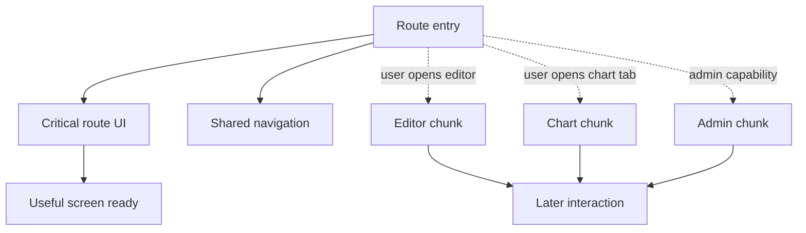
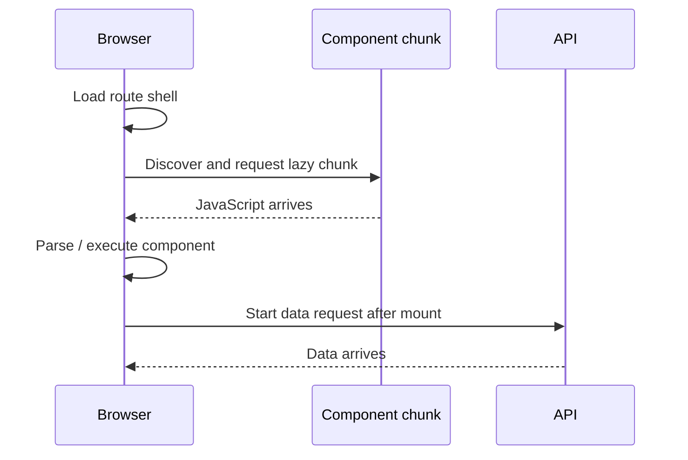

# Frontend Bundle Performance: Ship Less JavaScript, Load It Later

## TL;DR

Frontend bundle performance is not a contest to produce the smallest single file. It is the discipline of controlling **which JavaScript enters the browser, when it is requested, and how much work the browser must perform before the user can interact**.

A useful mental model is:

1. trace the **client dependency graph**;
2. keep code out of that graph when it does not need to run in the browser;
3. split optional capabilities at meaningful route or interaction boundaries;
4. let static analysis remove genuinely unused code;
5. measure transfer size **and** parse/compile/execute cost;
6. verify that splitting did not create a new request waterfall;
7. protect the result with budgets and regression checks.

<TermBox term="Client dependency graph">
The **client dependency graph** is the transitive set of modules that a browser-facing entry point can reach through imports. A tiny component can still pull a large library into the browser if its import chain crosses into that library.
</TermBox>


## Bundle size is not one number

The browser pays several different costs for JavaScript.

A production report may show a gzip or Brotli **transfer size**, which matters for network time. But compressed bytes are not the amount of source the JavaScript engine must process. After download, the browser decompresses the resource, parses it, compiles it, and executes the code that runs.

That means two bundles with the same compressed size can have different runtime cost, and a fast network does not eliminate CPU work on a slower device.

When investigating bundle performance, distinguish at least:

- compressed transfer bytes over the network;
- decompressed resource size;
- parse and compile work;
- execution and initialization work;
- work triggered later by user interaction.

The goal is not merely "fewer KB." The goal is **less unnecessary work on the critical path**.

## Imports create performance reachability

Static imports are part of the module graph the bundler can analyze ahead of time:

```ts
import { RichTextEditor } from './rich-text-editor';
```

If a browser entry point can reach that import, the editor and its reachable dependencies may become part of browser-delivered output even if only a small percentage of users open the editor.

A dynamic import creates an asynchronous edge:

```ts
const module = await import('./rich-text-editor');
```

For React components, `React.lazy()` or framework-specific lazy-loading primitives can attach that asynchronous module boundary to UI rendering:

```tsx
import { lazy, Suspense } from 'react';

const RichTextEditor = lazy(() => import('./rich-text-editor'));

export function EditPanel({ editing }: { editing: boolean }) {
  if (!editing) return null;

  return (
    <Suspense fallback={<p>Loading editor…</p>}>
      <RichTextEditor />
    </Suspense>
  );
}
```

Dynamic import is not automatically an optimization. It is useful when it moves code **off an earlier critical path** without introducing a worse wait later.

<TermBox term="Code splitting">
**Code splitting** divides build output into chunks that can be requested at different times. A good split follows a real timing boundary such as a route, optional workflow, or expensive capability—not an arbitrary file boundary.
</TermBox>

## Split by user timing, not by file count

Good candidates for deferred code often include:

- an admin-only panel absent for most users;
- a rich editor opened after an explicit action;
- a charting package below the fold or behind a tab;
- a large modal used only in one workflow;
- route-specific functionality that other routes never need.

Code required for the first useful screen is different. Deferring critical rendering code can replace a larger initial request with an obvious loading delay.



A practical split asks two questions:

- **Probability:** how likely is the user to need this code soon?
- **Urgency:** if they do need it, how costly is waiting for the chunk at that moment?

High-probability, immediately needed code usually belongs earlier. Low-probability, expensive optional code is a stronger lazy-loading candidate.

## Avoid turning code splitting into a waterfall

Too little splitting can create a giant bundle. Too much splitting can create many tiny chunks, extra request overhead, repeated loading states, and sequential discovery.

A particularly bad pattern is:

1. load a shell;
2. shell discovers a lazy component;
3. component code loads;
4. component mounts;
5. only then does it start a data request.

Now code and data are serialized even though they could have been prepared in parallel.



The Frontend Data Fetching lesson covered the same dependency-scheduling principle for remote data: **start independent work as early as its inputs allow**. A lazy boundary should not accidentally force an independent data request to wait for component code.

Use framework route loading, prefetching, preloading, or explicit orchestration when evidence shows the later interaction benefits from preparing code or data earlier.

## Server/Client boundaries decide what can enter the browser graph

In a React Server Components architecture, `'use client'` is not just an interactivity marker. It creates a client module-graph boundary: the client component and modules it imports may need to be available to the browser.

That makes this pattern expensive when browser execution is unnecessary:

```tsx
'use client';

import { hugeMarkdownParser } from './markdown-runtime';

export function ArticleBody({ source }: { source: string }) {
  return <div>{hugeMarkdownParser(source)}</div>;
}
```

If markdown transformation can run on the server, moving that work outside the client graph can be stronger than trying to shave bytes from the client library.

The Server and Client Components lesson therefore precedes this lesson for a reason: **the cheapest client bundle dependency is often the dependency that never becomes client code**.

Component Boundaries matter too. A cohesive optional capability such as `ChartExplorer` gives you a meaningful place to introduce a lazy boundary. Randomly splitting helper files does not.

## Tree shaking removes provably unused code, not wishful thinking

Modern bundlers can eliminate unused exports when they can reason statically about module structure. This is commonly called **tree shaking**.

<TermBox term="Tree shaking">
**Tree shaking** is build-time dead-code elimination over the module graph. It works best when imports and exports are statically analyzable and when modules correctly declare or avoid import-time side effects.
</TermBox>

Tree shaking has limits:

- importing a module can itself perform a side effect;
- CommonJS or highly dynamic module patterns can reduce static analyzability;
- a broad barrel import may make reachability harder to understand even if the bundler can optimize it;
- package metadata such as `sideEffects` must be correct;
- code that is genuinely used cannot be tree-shaken away merely because it is expensive.

Do not set `sideEffects: false` blindly. CSS imports, polyfills, global registrations, and other import-time behavior may be semantically required.

A good workflow is to inspect the **production** output instead of assuming a source import style guarantees a small bundle.

## Dependencies are architectural decisions

Adding a package changes more than `package.json`.

For browser-facing code, ask:

- does the package enter the client graph at all;
- how much of it is reachable from the actual import;
- does it duplicate functionality already shipped elsewhere;
- does it bring nested dependencies or large locale/data tables;
- can the work happen on the server instead;
- is a smaller focused package or native platform API sufficient;
- is the capability optional enough to load later.

A 5-line wrapper around a charting, editor, mapping, syntax-highlighting, or date-processing library may represent hundreds of kilobytes of reachable code. Source line count is not dependency cost.

## Third-party scripts have their own critical path

Analytics, support widgets, experimentation SDKs, ads, payment helpers, and monitoring agents can consume network, parse, execution, and main-thread time even when they live outside your application bundle.

Treat third-party JavaScript as part of the same performance budget:

- load it only where the product actually needs it;
- choose an appropriate loading strategy rather than blocking the earliest render by default;
- audit duplicate SDKs and tag-manager additions;
- measure execution cost, not only transfer bytes;
- define an owner who can remove a script when its value no longer justifies its cost.

"It comes from a vendor" does not make browser work free.

## Chunking and caching are connected

A single giant hashed bundle can invalidate a large amount of cached code after a small release. Splitting stable and route-specific code can improve cache reuse when the build system produces stable content-addressed chunks.

But manual chunking is not automatically better. Overly fragmented output can increase request coordination, duplicate shared modules, or make the loading graph harder to predict.

Prefer framework/bundler defaults first. Change chunk strategy when measurements show a specific caching or loading problem.

When reviewing cache behavior, ask:

- which chunks change when one feature changes;
- which chunks are shared across routes;
- whether users repeatedly download code they never execute;
- whether a supposedly stable vendor chunk actually churns every build;
- whether a lazy chunk is requested soon enough for its interaction.

## Measure the import chain before optimizing

Do not start by guessing which package is "probably heavy." Use production build evidence.

Bundle analyzers and build stats can answer:

- which modules are in a client chunk;
- how large they are in parsed or transfer terms;
- which route or entry includes them;
- the import chain that made them reachable;
- whether the same dependency appears in multiple places.

For modern Next.js, bundle-analysis tooling can inspect client/server module graphs and trace import chains. Browser Network and Performance tooling then shows what real navigation transferred and when JavaScript executed.

A useful optimization loop is:

1. reproduce the slow route or oversized chunk;
2. capture a production bundle report;
3. identify the largest relevant module or unexpected dependency;
4. trace the import path back to an ownership boundary;
5. remove, move server-side, or defer the dependency;
6. rebuild and compare the same evidence;
7. verify user-visible timing, not only bundle bytes.

## Protect improvements with budgets

Performance regressions are easy to reintroduce one dependency at a time.

A **bundle budget** is a machine-checkable threshold or review contract for a meaningful artifact: for example, initial JavaScript for a critical route, a specific optional chunk, or total third-party cost.

Useful budgets are scoped. One global "all JS must be under X KB" number can hide which user journey actually regressed.

Pair budgets with investigation rather than automatic cargo-cult deletion. If a route intentionally grows because it gained a valuable capability, the team can revise the budget with evidence. What matters is making the trade-off visible.

## Production scenario

A commerce dashboard initially renders account summary and recent orders. Over several releases, its top-level Client Component begins statically importing a charting package, a rich-text editor for internal notes, an admin-only bulk-action panel, an analytics helper, and a date library. Most users never open the chart tab, cannot access the admin panel, and never edit notes—but all of those imports are reachable from the initial client graph.

**Impact:** the route ships a much larger initial JavaScript payload, slower devices spend more time parsing and executing code before interaction, cache churn increases after unrelated feature changes, and a later attempt to lazy-load everything creates visible spinners plus a code-then-data waterfall.

**Root cause:** the team treated component proximity as loading priority. Optional capabilities and browser-unnecessary work crossed into one eager client dependency graph, and nobody traced the import chains or owned a bundle budget.

**Correct pattern:** measure the production client graph; move non-interactive transformation work to the server; keep the critical summary eager; place chart, editor, and admin capabilities behind cohesive lazy boundaries; begin independent data work without waiting for lazy component mount; audit third-party code separately; then compare transfer and execution evidence and add a scoped regression budget for the critical route.

## Bundle review

- [ ] **Graph:** Which entry point makes each large module reachable from the browser?
- [ ] **Boundary:** Does this work actually need to run in a Client Component?
- [ ] **Timing:** Is each dependency needed for the first useful screen or only later interaction?
- [ ] **Transfer:** What are the compressed and decompressed sizes?
- [ ] **CPU:** What parse, compile, initialization, and execution work occurs on representative devices?
- [ ] **Splitting:** Does the lazy boundary follow a route or product capability rather than an arbitrary file?
- [ ] **Waterfall:** Can code and data for a later capability be prepared in parallel?
- [ ] **Tree shaking:** Are module format and side-effect declarations allowing unused code to disappear safely?
- [ ] **Third party:** Which external scripts compete for network and main-thread time?
- [ ] **Cache:** Which chunks churn after unrelated releases?
- [ ] **Evidence:** Did the bundle analyzer reveal the actual import chain?
- [ ] **Budget:** Is there a scoped guardrail for the critical user journey?

## Self-check

A route has a 220 KB compressed initial client payload. A 90 KB charting dependency is used only after the user opens an analytics tab. The tab's data request does not depend on the chart code. Should the team simply replace the chart import with a lazy import and stop there?

<details>
<summary>Show the reasoning</summary>

No. Deferring the chart is a strong candidate because the capability is optional, but the team should verify the whole timing graph. The chart chunk and analytics data can often start independently; waiting for the lazy component to mount before requesting data would create a waterfall. First trace why the chart is in the initial graph, introduce a cohesive lazy boundary, schedule independent data appropriately, and then compare both bundle output and user-visible interaction latency. If the tab is opened frequently, preloading may also be justified by evidence.

</details>

## Frontend bundle performance checklist

- [ ] Keep browser-unnecessary work out of the client dependency graph.
- [ ] Treat compressed transfer size and browser execution cost as different measurements.
- [ ] Split optional code at route, capability, or interaction boundaries.
- [ ] Avoid both giant eager bundles and gratuitous tiny-chunk fragmentation.
- [ ] Do not serialize independent code and data work into a waterfall.
- [ ] Let tree shaking remove only code the bundler can prove is unused.
- [ ] Audit package imports, nested dependencies, and third-party scripts.
- [ ] Prefer framework/bundler chunk defaults until measurements justify manual tuning.
- [ ] Trace import chains with production bundle analysis before changing architecture.
- [ ] Add scoped budgets so regressions become visible during review.

## Agent rule

- [ ] Trace the client import path before proposing a bundle optimization.
- [ ] Ask whether the dependency can stay server-side before optimizing its client delivery.
- [ ] Defer only code that is genuinely non-critical, and model the later loading experience.
- [ ] Check for code/data waterfalls whenever adding a lazy boundary.
- [ ] Verify production output after tree-shaking or package-import changes.
- [ ] Compare before/after evidence and preserve a regression guardrail when the route is performance-sensitive.

## Sources

Primary references verified on **2026-09-16**:

- [React — `lazy`](https://react.dev/reference/react/lazy)
- [React — Build a React app from Scratch: Code-splitting](https://react.dev/learn/build-a-react-app-from-scratch#code-splitting)
- [Next.js — Lazy Loading](https://nextjs.org/docs/app/guides/lazy-loading)
- [Next.js — Package Bundling](https://nextjs.org/docs/app/guides/package-bundling)
- [webpack — Tree Shaking](https://webpack.js.org/guides/tree-shaking/)
- [web.dev — Reduce JavaScript payloads with tree shaking](https://web.dev/articles/reduce-javascript-payloads-with-tree-shaking)
