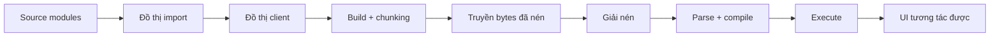
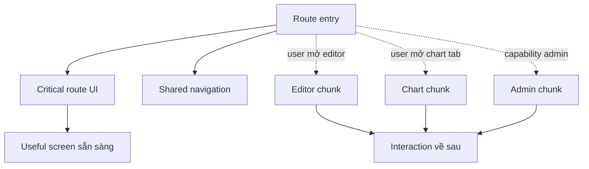
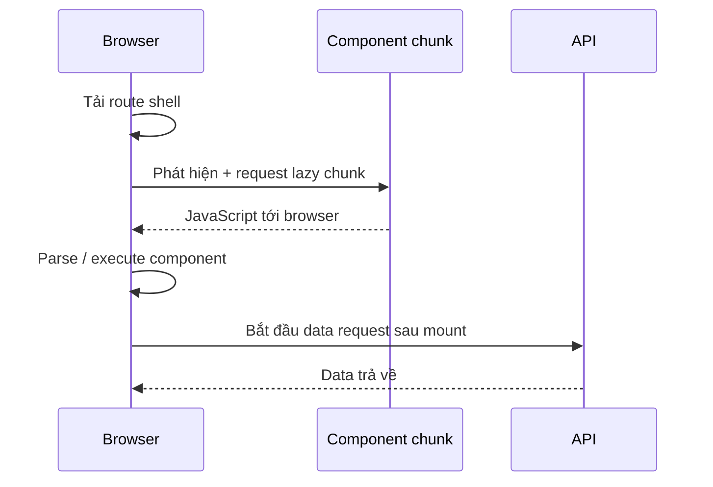

# Hiệu năng Bundle Frontend: Gửi ít JavaScript hơn, tải muộn hơn

## TL;DR

Hiệu năng bundle frontend không phải cuộc thi tạo ra một file nhỏ nhất có thể. Đây là việc kiểm soát **JavaScript nào đi vào browser, khi nào nó được request, và browser phải làm bao nhiêu công việc trước khi người dùng có thể tương tác**.

Một mental model hữu ích:

1. lần theo **đồ thị phụ thuộc client (client dependency graph)**;
2. giữ code ở ngoài đồ thị đó nếu code không cần chạy trong browser;
3. tách capability tùy chọn tại boundary route hoặc interaction có ý nghĩa;
4. để static analysis loại bỏ code thật sự không được dùng;
5. đo cả transfer size **và** chi phí parse/compile/execute;
6. xác minh code splitting không tạo request waterfall mới;
7. bảo vệ kết quả bằng budget và guardrail chống regression.

<TermBox term="Đồ thị phụ thuộc client">
**Đồ thị phụ thuộc client** là tập module bắc cầu mà một entry point phía browser có thể chạm tới qua các import. Một component rất nhỏ vẫn có thể kéo một library lớn vào browser nếu import chain của nó đi tới library đó.
</TermBox>



## Bundle size không phải chỉ có một con số

Browser trả nhiều loại chi phí khác nhau cho JavaScript.

Một production report có thể hiển thị **transfer size** sau gzip hoặc Brotli, quan trọng đối với thời gian network. Nhưng số byte đã nén không phải lượng source mà JavaScript engine phải xử lý. Sau khi tải, browser giải nén resource, phân tích cú pháp (parse), biên dịch (compile) và thực thi (execute) phần code cần chạy.

Vì vậy hai bundle có cùng compressed size vẫn có thể có runtime cost khác nhau, và network nhanh không xóa được CPU cost trên thiết bị chậm hơn.

Khi điều tra bundle performance, ít nhất hãy phân biệt:

- compressed transfer bytes qua network;
- kích thước resource sau giải nén;
- parse và compile work;
- initialization và execution work;
- công việc chỉ phát sinh sau interaction của người dùng.

Mục tiêu không đơn giản là "ít KB hơn". Mục tiêu là **ít công việc không cần thiết hơn trên critical path**.

## Import tạo ra phạm vi code có thể chạm tới

Static import là một phần của module graph mà bundler có thể phân tích trước build:

```ts
import { RichTextEditor } from './rich-text-editor';
```

Nếu một browser entry point có thể chạm tới import đó, editor và các dependency bắc cầu của nó có thể đi vào output gửi cho browser ngay cả khi chỉ một tỷ lệ nhỏ người dùng mở editor.

Dynamic import tạo một cạnh bất đồng bộ:

```ts
const module = await import('./rich-text-editor');
```

Với React component, `React.lazy()` hoặc primitive lazy-loading của framework có thể gắn async module boundary vào quá trình render UI:

```tsx
import { lazy, Suspense } from 'react';

const RichTextEditor = lazy(() => import('./rich-text-editor'));

export function EditPanel({ editing }: { editing: boolean }) {
  if (!editing) return null;

  return (
    <Suspense fallback={<p>Đang tải editor…</p>}>
      <RichTextEditor />
    </Suspense>
  );
}
```

Dynamic import không tự động là optimization. Nó hữu ích khi đưa code **ra khỏi critical path sớm hơn** mà không tạo thời gian chờ tệ hơn ở bước sau.

<TermBox term="Code splitting">
**Code splitting** chia build output thành các chunk có thể được request ở những thời điểm khác nhau. Một split tốt bám theo timing boundary thật như route, workflow tùy chọn hoặc capability nặng—không phải boundary file tùy ý.
</TermBox>

## Chia theo thời điểm người dùng cần, không theo số file

Các ứng viên tốt cho deferred code thường gồm:

- admin-only panel mà phần lớn người dùng không có quyền dùng;
- rich editor chỉ mở sau một action rõ ràng;
- charting package nằm dưới fold hoặc sau một tab;
- modal lớn chỉ dùng trong một workflow;
- chức năng đặc thù route mà route khác không cần.

Code cần cho first useful screen là chuyện khác. Trì hoãn critical rendering code có thể chỉ đổi một initial request lớn thành loading delay rất dễ thấy.



Một quyết định split thực tế nên hỏi hai câu:

- **Probability:** người dùng có khả năng cần code này sớm đến mức nào?
- **Urgency:** nếu họ cần, chờ chunk tại thời điểm đó gây tốn kém đến đâu?

Code có xác suất cao và cần ngay thường nên đến sớm. Code tùy chọn, nặng và xác suất thấp là ứng viên lazy loading mạnh hơn.

## Đừng biến code splitting thành waterfall

Split quá ít có thể tạo giant bundle. Split quá nhiều có thể tạo quá nhiều tiny chunks, tăng coordination giữa request, lặp loading state và khiến dependency được phát hiện tuần tự.

Một pattern đặc biệt tệ:

1. tải shell;
2. shell mới phát hiện lazy component;
3. component code được tải;
4. component mount;
5. đến lúc đó mới bắt đầu data request.

Lúc này code và data bị serialize dù có thể chuẩn bị song song.



Bài Frontend Data Fetching đã dùng cùng nguyên tắc dependency scheduling cho remote data: **bắt đầu công việc độc lập sớm nhất khi input của nó cho phép**. Một lazy boundary không nên vô tình bắt data request độc lập phải chờ component code.

Dùng route loading, prefetching, preloading hoặc orchestration tường minh của framework khi evidence cho thấy interaction về sau đáng được chuẩn bị code hoặc data sớm hơn.

## Server/Client boundary quyết định code nào có thể đi vào browser graph

Trong kiến trúc React Server Components, `'use client'` không chỉ là marker cho interactivity. Nó tạo client module-graph boundary: Client Component và các module mà nó import có thể phải sẵn sàng cho browser.

Pattern sau trở nên đắt khi việc chạy trong browser là không cần thiết:

```tsx
'use client';

import { hugeMarkdownParser } from './markdown-runtime';

export function ArticleBody({ source }: { source: string }) {
  return <div>{hugeMarkdownParser(source)}</div>;
}
```

Nếu markdown transformation có thể chạy trên server, chuyển công việc đó ra ngoài client graph thường mạnh hơn việc cố cắt vài byte khỏi client library.

Đó là lý do bài Server and Client Components đứng trước bài này: **client dependency rẻ nhất thường là dependency không bao giờ trở thành client code**.

Component Boundaries cũng quan trọng. Một capability gắn kết và tùy chọn như `ChartExplorer` cho ta vị trí có ý nghĩa để đặt lazy boundary. Chia ngẫu nhiên các helper file thì không.

## Tree shaking chỉ loại code có thể chứng minh là không dùng

Bundler hiện đại có thể loại unused export khi chúng suy luận tĩnh được module structure. Cơ chế này thường gọi là **tree shaking**.

<TermBox term="Tree shaking">
**Tree shaking** là dead-code elimination tại build time trên module graph. Nó hoạt động tốt nhất khi import/export có thể phân tích tĩnh và module khai báo hoặc tránh đúng các import-time side effect.
</TermBox>

Tree shaking có giới hạn:

- chỉ import một module cũng có thể gây side effect;
- CommonJS hoặc module pattern quá dynamic có thể làm static analysis yếu đi;
- broad barrel import có thể khiến reachability khó hiểu dù bundler vẫn có khả năng optimize;
- metadata package như `sideEffects` phải chính xác;
- code thật sự được dùng không thể biến mất chỉ vì nó nặng.

Không được đặt `sideEffects: false` một cách mù quáng. CSS import, polyfill, global registration và các import-time behavior khác có thể cần thiết về mặt semantics.

Workflow tốt là inspect **production** output thay vì giả định một kiểu source import chắc chắn tạo bundle nhỏ.

## Dependency là quyết định kiến trúc

Thêm package thay đổi nhiều hơn `package.json`.

Với browser-facing code, hãy hỏi:

- package có đi vào client graph hay không;
- phần nào của package thật sự reachable từ import hiện tại;
- có duplicate functionality đã ship ở nơi khác không;
- nó có kéo nested dependency hoặc bảng locale/data lớn không;
- công việc có thể chạy ở server thay vì client không;
- package nhỏ hơn hoặc native platform API có đủ không;
- capability có đủ tùy chọn để load muộn hơn không.

Một wrapper 5 dòng quanh charting, editor, mapping, syntax-highlighting hoặc date-processing library có thể đại diện cho hàng trăm kilobyte code reachable. Số dòng source không phải dependency cost.

## Third-party script có critical path riêng

Analytics, support widget, experimentation SDK, ads, payment helper và monitoring agent có thể chiếm network, parse, execution và main-thread time ngay cả khi nằm ngoài application bundle.

Hãy xem JavaScript bên thứ ba như một phần của cùng performance budget:

- chỉ load ở nơi product thật sự cần;
- chọn loading strategy phù hợp thay vì mặc định block render sớm nhất;
- audit SDK trùng và tag-manager addition;
- đo execution cost, không chỉ transfer bytes;
- gán owner có quyền xóa script khi giá trị của nó không còn xứng đáng với chi phí.

"Code của vendor" không làm browser work trở nên miễn phí.

## Chunking và caching liên quan trực tiếp

Một giant hashed bundle có thể làm invalid một lượng code đã cache rất lớn chỉ sau một thay đổi nhỏ. Tách stable code khỏi route-specific code có thể cải thiện cache reuse khi build system sinh content-addressed chunk ổn định.

Nhưng manual chunking không tự động tốt hơn. Output quá phân mảnh có thể tăng request coordination, duplicate shared module hoặc làm loading graph khó dự đoán.

Ưu tiên default của framework/bundler trước. Chỉ đổi chunk strategy khi measurement cho thấy một vấn đề caching hoặc loading cụ thể.

Khi review cache behavior, hãy hỏi:

- chunk nào đổi khi chỉ một feature đổi;
- chunk nào shared giữa nhiều route;
- người dùng có phải tải lặp lại code họ không bao giờ execute không;
- một vendor chunk được cho là ổn định có churn mỗi build không;
- lazy chunk có được request đủ sớm cho interaction của nó không.

## Đo import chain trước khi tối ưu

Đừng bắt đầu bằng việc đoán package nào "chắc là nặng". Dùng production build evidence.

Bundle analyzer và build stats có thể trả lời:

- module nào nằm trong client chunk;
- kích thước của chúng theo parsed hoặc transfer terms;
- route hoặc entry nào kéo chúng vào;
- import chain nào khiến chúng reachable;
- cùng dependency có xuất hiện ở nhiều nơi không.

Với Next.js hiện đại, bundle-analysis tooling có thể inspect client/server module graph và trace import chain. Browser Network và Performance tooling sau đó cho thấy navigation thật đã truyền gì và JavaScript chạy khi nào.

Một optimization loop hữu ích:

1. reproduce route chậm hoặc chunk quá lớn;
2. capture production bundle report;
3. xác định module lớn nhất có liên quan hoặc dependency bất ngờ;
4. trace import path ngược về ownership boundary;
5. remove, chuyển server-side hoặc defer dependency;
6. rebuild và so sánh cùng loại evidence;
7. verify user-visible timing, không chỉ bundle bytes.

## Bảo vệ cải tiến bằng budget

Performance regression rất dễ quay lại từng dependency một.

**Bundle budget** là threshold có thể machine-check hoặc review contract cho một artifact có ý nghĩa: ví dụ initial JavaScript của critical route, một optional chunk cụ thể hoặc tổng third-party cost.

Budget hữu ích phải có scope. Một con số toàn cục kiểu "mọi JS phải dưới X KB" có thể che mất user journey nào thật sự regression.

Hãy dùng budget để kích hoạt investigation, không phải cargo-cult deletion. Nếu một route cố ý lớn hơn vì có capability giá trị, team có thể điều chỉnh budget dựa trên evidence. Điều quan trọng là đánh đổi trở nên nhìn thấy được.

## Production scenario

Một commerce dashboard ban đầu chỉ render account summary và recent orders. Qua nhiều release, Client Component cấp cao nhất bắt đầu static import charting package, rich-text editor cho internal note, admin-only bulk-action panel, analytics helper và date library. Phần lớn user không bao giờ mở chart tab, không có quyền admin và không edit note—nhưng tất cả import này đều reachable từ initial client graph.

**Hậu quả:** route ship initial JavaScript payload lớn hơn nhiều, thiết bị chậm tốn thêm thời gian parse và execute trước khi tương tác, cache churn tăng sau các thay đổi feature không liên quan, và một nỗ lực lazy-load mọi thứ về sau lại tạo spinner dễ thấy cùng code-then-data waterfall.

**Nguyên nhân cốt lõi:** team xem component proximity như loading priority. Capability tùy chọn và công việc không cần browser đã cùng đi vào một eager client dependency graph, trong khi không ai trace import chain hay sở hữu bundle budget.

**Cách khắc phục chuẩn:** đo production client graph; chuyển transformation không cần tương tác sang server; giữ critical summary eager; đặt chart, editor và admin capability sau các lazy boundary gắn kết; bắt đầu independent data work mà không chờ lazy component mount; audit third-party code riêng; sau đó so sánh transfer/execution evidence và thêm scoped regression budget cho critical route.

## Review bundle

- [ ] **Graph:** Entry point nào khiến từng module lớn reachable từ browser?
- [ ] **Boundary:** Công việc này có thật sự cần chạy trong Client Component không?
- [ ] **Timing:** Dependency cần cho first useful screen hay chỉ interaction về sau?
- [ ] **Transfer:** Compressed và decompressed size là bao nhiêu?
- [ ] **CPU:** Parse, compile, initialization và execution work trên thiết bị đại diện là gì?
- [ ] **Splitting:** Lazy boundary có bám theo route/product capability thay vì file tùy ý không?
- [ ] **Waterfall:** Code và data của capability về sau có thể được chuẩn bị song song không?
- [ ] **Tree shaking:** Module format và side-effect declaration có cho phép unused code biến mất an toàn không?
- [ ] **Third party:** External script nào đang cạnh tranh network và main-thread time?
- [ ] **Cache:** Chunk nào churn sau release không liên quan?
- [ ] **Evidence:** Bundle analyzer có chỉ ra import chain thật sự không?
- [ ] **Budget:** Có guardrail có scope cho critical user journey chưa?

## Self-check

Một route có initial client payload 220 KB compressed. Dependency charting 90 KB chỉ được dùng sau khi user mở analytics tab. Data request của tab không phụ thuộc vào chart code. Team có nên chỉ thay chart import bằng lazy import rồi dừng lại không?

<details>
<summary>Xem giải thích chi tiết</summary>

Không. Defer chart là ứng viên mạnh vì capability này tùy chọn, nhưng team phải verify toàn timing graph. Chart chunk và analytics data thường có thể bắt đầu độc lập; nếu chờ lazy component mount rồi mới request data thì lại tạo waterfall. Trước hết trace lý do chart nằm trong initial graph, tạo một cohesive lazy boundary, schedule independent data đúng cách, rồi so sánh cả bundle output lẫn interaction latency mà user nhìn thấy. Nếu tab được mở thường xuyên, preloading cũng có thể hợp lý khi có evidence.

</details>

## Checklist hiệu năng bundle frontend

- [ ] Giữ browser-unnecessary work ở ngoài client dependency graph.
- [ ] Xem compressed transfer size và browser execution cost là hai measurement khác nhau.
- [ ] Split optional code tại route, capability hoặc interaction boundary.
- [ ] Tránh cả giant eager bundle lẫn việc chia vụn thành quá nhiều tiny chunks.
- [ ] Không serialize code và data độc lập thành waterfall.
- [ ] Chỉ để tree shaking loại code mà bundler có thể chứng minh là unused.
- [ ] Audit package import, nested dependency và third-party script.
- [ ] Ưu tiên chunk default của framework/bundler tới khi measurement chứng minh cần manual tuning.
- [ ] Trace import chain bằng production bundle analysis trước khi đổi architecture.
- [ ] Thêm scoped budget để regression trở nên nhìn thấy trong review.

## Agent rule

- [ ] Trace client import path trước khi đề xuất bundle optimization.
- [ ] Hỏi dependency có thể ở lại server-side không trước khi tối ưu cách ship nó xuống client.
- [ ] Chỉ defer code thật sự non-critical và mô hình hóa loading experience về sau.
- [ ] Kiểm tra code/data waterfall mỗi khi thêm lazy boundary.
- [ ] Verify production output sau thay đổi tree-shaking hoặc package import.
- [ ] So sánh before/after evidence và giữ regression guardrail khi route nhạy với performance.

## Sources

Tài liệu chính được kiểm chứng vào **2026-09-16**:

- [React — `lazy`](https://react.dev/reference/react/lazy)
- [React — Build a React app from Scratch: Code-splitting](https://react.dev/learn/build-a-react-app-from-scratch#code-splitting)
- [Next.js — Lazy Loading](https://nextjs.org/docs/app/guides/lazy-loading)
- [Next.js — Package Bundling](https://nextjs.org/docs/app/guides/package-bundling)
- [webpack — Tree Shaking](https://webpack.js.org/guides/tree-shaking/)
- [web.dev — Reduce JavaScript payloads with tree shaking](https://web.dev/articles/reduce-javascript-payloads-with-tree-shaking)
