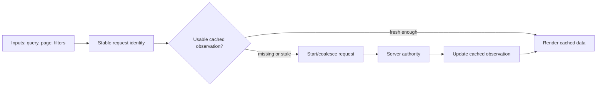
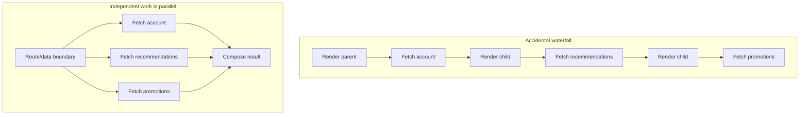
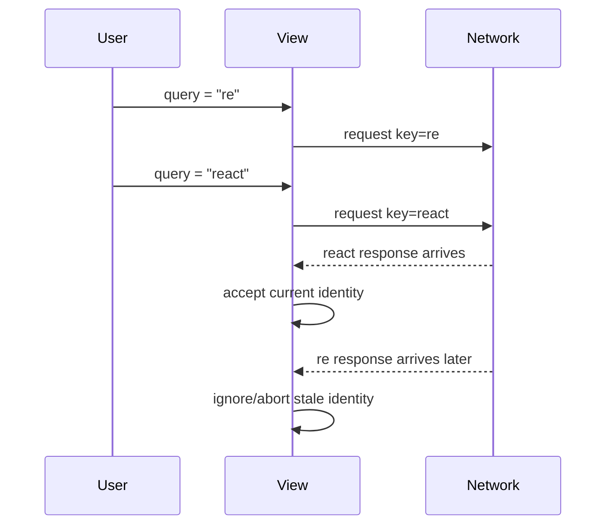

# Frontend Data Fetching: Request Identity, Caching, and Races

## TL;DR

A user searches a flight portal for "Tokyo", then immediately types "Paris". The network response for "Paris" returns in 150ms and renders Paris flights. But 800ms later, the delayed "Tokyo" response finally arrives, silently overwriting the screen with Tokyo flights while the input field still clearly says "Paris"! The user books the wrong hotel, causing customer support havoc. The root cause? A classic un-aborted async data fetching race condition caused by naked `useEffect` fetches without request identity, abort signals, or cache lifecycle management.

> 💡 **Rule of thumb:** **Remote data is server-owned state, not local state—treat it as a cached observation.** Every query requires a stable request identity (cache key); every in-flight request must be cancelable via `AbortController`; and mutations must explicitly invalidate affected queries rather than blindly hoping client state stays in sync.

- **Server-owned state over local copies:** Treat remote data as an asynchronous snapshot of server truth; manage it with dedicated caching tools (TanStack Query, SWR, RSC) rather than raw `useEffect` + `useState`.
- **Stable request identity:** Build cache keys that capture all influencing inputs (query parameters, filters, pagination, user ID); identical keys coalesce in-flight requests and deduplicate network traffic.
- **Race conditions & cancellation:** Use `AbortController` signals so that quick successive searches cancel or ignore late-arriving stale responses from previous queries.
- **Parallel fetching over waterfalls:** Hoist independent data requirements to route or Server Component boundaries, firing parallel requests via `Promise.all` instead of chaining sequential calls inside nested presentation components.
- **Mutation invalidation & optimistic updates:** When modifying data, explicitly invalidate affected cache queries or apply optimistic UI updates with automatic error rollback.
- **Fatal pitfall:** Writing naked `useEffect(() => { fetch(...) }, [query])` without an abort signal—allowing out-of-order network responses to overwrite newer user views with stale data.

<TermBox term="Request identity">
A **request identity** is the stable description of the remote resource or query being observed. Client data libraries often encode it as a query/cache key. The identity should include every input that changes the result, such as resource ID, filters, page, sort, tenant, or locale when those values affect the response.
</TermBox>



## Fetching is synchronization with a remote owner

The previous State Models lesson separated client-owned state from server-owned state. Data fetching is the mechanism that keeps a frontend observation synchronized with that remote owner.

The browser may hold a copy of a product, account, permission set, or search result. That copy can be cached, optimistic, or temporarily stale, but the cache does not become authoritative merely because rendering reads from it.

This distinction changes the design question from “where should I store this object?” to:

- what remote query produced it;
- when the observation is fresh enough to reuse;
- how another consumer can reuse the same in-flight or cached work;
- how the observation becomes stale after a mutation;
- how the UI behaves while the observation is unavailable or refreshing.

## Give every query a stable identity

A cache cannot deduplicate or invalidate work reliably if equivalent requests have unstable identities.

For example, a catalog query might be identified by:

```text
products | tenant=acme | category=books | sort=price | page=3
```

If `category`, `sort`, or `page` changes the server result, it belongs in the identity. If object property order, temporary component IDs, or newly allocated callbacks change the key without changing the remote query, the identity is too unstable.

Two practical rules follow:

- **same remote observation → same logical key**;
- **different remote result → different logical key**.

A query key is not only a cache lookup key. It is also a handle for deduplication, refetching, invalidation, observability, and reasoning about which screen a response belongs to.

## Choose fetch placement by ownership and timing

There is no universal rule that all frontend data belongs in `useEffect`, or that all data belongs on the server.

Fetch at a **server or route boundary** when the data is needed to construct the initial route, can be fetched with server-only credentials or direct infrastructure access, should participate in server rendering/streaming, or can be coordinated before client components mount.

Fetch in the **client** when the request is driven by post-hydration interaction, browser-only context, background refresh, polling/live behavior, or a reusable client cache that must follow interaction state without navigating the whole route.

A framework loader, Server Component, route handler, client query cache, or event-driven request can all be reasonable. The important question is who can coordinate the request earliest without leaking server-only capabilities or moving interaction ownership to the wrong environment.

## Avoid accidental network waterfalls

A dependency waterfall is correct when request B truly needs the result of request A. It is wasteful when independent work starts sequentially only because component mounting made it sequential.



When requests are independent, start them together with framework preloading, route-level coordination, `Promise.all`, or a cache that can initiate work before deeply nested components mount.

When they are dependent, make that dependency explicit rather than hiding it in mount order. This lets reviewers distinguish unavoidable latency from an architectural waterfall.

## Cache layers are not interchangeable

A modern frontend may use several caches at once:

- the **browser HTTP cache**, governed by HTTP cache semantics and response headers;
- a **framework/server cache**, which may reuse server-side fetch or rendered results;
- a **client query cache**, which stores observations and request metadata for interactive reuse;
- sometimes a CDN or application cache further upstream.

These layers have different keys, scopes, lifetimes, invalidation APIs, and security boundaries. A client query becoming stale does not automatically purge an HTTP response cache. Revalidating a server-rendered path does not automatically rewrite every client-side observation already in memory.

Model each cache according to the layer that owns it.

<TermBox term="Freshness">
**Freshness** answers whether a cached observation is still acceptable to serve without first obtaining newer evidence. “Cached” and “fresh” are not synonyms: a cache may deliberately serve stale data while a background refetch runs, or reject old data immediately for stricter domains.
</TermBox>

## Fresh versus stale is a product decision

A weather tile, stock trade confirmation, user avatar, permission check, and documentation page do not have the same tolerance for stale observations.

Define freshness from product semantics:

- how quickly can the remote value change;
- what harm occurs if a user sees an older value;
- whether stale-while-refresh behavior is acceptable;
- whether foreground navigation should wait for fresh evidence;
- whether a mutation makes related cached queries immediately stale.

Avoid copying a single “5 minute cache” value across unrelated resources.

## Deduplicate equivalent work

If five components observe the same query at the same time, issuing five equivalent requests usually adds latency, backend load, and race opportunities without adding information.

A useful data layer can **deduplicate or coalesce** equivalent in-flight requests so consumers share one logical observation. Later consumers may reuse a fresh cached result instead of starting another request.

Deduplication depends on stable request identity. If every render creates a different key for the same logical query, the cache cannot recognize equivalent work.

## Protect the UI from stale-response races

Network completion order is not user intent order.

A search box can request `r`, then `re`, then `react`. The `re` response may arrive last. If every completion writes directly to visible state, the UI can show results for an older query after the user already moved on.



Client fetch logic must either abort superseded work with an API such as `AbortController`, ignore responses whose identity is no longer current, or delegate the race to a cache/framework that already tracks request identity.

Cancellation saves unnecessary work when supported, but it does not mean the remote server never received or acted on the request. The correctness rule is still: **an obsolete response must not overwrite the current observation**.

## Loading is not one boolean

A mature UI often needs to distinguish:

- **initial loading**: there is no usable observation yet;
- **empty**: a successful query returned no domain results;
- **error**: the current attempt failed and no acceptable observation exists;
- **refetching**: usable data is visible while newer evidence is being requested;
- **stale**: cached data is visible but its freshness policy says it should be refreshed;
- **partial**: some independently loaded regions are ready while others are still pending.

Collapsing all of these into `isLoading` makes interfaces flicker and makes error recovery unclear. Streaming and Suspense can improve when partial server-rendered regions become visible, but they do not remove the need to define these states.

## Mutation changes what reads are trustworthy

Creating, updating, or deleting data often makes one or more cached observations stale.

<TermBox term="Invalidation">
**Invalidation** marks a cached observation as no longer trustworthy after an event that may have changed its remote result. Revalidation or refetching is the later act of obtaining newer evidence. Good invalidation targets the affected query identities instead of clearing every cache indiscriminately.
</TermBox>

After `updateProduct(42)`, possible affected observations may include:

- `product | id=42`;
- a category list containing product 42;
- a search result whose ranking/fields depend on the changed value;
- aggregate counts or dashboards derived from that product.

Mutation handling is therefore part of the read model. If the write path has no invalidation plan, “successful mutation” can still leave a visibly incorrect frontend.

## Optimistic updates need a recovery story

An optimistic update changes the local observation before the server confirms the mutation. It can make interactions feel immediate, but it temporarily creates a prediction about remote state.

Use optimistic updates when the product benefit justifies the added state machine, and define:

1. the optimistic value;
2. which query identities are patched;
3. what happens if the server confirms with a different canonical value;
4. how rollback works on rejection;
5. whether concurrent mutations require reconciliation rather than a blind rollback.

For money movement, permission changes, inventory reservations, or other high-consequence writes, displaying an unqualified optimistic success may be inappropriate even if the technique is mechanically possible.

## Pagination and dependent queries should expose their dependency

Pagination should make page/cursor/filter inputs part of request identity. A page-2 response for `query=react` must not be reused as page 2 for `query=vue` simply because both screens render the same component.

Dependent queries are valid when the second query truly needs output from the first, such as fetching a workspace after resolving the authenticated account's workspace ID. Keep that dependency explicit and avoid starting impossible requests with placeholder IDs merely to fit a generic hook shape.

## Retry is not a substitute for a data model

Retries can help with transient failures, but **do not retry every failure blindly** and do not use retry to hide unstable request identity, missing invalidation, or race bugs.

A retry should remain bounded, respect the operation's safety and user deadline, and stop for deterministic failures such as invalid input or authorization denial. Retrying a stale query under the wrong identity only produces the wrong answer more persistently.

## Production scenario

A catalog search page fetches data in nested `useEffect` calls. The parent fetches category metadata, then a child mounts and fetches products, then another child fetches promotions. Typing quickly starts several search requests. Components remount during navigation and issue duplicates. After an admin edits a product, the search cache continues showing the old title.

**Impact:** the page is slower than the backend latency requires, duplicate requests amplify load, old search responses sometimes overwrite newer queries, loading UI flickers on remount, and successful mutations leave users looking at stale catalog data.

**Root cause:** request identity, scheduling, cache ownership, race handling, and mutation invalidation were implicit in component mount order instead of modeled as one data-fetching system.

**Correct pattern:** define stable query keys from URL/domain inputs; start independent work in parallel at the earliest appropriate route/server boundary; use a client query cache for interaction-owned refetching and deduplication; abort or ignore superseded responses; distinguish initial loading from background refetch; and invalidate/revalidate only affected query identities after mutations, with rollback or reconciliation for optimistic changes.

## A data-fetching review

For each remote read, ask:

1. Who owns the authoritative value?
2. Which inputs fully determine the request identity?
3. Where is the earliest safe place to start the request?
4. Which sibling requests are truly independent?
5. Which cache layer is expected to reuse this observation?
6. What freshness rule applies to this domain fact?
7. How are equivalent in-flight requests deduplicated?
8. How is a stale response prevented from overwriting newer intent?
9. What does the UI show for initial loading, empty, error, stale, and refetching states?
10. Which mutation events invalidate this query?
11. If optimistic, how do rollback and reconciliation work?
12. Is retry bounded and limited to failures another attempt can plausibly fix?

## Self-check

A search route is showing results for `?q=react`. The user changes the URL to `?q=rust`. The Rust request finishes first, then the older React request finishes and writes into component state. The cache keys are both just `"search"`. What is wrong?

<details>
<summary>Show the reasoning</summary>

There are two related bugs. First, the request identity is incomplete: the query string must participate in the key, such as `search | q=rust`. Second, the view accepts a response without proving it still belongs to the current identity. Stable query keys plus abort/ignore/current-key checks prevent the older React response from replacing the Rust observation.

</details>

## Data-fetching checklist

- [ ] Treat cached remote data as an observation of server-owned state.
- [ ] Give every query a stable identity containing all result-shaping inputs.
- [ ] Fetch at the server/route/client boundary that best matches ownership and timing.
- [ ] Start independent requests in parallel; make real dependencies explicit.
- [ ] Know which HTTP, framework/server, and client query cache layers are involved.
- [ ] Define freshness from product semantics instead of one copied TTL.
- [ ] Deduplicate equivalent in-flight work.
- [ ] Abort or ignore stale responses so old intent cannot overwrite current intent.
- [ ] Model loading, empty, error, stale, and refetching states deliberately.
- [ ] Invalidate/revalidate affected queries after mutations.
- [ ] Give optimistic updates an explicit rollback/reconciliation path.
- [ ] Keep retries bounded and reserved for plausibly transient failures.

## Agent rule

When implementing frontend data fetching, do not start with scattered component Effects. First define the remote owner, stable request identity, fetch placement, dependency graph, cache/freshness policy, stale-response rule, and mutation invalidation plan; then choose the smallest framework or client-cache mechanism that enforces those semantics.

## Sources

Primary references verified on **2026-09-16**:

- [React — Synchronizing with Effects](https://react.dev/learn/synchronizing-with-effects)
- [React — `useEffect`](https://react.dev/reference/react/useEffect)
- [React — You Might Not Need an Effect](https://react.dev/learn/you-might-not-need-an-effect)
- [Next.js Learn — Fetching Data](https://nextjs.org/learn/dashboard-app/fetching-data)
- [Next.js Learn — Streaming](https://nextjs.org/learn/dashboard-app/streaming)
- [Next.js Learn — Mutating Data](https://nextjs.org/learn/dashboard-app/mutating-data)
- [MDN — AbortController](https://developer.mozilla.org/en-US/docs/Web/API/AbortController)
