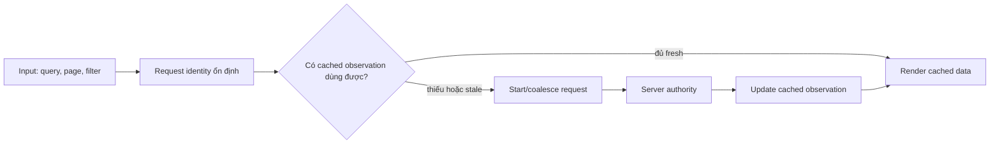
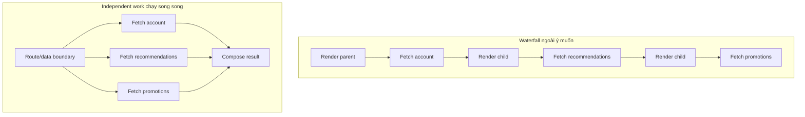
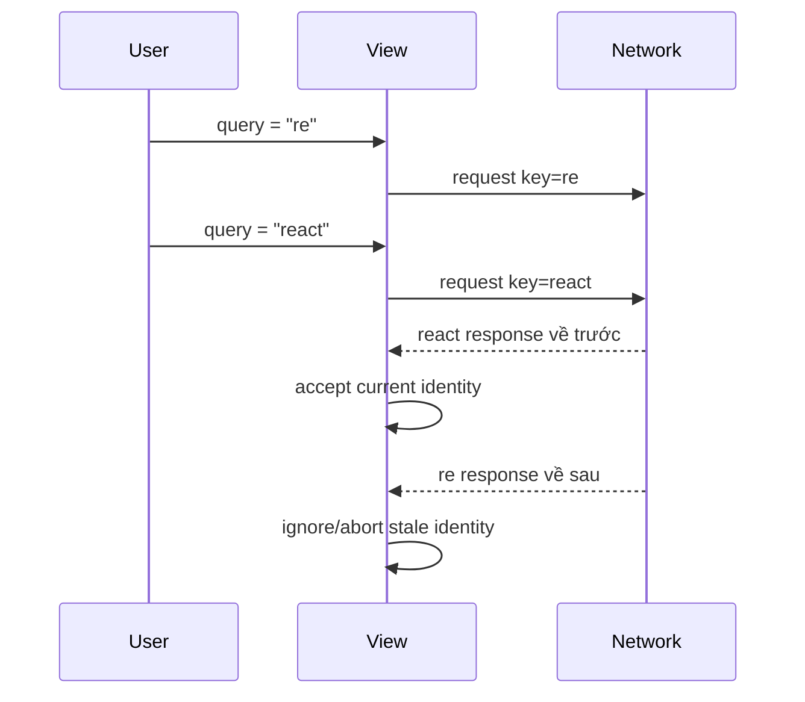

# Frontend Data Fetching: Làm dữ liệu từ xa trở nên tường minh

## Tóm tắt

Remote data vẫn là **state do server sở hữu** ngay cả khi browser giữ một bản cache. Vì vậy frontend đáng tin cậy cần nhiều hơn vài lệnh `fetch()`: nó cần request identity ổn định, vị trí fetch có chủ đích, freshness rule rõ ràng, xử lý race, invalidation sau mutation và UI state cho lúc chờ hay lỗi.

Một chuỗi câu hỏi review hữu ích là:

1. Ta đang đọc remote fact nào và ai là nguồn authoritative?
2. Input nào quyết định request identity?
3. Request nên bắt đầu ở server/route boundary hay phía client?
4. Request nào độc lập và có thể chạy song song?
5. Cache layer nào sở hữu reuse, freshness và deduplication?
6. Điều gì ngăn response cũ ghi đè view mới hơn?
7. Sau mutation, observation nào đã trở thành stale?

<TermBox term="Request identity">
**Request identity** là mô tả ổn định của remote resource hoặc query đang được quan sát. Client data library thường biểu diễn nó bằng query/cache key. Identity phải chứa mọi input làm thay đổi kết quả, như resource ID, filter, page, sort, tenant hoặc locale khi các giá trị đó ảnh hưởng response.
</TermBox>



## Fetching là đồng bộ với một remote owner

Bài State Models trước đã tách client-owned state khỏi server-owned state. Data fetching là cơ chế giữ observation phía frontend đồng bộ với remote owner đó.

Browser có thể giữ một bản sao product, account, permission set hoặc search result. Bản sao đó có thể được cache, optimistic hoặc tạm thời stale, nhưng cache không trở thành nguồn sự thật chỉ vì render đang đọc từ nó.

Phân biệt này biến câu hỏi thiết kế từ “để object này ở đâu?” thành:

- remote query nào tạo ra nó;
- observation còn đủ fresh để reuse đến khi nào;
- consumer khác có thể reuse cùng in-flight hoặc cached work thế nào;
- observation trở thành stale sau mutation ra sao;
- UI hành xử thế nào khi observation chưa có hoặc đang refresh.

## Mỗi query cần một identity ổn định

Cache không thể deduplicate hay invalidate đáng tin cậy nếu các request tương đương có identity không ổn định.

Ví dụ catalog query có thể được định danh bằng:

```text
products | tenant=acme | category=books | sort=price | page=3
```

Nếu `category`, `sort` hay `page` làm đổi kết quả server, nó phải nằm trong identity. Nếu property order của object, component ID tạm thời hoặc callback mới được tạo làm key đổi dù remote query không đổi, identity đang quá bất ổn.

Hai rule thực dụng:

- **cùng remote observation → cùng logical key**;
- **khác remote result → khác logical key**.

Query key không chỉ dùng để lookup cache. Nó còn là handle cho deduplication, refetch, invalidation, observability và suy luận response này thuộc screen nào.

## Chọn vị trí fetch theo ownership và timing

Không có rule chung rằng mọi frontend data đều phải nằm trong `useEffect`, cũng không có rule mọi data đều phải fetch ở server.

Fetch ở **server hoặc route boundary** khi data cần để dựng initial route, cần server-only credential hoặc direct infrastructure access, nên tham gia server rendering/streaming, hoặc có thể được phối hợp trước khi Client Components mount.

Fetch ở **client** khi request được kích hoạt bởi interaction sau hydration, browser-only context, background refresh, polling/live behavior hoặc client cache dùng chung phải đi theo interaction state mà không điều hướng cả route.

Framework loader, Server Component, route handler, client query cache hay event-driven request đều có thể đúng. Câu hỏi quan trọng là ai có thể phối hợp request sớm nhất mà không làm lộ server-only capability hoặc chuyển sai interaction ownership sang môi trường khác.

## Tránh network waterfall ngoài ý muốn

Dependency waterfall là hợp lệ khi request B thật sự cần kết quả request A. Nó lãng phí khi independent work chạy tuần tự chỉ vì component mount theo thứ tự đó.



Khi request độc lập, hãy khởi động cùng lúc bằng framework preloading, route-level coordination, `Promise.all` hoặc cache có thể bắt đầu work trước khi nested component mount sâu.

Khi request phụ thuộc nhau, hãy làm dependency đó explicit thay vì giấu trong mount order. Reviewer khi đó phân biệt được latency bắt buộc với architectural waterfall.

## Các cache layer không thể thay thế lẫn nhau

Frontend hiện đại có thể dùng nhiều cache cùng lúc:

- **browser HTTP cache**, theo HTTP cache semantics và response headers;
- **framework/server cache**, có thể reuse server-side fetch hoặc rendered result;
- **client query cache**, giữ observation cùng request metadata cho interactive reuse;
- đôi khi còn CDN hoặc application cache ở upstream.

Các layer này có key, scope, lifetime, invalidation API và security boundary khác nhau. Client query trở thành stale không tự động purge HTTP response cache. Revalidate server-rendered path cũng không tự động viết lại mọi client-side observation đang nằm trong memory.

Hãy model từng cache theo layer đang sở hữu nó.

<TermBox term="Freshness">
**Freshness** trả lời cached observation còn đủ chấp nhận được để serve mà chưa cần bằng chứng mới hay không. “Đã cache” và “fresh” không đồng nghĩa: cache có thể chủ ý serve stale data trong lúc background refetch, hoặc từ chối data cũ ngay với domain nghiêm ngặt hơn.
</TermBox>

## Fresh hay stale là quyết định sản phẩm

Weather tile, xác nhận giao dịch chứng khoán, avatar, permission check và documentation page không có cùng tolerance với stale observation.

Hãy định nghĩa freshness từ semantics của sản phẩm:

- remote value có thể đổi nhanh đến mức nào;
- user thấy value cũ gây hại gì;
- stale-while-refresh có chấp nhận được không;
- foreground navigation có phải chờ fresh evidence không;
- mutation có làm related query stale ngay lập tức không.

Tránh copy một TTL kiểu “5 phút” cho mọi resource không liên quan.

## Deduplicate equivalent work

Nếu năm component cùng observe một query ở cùng thời điểm, gửi năm request tương đương thường chỉ tăng latency, backend load và cơ hội race mà không thêm thông tin.

Một data layer tốt có thể **deduplicate hoặc coalesce** các in-flight request tương đương để consumer cùng chia sẻ một logical observation. Consumer đến sau có thể reuse fresh cached result thay vì mở request mới.

Deduplication phụ thuộc request identity ổn định. Nếu mỗi render tạo một key khác cho cùng logical query, cache không thể nhận ra work tương đương.

## Bảo vệ UI khỏi stale-response race

Thứ tự network hoàn tất không phải thứ tự user intent.

Search box có thể request `r`, rồi `re`, rồi `react`. Response của `re` có thể về cuối cùng. Nếu completion nào cũng viết thẳng vào visible state, UI có thể hiện kết quả của query cũ sau khi user đã chuyển sang query mới.



Client fetch logic phải abort superseded work bằng API như `AbortController`, bỏ qua response whose identity không còn current, hoặc giao race cho cache/framework đã track request identity.

Cancellation giúp tiết kiệm work khi được hỗ trợ, nhưng không có nghĩa remote server chắc chắn chưa nhận hoặc chưa xử lý request. Correctness rule vẫn là: **obsolete response không được ghi đè current observation**.

## Loading không chỉ là một boolean

UI trưởng thành thường cần phân biệt:

- **initial loading**: chưa có observation dùng được;
- **empty**: query thành công nhưng không có domain result;
- **error**: attempt hiện tại fail và không có observation chấp nhận được;
- **refetching**: data dùng được vẫn đang hiện trong lúc xin bằng chứng mới;
- **stale**: cached data đang hiện nhưng freshness policy nói cần refresh;
- **partial**: một số independent region đã sẵn sàng trong khi phần khác còn pending.

Dồn tất cả vào `isLoading` làm UI flicker và khiến error recovery khó hiểu. Streaming và Suspense có thể cải thiện thời điểm từng server-rendered region xuất hiện, nhưng không loại bỏ nhu cầu model các trạng thái này.

## Mutation làm thay đổi độ tin cậy của read

Create, update hoặc delete thường khiến một hay nhiều cached observation trở thành stale.

<TermBox term="Invalidation">
**Invalidation** đánh dấu cached observation không còn đáng tin sau một event có thể đã đổi remote result. Revalidation hoặc refetch là bước sau để lấy bằng chứng mới. Invalidation tốt nhắm đúng query identity bị ảnh hưởng thay vì xóa toàn bộ cache một cách mù quáng.
</TermBox>

Sau `updateProduct(42)`, các observation có thể bị ảnh hưởng gồm:

- `product | id=42`;
- category list chứa product 42;
- search result có ranking/field phụ thuộc value đã đổi;
- aggregate count hay dashboard derive từ product đó.

Vì vậy, việc xử lý dữ liệu thay đổi (mutation) là một phần không thể tách rời của mô hình đọc (read model). Nếu luồng ghi không có kế hoạch hủy cache rõ ràng, một thao tác "ghi thành công" vẫn có thể khiến giao diện người dùng hiển thị dữ liệu sai lệch.

## Optimistic update cần recovery story

Optimistic update thay đổi local observation trước khi server confirm mutation. Nó có thể làm interaction phản hồi tức thì, nhưng tạm thời tạo một dự đoán về remote state.

Chỉ dùng optimistic update khi product benefit xứng đáng với state machine phức tạp hơn, và phải định nghĩa:

1. optimistic value;
2. query identity nào được patch;
3. chuyện gì xảy ra nếu server confirm một canonical value khác;
4. rollback khi server reject thế nào;
5. concurrent mutation có cần reconciliation thay vì blind rollback không.

Với money movement, permission change, inventory reservation hoặc write có hậu quả cao, hiển thị optimistic success vô điều kiện có thể không phù hợp dù kỹ thuật cho phép.

## Pagination và dependent query phải lộ dependency

Pagination cần đưa page/cursor/filter vào request identity. Response page 2 cho `query=react` không được reuse như page 2 của `query=vue` chỉ vì cả hai screen dùng cùng component.

Dependent query hợp lệ khi query thứ hai thật sự cần output của query đầu, ví dụ fetch workspace sau khi resolve workspace ID của authenticated account. Hãy giữ dependency đó explicit và tránh mở request bất khả thi bằng placeholder ID chỉ để vừa một generic hook shape.

## Retry không thay thế data model

Retry có thể giúp transient failure, nhưng **không retry mọi lỗi một cách mù quáng** và không dùng retry để che unstable request identity, missing invalidation hay race bug.

Retry phải bounded, tôn trọng safety của operation và user deadline, đồng thời dừng ở deterministic failure như invalid input hay authorization denial. Retry một stale query dưới sai identity chỉ khiến ta nhận câu trả lời sai nhiều lần hơn.

## Tình huống production

Một catalog search page fetch data bằng các `useEffect` lồng nhau. Parent fetch category metadata, sau đó child mới mount và fetch products, rồi child khác fetch promotions. Gõ nhanh mở nhiều search request. Component remount trong navigation lại gửi duplicate requests. Sau khi admin sửa product, search cache vẫn hiện title cũ.

**Hậu quả:** page chậm hơn mức backend latency bắt buộc, duplicate request khuếch đại load, search response cũ đôi lúc ghi đè query mới, loading UI flicker khi remount, và mutation thành công nhưng user vẫn nhìn thấy catalog data stale.

**Nguyên nhân cốt lõi:** định danh request, lập lịch fetch, quyền sở hữu cache, xử lý race condition và cơ chế hủy cache sau mutation bị ẩn trong thứ tự mount của component thay vì được thiết kế như một hệ thống quản lý dữ liệu hoàn chỉnh.

**Cách khắc phục chuẩn:** định nghĩa stable query key từ URL/domain inputs; khởi động independent work song song tại route/server boundary phù hợp và sớm nhất; dùng client query cache cho interaction-owned refetch cùng deduplication; abort hoặc ignore superseded response; phân biệt initial loading với background refetch; invalidate/revalidate đúng query identity bị ảnh hưởng sau mutation, kèm rollback hoặc reconciliation cho optimistic change.

## Review một data-fetching flow

Với mỗi remote read, hãy hỏi:

1. Ai sở hữu authoritative value?
2. Input nào xác định đầy đủ request identity?
3. Vị trí an toàn sớm nhất để bắt đầu request là đâu?
4. Sibling request nào thật sự độc lập?
5. Cache layer nào được kỳ vọng reuse observation này?
6. Freshness rule nào áp dụng cho domain fact này?
7. Equivalent in-flight request được deduplicate thế nào?
8. Điều gì ngăn stale response ghi đè intent mới hơn?
9. UI hiện gì ở initial loading, empty, error, stale và refetching?
10. Mutation event nào invalidate query này?
11. Nếu optimistic, rollback và reconciliation hoạt động ra sao?
12. Retry có bounded và chỉ dành cho failure mà attempt khác có khả năng khắc phục không?

## Tự kiểm tra

Search route đang hiện kết quả cho `?q=react`. User đổi URL sang `?q=rust`. Request Rust hoàn tất trước, sau đó request React cũ mới xong và ghi vào component state. Cache key của cả hai đều chỉ là `"search"`. Sai ở đâu?

<details>
<summary>Xem giải thích chi tiết</summary>

Có hai bug liên quan. Thứ nhất, request identity thiếu input: query string phải nằm trong key, ví dụ `search | q=rust`. Thứ hai, view accept response mà không chứng minh response vẫn thuộc current identity. Stable query key cùng abort/ignore/current-key check sẽ ngăn response React cũ thay thế observation của Rust.

</details>

## Checklist data fetching

- [ ] Xem cached remote data như một observation của server-owned state.
- [ ] Cho mỗi query một identity ổn định chứa mọi input làm đổi result.
- [ ] Fetch ở server/route/client boundary phù hợp ownership và timing.
- [ ] Khởi động independent request song song; làm real dependency explicit.
- [ ] Biết HTTP cache, framework/server cache và client query cache nào đang tham gia.
- [ ] Định nghĩa freshness từ product semantics thay vì copy một TTL chung.
- [ ] Deduplicate equivalent in-flight work.
- [ ] Abort hoặc ignore stale response để intent cũ không ghi đè intent hiện tại.
- [ ] Model loading, empty, error, stale và refetching state có chủ đích.
- [ ] Invalidate/revalidate affected query sau mutation.
- [ ] Cho optimistic update một đường rollback/reconciliation rõ ràng.
- [ ] Giữ retry bounded và chỉ dùng cho failure có khả năng transient.

## Agent rule

Khi implement frontend data fetching, đừng bắt đầu bằng các component Effect rải rác. Trước tiên hãy định nghĩa remote owner, stable request identity, fetch placement, dependency graph, cache/freshness policy, stale-response rule và mutation invalidation plan; sau đó mới chọn framework hoặc client-cache mechanism nhỏ nhất có thể enforce semantics đó.

## Nguồn tham khảo

Các nguồn chính được kiểm tra ngày **2026-09-16**:

- [React — Synchronizing with Effects](https://react.dev/learn/synchronizing-with-effects)
- [React — `useEffect`](https://react.dev/reference/react/useEffect)
- [React — You Might Not Need an Effect](https://react.dev/learn/you-might-not-need-an-effect)
- [Next.js Learn — Fetching Data](https://nextjs.org/learn/dashboard-app/fetching-data)
- [Next.js Learn — Streaming](https://nextjs.org/learn/dashboard-app/streaming)
- [Next.js Learn — Mutating Data](https://nextjs.org/learn/dashboard-app/mutating-data)
- [MDN — AbortController](https://developer.mozilla.org/en-US/docs/Web/API/AbortController)
