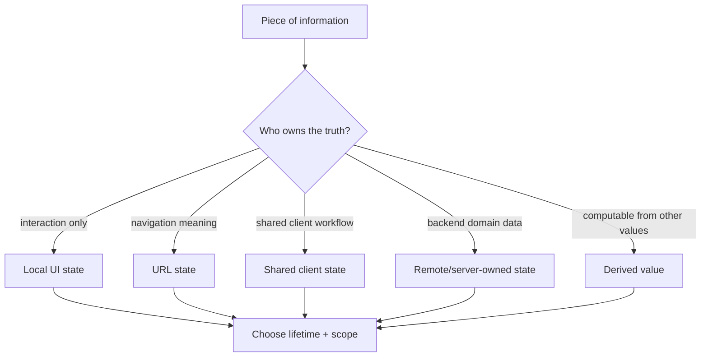
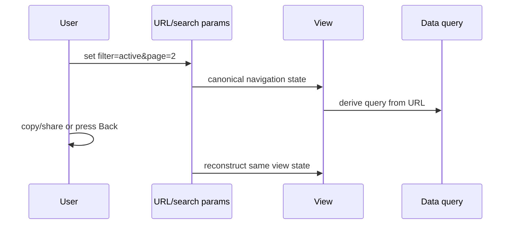
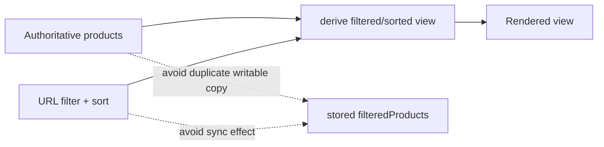

# Frontend State Models: Put Each State in the Right Place

## TL;DR

Frontend state is not one bucket. Before choosing `useState`, Context, a global store, the URL, `localStorage`, or a data cache, classify the information first.

Ask four questions:

1. **Who owns it?** Which part of the product is authoritative for changing it?
2. **How long should it live?** One interaction, one route visit, one browser session, or across sessions?
3. **How wide is its scope?** One component, a subtree, the whole app, or multiple devices/users?
4. **Should it persist?** Should refresh, sharing a URL, or reopening the app restore it?

The best state model usually has **one canonical owner per fact**, keeps state close to that owner, and derives everything else when possible.

<TermBox term="State owner">
A **state owner** is the component, URL, store, cache, server, or persistence layer that is authoritative for a particular fact. Consumers may read or derive from it, but they should not silently create competing writable copies.
</TermBox>

## State is a model of changing facts, not a storage API

A common failure mode is choosing a tool before defining the state. “We use Zustand,” “put it in Context,” or “save it in `localStorage`” are implementation decisions, not a state model.

The model comes first:

- what fact changes;
- what event changes it;
- who is authoritative;
- which consumers need it;
- how long it remains meaningful;
- whether another source can reconstruct it.

If two places both believe they can write the same fact, synchronization becomes part of your architecture whether you intended it or not.

## A practical state taxonomy

### Local ephemeral UI state

This state exists to support a nearby interaction and usually dies with the component or route:

- whether a popover is open;
- the focused row;
- a temporary drag position;
- a disclosure panel's expanded state;
- an unsaved local draft when only one editor owns it.

Keep it local when no other owner needs to coordinate it. Promoting every boolean into a global store increases coupling without adding useful semantics.

### Form and draft state

Form input deserves special attention because its lifetime may be longer than a single control but shorter than persistent domain data.

A form can own an editable draft while the backend owns the saved entity. Treat those as different states. The draft may be dirty, invalid, or incomplete; the persisted server entity should not be mutated conceptually on every keystroke.

### URL and navigation state

Filters, search terms, sort order, pagination, selected tabs, or view modes often have navigation semantics. If users should be able to **bookmark, share, reload, or use Back/Forward** and recover the same view, the URL is a strong candidate for ownership.

<TermBox term="URL state">
**URL state** is state whose meaning belongs to navigation. Path segments, search params, or hashes can make a view addressable and reproducible without relying on hidden browser memory.
</TermBox>

Not every UI toggle belongs in the URL. Hover state, a transient tooltip, or an animation phase usually does not need addressability. The test is semantic: **would another person or a later browser history entry need this exact state to reproduce the view?**

### Shared client state

Some client-owned facts legitimately span distant components: an in-progress multi-step workflow, a client-only editor session, or UI preferences used across multiple branches of the tree.

Start with the narrowest owner that can coordinate all consumers. Lift state to the **closest common parent** when siblings need one source of truth. Use Context or a global store when ownership really crosses a broad subtree or the application—not merely to avoid passing a few props.

A global store is useful infrastructure, but global state has costs:

- more components can depend on and mutate the same state;
- reset and lifecycle rules become less obvious;
- tests need wider setup;
- persistence can accidentally preserve stale or user-specific values;
- unrelated features can become coupled through shared selectors/actions.

### Remote or server-owned state

Backend entities, permissions, inventory, account balances, and server-generated search results are not made “client-owned” just because a browser cache holds a copy.

The server remains authoritative. A frontend cache owns **a local observation of remote state**, plus metadata such as freshness or request status. Cache invalidation, refetching, optimistic updates, and request deduplication belong primarily in the next lesson, **Frontend Data Fetching**.

This distinction matters: putting a fetched `User` object into a global store does not turn that store into the source of truth for the user record.

### Persistent browser state

`localStorage`, IndexedDB, cookies, and similar mechanisms answer a persistence question, not an ownership question.

Persist only values that have clear restore semantics. Theme preference may survive sessions. A server-owned account balance should not become authoritative because an old value is still in storage.

On restore, ask whether persisted state must be versioned, expired, validated, scoped to a user, or reconciled with newer server data.

## Derived state should usually not be stored

If a value can be calculated from current props/state during render, storing another writable copy creates a synchronization obligation.

<TermBox term="Derived state">
**Derived state** is information computable from other authoritative values. Prefer computing it from those inputs instead of storing a second mutable copy unless the derivation itself needs an explicit cache for measured performance reasons.
</TermBox>

Suppose a product list owns `products` and the URL owns `sort=price`. The sorted list is derived. Storing `sortedProducts` as another independent state variable means every product change and every sort change must update both copies correctly.

Memoization can cache a computation, but a cache is not a new source of truth. The inputs still define the value.

## Synchronizing two writable copies is a design smell

A pattern such as “when A changes, run an effect to copy A into B” deserves scrutiny. Effects are valid for synchronizing React with **external systems**. They are often unnecessary when two React values can instead share one owner or one can be derived from the other.

Typical warning signs:

- URL filter copied into component state, then synced back to the URL;
- server response copied into a global store and separately updated there;
- props copied into local state on every change;
- `fullName` stored and updated whenever `firstName` or `lastName` changes;
- the same selection stored as both an object and an ID.

Before adding another synchronization effect, ask whether one copy can disappear.

## Colocate first; lift when coordination requires it

“Keep state local” does not mean “never share state.” It means **put mutable state near the smallest owner that has enough context to make correct updates**.

If two siblings must coordinate, lift state to their closest common parent. If a whole feature subtree needs it, a reducer + Context may be appropriate. If independent distant features need the same client-owned workflow state, a store may be appropriate.

The direction should be driven by ownership, not by fear of prop drilling.

## Scope and lifetime are independent

A value can have wide scope but short lifetime, or narrow scope but long persistence.

Examples:

- a route-wide command palette can be broad but disappear on navigation;
- a tiny theme preference can affect the whole app and persist for months;
- a modal is local and ephemeral;
- an upload draft may belong to one feature but survive refresh via persisted storage.

Write these dimensions explicitly during design reviews. “Global” alone does not explain how long a value should survive or who can modify it.

## Production scenario

A catalog page stores `filter`, `sort`, and `page` in four places: component state, a global store, URL search params, and `localStorage`. Mount effects copy values among them. A user changes filters, opens a product, presses Back, then shares the URL with a teammate.

**Impact:** Back/Forward restores a different filter than the visible URL, shared links open with defaults or stale local preferences, reload behavior depends on effect order, and engineers cannot identify which layer is authoritative during incidents.

**Root cause:** the team optimized for convenient access and persistence before defining ownership. Four writable copies of navigation state became competing sources of truth, with effects acting as fragile synchronization glue.

**Correct pattern:** make the URL the canonical owner for shareable navigation state such as filter/sort/page; keep truly ephemeral interaction state local; let the remote-data cache represent server-owned results derived from the URL query; persist only preferences with explicit restore semantics; compute derived values instead of copying them.

## A state-placement review

For every proposed state variable, ask:

1. What exact fact does this represent?
2. Who is authoritative for changing it?
3. What is its lifetime?
4. How wide is its scope?
5. Must it survive refresh or another session?
6. Should Back/Forward, bookmark, or sharing reproduce it?
7. Can it be derived from another source instead?
8. Are we creating a second writable copy that needs synchronization?
9. If it is remote data, are we confusing a cache with the server's authority?
10. If it is global, which consumers truly require global ownership?

## Self-check

A search page has `?query=react&page=3` in the URL. On mount, a component copies both values into local state, updates the URL whenever local state changes, and uses another effect to reset local state when browser navigation changes the URL. Is this two-way synchronization a good default?

Show the reasoning

Usually no. If query and page have navigation semantics, the URL can be the single source of truth. The component can read from the URL and derive the request/view from it. A separate writable local copy creates timing and synchronization cases that do not exist when one owner is authoritative. Temporary input drafts can still be local when their semantics differ from the committed navigation state.

## State model checklist

- [ ] Name one canonical owner for each mutable fact.
- [ ] Record lifetime, scope, and persistence separately.
- [ ] Keep ephemeral interaction state close to the component or feature that owns it.
- [ ] Lift state only when multiple consumers genuinely need coordinated updates.
- [ ] Use URL state for addressable navigation state that should survive share/bookmark/Back/Forward.
- [ ] Derive computable values instead of storing duplicate writable state.
- [ ] Treat synchronization effects between two copies as a signal to revisit ownership.
- [ ] Use Context/global stores for genuinely broad client-owned state, not as a default container.
- [ ] Treat remote caches as observations of server-owned state, not the server authority itself.
- [ ] Persist browser state only with explicit restore, versioning, expiry, and user-scope rules where needed.

## Agent rule

When asked where frontend state should live, do not choose a library first. Identify the state owner, lifetime, scope, persistence, and navigation semantics; eliminate redundant derived copies; then select the smallest mechanism that preserves one clear source of truth.

## Sources

Primary references verified on **2026-09-16**:

- [React — Choosing the State Structure](https://react.dev/learn/choosing-the-state-structure)
- [React — Sharing State Between Components](https://react.dev/learn/sharing-state-between-components)
- [React — Managing State](https://react.dev/learn/managing-state)
- [Next.js Learn — Adding Search and Pagination](https://nextjs.org/learn/dashboard-app/adding-search-and-pagination)
