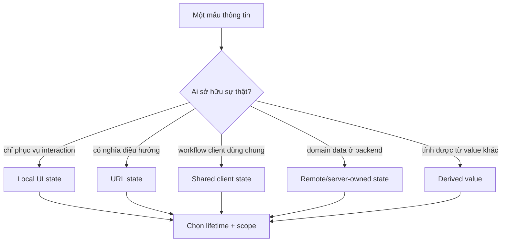
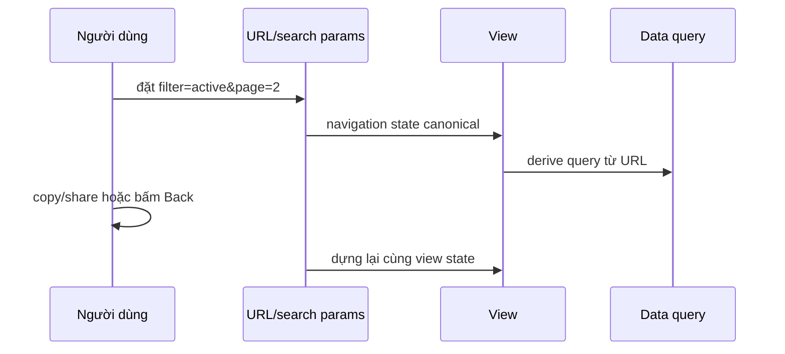
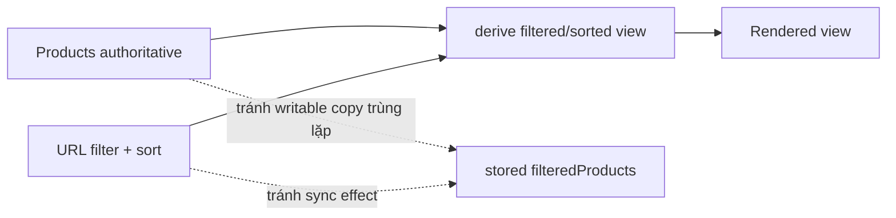

# Mô hình State Frontend: Đặt Từng Loại State Đúng Chỗ

## Tóm tắt

Frontend state không phải một cái thùng duy nhất. Trước khi chọn `useState`, Context, global store, URL, `localStorage` hay data cache, hãy phân loại thông tin trước.

Hãy hỏi bốn câu:

1. **Ai sở hữu nó?** Phần nào của sản phẩm có quyền quyết định thay đổi nó?
2. **Nó nên sống bao lâu?** Một interaction, một lần ở route, một browser session hay qua nhiều session?
3. **Phạm vi của nó rộng đến đâu?** Một component, một subtree, toàn app hay nhiều thiết bị/người dùng?
4. **Có cần lưu bền không?** Refresh, chia sẻ URL hay mở lại app có cần khôi phục nó không?

Mô hình state tốt thường có **một owner canonical cho mỗi fact**, giữ state gần owner đó và derive phần còn lại khi có thể.

<TermBox term="Chủ sở hữu state">
**Chủ sở hữu state** là component, URL, store, cache, server hoặc persistence layer có quyền quyết định một fact cụ thể. Consumer có thể đọc hay derive từ nó, nhưng không nên âm thầm tạo thêm bản writable cạnh tranh.
</TermBox>

## State là mô hình của fact thay đổi, không phải storage API

Một failure mode phổ biến là chọn tool trước khi định nghĩa state. “Team dùng Zustand”, “cho vào Context” hay “lưu `localStorage`” là implementation decision, chưa phải state model.

Model phải có trước:

- fact nào đang thay đổi;
- event nào làm nó thay đổi;
- ai là authoritative owner;
- consumer nào cần nó;
- nó còn ý nghĩa trong bao lâu;
- nguồn khác có thể tái tạo nó không.

Nếu hai nơi đều tin rằng mình có quyền ghi cùng một fact, synchronization đã trở thành một phần kiến trúc dù team có chủ đích hay không.

## Một taxonomy state thực dụng

### Local ephemeral UI state

Loại state này tồn tại để phục vụ interaction gần đó và thường biến mất cùng component hoặc route:

- popover có đang mở không;
- row nào đang focus;
- drag position tạm thời;
- disclosure panel có expand không;
- unsaved local draft khi chỉ một editor sở hữu nó.

Giữ local nếu không có owner nào khác cần phối hợp. Đẩy mọi boolean vào global store chỉ làm coupling tăng mà không thêm semantics hữu ích.

### Form và draft state

Form input cần được nhìn riêng vì lifetime có thể dài hơn một control nhưng ngắn hơn persistent domain data.

Form có thể sở hữu editable draft trong khi backend sở hữu entity đã save. Hai thứ này là state khác nhau. Draft có thể dirty, invalid hoặc chưa hoàn chỉnh; persisted server entity không nên được xem như đã thay đổi sau từng keystroke.

### URL và navigation state

Filter, search term, sort order, pagination, selected tab hay view mode thường mang navigation semantics. Nếu người dùng cần **bookmark, chia sẻ, reload hoặc dùng Back/Forward** mà vẫn khôi phục cùng một view, URL là candidate rất mạnh cho ownership.

<TermBox term="URL state">
**URL state** là state mà ý nghĩa của nó thuộc về navigation. Path segment, search param hay hash có thể làm một view addressable và reproducible mà không dựa vào hidden browser memory.
</TermBox>

Không phải mọi UI toggle đều nên nằm trong URL. Hover state, tooltip tạm thời hay animation phase thường không cần addressability. Hãy kiểm tra semantics: **một người khác hoặc một history entry sau này có cần state chính xác này để tái tạo view không?**

### Shared client state

Một số fact do client sở hữu thật sự cần đi qua nhiều component xa nhau: workflow nhiều bước đang dang dở, editor session chỉ tồn tại phía client, hoặc UI preference được nhiều nhánh trong tree sử dụng.

Bắt đầu từ owner hẹp nhất có đủ context để phối hợp tất cả consumer. Nâng state lên **closest common parent** khi sibling cần một nguồn sự thật chung. Dùng Context hoặc global store khi ownership thật sự phủ một subtree rộng hay cả application—không chỉ để tránh truyền vài props.

Global store là infrastructure hữu ích, nhưng global state có chi phí:

- nhiều component hơn có thể phụ thuộc và mutate cùng state;
- rule reset và lifecycle khó thấy hơn;
- test cần setup rộng hơn;
- persistence có thể vô tình giữ value stale hoặc gắn với user cũ;
- feature không liên quan có thể bị coupling qua selector/action chung.

### Remote hoặc server-owned state

Backend entity, permission, inventory, account balance và server-generated search result không tự nhiên trở thành “client-owned” chỉ vì browser cache đang giữ một bản copy.

Server vẫn authoritative. Frontend cache sở hữu **một quan sát cục bộ của remote state**, cộng metadata như freshness hay request status. Cache invalidation, refetch, optimistic update và request deduplication sẽ được đào sâu chủ yếu ở bài kế **Frontend Data Fetching**.

Điểm này rất quan trọng: cho một object `User` đã fetch vào global store không biến store đó thành nguồn sự thật của user record.

### Persistent browser state

`localStorage`, IndexedDB, cookie và cơ chế tương tự trả lời câu hỏi persistence, không trả lời câu hỏi ownership.

Chỉ persist value có semantics khôi phục rõ ràng. Theme preference có thể sống qua nhiều session. Một account balance do server sở hữu không thể trở thành authoritative chỉ vì browser vẫn giữ bản cũ trong storage.

Khi restore, hãy hỏi persisted state có cần version, expiry, validation, user scope hoặc reconciliation với server data mới hơn không.

## Derived state thường không nên được lưu

Nếu một value có thể tính từ props/state hiện tại trong render, lưu thêm một writable copy sẽ tạo ra nghĩa vụ synchronization.

<TermBox term="State dẫn xuất">
**State dẫn xuất** là thông tin có thể tính từ các value authoritative khác. Ưu tiên tính nó từ input thay vì lưu bản mutable thứ hai, trừ khi chính phép tính cần một cache rõ ràng vì lý do performance đã đo được.
</TermBox>

Giả sử product list sở hữu `products` và URL sở hữu `sort=price`. Sorted list là derived value. Nếu lưu thêm `sortedProducts` như state độc lập, mọi thay đổi products và sort đều phải cập nhật hai bản đúng cách.

Memoization có thể cache computation, nhưng cache không trở thành source of truth mới. Input vẫn định nghĩa value.

## Đồng bộ hai writable copy là một design smell

Pattern kiểu “A đổi thì chạy effect để copy A sang B” nên được soi kỹ. Effect hợp lệ khi đồng bộ React với **external system**. Nhưng effect thường không cần thiết khi hai React value có thể cùng dùng một owner hoặc một value có thể derive từ value kia.

Các warning sign phổ biến:

- URL filter được copy vào component state rồi lại sync ngược về URL;
- server response được copy vào global store rồi update riêng ở đó;
- props được copy vào local state mỗi khi đổi;
- `fullName` được lưu và update mỗi lần `firstName` hay `lastName` đổi;
- cùng một selection được lưu vừa dưới dạng object vừa dưới dạng ID.

Trước khi thêm synchronization effect, hãy hỏi liệu có thể xóa một trong hai bản copy không.

## Colocate trước; chỉ lift khi coordination yêu cầu

“Giữ state local” không có nghĩa “không bao giờ share state”. Nó có nghĩa **đặt mutable state gần owner nhỏ nhất nhưng vẫn có đủ context để update đúng**.

Nếu hai sibling cần phối hợp, nâng state lên closest common parent. Nếu cả một feature subtree cần nó, reducer + Context có thể hợp lý. Nếu nhiều feature xa nhau thật sự cần cùng một client-owned workflow state, store có thể phù hợp.

Hướng di chuyển state nên do ownership quyết định, không phải nỗi sợ prop drilling.

## Scope và lifetime là hai trục độc lập

Một value có thể scope rộng nhưng lifetime ngắn, hoặc scope hẹp nhưng persistence dài.

Ví dụ:

- command palette cho cả route có scope rộng nhưng biến mất khi navigation;
- theme preference rất nhỏ nhưng ảnh hưởng toàn app và có thể tồn tại nhiều tháng;
- modal vừa local vừa ephemeral;
- upload draft chỉ thuộc một feature nhưng có thể sống qua refresh nhờ persistent storage.

Hãy ghi rõ các dimension này khi review thiết kế. Từ “global” một mình không giải thích được value tồn tại bao lâu hay ai có quyền sửa nó.

## Tình huống production

Một catalog page lưu `filter`, `sort` và `page` ở bốn nơi: component state, global store, URL search params và `localStorage`. Mount effects copy value qua lại giữa các nơi. Người dùng đổi filter, mở product, bấm Back rồi chia sẻ URL cho đồng đội.

**Hậu quả:** Back/Forward khôi phục filter khác với URL đang hiển thị, shared link mở với default hoặc local preference cũ, reload phụ thuộc thứ tự effect, và engineer không xác định được layer nào authoritative khi có incident.

**Nguyên nhân cốt lõi:** team tối ưu cho convenience và persistence trước khi định nghĩa ownership. Bốn writable copy của navigation state trở thành các nguồn sự thật cạnh tranh, còn effect trở thành lớp keo synchronization mong manh.

**Cách khắc phục chuẩn:** dùng URL làm canonical owner cho shareable navigation state như filter/sort/page; giữ interaction thật sự ephemeral ở local; để remote-data cache biểu diễn server-owned result được derive từ URL query; chỉ persist preference có restore semantics rõ ràng; và tính derived values thay vì copy chúng.

## Cách review vị trí state

Với mỗi state variable được đề xuất, hãy hỏi:

1. Fact chính xác nào đang được biểu diễn?
2. Ai là authoritative owner có quyền thay đổi nó?
3. Lifetime của nó là gì?
4. Scope rộng đến đâu?
5. Nó có cần sống qua refresh hoặc session khác không?
6. Back/Forward, bookmark hay share có cần tái tạo nó không?
7. Có thể derive nó từ nguồn khác không?
8. Team có đang tạo writable copy thứ hai phải sync không?
9. Nếu là remote data, team có đang nhầm cache với authority của server không?
10. Nếu là global state, consumer nào thật sự cần global ownership?

## Tự kiểm tra

Một search page có `?query=react&page=3` trong URL. Khi mount, component copy hai value vào local state, update URL mỗi khi local state đổi, rồi dùng effect khác để reset local state khi browser navigation đổi URL. Hai chiều synchronization này có nên là default không?

Xem cách suy luận

Thường là không. Nếu query và page có navigation semantics, URL có thể là single source of truth. Component đọc từ URL rồi derive request/view từ đó. Writable local copy riêng tạo thêm timing và synchronization case vốn không tồn tại khi chỉ một owner authoritative. Temporary input draft vẫn có thể local nếu semantics của nó khác committed navigation state.

## Checklist mô hình state

- [ ] Chỉ định một canonical owner cho mỗi mutable fact.
- [ ] Ghi lifetime, scope và persistence như ba dimension riêng.
- [ ] Giữ ephemeral interaction state gần component hoặc feature sở hữu nó.
- [ ] Chỉ lift state khi nhiều consumer thật sự cần coordinated updates.
- [ ] Dùng URL state cho navigation state cần share/bookmark/Back/Forward.
- [ ] Derive value tính được thay vì lưu writable state trùng lặp.
- [ ] Xem synchronization effect giữa hai bản copy là tín hiệu cần review ownership.
- [ ] Dùng Context/global store cho client-owned state thật sự có phạm vi rộng, không như container mặc định.
- [ ] Xem remote cache là quan sát của server-owned state, không phải server authority.
- [ ] Chỉ persist browser state khi có restore, versioning, expiry và user-scope rule rõ ràng nếu cần.

## Agent rule

Khi được hỏi frontend state nên sống ở đâu, đừng chọn library trước. Hãy xác định state owner, lifetime, scope, persistence và navigation semantics; loại bỏ derived copy dư thừa; rồi mới chọn cơ chế nhỏ nhất giữ được một source of truth rõ ràng.

## Nguồn tham khảo

Các nguồn chính được kiểm tra ngày **2026-09-16**:

- [React — Choosing the State Structure](https://react.dev/learn/choosing-the-state-structure)
- [React — Sharing State Between Components](https://react.dev/learn/sharing-state-between-components)
- [React — Managing State](https://react.dev/learn/managing-state)
- [Next.js Learn — Adding Search and Pagination](https://nextjs.org/learn/dashboard-app/adding-search-and-pagination)
