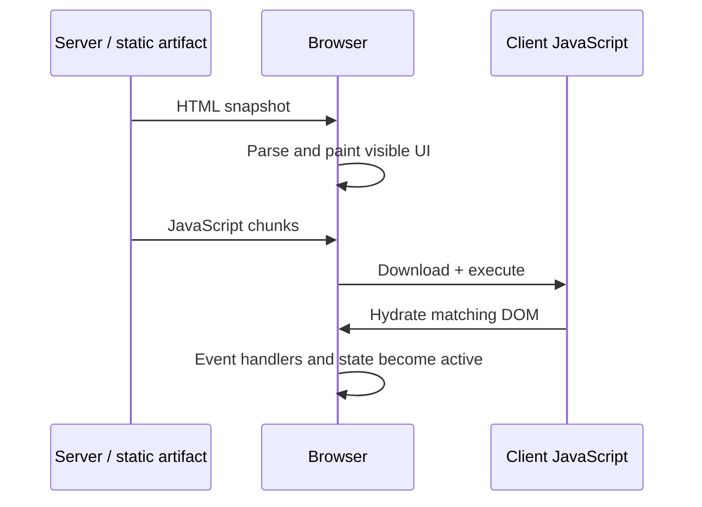
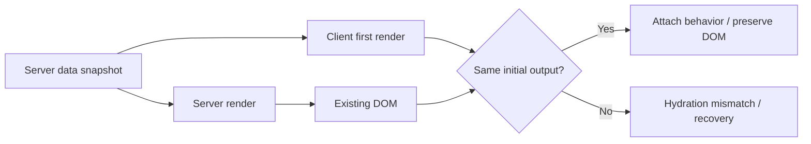
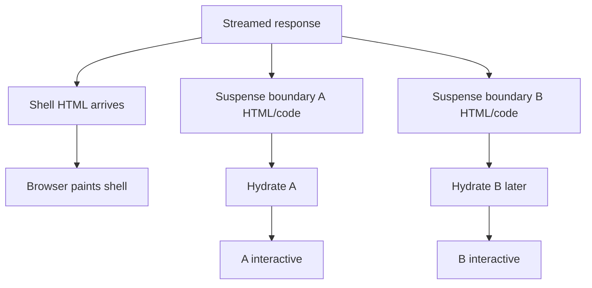

# Hydration: Turn Rendered HTML into an Interactive App

## TL;DR

Server rendering can make HTML visible before the browser has loaded and executed the application runtime. **Hydration is the client-side step that attaches component logic and event behavior to that existing HTML so the UI can become interactive.**

Visible HTML and an interactive application are therefore different milestones.

<TermBox term="Hydration">
**Hydration** is the process of attaching client-side component logic to HTML that was rendered earlier on the server or during prerendering, while reusing the existing DOM instead of replacing it from scratch.
</TermBox>

## The hydration gap

The browser can parse and display server HTML before the JavaScript required for interaction is ready. During that interval, the page may look complete while buttons, controlled widgets, or client state are not fully active yet.

<TermBox term="Hydration gap">
The **hydration gap** is the interval between useful HTML becoming visible and the relevant client-side behavior becoming ready. Network transfer, JavaScript size, parsing, compilation, execution, and main-thread contention can all widen it.
</TermBox>

Hydration is therefore a performance boundary, not merely a framework implementation detail. Moving HTML earlier with SSR or SSG does not automatically move interactivity equally early.

## Hydration reuses a snapshot; it does not invent a second page

React's `hydrateRoot` attaches React to DOM whose HTML was already produced by React on the server. The client component tree is expected to describe the **same initial UI**.

This identity requirement explains many hydration bugs: the server and browser are not allowed to independently choose different initial truths and still expect deterministic attachment.

## Why mismatches happen

Common causes are values or branches that differ between the server render and the client's first render:

- `Date.now()`, `new Date()`, or `Math.random()` during render;
- formatting with a browser locale or timezone different from the server;
- branching on `window`, `localStorage`, `matchMedia`, or other browser-only APIs while rendering;
- fetching changing external data twice without transferring the server snapshot to the client;
- invalid HTML nesting that the browser repairs into a DOM shape different from the intended React tree;
- extensions, middleware, or edge transformations that mutate HTML before hydration.

A mismatch is not merely a noisy console warning. React documents that some mismatches can force recovery work, slow startup, or in bad cases associate behavior with unexpected elements.

## Deterministic first render, then browser-specific updates

The usual pattern is:

1. produce a deterministic server snapshot;
2. serialize or otherwise provide the same required initial state to the client;
3. make the client's first render reproduce that snapshot;
4. after hydration, update browser-only or newly fresh state through Effects, events, subscriptions, or later data fetches.

For example, render a stable timestamp or locale chosen by the server first. If the browser must later display a local timezone, change it after hydration rather than letting server and client independently format the first frame.

<TermBox term="Initial render contract">
The **initial render contract** is the requirement that server-rendered markup and the client's first render describe compatible output. Later client updates may differ; the first hydration pass must not begin from a contradictory tree.
</TermBox>

## `suppressHydrationWarning` is not a repair strategy

React provides `suppressHydrationWarning` for narrowly unavoidable differences, such as a known timestamp. It only suppresses a warning at a shallow boundary and is documented as an escape hatch.

Using it across a component tree because server and client data pipelines disagree hides evidence instead of fixing the contract. Prefer deterministic input, delayed browser-only rendering, or an intentionally client-only boundary when the content truly cannot be rendered consistently on the server.

## Streaming changes arrival order, not the identity rule

Streaming server rendering can send useful HTML in pieces. Suspense boundaries can let React progressively reveal content and support **selective hydration**, so one boundary may become interactive while another still waits for code or data.

But streaming is not "no hydration." Interactive client regions still need their runtime and a compatible first render. Smaller/selective boundaries can reduce blocking, but they do not make mismatches safe.

## Hydration cost is client work

A page can have fast TTFB and still feel unresponsive if the browser must download a large client bundle and hydrate a large tree on a busy main thread.

Useful signals include:

- JavaScript bytes and chunk arrival time;
- long tasks during startup;
- time from first content to relevant interaction readiness;
- recoverable hydration errors and mismatch reports;
- which boundaries require client JavaScript at all.

The next architectural question is often not "How do we hydrate faster?" but "Which parts genuinely need client-side interactivity and state?"

## Production scenario

An SSR product page renders price, "updated at" text, and localized availability on the server. The browser's first render calls `Date.now()`, reads `navigator.language`, and immediately refetches stock. The initial client tree therefore differs from the HTML already on screen.

**Impact:** development reports hydration warnings, production performs recovery work, text/layout visibly changes during startup, and interactions become unpredictable on slow devices.

**Root cause:** the server HTML and client first render used different clocks, locale inputs, and data snapshots. The team treated hydration as "React will reconcile whatever is there" rather than an initial identity contract.

**Correct pattern:** render from one deterministic snapshot, transfer the required state to the client, reproduce that snapshot on the first render, then refresh browser-specific locale or fresher stock after hydration. Use client-only boundaries only where server output genuinely cannot be stable.

## Debugging workflow

When hydration fails, debug the **first render**, not the eventual settled UI:

1. capture the server HTML or server-side data snapshot;
2. identify the component named by the hydration warning or recoverable error;
3. compare that HTML with what the client would render before Effects run;
4. remove nondeterministic values and browser-only branches from render-time decisions;
5. verify both sides receive the same initial data and identifiers;
6. validate HTML nesting;
7. only then examine extensions, proxies, CDN transforms, or framework-specific recovery behavior.

## Self-check

A server renders `10:00`. Before hydration, one minute passes and the client first render produces `10:01`. The value is semantically newer. Is the mismatch harmless?

Show the reasoning

No. Hydration compares the server snapshot with the client's **initial** render, not with whichever value is newest. The first client output should reproduce `10:00`; after hydration the component may update to `10:01`. If real-time time text cannot be stable, isolate it behind an intentional client-update strategy rather than allowing the first trees to disagree.

## Hydration checklist

- [ ] Treat visible HTML and interaction readiness as separate milestones.
- [ ] Make the client first render reproduce the server snapshot.
- [ ] Keep time, randomness, locale, and browser-only APIs out of nondeterministic first-render branches.
- [ ] Transfer server-fetched data needed for the initial client tree instead of independently refetching before hydration.
- [ ] Validate HTML nesting when the DOM shape looks surprising.
- [ ] Use `suppressHydrationWarning` only for narrow, understood exceptions.
- [ ] Measure JavaScript/main-thread hydration cost, not only TTFB.
- [ ] Use streaming/selective hydration boundaries to schedule work, not to excuse mismatched output.

## Agent rule

When diagnosing a hydration bug, compare the exact server snapshot with the client's first render before Effects or later fetches. Fix the first point where their inputs or tree diverge; do not silence a systemic mismatch with `suppressHydrationWarning`.

## Sources

Primary references verified on **2026-09-15**:

- [React — `hydrateRoot`](https://react.dev/reference/react-dom/client/hydrateRoot)
- [React — Suspense](https://react.dev/reference/react/Suspense)
- [Next.js — Text content does not match server-rendered HTML](https://nextjs.org/docs/messages/react-hydration-error)
- [Next.js Learn — Pre-rendering](https://nextjs.org/learn/pages-router/data-fetching-pre-rendering)
