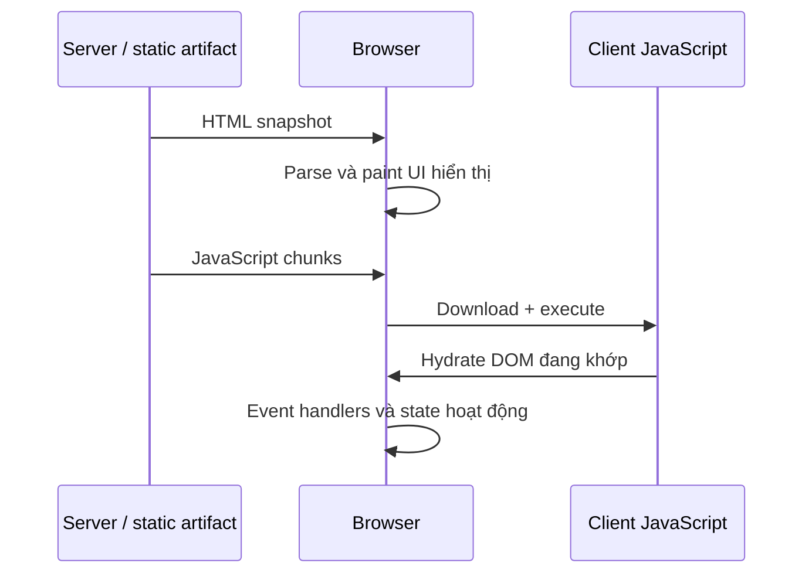
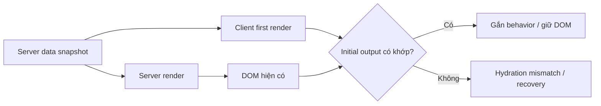
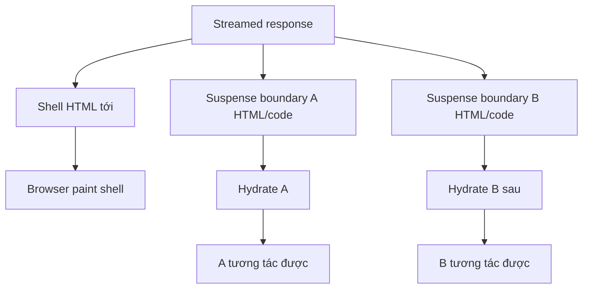

# Hydration: Biến HTML render sẵn thành ứng dụng tương tác

## Tóm tắt

Trong đợt mở bán flash sale, một khách hàng bấm liên tục 5 lần vào nút "Mua ngay" trong hai giây đầu tiên khi trang web vừa hiện ra. Nút bấm trông có vẻ đã tải xong, nhưng không hề có phản hồi—cho đến khi gói JavaScript 1.5MB tải xong, bảng điều khiển console nổ tung hàng loạt cảnh báo hydration mismatch, giao diện bị xóa bỏ rồi render lại từ đầu trên client, và tài khoản của khách hàng bị trừ tiền 5 lần liên tiếp. Nguyên nhân? Người dùng rơi vào **khoảng trống hydration** (hydration gap) giữa lúc mắt nhìn thấy và lúc sự kiện được gắn, kết hợp với sự sai lệch dữ liệu giữa server và client kích hoạt cơ chế phá hủy DOM tốn kém.

> 💡 **Quy tắc bỏ túi:** **HTML hiển thị được không đồng nghĩa với UI đã sẵn sàng tương tác.** Hydration tái sử dụng các node DOM sẵn có từ server thay vì tạo lại từ đầu; bất kỳ sự sai lệch nào giữa output server và lượt render đầu tiên của client đều buộc trình duyệt phải chạy quy trình phục hồi tốn kém, xóa bỏ DOM và giam giữ người dùng trong khoảng trống hydration.

- **Hai cột mốc riêng biệt:** Server render tạo ra HTML hiển thị (FCP); hydration gắn event handler và reactive state vào các node DOM có sẵn để đạt trạng thái tương tác hoàn chỉnh (TTI).
- **Khoảng trống hydration (Hydration gap):** Độ trễ giữa lúc HTML được vẽ lên màn hình và lúc listener sẵn sàng—bị kéo dài bởi bundle JavaScript quá lớn, CPU luồng chính bị nghẽn và thiếu streaming SSR.
- **Tác nhân gây hydration mismatch:** Sai lệch giữa server snapshot và client first render (ví dụ: `Date.now()`, `Math.random()`, `window`/`localStorage`, sự khác biệt về locale, hoặc lồng thẻ HTML không hợp lệ).
- **Cái giá của việc phục hồi mismatch:** Khi client render khác với HTML máy chủ, framework buộc phải hủy bỏ các node DOM cũ và tái tạo lại toàn bộ cây DOM, gây giật lag giao diện (layout shift).
- **Cạm bẫy chết người:** Dùng `suppressHydrationWarning` để che giấu cảnh báo console thay vì xử lý tận gốc nguyên nhân lệch dữ liệu hoặc trì hoãn logic máy khách sau khi component đã mount.

<TermBox term="Hydration">
**Hydration** là quá trình gắn component logic phía client vào HTML đã được render trước trên server hoặc trong bước prerender, đồng thời tái sử dụng DOM hiện có thay vì dựng lại toàn bộ từ đầu.
</TermBox>

## Hydration gap

Trình duyệt có thể parse và hiển thị server HTML trước khi JavaScript cần cho tương tác sẵn sàng. Trong khoảng đó, trang có thể trông hoàn chỉnh nhưng button, controlled widget hoặc client state chưa hoạt động đầy đủ.

<TermBox term="Hydration gap">
**Hydration gap** là khoảng thời gian giữa lúc HTML hữu ích bắt đầu hiển thị và lúc behavior phía client liên quan sẵn sàng. Network transfer, JavaScript size, parse, compile, execute và tranh chấp luồng chính đều có thể kéo dài khoảng này.
</TermBox>

Vì vậy hydration là một performance boundary, không chỉ là chi tiết triển khai của framework. Đưa HTML tới sớm hơn bằng SSR hoặc SSG không tự động đưa interactivity tới sớm tương ứng.

## Hydration tái sử dụng một snapshot; không tạo một trang thứ hai

`hydrateRoot` của React gắn React vào DOM có HTML đã được React tạo trên server. Client component tree phải mô tả **cùng initial UI**.

Yêu cầu về identity này giải thích nhiều hydration bug: server và browser không thể tự chọn hai initial truth khác nhau rồi vẫn kỳ vọng việc attachment diễn ra deterministic.

## Vì sao mismatch xảy ra

Nguyên nhân phổ biến là value hoặc branch khác nhau giữa server render và first render phía client:

- `Date.now()`, `new Date()` hoặc `Math.random()` trong render;
- format bằng locale hoặc timezone của browser khác server;
- branch theo `window`, `localStorage`, `matchMedia` hoặc browser-only API trong lúc render;
- fetch external data thay đổi hai lần mà không chuyển server snapshot sang client;
- lồng HTML không hợp lệ khiến browser tự sửa thành DOM shape khác React tree dự kiến;
- extension, middleware hoặc edge transformation sửa HTML trước hydration.

Mismatch không chỉ là console warning gây khó chịu. React ghi rõ một số mismatch có thể buộc recovery work, làm startup chậm hơn hoặc trong trường hợp xấu gắn behavior vào element không như dự kiến.

## First render deterministic, rồi mới cập nhật state riêng của browser

Pattern thường dùng là:

1. tạo một server snapshot deterministic;
2. serialize hoặc cung cấp cùng initial state cần thiết cho client;
3. để first render phía client tái tạo snapshot đó;
4. sau hydration mới cập nhật browser-only hoặc fresh state qua Effect, event, subscription hoặc later data fetch.

Ví dụ, hãy render timestamp hoặc locale ổn định do server chọn ở frame đầu. Nếu browser cần đổi sang local timezone, cập nhật sau hydration thay vì để server và client tự format frame đầu độc lập.

<TermBox term="Initial render contract">
**Initial render contract** là yêu cầu server-rendered markup và first render phía client mô tả output tương thích. Client update về sau có thể khác; hydration pass đầu tiên không được bắt đầu từ hai tree mâu thuẫn.
</TermBox>

## `suppressHydrationWarning` không phải chiến lược sửa lỗi

React cung cấp `suppressHydrationWarning` cho những khác biệt hẹp, thật sự khó tránh như một timestamp đã biết trước. Nó chỉ suppress warning ở boundary nông và được tài liệu mô tả như một escape hatch.

Dùng nó trên cả component tree vì server và client data pipeline bất đồng chỉ che mất bằng chứng. Hãy ưu tiên input deterministic, trì hoãn browser-only rendering, hoặc dùng client-only boundary có chủ đích khi nội dung thực sự không thể render ổn định trên server.

## Streaming đổi thứ tự nội dung tới, không bỏ identity rule

Streaming server rendering có thể gửi HTML hữu ích theo từng phần. Suspense boundary có thể cho React reveal dần nội dung và hỗ trợ **selective hydration**, để một boundary trở nên tương tác được trong khi boundary khác vẫn chờ code hoặc data.

Nhưng streaming không có nghĩa là "không cần hydration". Client region có tương tác vẫn cần runtime và first render tương thích. Boundary nhỏ/selective có thể giảm blocking, nhưng không làm mismatch trở nên an toàn.

## Chi phí hydration là client work

Một trang có thể TTFB nhanh nhưng vẫn cảm giác không phản hồi nếu browser phải tải bundle client lớn và hydrate một tree lớn trên luồng chính đang bận.

Các tín hiệu hữu ích gồm:

- số byte JavaScript và thời điểm chunk tới;
- long task trong startup;
- thời gian từ first content tới lúc interaction quan trọng sẵn sàng;
- recoverable hydration error và mismatch report;
- boundary nào thực sự cần client JavaScript.

Câu hỏi kiến trúc tiếp theo thường không phải "Làm hydration nhanh hơn thế nào?" mà là "Phần nào thật sự cần client-side interactivity và state?"

## Production scenario

Một SSR product page render price, text "updated at" và localized availability trên server. First render trong browser lại gọi `Date.now()`, đọc `navigator.language` và refetch stock ngay lập tức. Client tree đầu tiên vì thế khác HTML đang hiển thị.

**Hậu quả:** development báo hydration warning, production phải làm recovery work, text/layout thay đổi thấy rõ lúc startup và interaction trở nên khó đoán trên thiết bị chậm.

**Nguyên nhân cốt lõi:** server HTML và client first render dùng clock, locale input và data snapshot khác nhau. Team xem hydration như "React sẽ reconcile bất cứ thứ gì đang có" thay vì một initial identity contract.

**Cách khắc phục chuẩn:** render từ một deterministic snapshot, chuyển state cần thiết sang client, tái tạo snapshot đó ở first render rồi mới refresh browser-specific locale hoặc stock mới hơn sau hydration. Chỉ dùng client-only boundary ở nơi server output thật sự không thể ổn định.

## Workflow debug

Khi hydration fail, hãy debug **first render**, không phải UI cuối cùng sau khi đã settle:

1. capture server HTML hoặc server-side data snapshot;
2. xác định component được hydration warning hoặc recoverable error chỉ ra;
3. so sánh HTML đó với output client sẽ render trước khi Effect chạy;
4. loại nondeterministic value và browser-only branch khỏi quyết định trong render;
5. kiểm tra hai phía nhận cùng initial data và identifier;
6. validate cách lồng HTML;
7. sau cùng mới kiểm extension, proxy, CDN transform hoặc framework recovery behavior.

## Self-check

Server render `10:00`. Trước hydration trôi qua một phút và client first render ra `10:01`. Giá trị mới hơn về mặt ngữ nghĩa. Mismatch này có vô hại không?

Xem giải thích chi tiết

Không. Hydration so server snapshot với **initial** render phía client, không so với giá trị nào mới nhất. First client output nên tái tạo `10:00`; sau hydration component có thể cập nhật thành `10:01`. Nếu text thời gian realtime không thể ổn định, hãy cô lập nó sau một chiến lược client update có chủ đích thay vì cho hai tree đầu tiên bất đồng.

## Checklist hydration

- [ ] Tách HTML đã hiển thị khỏi mốc interaction sẵn sàng.
- [ ] Làm client first render tái tạo server snapshot.
- [ ] Không để time, randomness, locale và browser-only API tạo nondeterministic branch ở first render.
- [ ] Chuyển server-fetched data cần cho initial client tree thay vì refetch độc lập trước hydration.
- [ ] Validate HTML nesting khi DOM shape khác dự kiến.
- [ ] Chỉ dùng `suppressHydrationWarning` cho ngoại lệ hẹp và đã hiểu rõ.
- [ ] Đo JavaScript/main-thread hydration cost, không chỉ TTFB.
- [ ] Dùng streaming/selective hydration boundary để schedule work, không để biện minh cho output mismatch.

## Agent rule

Khi chẩn đoán hydration bug, hãy so sánh chính xác server snapshot với client first render trước Effect hoặc later fetch. Sửa điểm đầu tiên nơi input hoặc tree phân kỳ; không che một mismatch có tính hệ thống bằng `suppressHydrationWarning`.

## Nguồn tham khảo

Các nguồn chính được kiểm tra ngày **2026-09-15**:

- [React — `hydrateRoot`](https://react.dev/reference/react-dom/client/hydrateRoot)
- [React — Suspense](https://react.dev/reference/react/Suspense)
- [Next.js — Text content does not match server-rendered HTML](https://nextjs.org/docs/messages/react-hydration-error)
- [Next.js Learn — Pre-rendering](https://nextjs.org/learn/pages-router/data-fetching-pre-rendering)
