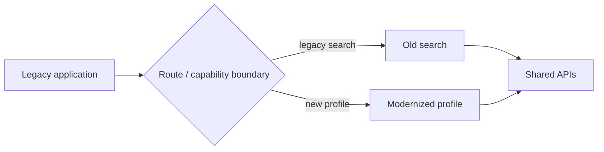
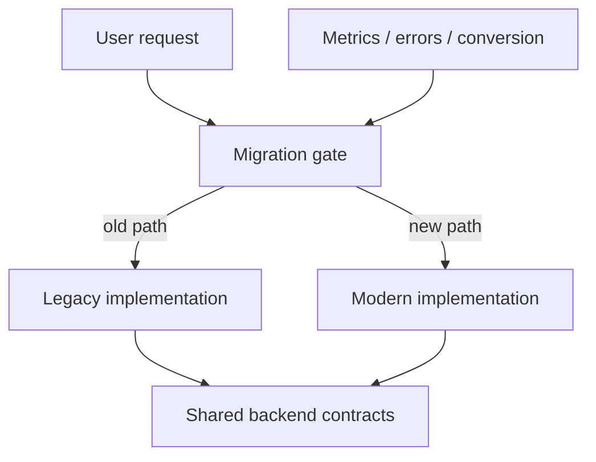
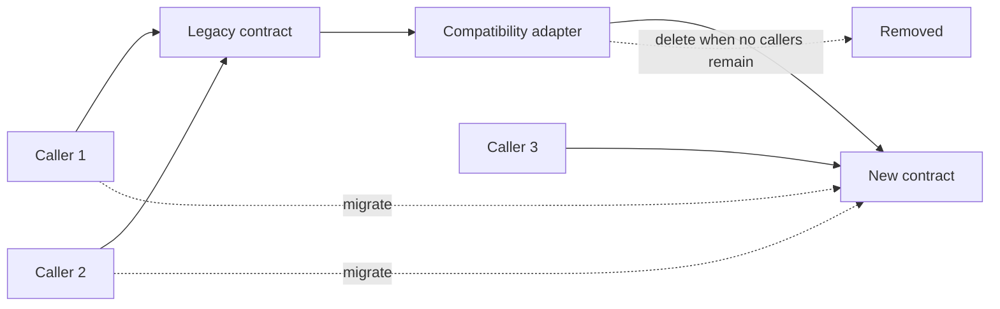

# Incremental Frontend Migration: Strangler Patterns, Compatibility Boundaries, and Cutovers

## TL;DR

A legacy frontend rewrite is risky because the old application keeps changing while the new one is being rebuilt. Requirements drift, hidden behaviors emerge late, and the final cutover concentrates months of uncertainty into one release.

Incremental migration takes the opposite approach: move behavior across explicit seams, let old and new coexist temporarily, and release small slices frequently enough that you can observe, rollback, and learn.

> 💡 **Rule of thumb:** **Move one business capability or user journey at a time, and keep the routing decision explicit.** A migration is healthy when every temporary bridge has a deletion condition.

- Choose seams by product behavior, not file layout.
- Prefer vertical slices that can deliver independently.
- Use adapters and routing boundaries to let old and new code coexist.
- Roll out with explicit ownership, telemetry, and rollback.
- Delete transitional code once the cutover is proven.
- **Fatal pitfall:** building a complete replacement in parallel for months while the legacy application continues to evolve.

<TermBox term="Incremental migration">
An **incremental migration** replaces a legacy system in small independently deliverable parts instead of requiring one complete cutover.

**Why it matters:** each step creates production evidence and limits the amount of uncertainty carried into the next release.
</TermBox>

<TermBox term="Transitional architecture">
**Transitional architecture** is temporary code, routing, adapters, or data bridges that allow old and new implementations to coexist during migration.

**Why it matters:** temporary architecture is acceptable when it reduces rollout risk and has an explicit deletion condition.
</TermBox>

## Choose the migration unit

A common mistake is to migrate by technical layer:

```text
first all components
then all Redux
then all API code
then all routing
```

That can leave every user journey half-migrated for months.

Prefer a vertical unit where behavior can be verified end-to-end:



Good migration units include:

- one route;
- one workflow;
- one domain capability;
- one independently owned widget;
- one user cohort when routing can be controlled safely.

The right unit is the smallest slice that can still produce meaningful product evidence.

## Use a strangler-style edge

Martin Fowler's Strangler Fig metaphor describes gradual modernization where new capability grows around and replaces parts of the legacy system over time.

In a frontend, the interception point can be:

- router configuration;
- server/reverse-proxy routing;
- shell composition;
- feature flag;
- component adapter;
- module boundary;
- navigation entry point.



The migration gate must be observable and understandable. If nobody knows which implementation serves which user, debugging becomes harder than before.

## Compatibility boundaries should shrink

A temporary bridge might convert old state into a new component contract:

```ts
function LegacyCheckoutAdapter({ legacyCart }) {
  const cart = toModernCart(legacyCart);
  return <ModernCheckout cart={cart} />;
}
```

This can be useful during migration.

It becomes dangerous when the adapter accumulates product behavior and turns into a permanent second domain model.

Track:

- which callers still need it;
- which fields are translated;
- what behavior remains unsupported;
- when it can be deleted.



## Feature flags are rollout controls, not architecture

A feature flag can choose old or new behavior for:

- internal users;
- a percentage of traffic;
- a tenant;
- a region;
- a route;
- a named migration cohort.

But the flag should not become the permanent abstraction.

Bad long-lived shape:

```ts
if (flags.newCheckout) {
  if (flags.newPricing) {
    if (flags.newValidation) {
      // ...
    }
  }
}
```

That creates a combinatorial system.

Prefer one migration decision around a coherent capability, and remove the old branch after rollout completes.

## Design rollback before rollout

Rollback is not "git revert" when a migration includes:

- new browser state;
- changed URLs;
- new API contracts;
- new persisted data;
- changed authentication/session behavior.

Before rollout, ask:

1. can users safely move back to the old implementation?
2. does the old implementation understand state created by the new one?
3. are API changes backward-compatible during the window?
4. will old and new clients be active simultaneously?
5. what telemetry tells us to stop?

For browser-only presentation changes, rollback may be simple. For persisted workflow or contract changes, it can require explicit backward compatibility.

## Migrate ownership, not only rendering

A route can look modern while still depending on every legacy subsystem.

Example:

```text
New React page
  -> legacy Redux store
  -> legacy API service
  -> legacy analytics wrapper
  -> legacy permission helper
  -> legacy CSS globals
```

That may be a valid first step, but it is not the migration finish line.

Define completion criteria such as:

- legacy state dependency removed;
- obsolete package removed;
- old route deleted;
- compatibility adapter deleted;
- old flag deleted;
- old tests deleted or replaced;
- operational ownership moved.

## Keep migration direction one-way where possible

Bidirectional synchronization is expensive:

```text
old state <-> new state
old route <-> new route
old cache <-> new cache
```

Every two-way bridge doubles synchronization behavior and failure modes.

Prefer one authoritative direction during a migration stage. If bidirectional migration is required for rollback, bound the window and test both directions explicitly.

## Production micro-scenario: the two-year rewrite

A company starts a greenfield replacement for a large React SPA. Eighteen months later the old application has gained new pricing rules, permissions, and customer workflows. The replacement team spends increasing time reimplementing moving targets. The final release requires migrating every route, role, and integration at once.

- **Impact:** the cutover slips repeatedly, regression risk grows, and the new application inherits duplicated legacy behavior before producing business value.
- **Root cause:** modernization was structured as a complete replacement rather than a sequence of independently delivered capabilities.
- **Correct pattern:** define product seams, route one capability at a time to the new implementation, keep old/new contracts compatible during each slice, observe production behavior, then delete the old path before starting the next high-risk slice.

## Check your mental model

> **Scenario:** You have migrated the account page to a new React architecture behind a feature flag. After 100% rollout, the old account route, adapter, tests, and flag remain because "they might be useful for rollback someday." Is the migration complete?

<details>
<summary>Show the reasoning</summary>

No.

A migration that never deletes its temporary path creates permanent dual architecture. After a defined confidence window, either the old path is still required and should have explicit ownership, or it should be removed. Rollback capability is valuable during rollout; indefinite dormant compatibility code becomes new technical debt.

</details>

## Incremental migration checklist

- [ ] **Outcome:** State the product or engineering outcome the migration must improve.
- [ ] **Unit:** Choose a route, workflow, capability, or cohort that can deliver independently.
- [ ] **Gate:** Make the old/new routing decision explicit and observable.
- [ ] **Contract:** Keep shared APIs and persisted state backward-compatible during coexistence.
- [ ] **Adapter:** Bound temporary translation logic and define its deletion condition.
- [ ] **Rollout:** Start with a controlled cohort where feature impact can be measured.
- [ ] **Rollback:** Verify old code can safely resume before exposing users.
- [ ] **Telemetry:** Compare errors, performance, business outcomes, and support signals.
- [ ] **Ownership:** Move state, dependencies, tests, and operational responsibility—not only UI rendering.
- [ ] **Deletion:** Remove the old path, migration flag, compatibility code, and stale tests after the confidence window.

## Sources

- [Martin Fowler — Strangler Fig](https://martinfowler.com/bliki/StranglerFigApplication.html)
- [Martin Fowler — Original Strangler Fig Application](https://martinfowler.com/bliki/OriginalStranglerFigApplication.html)
- [Martin Fowler — Using the Strangler Fig with Mobile Apps](https://martinfowler.com/articles/strangler-fig-mobile-apps.html)
- [React — Choosing the State Structure](https://react.dev/learn/choosing-the-state-structure)
