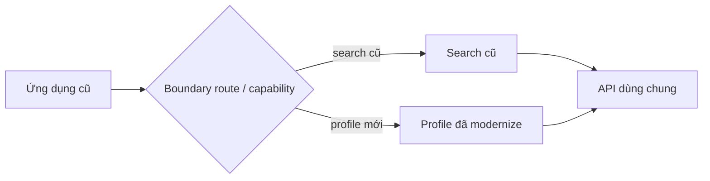
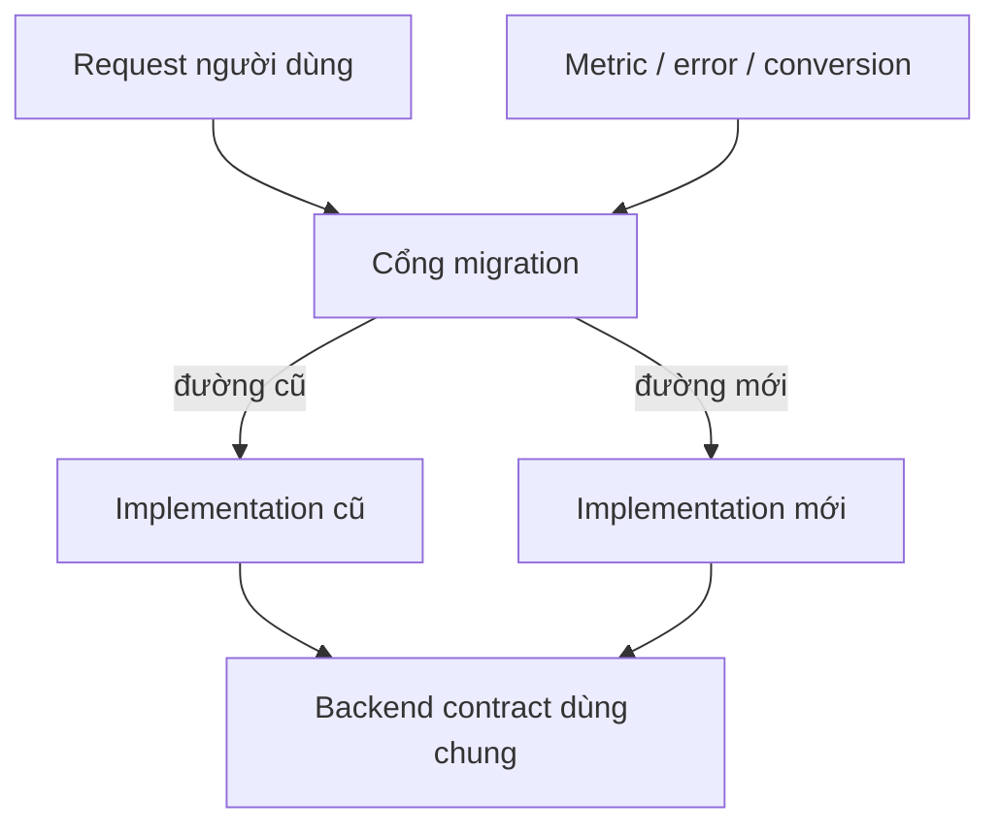
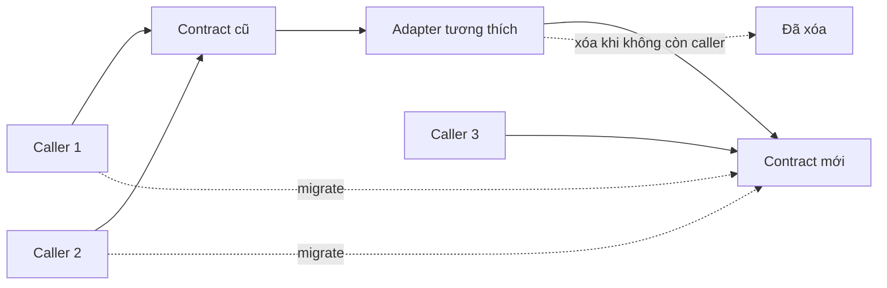

# Migration Frontend Tăng dần: Strangler Pattern, Boundary Tương thích và Cutover

## Tóm tắt

Rewrite một frontend cũ rất rủi ro vì ứng dụng cũ vẫn tiếp tục thay đổi trong lúc hệ thống mới được xây lại. Requirement trôi, behavior ẩn xuất hiện muộn và final cutover dồn hàng tháng uncertainty vào một release.

Migration tăng dần làm ngược lại: di chuyển behavior qua seam rõ ràng, cho old và new cùng sống tạm thời, và release các slice đủ nhỏ để quan sát, rollback và học.

> 💡 **Quy tắc thực hành:** **Di chuyển từng business capability hoặc user journey và giữ routing decision thật rõ.** Migration khỏe mạnh khi mọi bridge tạm đều có điều kiện xóa.

- Chọn seam theo product behavior, không theo layout thư mục.
- Ưu tiên vertical slice có thể deliver độc lập.
- Dùng adapter và routing boundary để code cũ và mới cùng tồn tại.
- Rollout với ownership, telemetry và rollback rõ.
- Xóa code chuyển tiếp sau khi cutover được chứng minh.
- **Sai lầm chí mạng:** xây replacement hoàn chỉnh song song nhiều tháng trong khi legacy app vẫn tiếp tục thay đổi.

<TermBox term="Migration tăng dần">
**Migration tăng dần** thay một hệ thống cũ bằng những phần nhỏ có thể deliver độc lập thay vì yêu cầu một cutover hoàn chỉnh.

**Tại sao quan trọng:** mỗi bước tạo bằng chứng production và giới hạn uncertainty mang sang release tiếp theo.
</TermBox>

<TermBox term="Kiến trúc chuyển tiếp">
**Kiến trúc chuyển tiếp** là code, routing, adapter hoặc data bridge tạm cho phép implementation cũ và mới cùng sống trong migration.

**Tại sao quan trọng:** kiến trúc tạm là chấp nhận được khi nó giảm rollout risk và có điều kiện xóa rõ.
</TermBox>

## Chọn đơn vị migration

Sai lầm thường gặp là migrate theo technical layer:

```text
đầu tiên mọi component
sau đó mọi Redux
sau đó mọi API code
sau đó mọi routing
```

Cách này có thể khiến mọi user journey ở trạng thái nửa cũ nửa mới suốt nhiều tháng.

Ưu tiên vertical unit nơi behavior có thể verify end-to-end:



Đơn vị migration tốt gồm:

- một route;
- một workflow;
- một domain capability;
- một widget có ownership độc lập;
- một cohort user khi có thể route an toàn.

Đơn vị đúng là slice nhỏ nhất vẫn tạo được product evidence có ý nghĩa.

## Dùng edge kiểu Strangler Fig

Ẩn dụ Strangler Fig của Martin Fowler mô tả modernization tăng dần: capability mới phát triển quanh và thay từng phần hệ thống cũ theo thời gian.

Trong frontend, interception point có thể là:

- router;
- reverse proxy;
- app shell;
- feature flag;
- component adapter;
- module boundary;
- navigation entry point.



Migration gate phải observable và dễ hiểu. Nếu không ai biết user nào đang được phục vụ bởi implementation nào thì debugging còn khó hơn trước.

## Compatibility boundary phải thu nhỏ dần

Bridge tạm có thể chuyển state cũ sang contract component mới:

```ts
function LegacyCheckoutAdapter({ legacyCart }) {
  const cart = toModernCart(legacyCart);
  return <ModernCheckout cart={cart} />;
}
```

Điều này có thể hữu ích trong migration.

Nó trở nên nguy hiểm khi adapter tích tụ product behavior và biến thành domain model thứ hai vĩnh viễn.

Hãy theo dõi:

- caller nào còn cần nó;
- field nào đang translate;
- behavior nào chưa hỗ trợ;
- khi nào có thể xóa.



## Feature flag là rollout control, không phải architecture

Feature flag có thể chọn behavior cũ hoặc mới cho:

- user nội bộ;
- phần trăm traffic;
- tenant;
- region;
- route;
- migration cohort cụ thể.

Nhưng flag không nên trở thành abstraction vĩnh viễn.

Shape lâu dài không tốt:

```ts
if (flags.newCheckout) {
  if (flags.newPricing) {
    if (flags.newValidation) {
      // ...
    }
  }
}
```

Cách này tạo hệ thống tổ hợp.

Ưu tiên một migration decision quanh capability thống nhất, rồi xóa old branch sau rollout.

## Thiết kế rollback trước rollout

Rollback không chỉ là `git revert` khi migration có:

- browser state mới;
- URL mới;
- API contract mới;
- persisted data mới;
- session hoặc auth behavior mới.

Trước rollout, hỏi:

1. user có thể quay lại implementation cũ an toàn không?
2. implementation cũ có hiểu state do implementation mới tạo không?
3. API change có backward-compatible trong thời gian cùng tồn tại không?
4. old/new client có active đồng thời không?
5. telemetry nào buộc dừng rollout?

Presentation-only change thường rollback đơn giản. Persisted workflow hoặc contract change có thể cần backward compatibility rõ.

## Migrate ownership, không chỉ migrate rendering

Route có thể nhìn hiện đại nhưng vẫn phụ thuộc mọi subsystem cũ.

Ví dụ:

```text
React page mới
  -> Redux store cũ
  -> API service cũ
  -> analytics wrapper cũ
  -> permission helper cũ
  -> global CSS cũ
```

Đây có thể là first step hợp lệ nhưng không phải finish line.

Định nghĩa completion criteria như:

- bỏ dependency state cũ;
- xóa package lỗi thời;
- xóa route cũ;
- xóa compatibility adapter;
- xóa flag cũ;
- xóa hoặc thay test cũ;
- chuyển operational ownership.

## Giữ migration một chiều khi có thể

Đồng bộ hai chiều rất đắt:

```text
old state <-> new state
old route <-> new route
old cache <-> new cache
```

Mỗi bridge hai chiều nhân đôi behavior đồng bộ và failure mode.

Ưu tiên một authoritative direction trong từng stage. Nếu cần bidirectional migration cho rollback, giới hạn thời gian và test rõ cả hai chiều.

## Tình huống production: rewrite hai năm

Một công ty bắt đầu greenfield replacement cho SPA React lớn. Mười tám tháng sau app cũ đã thêm pricing rule, permission và customer workflow mới. Team replacement ngày càng dành nhiều thời gian reimplement moving target. Final release phải migrate mọi route, role và integration cùng lúc.

- **Hậu quả:** cutover liên tục trễ, regression risk tăng và app mới kế thừa nhiều legacy behavior trước khi tạo business value.
- **Nguyên nhân cốt lõi:** modernization được tổ chức như complete replacement thay vì chuỗi capability deliver độc lập.
- **Cách khắc phục chuẩn:** định nghĩa product seam, route từng capability sang implementation mới, giữ contract tương thích trong thời gian cùng tồn tại, quan sát production rồi xóa đường cũ trước khi sang slice rủi ro tiếp theo.

## Kiểm tra mental model

> **Tình huống:** Account page đã migrate sang React architecture mới sau feature flag. Sau 100% rollout, route cũ, adapter, test cũ và flag vẫn còn vì "có thể cần rollback sau này". Migration đã xong chưa?

<details>
<summary>Xem giải thích chi tiết</summary>

Chưa.

Migration không bao giờ xóa temporary path sẽ tạo dual architecture vĩnh viễn. Sau confidence window đã định nghĩa, hoặc old path vẫn thật sự cần và phải có ownership rõ, hoặc nó phải bị xóa. Rollback capability có giá trị trong rollout; dormant compatibility code vô thời hạn trở thành technical debt mới.

</details>

## Checklist migration tăng dần

- [ ] **Kết quả:** Nói rõ product hoặc engineering outcome cần cải thiện.
- [ ] **Đơn vị:** Chọn route, workflow, capability hoặc cohort deliver độc lập.
- [ ] **Cổng:** Làm old/new routing decision rõ và observable.
- [ ] **Contract:** Giữ API và persisted state backward-compatible trong lúc cùng tồn tại.
- [ ] **Adapter:** Giới hạn translation logic tạm và định nghĩa điều kiện xóa.
- [ ] **Rollout:** Bắt đầu với cohort kiểm soát được và đo được tác động.
- [ ] **Rollback:** Verify code cũ có thể tiếp quản lại an toàn trước khi expose user.
- [ ] **Telemetry:** So error, performance, business outcome và support signal.
- [ ] **Ownership:** Di chuyển state, dependency, test và operational responsibility chứ không chỉ UI.
- [ ] **Xóa bỏ:** Xóa old path, migration flag, compatibility code và stale test sau confidence window.

## Nguồn tham khảo

- [Martin Fowler — Strangler Fig](https://martinfowler.com/bliki/StranglerFigApplication.html)
- [Martin Fowler — Original Strangler Fig Application](https://martinfowler.com/bliki/OriginalStranglerFigApplication.html)
- [Martin Fowler — Using the Strangler Fig with Mobile Apps](https://martinfowler.com/articles/strangler-fig-mobile-apps.html)
- [React — Choosing the State Structure](https://react.dev/learn/choosing-the-state-structure)
