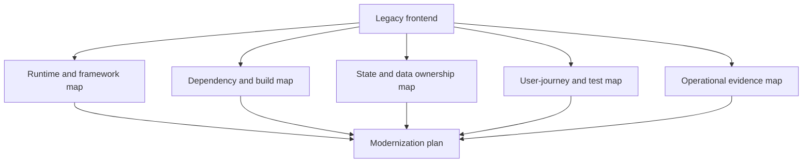
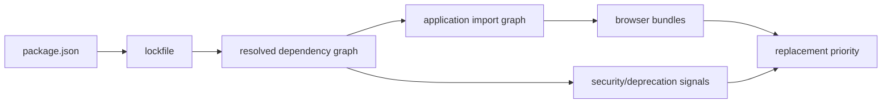
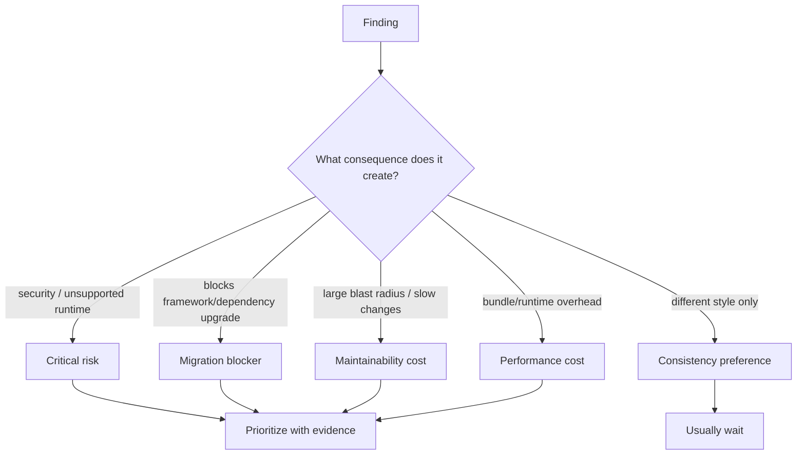

# Legacy Frontend Assessment: Map the System Before You Upgrade

## TL;DR

A seven-year-old React application can look like "React plus Redux" while actually containing several generations of assumptions: class components next to hooks, legacy context next to modern providers, hand-written Redux next to Redux Toolkit, JavaScript next to TypeScript, multiple styling systems, abandoned packages, beta dependencies, custom wrappers, and build scripts nobody wants to touch.

The first modernization task is therefore **not an upgrade**. It is building an evidence-backed map of the system so you know what can change independently, what is coupled, and what must be protected before you move it.

> 💡 **Rule of thumb:** **Inventory before intervention.** Do not start by bumping React, replacing Redux, or deleting "ugly" abstractions. First map runtime versions, dependency reachability, ownership, critical user journeys, production signals, and rollback boundaries.

- Treat the application as a graph of responsibilities and dependencies, not a pile of old files.
- Separate **obsolete**, **risky**, **expensive**, and merely **unfamiliar** code.
- Record current behavior before changing implementation.
- Find migration seams that allow small reversible changes.
- **Fatal pitfall:** starting a "cleanup sprint" that changes framework version, state model, routing, styling, and dependencies at the same time.

<TermBox term="Legacy system">
A **legacy system** is software whose current behavior still matters to the business but whose history, dependencies, architecture, or operational constraints make safe change difficult. "Legacy" describes change risk, not age or code style.
</TermBox>

<TermBox term="Migration seam">
A **migration seam** is a boundary where old and new implementations can coexist behind a stable interface, route, component contract, API client, or adapter.

**Why it matters:** useful seams let you replace behavior incrementally without requiring a whole-application cutover.
</TermBox>

## Start with five maps

A useful assessment produces five linked maps rather than one giant architecture diagram.



### 1. Runtime and framework map

Record what actually executes and builds the application:

- React and React DOM versions;
- router version and routing model;
- bundler/framework and Node.js version;
- Babel/TypeScript/JSX transform;
- class components, function components, hooks, HOCs, render props, and legacy context;
- server rendering or client-only assumptions;
- test runner and DOM testing stack.

Do not infer the application model from `package.json` alone. A dependency can be installed yet unused, and a newer package can coexist with code written for an older API.

React 19 removed several APIs that had already been deprecated for years. React's upgrade guidance also recommends using intermediate warnings and codemods for known breaking changes rather than discovering all incompatibilities at the final cutover.

### 2. Dependency and build map

For every direct dependency, capture at least:

| Signal | Question |
| --- | --- |
| Purpose | What capability does this package provide? |
| Reachability | Which routes/features import it? |
| Maintenance | Is it maintained, deprecated, archived, or effectively dormant? |
| Stability | Stable release, prerelease, fork, or private patch? |
| Replacement cost | Can it be removed, upgraded, wrapped, or replaced locally? |
| Security | Does it introduce known vulnerability or supply-chain risk? |
| Bundle cost | Does it reach critical browser bundles? |

A deprecation warning is evidence, not an automatic deletion order. npm explicitly notes that a deprecated package may still function; the signal can mean the publisher no longer recommends or maintains it.



### 3. State and data ownership map

List major state domains and classify the current owner:

- local interaction state;
- URL/navigation state;
- server-owned remote data;
- shared client workflow state;
- authentication/session state;
- persisted browser state;
- derived values.

Then mark duplicated ownership. A common legacy smell is not "Redux exists"; it is that the same fact is writable in Redux, component state, URL query parameters, and an API cache at once.

### 4. User-journey and test map

Identify workflows where a regression would be expensive:

- sign in;
- search/filter;
- checkout/payment;
- account or permissions;
- editing/publishing;
- destructive operations.

For each, record what evidence currently exists: unit tests, integration tests, browser tests, manual runbooks, analytics, logs, error tracking, or nothing.

<TermBox term="Characterization test">
A **characterization test** captures behavior that the existing system currently exhibits, even if the implementation is awkward. Its purpose during modernization is to preserve an important observable contract while internals change.
</TermBox>

The test does not have to bless every historical bug forever. It gives you evidence about which behavior you are about to change intentionally.

### 5. Operational evidence map

Before optimization or replacement, capture production baselines where available:

- JavaScript errors and unhandled promise rejections;
- route-level latency and Web Vitals;
- bundle/chunk sizes;
- failed API requests;
- session/login failures;
- feature usage;
- deployment frequency and rollback history.

Modernization without a baseline easily becomes aesthetic work: code looks newer, but nobody can show that reliability, maintainability, performance, or delivery improved.

## Classify debt by consequence

Do not maintain one undifferentiated "technical debt" list.



Two files using different naming conventions may be annoying but harmless. A prerelease editor package on the critical publishing path, or a router version that prevents the framework upgrade, is a different class of problem.

## Build an upgrade constraint graph

Modernization order is constrained by compatibility.

For example:

```text
Node runtime
   ↓
build tool / framework
   ↓
React + React DOM
   ↓
router / UI framework / React bindings
   ↓
test utilities
   ↓
feature code
```

This does **not** mean every application must upgrade in this exact order. It means you should make the actual compatibility edges visible before choosing an order.

A practical artifact is a table with:

- current version;
- target version;
- blockers;
- owner;
- verification required;
- rollback plan.

## Production micro-scenario: the "simple React upgrade"

A team upgrades React, the router, a component library, and the test renderer in one pull request because each package individually advertises a migration guide. Development looks mostly fine, but production reveals broken focus behavior in modal flows and a stale Redux-connected checkout path.

- **Impact:** rollback becomes difficult because nobody can identify which change altered which behavior.
- **Root cause:** independent package upgrades were treated as independent system changes even though they crossed the same rendering, routing, state, and testing boundaries.
- **Correct pattern:** map compatibility edges first, establish critical journey evidence, then move one boundary at a time with explicit before/after verification.

## Check your mental model

> **Scenario:** You find 180 class components in a React application. Should "convert every class to hooks" become phase one of modernization?

<details>
<summary>Show the reasoning</summary>

No.

Class components are a modernization signal, not automatically the highest-risk boundary. React still documents class components as legacy APIs rather than saying every working class must be rewritten immediately. First determine whether they block a required upgrade, depend on removed APIs, create fragile ownership, or sit on frequently changing paths. Convert code because it reduces a concrete migration or maintenance risk, not to maximize syntax uniformity.

</details>

## Assessment checklist

- [ ] **Runtime:** Record Node, framework, React, router, TypeScript/Babel, test, and build versions.
- [ ] **Legacy APIs:** Locate removed/deprecated React APIs and compatibility blockers.
- [ ] **Dependencies:** Classify direct packages by purpose, maintenance, stability, reachability, security, and replacement cost.
- [ ] **Prereleases:** Identify beta/RC dependencies on business-critical paths.
- [ ] **State:** Map authoritative owners and duplicated writable copies.
- [ ] **Journeys:** Name critical user workflows and the evidence protecting each one.
- [ ] **Operations:** Capture error, performance, bundle, and deployment baselines.
- [ ] **Seams:** Identify routes, adapters, feature boundaries, or API layers suitable for incremental replacement.
- [ ] **Order:** Build a compatibility/constraint graph before scheduling upgrades.
- [ ] **Rollback:** Make every early migration step independently reversible where practical.

## Sources

- [React 19.3](https://react.dev/blog/2026/09/09/react-19-3)
- [React 19 Upgrade Guide](https://react.dev/blog/2024/04/25/react-19-upgrade-guide)
- [React — Legacy APIs](https://react.dev/reference/react/legacy)
- [npm — Using deprecated packages](https://docs.npmjs.com/using-deprecated-packages/)
- [GitHub Docs — Dependency review](https://docs.github.com/en/code-security/concepts/supply-chain-security/dependency-review)
- [Redux — Migrating to Modern Redux](https://redux.js.org/usage/migrating-to-modern-redux)
