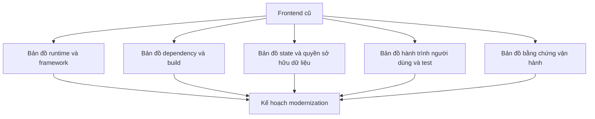
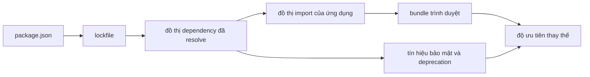
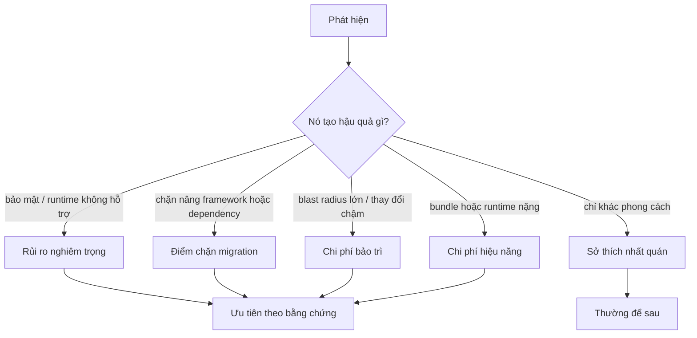

# Đánh giá Frontend Cũ: Lập Bản đồ Hệ thống Trước khi Nâng cấp

## Tóm tắt

Một ứng dụng React bảy năm tuổi có thể trông như "React cộng Redux" nhưng thực tế chứa nhiều thế hệ giả định: component dạng lớp nằm cạnh hook, context cũ nằm cạnh provider mới, Redux viết tay nằm cạnh Redux Toolkit, JavaScript nằm cạnh TypeScript, nhiều hệ thống giao diện, package bị bỏ bảo trì, dependency bản thử nghiệm, wrapper tự viết và script build không ai muốn chạm vào.

Vì vậy công việc modernization đầu tiên **không phải nâng phiên bản**. Đầu tiên phải tạo bản đồ hệ thống dựa trên bằng chứng để biết phần nào có thể đổi độc lập, phần nào đang dính nhau và hành vi nào phải được bảo vệ trước khi di chuyển.

> 💡 **Quy tắc thực hành:** **Kiểm kê trước khi can thiệp.** Đừng bắt đầu bằng việc nâng React, bỏ Redux hay xóa abstraction trông xấu. Hãy lập bản đồ phiên bản chạy, dependency, quyền sở hữu, hành trình người dùng quan trọng, tín hiệu production và ranh giới rollback trước.

- Xem ứng dụng như đồ thị trách nhiệm và dependency, không phải đống file cũ.
- Tách **lỗi thời**, **rủi ro**, **tốn kém** và chỉ đơn giản là **không quen thuộc**.
- Ghi lại hành vi hiện tại trước khi đổi implementation.
- Tìm các ranh giới cho phép thay đổi nhỏ và có thể đảo ngược.
- **Sai lầm chí mạng:** mở một đợt "dọn code" đồng thời đổi framework, state model, router, styling và dependency.

<TermBox term="Hệ thống cũ">
Một **hệ thống cũ** là phần mềm có hành vi hiện tại vẫn quan trọng với doanh nghiệp nhưng lịch sử, dependency, kiến trúc hoặc ràng buộc vận hành khiến việc thay đổi an toàn trở nên khó. "Cũ" mô tả rủi ro thay đổi, không chỉ tuổi đời hay phong cách code.
</TermBox>

<TermBox term="Ranh giới migration">
Một **ranh giới migration** là nơi implementation cũ và mới có thể cùng tồn tại phía sau một giao diện ổn định như route, contract component, lớp gọi API hoặc adapter.

**Tại sao quan trọng:** ranh giới tốt cho phép thay dần hành vi mà không cần một lần cutover toàn ứng dụng.
</TermBox>

## Bắt đầu bằng năm bản đồ

Một assessment hữu ích tạo ra năm bản đồ liên kết thay vì một sơ đồ kiến trúc khổng lồ.



### 1. Bản đồ runtime và framework

Ghi lại thứ thực sự chạy và build ứng dụng:

- phiên bản React và React DOM;
- phiên bản router và mô hình định tuyến;
- bundler hoặc framework cùng phiên bản Node.js;
- Babel, TypeScript và JSX transform;
- component dạng lớp, component hàm, hook, HOC, render prop và context cũ;
- giả định về render phía server hay chỉ phía client;
- test runner và bộ công cụ test DOM.

Đừng suy luận mô hình ứng dụng chỉ từ `package.json`. Một dependency có thể được cài nhưng không dùng, còn package mới có thể cùng tồn tại với code viết theo API cũ.

React 19 đã loại bỏ một số API vốn bị đánh dấu deprecated nhiều năm. Hướng dẫn nâng cấp của React cũng dùng cảnh báo trung gian và codemod cho các thay đổi đã biết thay vì đợi tới cutover cuối mới phát hiện tất cả incompatibility.

### 2. Bản đồ dependency và build

Với mỗi dependency trực tiếp, ghi ít nhất:

| Tín hiệu | Câu hỏi |
| --- | --- |
| Mục đích | Package này cung cấp khả năng gì? |
| Phạm vi ảnh hưởng | Route hoặc tính năng nào import nó? |
| Bảo trì | Còn được bảo trì, đã deprecated, archived hay gần như ngừng phát triển? |
| Độ ổn định | Bản stable, prerelease, fork hay bản vá nội bộ? |
| Chi phí thay thế | Có thể xóa, nâng, bọc hay thay cục bộ không? |
| Bảo mật | Có rủi ro lỗ hổng hay chuỗi cung ứng không? |
| Chi phí bundle | Có đi vào bundle quan trọng của trình duyệt không? |

Cảnh báo deprecation là bằng chứng, không phải lệnh xóa tự động. npm nói rõ package deprecated vẫn có thể chạy; tín hiệu đó có thể chỉ nghĩa publisher không còn khuyến nghị hoặc bảo trì.



### 3. Bản đồ state và quyền sở hữu dữ liệu

Liệt kê các miền state lớn và xác định owner hiện tại:

- state tương tác cục bộ;
- state của URL và điều hướng;
- dữ liệu từ server;
- state workflow dùng chung;
- state xác thực và phiên;
- state lưu trong trình duyệt;
- giá trị có thể suy ra.

Sau đó đánh dấu nơi một sự thật có nhiều owner cùng ghi. Mùi code thường gặp không phải "có Redux"; vấn đề là cùng một giá trị có thể được ghi trong Redux, state component, query parameter và cache API cùng lúc.

### 4. Bản đồ hành trình người dùng và test

Xác định workflow mà regression sẽ tốn kém:

- đăng nhập;
- tìm kiếm và lọc;
- checkout hoặc thanh toán;
- tài khoản và quyền;
- chỉnh sửa hoặc xuất bản;
- thao tác phá hủy dữ liệu.

Với mỗi workflow, ghi bằng chứng hiện có: unit test, integration test, browser test, runbook thủ công, analytics, log, error tracking hoặc không có gì.

<TermBox term="Test đặc tả hành vi">
Một **test đặc tả hành vi** ghi lại hành vi mà hệ thống hiện tại đang thể hiện, kể cả khi implementation chưa đẹp. Trong modernization, mục đích của nó là giữ một contract quan sát được quan trọng trong lúc phần bên trong thay đổi.
</TermBox>

Test không có nghĩa phải giữ mọi bug lịch sử mãi mãi. Nó cho bạn bằng chứng về hành vi nào sắp được thay đổi có chủ đích.

### 5. Bản đồ bằng chứng vận hành

Trước khi tối ưu hoặc thay thế, ghi baseline production nếu có:

- lỗi JavaScript và promise bị bỏ sót;
- độ trễ theo route và Web Vitals;
- kích thước bundle và chunk;
- API request thất bại;
- lỗi session và đăng nhập;
- mức sử dụng tính năng;
- tần suất deployment và lịch sử rollback.

Modernization không có baseline rất dễ biến thành công việc thẩm mỹ: code trông mới hơn nhưng không ai chứng minh được độ tin cậy, khả năng bảo trì, hiệu năng hay tốc độ giao hàng tốt hơn.

## Phân loại technical debt theo hậu quả

Đừng giữ một danh sách "technical debt" không phân loại.



Hai file đặt tên khác nhau có thể khó chịu nhưng không nguy hiểm. Một editor bản prerelease nằm trên đường xuất bản quan trọng, hoặc router chặn nâng framework, là loại vấn đề khác hoàn toàn.

## Tạo đồ thị ràng buộc nâng cấp

Thứ tự modernization bị ràng buộc bởi compatibility.

Ví dụ:

```text
Node runtime
   ↓
build tool / framework
   ↓
React + React DOM
   ↓
router / UI framework / React binding
   ↓
công cụ test
   ↓
code tính năng
```

Điều này **không** có nghĩa mọi ứng dụng phải nâng đúng thứ tự trên. Nghĩa là cần làm lộ các cạnh compatibility thật trước khi chọn thứ tự.

Một artifact thực dụng là bảng gồm:

- phiên bản hiện tại;
- phiên bản mục tiêu;
- blocker;
- owner;
- bằng chứng cần kiểm;
- kế hoạch rollback.

## Tình huống production: "chỉ là nâng React"

Một đội nâng React, router, thư viện component và test renderer trong cùng một pull request vì từng package đều có migration guide. Development nhìn gần như ổn nhưng production xuất hiện lỗi focus ở luồng modal và một đường checkout dùng Redux cũ giữ dữ liệu stale.

- **Hậu quả:** rollback khó vì không ai xác định được thay đổi nào gây ra hành vi nào.
- **Nguyên nhân cốt lõi:** các package được xem là nâng cấp độc lập dù thực tế chúng cùng cắt qua rendering, routing, state và test boundary.
- **Cách khắc phục chuẩn:** lập bản đồ compatibility trước, bảo vệ các hành trình quan trọng, rồi di chuyển từng boundary với bằng chứng trước và sau rõ ràng.

## Kiểm tra mental model

> **Tình huống:** Bạn tìm thấy 180 component dạng lớp trong ứng dụng React. Có nên biến "đổi mọi class thành hook" thành phase một của modernization không?

<details>
<summary>Xem giải thích chi tiết</summary>

Không.

Component dạng lớp là tín hiệu cần đánh giá, không tự động là boundary rủi ro cao nhất. React hiện xếp class component vào nhóm API cũ, nhưng điều đó không có nghĩa mọi class đang chạy phải được viết lại ngay. Trước hết hãy xác định chúng có chặn nâng cấp bắt buộc, dùng API đã bị loại bỏ, tạo ownership mong manh hay nằm trên đường thay đổi thường xuyên không. Hãy chuyển đổi vì nó giảm rủi ro migration hoặc bảo trì cụ thể, không phải để tối đa tính đồng nhất cú pháp.

</details>

## Checklist đánh giá

- [ ] **Runtime:** Ghi Node, framework, React, router, TypeScript/Babel, test và build version.
- [ ] **API cũ:** Tìm API React đã loại bỏ hoặc deprecated và blocker compatibility.
- [ ] **Dependency:** Phân loại package trực tiếp theo mục đích, bảo trì, độ ổn định, phạm vi ảnh hưởng, bảo mật và chi phí thay thế.
- [ ] **Prerelease:** Xác định beta/RC dependency trên đường nghiệp vụ quan trọng.
- [ ] **State:** Lập bản đồ owner và các bản sao có thể ghi trùng nhau.
- [ ] **Hành trình:** Gọi tên workflow quan trọng và bằng chứng bảo vệ từng workflow.
- [ ] **Vận hành:** Ghi baseline lỗi, hiệu năng, bundle và deployment.
- [ ] **Ranh giới:** Tìm route, adapter, feature boundary hoặc lớp API phù hợp để thay dần.
- [ ] **Thứ tự:** Tạo đồ thị ràng buộc trước khi lên lịch nâng cấp.
- [ ] **Rollback:** Giữ các bước migration ban đầu có khả năng đảo ngược độc lập khi thực tế cho phép.

## Nguồn tham khảo

- [React 19.3](https://react.dev/blog/2026/09/09/react-19-3)
- [React 19 Upgrade Guide](https://react.dev/blog/2024/04/25/react-19-upgrade-guide)
- [React — Legacy APIs](https://react.dev/reference/react/legacy)
- [npm — Using deprecated packages](https://docs.npmjs.com/using-deprecated-packages/)
- [GitHub Docs — Dependency review](https://docs.github.com/en/code-security/concepts/supply-chain-security/dependency-review)
- [Redux — Migrating to Modern Redux](https://redux.js.org/usage/migrating-to-modern-redux)
