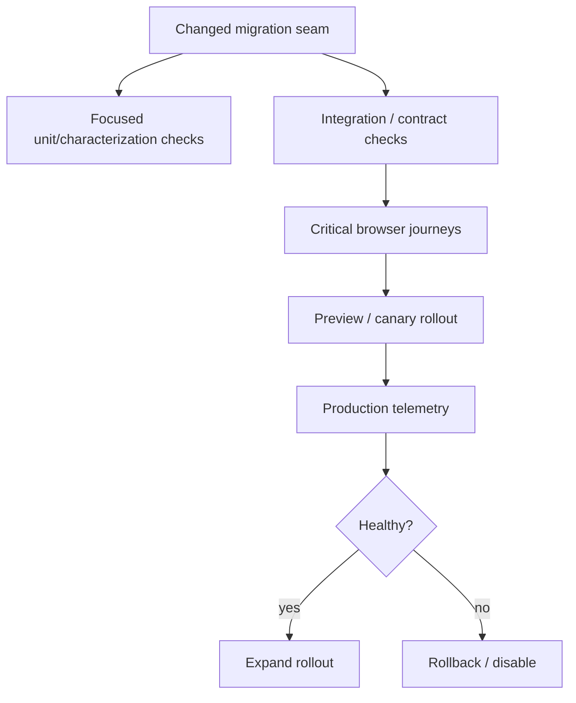
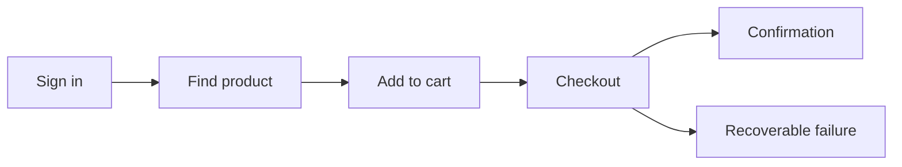
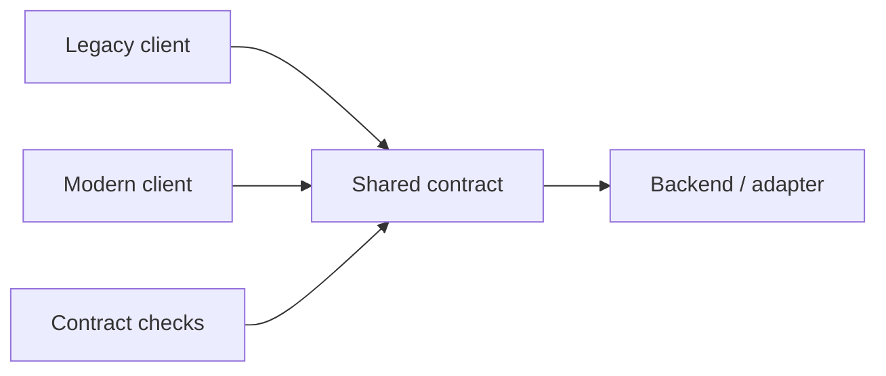

# Safety Nets for Legacy Frontend Upgrades

## TL;DR

A legacy frontend does not need perfect test coverage before modernization. It needs **enough evidence around the boundaries you are about to change** to detect important regressions quickly and diagnose them when they happen.

The strongest modernization safety net combines pre-release evidence with production evidence: characterization tests for existing behavior, a small set of critical browser journeys, API contracts around seams, visual checks where appearance is contractual, telemetry baselines, controlled rollout, and a rollback path.

> 💡 **Rule of thumb:** **Protect the migration seam, the critical user journey, and the production outcome—not every historical implementation detail.**

- Add evidence before changing a risky boundary.
- Prefer behavior-level checks over tests coupled to legacy internals.
- Capture traces and diagnostics for failures, not only pass/fail status.
- Establish production baselines before claiming an upgrade improved anything.
- **Fatal pitfall:** delaying modernization until "the whole app has tests," or moving fast with no evidence because adding tests feels too expensive.

<TermBox term="Characterization test">
A **characterization test** captures an important observable behavior of the existing application so a refactor or migration can detect unintended change.

**Why it matters:** you can protect behavior without first understanding or redesigning every legacy implementation detail.
</TermBox>

<TermBox term="Safety net">
A **safety net** is the combined evidence and recovery system that helps a team detect, diagnose, limit, and reverse regressions during change.

**Why it matters:** tests alone cannot detect every production issue, and telemetry alone detects problems after exposure.
</TermBox>

## Build evidence in layers



The point is not to maximize the number of test types. Each layer should answer a different question.

## 1. Characterize what you cannot yet explain

Legacy code often has behavior hidden across effects, middleware, selectors, wrappers, and timing.

Before rewriting a risky path, capture:

- inputs that users or APIs provide;
- visible outputs;
- emitted network requests;
- state transitions users rely on;
- error and empty states;
- keyboard/focus behavior when relevant.

Do **not** snapshot huge implementation trees just because the code is hard to understand. A useful characterization test protects an observable contract.

## 2. Protect golden user journeys

Choose a small set of high-value journeys:

- sign in;
- search/filter;
- checkout/payment;
- create/edit/publish;
- permission-gated action;
- logout/session recovery.



A journey is more useful when it includes meaningful assertions:

- URL/state transition;
- API request or response behavior;
- accessible UI result;
- persisted outcome;
- recovery from one credible failure.

Avoid giant E2E suites that assert every pixel and become too flaky to trust.

Playwright's current guidance recommends traces for diagnosing CI failures. Trace Viewer can expose DOM snapshots, network requests, console output, source locations, and action timing, which is especially valuable during migration failures that only reproduce in browser flows.

## 3. Put contracts around old/new seams

When old and new frontend code temporarily share an API or adapter, verify the contract explicitly.

Examples:

- request/response shape;
- error semantics;
- permissions;
- serialization;
- query parameters;
- event payloads;
- compatibility adapter input/output.



If the migration changes the contract, test the coexistence window: old and new clients may both be active during gradual rollout.

## 4. Use visual evidence where pixels are behavior

Visual regression is useful for:

- shared design-system primitives;
- dense layout migrations;
- typography/theme changes;
- responsive breakpoints;
- charts or complex components.

It is weak evidence for hidden business logic.

Keep visual checks scoped. A whole-application screenshot suite can create noisy diffs where every legitimate design change requires mass baseline updates.

## 5. Record operational baselines before the upgrade

Before rollout, capture the current baseline where available:

- frontend exception rate;
- failed network requests;
- Core Web Vitals or route timing;
- bundle/chunk size;
- login/session failure;
- checkout conversion or workflow completion;
- support incidents.

Without a baseline, "the new architecture is faster and more stable" is an opinion.

## 6. Make failures diagnosable

A red browser test with no trace is less useful than a focused failure with:

- action trace;
- console logs;
- network requests;
- screenshot/DOM snapshot;
- feature-flag state;
- build/deployment identifier.

Diagnostics reduce mean time to understanding, which matters when rollout is intentionally incremental.

## 7. Canary before full cutover

A migration safety net should include exposure control.

Possible rollout sequence:

```text
team-only
  -> internal/staging
  -> 1% cohort
  -> 10%
  -> 50%
  -> 100%
  -> confidence window
  -> delete old path
```

Not every application needs percentage rollout. The principle is to control blast radius when the migration risk justifies it.

Define stop conditions before rollout, for example:

- error rate exceeds baseline by a threshold;
- checkout completion drops;
- login failures increase;
- browser crash/reload loops appear;
- support signals indicate a blocking regression.

## 8. Rollback is part of verification

A rollback plan that has never been exercised is an assumption.

For a migration slice, verify:

- how to disable the new path;
- whether old code can consume state created by new code;
- whether database/API changes are backward compatible;
- whether cached assets/service workers can keep old clients alive;
- whether the deployment system can restore the prior version promptly.

## Production micro-scenario: green CI, broken checkout

A React upgrade passes thousands of unit tests. Production users on one browser hit a checkout issue where focus jumps out of a modal after an interaction, preventing keyboard users from completing payment. The unit suite never exercised the real dialog/focus lifecycle.

- **Impact:** a critical revenue and accessibility path fails despite "excellent coverage."
- **Root cause:** evidence was concentrated around implementation units while the risky migration boundary was browser interaction behavior.
- **Correct pattern:** add a focused browser journey for checkout keyboard/focus behavior, retain traces on failure, roll out the React upgrade to a controlled cohort, and watch completion/error telemetry before full cutover.

## Check your mental model

> **Scenario:** A legacy app has 12% unit-test coverage. You need to replace one critical checkout dependency. Should you first raise whole-repository coverage to 80%?

<details>
<summary>Show the reasoning</summary>

No.

Repository-wide coverage can be useful for other reasons, but it is not the prerequisite for this migration. First build evidence around the checkout seam: characterize the behavior, verify its API contract, protect one or two critical browser journeys, capture production baseline telemetry, and establish rollback. Spend testing effort where it changes migration confidence.

</details>

## Safety-net checklist

- [ ] **Boundary:** Identify the exact component, dependency, state owner, route, or contract being changed.
- [ ] **Characterization:** Capture important observable behavior before the rewrite.
- [ ] **Journey:** Protect critical user flows with a small reliable browser suite.
- [ ] **Contract:** Verify old/new clients agree with shared APIs and adapters during coexistence.
- [ ] **Visual:** Add scoped screenshot evidence only where appearance is contractual.
- [ ] **Diagnostics:** Retain traces, console/network evidence, and build identifiers for failures.
- [ ] **Baseline:** Record errors, performance, bundle, and business workflow signals before rollout.
- [ ] **Canary:** Limit initial exposure when blast radius justifies it.
- [ ] **Stop condition:** Define measurable signals that halt or reverse rollout.
- [ ] **Rollback:** Exercise the mechanism that returns traffic to the old path.
- [ ] **Cleanup:** Remove migration-only checks or flags when their temporary contract disappears; keep durable user-journey evidence.

## Sources

- [Playwright — Best Practices](https://playwright.dev/docs/best-practices)
- [Playwright — Trace Viewer](https://playwright.dev/docs/trace-viewer)
- [Testing Library — Guiding Principles](https://testing-library.com/docs/guiding-principles/)
- [web.dev — Web Vitals](https://web.dev/articles/vitals)
- [Martin Fowler — Strangler Fig](https://martinfowler.com/bliki/StranglerFigApplication.html)
