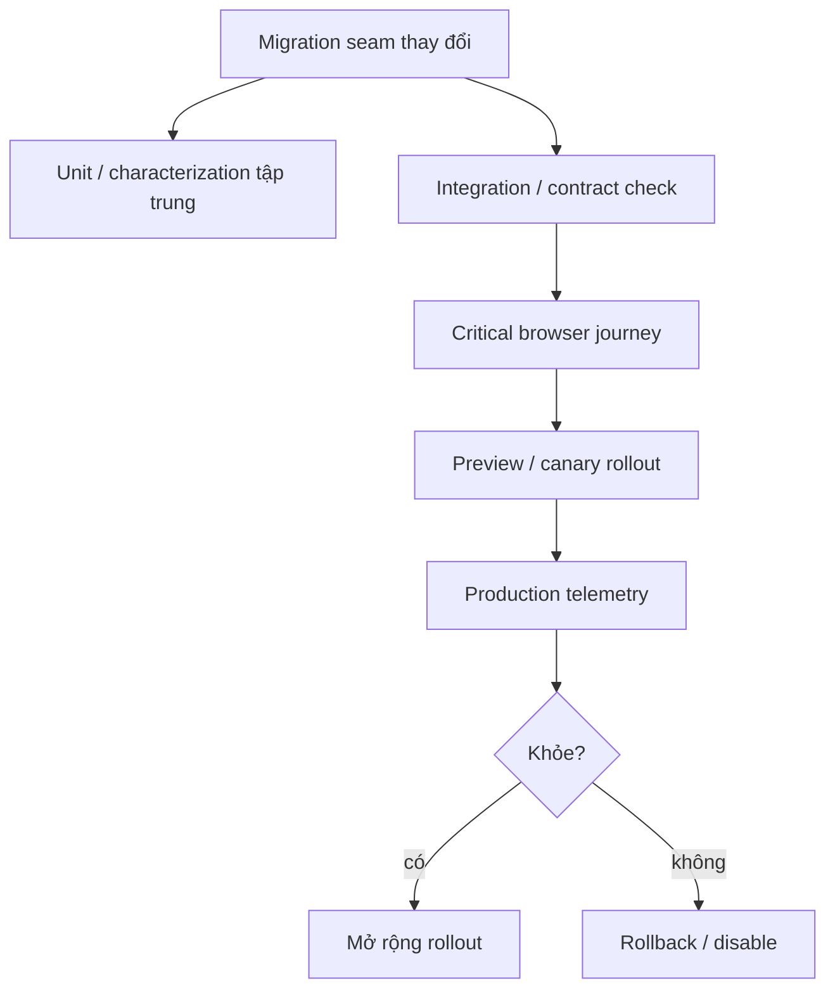
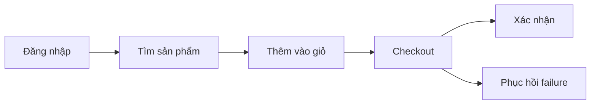
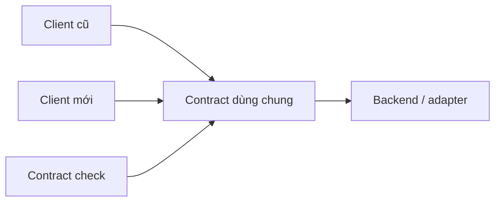

# Lưới An toàn cho Nâng cấp Frontend Cũ

## Tóm tắt

Frontend cũ không cần test coverage hoàn hảo trước modernization. Nó cần **đủ bằng chứng quanh boundary sắp thay đổi** để phát hiện regression quan trọng nhanh và chẩn đoán được khi failure xảy ra.

Safety net mạnh nhất kết hợp pre-release evidence với production evidence: characterization test cho behavior hiện tại, một nhóm nhỏ critical browser journey, API contract quanh seam, visual check nơi giao diện là contract, telemetry baseline, rollout có kiểm soát và rollback path.

> 💡 **Quy tắc thực hành:** **Bảo vệ migration seam, critical user journey và production outcome, không phải mọi implementation detail lịch sử.**

- Thêm bằng chứng trước khi đổi boundary rủi ro.
- Ưu tiên behavior-level check hơn test dính vào internals cũ.
- Capture trace và diagnostic cho failure, không chỉ pass/fail.
- Lập production baseline trước khi khẳng định upgrade cải thiện điều gì.
- **Sai lầm chí mạng:** trì hoãn modernization tới khi "cả app có test", hoặc thay đổi không bằng chứng vì viết test bị xem là quá đắt.

<TermBox term="Test đặc tả hành vi">
**Test đặc tả hành vi** ghi lại observable behavior quan trọng của ứng dụng hiện tại để refactor hoặc migration phát hiện thay đổi ngoài ý muốn.

**Tại sao quan trọng:** có thể bảo vệ behavior mà chưa cần hiểu hoặc thiết kế lại toàn bộ implementation cũ.
</TermBox>

<TermBox term="Lưới an toàn">
**Lưới an toàn** là tập hợp bằng chứng và cơ chế phục hồi giúp team phát hiện, chẩn đoán, giới hạn và đảo ngược regression trong lúc thay đổi.

**Tại sao quan trọng:** test không phát hiện mọi vấn đề production, còn telemetry chỉ thấy vấn đề sau khi user đã bị expose.
</TermBox>

## Xây bằng chứng theo nhiều lớp



Mục tiêu không phải tối đa số loại test. Mỗi lớp phải trả lời câu hỏi khác nhau.

## 1. Characterize phần chưa giải thích được

Code cũ thường có behavior ẩn qua effect, middleware, selector, wrapper và timing.

Trước khi rewrite đường rủi ro, capture:

- input từ user hoặc API;
- output visible;
- network request phát ra;
- state transition user phụ thuộc;
- error và empty state;
- keyboard/focus behavior khi liên quan.

Đừng snapshot cây implementation khổng lồ chỉ vì code khó hiểu. Characterization test hữu ích bảo vệ observable contract.

## 2. Bảo vệ golden user journey

Chọn nhóm nhỏ journey giá trị cao:

- đăng nhập;
- tìm kiếm và lọc;
- checkout hoặc thanh toán;
- tạo, sửa hoặc xuất bản;
- action bị permission gate;
- logout hoặc phục hồi session.



Journey hữu ích khi có assertion có ý nghĩa:

- URL hoặc state transition;
- API request hoặc response behavior;
- UI result accessible;
- persisted outcome;
- recovery từ một failure có khả năng xảy ra.

Tránh E2E suite khổng lồ assert từng pixel rồi trở nên flaky đến mức không còn đáng tin.

Hướng dẫn Playwright hiện tại khuyến nghị trace để chẩn đoán CI failure. Trace Viewer có thể hiển thị DOM snapshot, network request, console output, source location và action timing, rất hữu ích với migration failure chỉ tái hiện trong browser flow.

## 3. Đặt contract quanh seam old/new

Khi code frontend cũ và mới tạm chia sẻ API hoặc adapter, verify contract rõ ràng.

Ví dụ:

- request/response shape;
- error semantics;
- permission;
- serialization;
- query parameter;
- event payload;
- input/output của compatibility adapter.



Nếu migration đổi contract, hãy test coexistence window: old và new client có thể active cùng lúc trong rollout tăng dần.

## 4. Dùng visual evidence nơi pixel là behavior

Visual regression hữu ích cho:

- primitive design system dùng chung;
- migration layout dày đặc;
- đổi typography hoặc theme;
- breakpoint responsive;
- chart hoặc component phức tạp.

Nó là bằng chứng yếu cho hidden business logic.

Giữ visual check có scope. Screenshot suite toàn ứng dụng có thể tạo diff ồn, khiến mỗi design change hợp lệ phải update baseline hàng loạt.

## 5. Ghi operational baseline trước upgrade

Trước rollout, capture baseline hiện tại nếu có:

- frontend exception rate;
- failed network request;
- Core Web Vitals hoặc route timing;
- bundle/chunk size;
- login/session failure;
- checkout conversion hoặc workflow completion;
- support incident.

Không có baseline thì câu "architecture mới nhanh và ổn định hơn" chỉ là nhận xét.

## 6. Làm failure dễ chẩn đoán

Browser test đỏ không trace kém hữu ích hơn failure tập trung có:

- action trace;
- console log;
- network request;
- screenshot hoặc DOM snapshot;
- feature-flag state;
- build/deployment identifier.

Diagnostic giảm thời gian hiểu failure, rất quan trọng khi rollout cố ý tăng dần.

## 7. Canary trước full cutover

Safety net migration nên có exposure control.

Sequence có thể là:

```text
chỉ team
  -> nội bộ/staging
  -> cohort 1%
  -> 10%
  -> 50%
  -> 100%
  -> confidence window
  -> xóa old path
```

Không phải app nào cũng cần percentage rollout. Nguyên tắc là kiểm soát blast radius khi migration risk xứng đáng.

Định nghĩa stop condition trước rollout, ví dụ:

- error rate vượt baseline quá mức cho phép;
- checkout completion giảm;
- login failure tăng;
- browser crash hoặc reload loop xuất hiện;
- support signal cho thấy blocking regression.

## 8. Rollback là một phần verification

Rollback plan chưa từng được exercise chỉ là giả định.

Với một migration slice, verify:

- cách disable new path;
- code cũ có consume state do code mới tạo không;
- database/API change có backward compatible không;
- cached asset hoặc service worker có giữ old client sống không;
- deployment system có restore version trước đủ nhanh không.

## Tình huống production: CI xanh nhưng checkout hỏng

React upgrade pass hàng nghìn unit test. User production trên một browser gặp lỗi checkout: focus nhảy khỏi modal sau interaction khiến keyboard user không hoàn tất payment. Unit suite chưa từng exercise dialog/focus lifecycle thật.

- **Hậu quả:** revenue và accessibility path quan trọng fail dù "coverage rất tốt".
- **Nguyên nhân cốt lõi:** bằng chứng tập trung quanh implementation unit trong khi risky migration boundary là browser interaction behavior.
- **Cách khắc phục chuẩn:** thêm browser journey tập trung cho keyboard/focus checkout, giữ trace khi fail, rollout React upgrade cho cohort kiểm soát và theo dõi completion/error telemetry trước full cutover.

## Kiểm tra mental model

> **Tình huống:** Legacy app có 12% unit-test coverage. Bạn cần thay một checkout dependency quan trọng. Có nên nâng coverage toàn repo lên 80% trước không?

<details>
<summary>Xem giải thích chi tiết</summary>

Không.

Repository-wide coverage có thể hữu ích vì mục tiêu khác nhưng không phải prerequisite của migration này. Trước hết hãy xây evidence quanh checkout seam: characterize behavior, verify API contract, bảo vệ một hoặc hai critical browser journey, capture production baseline telemetry và thiết lập rollback. Dành test effort nơi nó thật sự đổi migration confidence.

</details>

## Checklist safety net

- [ ] **Boundary:** Xác định chính xác component, dependency, state owner, route hoặc contract sắp đổi.
- [ ] **Characterization:** Capture observable behavior quan trọng trước rewrite.
- [ ] **Journey:** Bảo vệ critical user flow bằng browser suite nhỏ và đáng tin.
- [ ] **Contract:** Verify old/new client đồng thuận với API và adapter dùng chung trong coexistence.
- [ ] **Visual:** Chỉ thêm screenshot evidence có scope nơi appearance là contract.
- [ ] **Diagnostic:** Giữ trace, console/network evidence và build identifier cho failure.
- [ ] **Baseline:** Ghi error, performance, bundle và business workflow signal trước rollout.
- [ ] **Canary:** Giới hạn exposure ban đầu khi blast radius đủ lớn.
- [ ] **Stop condition:** Định nghĩa signal đo được để dừng hoặc đảo rollout.
- [ ] **Rollback:** Exercise mechanism đưa traffic về old path.
- [ ] **Dọn dẹp:** Xóa check hoặc flag chỉ dành cho migration khi contract tạm biến mất; giữ user-journey evidence bền vững.

## Nguồn tham khảo

- [Playwright — Best Practices](https://playwright.dev/docs/best-practices)
- [Playwright — Trace Viewer](https://playwright.dev/docs/trace-viewer)
- [Testing Library — Guiding Principles](https://testing-library.com/docs/guiding-principles/)
- [web.dev — Web Vitals](https://web.dev/articles/vitals)
- [Martin Fowler — Strangler Fig](https://martinfowler.com/bliki/StranglerFigApplication.html)
