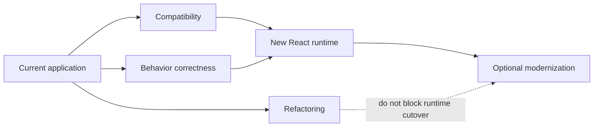
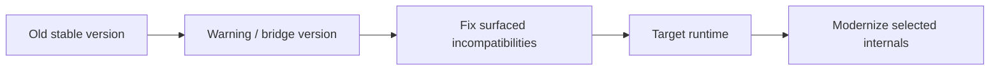
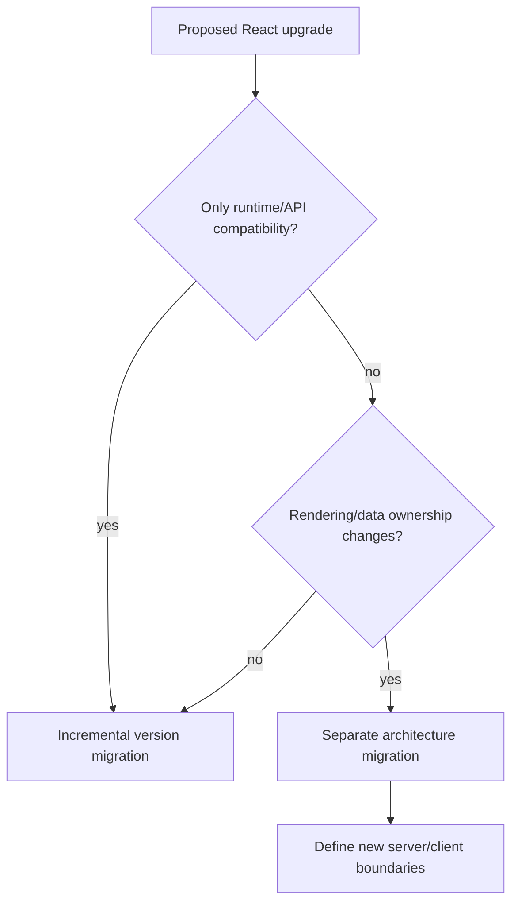

# React Modernization: Upgrade Without Rewriting the App

## TL;DR

A React upgrade and a React rewrite are different projects. Mature applications often contain class components, function components, HOCs, hooks, old context, custom render helpers, legacy test utilities, and third-party packages with different compatibility windows. Trying to make all of that "modern" before upgrading multiplies the blast radius.

React 19.3 is current as of this lesson's verification date. The relevant lesson for legacy systems is not "use every new feature." It is: **make the runtime boundary compatible first, then modernize implementation where it reduces concrete risk or cost.**

> 💡 **Rule of thumb:** **Upgrade the platform before you beautify the code.** Separate compatibility work, behavioral fixes, and optional refactors into independently verifiable steps.

- Find removed APIs and unsupported integrations before changing broad component style.
- Use warnings, Strict Mode, codemods, and tests as evidence generators.
- Allow old and new component styles to coexist during migration.
- Convert high-change or high-risk areas first, not every class component.
- **Fatal pitfall:** combining React version upgrade, hooks rewrite, router migration, state rewrite, and design-system replacement in one release.

<TermBox term="Compatibility migration">
A **compatibility migration** changes the minimum code and dependencies required for the application to run correctly on a newer runtime or framework version. It is different from an optional refactor whose goal is readability or architectural improvement.
</TermBox>

<TermBox term="Compatibility island">
A **compatibility island** is a bounded part of the application that temporarily keeps an older pattern behind a stable contract while surrounding code moves forward.

**Why it matters:** modernization can progress without forcing every legacy dependency or component to move on the same day.
</TermBox>

## Split the work into three tracks



### Compatibility track

Ask:

- does the app use APIs removed by the target React version?
- do React DOM entry points need migration?
- do third-party packages declare compatible peer ranges?
- does the JSX transform/toolchain meet target requirements?
- do test utilities rely on removed internals?
- does the router/UI library constrain the React version?

React's React 19 upgrade guide documents removed legacy context APIs and other breaking changes. The current React legacy reference also marks older APIs and lists those removed in React 19.

### Behavior track

Runtime upgrades often expose bugs that already existed:

- render functions with side effects;
- effects that do not clean up;
- refs with incomplete cleanup;
- assumptions that a component only mounts once in development;
- mutable shared state hidden behind timing.

React Strict Mode intentionally performs extra development checks, including extra render/effect/ref cycles, to surface these classes of bugs.

### Refactoring track

Only after compatibility is controlled should you decide whether a class, HOC, or abstraction deserves rewriting.

A component should move earlier when:

- it blocks a target upgrade;
- it depends on removed lifecycle/context behavior;
- it changes frequently;
- its ownership is hard to reason about;
- its test surface is poor and the migration creates a useful seam.

A stable class component deep in a rarely changed administrative route may be lower priority than a modern-looking function component that mutates global state during render.

## Use a stepping-stone release when one exists

React's React 19 guide recommended React 18.3 as an intermediate version because it behaved like 18.2 while adding warnings for changes needed by React 19.

That illustrates a general migration technique:



Do not assume every ecosystem provides such a bridge. When it does, use it to turn a large unknown migration into smaller observed failures.

## Codemods are accelerators, not proof

Codemods are valuable for mechanical transformations:

- renamed imports;
- removed API syntax;
- predictable TypeScript changes;
- JSX transform updates.

They do not prove semantic equivalence.

After a codemod, verify:

- lifecycle timing;
- focus and DOM behavior;
- subscriptions;
- error boundaries;
- async work and cleanup;
- tests that rely on implementation details.

The more behavior a transformation must infer, the less it should be treated as "automatic."

## Let old and new coexist

A healthy migration may temporarily look inconsistent:

```text
src/
  legacy/
    AccountClass.tsx
    old-connect/
  features/
    checkout/
      CheckoutPage.tsx
      hooks/
  adapters/
    legacy-user-context.ts
```

Temporary inconsistency is acceptable when the boundaries are explicit and shrinking.

Permanent ambiguity is not. Every compatibility layer should have:

- the reason it exists;
- what still depends on it;
- the condition for deletion;
- an owner or tracking issue.

## Modernize TypeScript incrementally too

Do not require a full JavaScript-to-TypeScript rewrite just because React is being upgraded.

TypeScript supports mixed JS/TS programs via `allowJs`, and `checkJs` can add checking to JavaScript incrementally. The same principle applies: strengthen boundaries first, then convert files when the migration creates useful type information.

## Separate render model changes from React version changes

Moving from a client-rendered SPA to a framework with server rendering or Server Components is an architectural change, not a routine React version bump.



Keep those projects separate unless there is a strong reason to combine them and the safety net is proportionate.

## Production micro-scenario: Strict Mode "caused" duplicate requests

After enabling Strict Mode during an upgrade, a team sees duplicate development requests and disables Strict Mode to make the symptom disappear. Months later, a reconnect path in production duplicates subscriptions and sends repeated analytics events.

- **Impact:** a development warning signal was removed while the underlying lifecycle bug remained.
- **Root cause:** extra development execution was mistaken for a production bug created by Strict Mode rather than evidence of impure setup/cleanup.
- **Correct pattern:** inspect whether effects and subscriptions are idempotent and correctly cleaned up; use the stricter development behavior to expose assumptions before the runtime cutover.

## Check your mental model

> **Scenario:** A component is a class but works on the target React version, has good tests, changes once a year, and has no removed API usage. Another function component uses an unsupported third-party React binding on the checkout route. Which is the stronger migration target?

<details>
<summary>Show the reasoning</summary>

The checkout dependency boundary.

Modern syntax is not the migration goal. Compatibility risk and change consequence matter more. The stable class component can remain temporarily while the unsupported dependency blocks the target runtime or exposes a critical journey.

</details>

## React modernization checklist

- [ ] **Target:** Record the exact React/React DOM target and supported runtime/toolchain.
- [ ] **Removed APIs:** Search for APIs removed or deprecated by the target.
- [ ] **Peers:** Check router, UI, state, testing, and rendering packages for compatibility.
- [ ] **Warnings:** Use bridge releases and development warnings when available.
- [ ] **Strictness:** Run Strict Mode on as much of the tree as practical and investigate surfaced lifecycle bugs.
- [ ] **Codemods:** Keep mechanical transforms separate from semantic refactors.
- [ ] **Coexistence:** Define compatibility islands instead of forcing whole-app rewrites.
- [ ] **Rendering:** Treat SSR/Server Component adoption as a separate architecture decision.
- [ ] **Verification:** Protect critical routes with behavior-level evidence.
- [ ] **Deletion:** Track when temporary adapters and old entry points can be removed.

## Sources

- [React 19.3](https://react.dev/blog/2026/09/09/react-19-3)
- [React 19 Upgrade Guide](https://react.dev/blog/2024/04/25/react-19-upgrade-guide)
- [React — StrictMode](https://react.dev/reference/react/StrictMode)
- [React — Legacy APIs](https://react.dev/reference/react/legacy)
- [TypeScript — Migrating from JavaScript](https://www.typescriptlang.org/docs/handbook/migrating-from-javascript.html)
- [TypeScript — allowJs](https://www.typescriptlang.org/tsconfig/allowJs.html)
