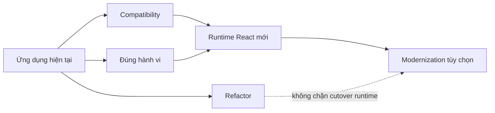
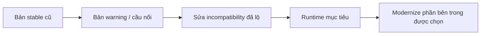
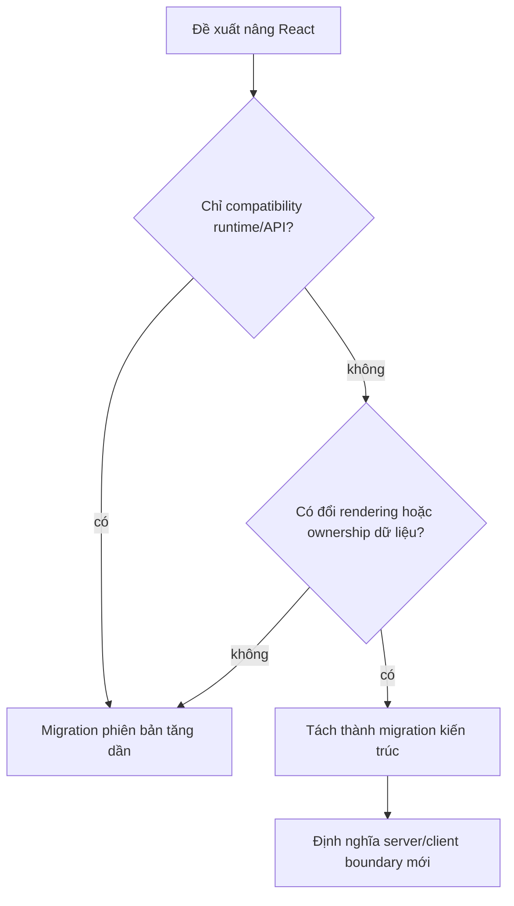

# Modernize React: Nâng cấp mà Không Viết lại Cả Ứng dụng

## Tóm tắt

Nâng React và viết lại ứng dụng React là hai dự án khác nhau. Ứng dụng lâu năm thường có component dạng lớp, component hàm, HOC, hook, context cũ, helper render tự viết, công cụ test cũ và package bên thứ ba với cửa sổ compatibility khác nhau. Cố làm mọi thứ "hiện đại" trước khi nâng runtime sẽ nhân blast radius.

React 19.3 là bản hiện hành tại ngày xác minh bài này. Bài học quan trọng cho hệ thống cũ không phải "dùng mọi tính năng mới". Nó là: **làm cho boundary runtime tương thích trước, sau đó mới modernize implementation ở nơi thật sự giảm rủi ro hoặc chi phí.**

> 💡 **Quy tắc thực hành:** **Nâng nền tảng trước khi làm đẹp code.** Tách compatibility work, sửa hành vi và refactor tùy chọn thành các bước có thể xác minh độc lập.

- Tìm API đã bị loại bỏ và integration không được hỗ trợ trước khi đổi style component hàng loạt.
- Dùng warning, Strict Mode, codemod và test như máy tạo bằng chứng.
- Cho phép component cũ và mới cùng tồn tại trong migration.
- Chuyển đổi khu vực thay đổi nhiều hoặc rủi ro cao trước, không phải mọi class component.
- **Sai lầm chí mạng:** gộp nâng React, rewrite sang hook, đổi router, rewrite state và thay design system vào cùng một release.

<TermBox term="Migration compatibility">
**Migration compatibility** là thay đổi tối thiểu về code và dependency để ứng dụng chạy đúng trên runtime hoặc framework mới hơn. Nó khác với refactor tùy chọn có mục tiêu chính là readability hoặc cải thiện kiến trúc.
</TermBox>

<TermBox term="Vùng tương thích tạm thời">
Một **vùng tương thích tạm thời** là phần ứng dụng được khoanh lại để giữ pattern cũ phía sau contract ổn định trong khi code xung quanh tiến lên.

**Tại sao quan trọng:** modernization có thể tiến triển mà không bắt mọi dependency hoặc component cũ phải di chuyển trong cùng một ngày.
</TermBox>

## Tách công việc thành ba luồng



### Luồng compatibility

Hỏi:

- ứng dụng có dùng API bị target React loại bỏ không?
- entry point React DOM có cần migration không?
- package bên thứ ba có khai báo peer range tương thích không?
- JSX transform và toolchain có đáp ứng target không?
- công cụ test có phụ thuộc internal API đã mất không?
- router hoặc UI library có khóa phiên bản React không?

Hướng dẫn React 19 ghi rõ các legacy context API bị loại bỏ cùng các breaking change khác. Tài liệu legacy hiện tại của React cũng đánh dấu API cũ và liệt kê những API đã bị loại bỏ trong React 19.

### Luồng hành vi

Nâng runtime thường làm lộ bug đã tồn tại:

- render có side effect;
- effect không cleanup;
- callback ref cleanup thiếu;
- giả định component chỉ mount một lần trong development;
- mutable shared state bị che bởi timing.

React Strict Mode chủ đích thực hiện thêm các kiểm tra trong development, gồm render, effect và ref cycle bổ sung, để làm lộ các nhóm bug này.

### Luồng refactor

Chỉ sau khi compatibility được kiểm soát mới quyết định class, HOC hoặc abstraction nào đáng rewrite.

Một component nên được ưu tiên khi:

- nó chặn target upgrade;
- phụ thuộc lifecycle/context đã bị loại bỏ;
- thay đổi thường xuyên;
- ownership khó hiểu;
- test surface yếu và migration tạo được seam tốt.

Một class component ổn định trong route quản trị ít thay đổi có thể ít ưu tiên hơn function component nhìn rất mới nhưng mutate global state ngay trong render.

## Dùng bản cầu nối khi hệ sinh thái cung cấp

Hướng dẫn React 19 từng khuyến nghị React 18.3 làm bản trung gian vì hành vi giống 18.2 nhưng thêm warning cho thay đổi cần thiết trước React 19.

Đây là một kỹ thuật migration tổng quát:



Đừng giả định mọi hệ sinh thái đều có bridge release. Khi có, hãy dùng nó để biến migration lớn chưa biết thành các failure nhỏ quan sát được.

## Codemod là máy tăng tốc, không phải bằng chứng

Codemod hữu ích cho transformation cơ học:

- đổi import;
- thay cú pháp API đã bỏ;
- thay đổi TypeScript có quy tắc rõ;
- cập nhật JSX transform.

Nó không chứng minh semantic equivalence.

Sau codemod, vẫn phải kiểm:

- timing lifecycle;
- focus và hành vi DOM;
- subscription;
- error boundary;
- async work và cleanup;
- test đang phụ thuộc implementation detail.

Transformation càng phải suy luận nhiều hành vi thì càng không nên xem là "tự động an toàn".

## Cho code cũ và mới cùng tồn tại

Một migration khỏe mạnh có thể tạm thời không đồng nhất:

```text
src/
  legacy/
    AccountClass.tsx
    old-connect/
  features/
    checkout/
      CheckoutPage.tsx
      hooks/
  adapters/
    legacy-user-context.ts
```

Không đồng nhất tạm thời là chấp nhận được khi boundary rõ và đang thu nhỏ.

Mơ hồ vĩnh viễn thì không. Mỗi compatibility layer nên có:

- lý do tồn tại;
- phần nào còn phụ thuộc;
- điều kiện để xóa;
- owner hoặc issue theo dõi.

## Modernize TypeScript theo từng bước

Đừng bắt buộc rewrite toàn bộ JavaScript sang TypeScript chỉ vì đang nâng React.

TypeScript hỗ trợ chương trình trộn JS/TS qua `allowJs`, còn `checkJs` có thể thêm kiểm tra cho JavaScript theo từng bước. Nguyên tắc vẫn vậy: làm mạnh boundary trước, rồi convert file khi migration tạo ra type information hữu ích.

## Tách thay đổi render model khỏi thay đổi phiên bản React

Chuyển từ SPA client-render sang framework có server rendering hoặc Server Components là thay đổi kiến trúc, không phải routine React bump.



Hãy tách các dự án này trừ khi có lý do mạnh để gộp và safety net tương xứng.

## Tình huống production: Strict Mode "gây" request trùng

Sau khi bật Strict Mode trong lúc upgrade, team thấy request development bị lặp và tắt Strict Mode để symptom biến mất. Vài tháng sau, đường reconnect production tạo subscription trùng và gửi analytics event nhiều lần.

- **Hậu quả:** tín hiệu cảnh báo ở development bị tắt nhưng lifecycle bug gốc vẫn còn.
- **Nguyên nhân cốt lõi:** extra execution trong development bị hiểu nhầm là production bug do Strict Mode tạo ra thay vì bằng chứng setup/cleanup không thuần.
- **Cách khắc phục chuẩn:** kiểm effect và subscription có idempotent và cleanup đúng không; dùng hành vi development nghiêm ngặt để làm lộ giả định trước cutover runtime.

## Kiểm tra mental model

> **Tình huống:** Một component dạng lớp chạy được trên target React, có test tốt, mỗi năm chỉ đổi một lần và không dùng API bị loại bỏ. Một function component khác dùng React binding bên thứ ba không hỗ trợ trên route checkout. Boundary nào đáng ưu tiên hơn?

<details>
<summary>Xem giải thích chi tiết</summary>

Boundary dependency ở checkout.

Cú pháp hiện đại không phải mục tiêu migration. Rủi ro compatibility và hậu quả thay đổi quan trọng hơn. Class component ổn định có thể giữ tạm thời, trong khi dependency không hỗ trợ đang chặn target runtime hoặc nằm trên hành trình quan trọng.

</details>

## Checklist modernize React

- [ ] **Target:** Ghi chính xác target React/React DOM và runtime/toolchain được hỗ trợ.
- [ ] **API bị loại bỏ:** Tìm API target đã bỏ hoặc deprecated.
- [ ] **Peer dependency:** Kiểm router, UI, state, testing và rendering package.
- [ ] **Warning:** Dùng bridge release và warning development khi có.
- [ ] **Độ nghiêm ngặt:** Chạy Strict Mode trên phần cây lớn nhất thực tế cho phép và điều tra lifecycle bug bị lộ.
- [ ] **Codemod:** Tách transformation cơ học khỏi semantic refactor.
- [ ] **Cùng tồn tại:** Định nghĩa compatibility island thay vì ép rewrite toàn ứng dụng.
- [ ] **Rendering:** Xem SSR hoặc Server Component như quyết định kiến trúc riêng.
- [ ] **Xác minh:** Bảo vệ route quan trọng bằng bằng chứng ở mức hành vi.
- [ ] **Xóa bỏ:** Theo dõi thời điểm adapter tạm và entry point cũ có thể bị xóa.

## Nguồn tham khảo

- [React 19.3](https://react.dev/blog/2026/09/09/react-19-3)
- [React 19 Upgrade Guide](https://react.dev/blog/2024/04/25/react-19-upgrade-guide)
- [React — StrictMode](https://react.dev/reference/react/StrictMode)
- [React — Legacy APIs](https://react.dev/reference/react/legacy)
- [TypeScript — Migrating from JavaScript](https://www.typescriptlang.org/docs/handbook/migrating-from-javascript.html)
- [TypeScript — allowJs](https://www.typescriptlang.org/tsconfig/allowJs.html)
