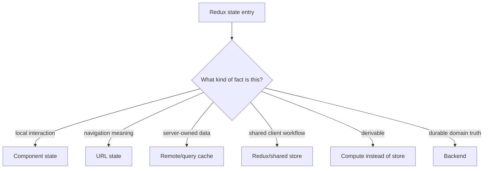
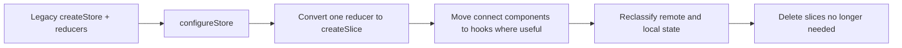
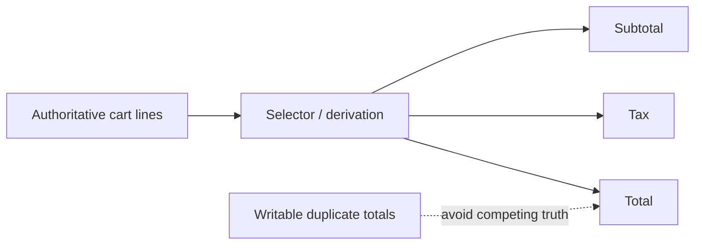

# Redux Everywhere: Rationalizing State in a Legacy React App

## TL;DR

Redux is not technical debt by itself. The problem begins when the store becomes the default destination for every changing value: modal visibility, form drafts, route filters, API responses, loading flags, derived totals, authentication details, notifications, and transient interaction state.

The modernization goal is not "remove Redux." It is to **restore explicit ownership** so Redux only coordinates state that genuinely needs a shared client-side owner.

> 💡 **Rule of thumb:** **Move state to the narrowest authoritative owner that still satisfies the product behavior.** Global state should be earned by coordination needs, not chosen because a store already exists.

- Keep local interaction state local when no other owner needs it.
- Put navigation meaning in the URL when it must survive sharing and browser history.
- Treat server data as remote state with cache semantics rather than copying it into a general store by default.
- Keep shared workflow state in Redux when distant features genuinely coordinate around it.
- **Fatal pitfall:** migrating from Redux to another global store without changing the ownership model.

<TermBox term="State rationalization">
**State rationalization** identifies the authoritative owner, lifetime, scope, and persistence needs of each state fact, then removes duplicated or unnecessarily global copies.
</TermBox>

<TermBox term="Remote state">
**Remote state** is data whose source of truth lives outside the browser, usually behind an API. The frontend holds observations and caches of that truth rather than becoming its authoritative owner.
</TermBox>

## Start from state facts, not reducers



Examples:

| Legacy Redux entry | Better question |
| --- | --- |
| isUserMenuOpen | Does any component outside the menu need to coordinate it? |
| searchQuery | Should browser history and shared links reproduce it? |
| products | Is this server-owned cache data? |
| cartCheckoutStep | Is this a cross-route client workflow? |
| totalPrice | Can this be derived from cart lines? |

The answer can still be Redux. The improvement is that Redux becomes a deliberate owner rather than a habit.

## Modernize Redux in place before deleting it

Official Redux guidance recommends Redux Toolkit as the standard way to write Redux logic today, and the official migration guide explicitly supports **incremental migration where old and new Redux code coexist**.



Starting with configureStore can preserve existing reducers and middleware while adding modern defaults and development checks. That reduces migration surface before deciding which state should leave Redux entirely.

## Do not confuse syntax migration with ownership migration

These are different changes:

```text
hand-written reducer -> createSlice
```

changes Redux implementation style.

```text
Redux API cache -> query cache
```

changes state ownership and lifecycle.

```text
Redux modal flag -> component state
```

changes scope.

Do one conceptual change at a time where practical.

## Remote data usually has a different lifecycle

Server data carries concerns such as freshness, refetching, deduplication, retry, invalidation after mutation, pagination, background refresh, and stale-versus-loading semantics.

A plain global store can model all of this, but then the application must build and maintain those cache semantics explicitly.

Redux currently recommends RTK Query as the default data-fetching and caching approach for Redux applications. Atlas's broader state model allows other cache tools too. The durable point is: **server-owned data deserves remote-state semantics.**

## Derived data should usually stop being writable

A classic legacy shape stores items, subtotal, tax, and total as separately writable values. If subtotal, tax, and total are deterministic functions of items and pricing rules, each writable copy creates synchronization obligations.



Memoization can optimize expensive derivation. It does not justify additional writable truth.

## Redux can still be the right answer

Keep shared client state when coordination is real, such as:

- a multi-route workflow that must survive route transitions;
- optimistic workflow state spanning distant features;
- an offline-first queue with explicit events;
- an application-wide state machine where action history and DevTools are useful;
- state consumed and changed by many independent areas.

The question is not whether Context, Zustand, or hooks can mechanically replace Redux. The question is **which owner gives the state the clearest lifecycle and smallest useful scope?**

## Remove state by vertical slice

Do not announce "we are removing Redux" and create a year-long parallel architecture.

Pick one feature:

1. map its state;
2. identify remote, local, URL, derived, and genuinely shared pieces;
3. move one ownership category;
4. verify behavior;
5. delete actions, reducers, and selectors that became unreachable;
6. repeat.

Store size should shrink as a consequence of better ownership.

## Production micro-scenario: the search page with four sources of truth

A search page stores filters in Redux. A new team later adds URL query parameters for shareable links. A component copies those filters into local state to manage a drawer, and a query cache uses the local copy as its request key.

- **Impact:** back/forward navigation, copied URLs, and displayed results disagree depending on which path updated last.
- **Root cause:** four writable representations of one navigational fact were synchronized through effects.
- **Correct pattern:** make the URL authoritative for search/filter meaning, derive the query key from it, keep drawer visibility local, and remove duplicate Redux filter state.

## Check your mental model

> **Scenario:** A Redux slice contains authenticated user profile data fetched from the backend and a boolean indicating whether the account-menu popover is open. Should both stay because "auth is global"?

<details>
<summary>Show the reasoning</summary>

Not necessarily.

The profile is remote/server-owned data with application-wide consumers, so it needs an explicit cache/session model. The popover flag is a local interaction detail unless distant features genuinely coordinate it. Sharing a feature label does not mean both facts have the same owner or lifetime.

</details>

## Redux modernization checklist

- [ ] **Inventory:** List major slices, actions, middleware, selectors, sagas/thunks, and consumers.
- [ ] **Classify:** Tag each state fact as local, URL, remote, shared workflow, derived, or durable server truth.
- [ ] **Modern core:** Move legacy store setup toward Redux Toolkit without forcing feature rewrites.
- [ ] **Remote data:** Give API data explicit cache, freshness, and invalidation semantics.
- [ ] **Derived values:** Delete writable copies that selectors can compute.
- [ ] **Scope:** Move interaction state to the nearest component owner.
- [ ] **Navigation:** Move shareable and back-forward state into the URL.
- [ ] **Workflow:** Keep Redux where cross-feature coordination is real.
- [ ] **Vertical slices:** Migrate one feature boundary at a time.
- [ ] **Deletion:** Remove dead actions, reducers, middleware, and selectors after consumers disappear.

## Sources

- [Redux — Migrating to Modern Redux](https://redux.js.org/usage/migrating-to-modern-redux)
- [Redux — Style Guide](https://redux.js.org/style-guide/)
- [Redux Toolkit — Overview](https://redux.js.org/redux-toolkit/overview)
- [Redux — Why Redux Toolkit is How To Use Redux Today](https://redux.js.org/introduction/why-rtk-is-redux-today)
