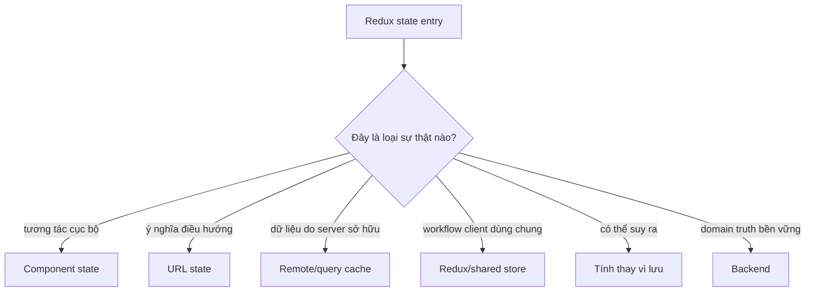
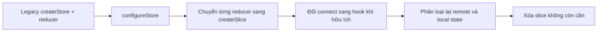
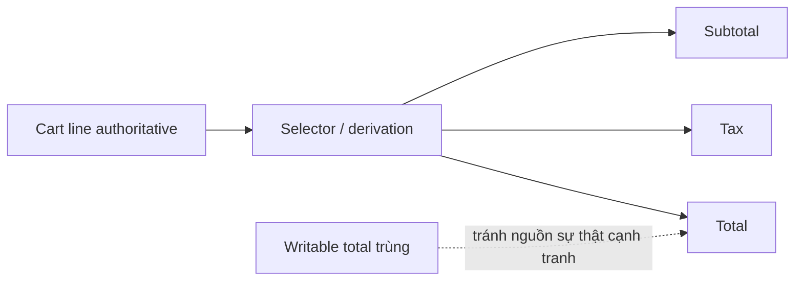

# Redux Khắp Nơi: Sắp xếp lại State trong Ứng dụng React Cũ

## Tóm tắt

Redux tự nó không phải technical debt. Vấn đề bắt đầu khi store trở thành nơi mặc định cho mọi giá trị thay đổi: modal mở hay đóng, form draft, filter route, API response, loading flag, tổng tiền suy ra, thông tin xác thực, notification và state tương tác thoáng qua.

Mục tiêu modernization không phải "xóa Redux". Mục tiêu là **khôi phục ownership rõ ràng** để Redux chỉ điều phối state thật sự cần một owner dùng chung phía client.

> 💡 **Quy tắc thực hành:** **Đưa state về owner hẹp nhất vẫn đáp ứng đúng hành vi sản phẩm.** Global state phải được biện minh bằng nhu cầu phối hợp, không phải vì store đã có sẵn.

- Giữ state tương tác cục bộ ở local khi không owner nào khác cần phối hợp.
- Đặt ý nghĩa điều hướng vào URL khi cần chia sẻ và browser history.
- Xem dữ liệu server là remote state có cache semantics thay vì mặc định copy vào general store.
- Giữ shared workflow state trong Redux khi các feature xa nhau thật sự cần phối hợp.
- **Sai lầm chí mạng:** chuyển từ Redux sang một global store khác nhưng giữ nguyên ownership model sai.

<TermBox term="Sắp xếp lại state">
**Sắp xếp lại state** là quá trình xác định owner có thẩm quyền, lifetime, scope và persistence của từng sự thật rồi xóa bản sao trùng hoặc global không cần thiết.
</TermBox>

<TermBox term="Remote state">
**Remote state** là dữ liệu có nguồn sự thật nằm ngoài browser, thường phía sau API. Frontend giữ quan sát và cache của sự thật đó chứ không trở thành owner có thẩm quyền.
</TermBox>

## Bắt đầu từ sự thật, không phải reducer



Ví dụ:

| State cũ trong Redux | Câu hỏi tốt hơn |
| --- | --- |
| isUserMenuOpen | Component ngoài menu có cần phối hợp không? |
| searchQuery | Browser history và link chia sẻ có cần tái tạo nó không? |
| products | Đây có phải dữ liệu cache do server sở hữu không? |
| cartCheckoutStep | Đây có phải workflow client đi qua nhiều route không? |
| totalPrice | Có thể suy ra từ cart line không? |

Câu trả lời vẫn có thể là Redux. Điểm cải thiện là Redux trở thành owner có chủ đích thay vì thói quen.

## Modernize Redux tại chỗ trước khi xóa

Hướng dẫn Redux chính thức khuyến nghị Redux Toolkit là cách chuẩn để viết Redux logic hiện nay, và migration guide nói rõ **code Redux cũ và mới có thể cùng tồn tại khi migrate tăng dần**.



Bắt đầu bằng configureStore có thể giữ reducer và middleware cũ trong khi thêm default hiện đại và development check. Nhờ vậy migration surface nhỏ hơn trước khi quyết định state nào nên rời Redux hoàn toàn.

## Đừng nhầm syntax migration với ownership migration

Đây là các thay đổi khác nhau:

```text
reducer viết tay -> createSlice
```

đổi style implementation Redux.

```text
Redux API cache -> query cache
```

đổi ownership và lifecycle của state.

```text
Redux modal flag -> component state
```

đổi scope.

Khi thực tế cho phép, hãy làm mỗi lần một thay đổi khái niệm.

## Dữ liệu remote thường có lifecycle khác

Server data mang các concern như freshness, refetch, deduplication, retry, invalidation sau mutation, pagination, background refresh và phân biệt stale với loading.

General store có thể model hết nhưng khi đó ứng dụng phải tự xây và duy trì cache semantics.

Hướng dẫn Redux hiện tại khuyến nghị RTK Query làm cách mặc định cho data fetching và caching trong ứng dụng Redux. State model rộng hơn của Atlas cũng cho phép query/cache tool khác. Điểm bền vững là: **dữ liệu do server sở hữu cần semantics của remote state.**

## Derived data thường không nên writable

Nếu subtotal, tax và total là hàm xác định từ cart line và pricing rule thì lưu tất cả dưới dạng writable state tạo nghĩa vụ đồng bộ.



Memoization có thể tối ưu derivation đắt. Nó không biện minh cho việc tạo thêm writable truth.

## Redux vẫn có thể là đáp án đúng

Giữ shared client state khi coordination thật sự tồn tại:

- workflow nhiều route cần sống qua navigation;
- optimistic workflow đi qua nhiều feature;
- offline queue có event rõ ràng;
- state machine toàn ứng dụng nơi action history và DevTools hữu ích;
- state được đọc và thay đổi bởi nhiều khu vực độc lập.

Câu hỏi không phải Context, Zustand hay hook có thay Redux được về mặt cơ học không. Câu hỏi là **owner nào cho lifecycle rõ nhất và scope nhỏ nhất đủ dùng?**

## Gỡ state theo vertical slice

Đừng công bố "chúng ta sẽ bỏ Redux" rồi tạo kiến trúc song song kéo dài một năm.

Chọn một feature:

1. map state;
2. nhận diện remote, local, URL, derived và shared thật;
3. chuyển một loại ownership;
4. xác minh behavior;
5. xóa action, reducer và selector không còn reachable;
6. lặp lại.

Store nhỏ đi như hệ quả của ownership tốt hơn.

## Tình huống production: trang tìm kiếm có bốn nguồn sự thật

Trang search lưu filter trong Redux. Team mới thêm query parameter để link có thể chia sẻ. Component copy filter sang local state để điều khiển drawer, còn query cache dùng local copy làm request key.

- **Hậu quả:** back/forward, URL được copy và kết quả hiển thị bất đồng tùy đường update nào chạy cuối.
- **Nguyên nhân cốt lõi:** bốn representation writable của cùng một navigational fact được đồng bộ bằng effect.
- **Cách khắc phục chuẩn:** dùng URL làm owner cho search/filter meaning, derive query key từ URL, giữ drawer visibility local và xóa Redux filter state trùng.

## Kiểm tra mental model

> **Tình huống:** Một Redux slice chứa user profile lấy từ backend và boolean cho biết account-menu popover có mở không. Có nên giữ cả hai vì "auth là global" không?

<details>
<summary>Xem giải thích chi tiết</summary>

Không nhất thiết.

Profile là dữ liệu remote do server sở hữu với consumer toàn ứng dụng nên cần cache/session model rõ. Popover flag là chi tiết tương tác local trừ khi feature xa nhau thật sự cần phối hợp. Cùng nhãn "auth" không có nghĩa hai sự thật cùng owner hoặc lifetime.

</details>

## Checklist modernize Redux

- [ ] **Kiểm kê:** Liệt kê slice, action, middleware, selector, saga/thunk và consumer lớn.
- [ ] **Phân loại:** Gắn mỗi state fact vào local, URL, remote, shared workflow, derived hoặc server truth.
- [ ] **Core hiện đại:** Đưa legacy store setup về Redux Toolkit mà không ép rewrite feature.
- [ ] **Remote data:** Cho API data semantics cache, freshness và invalidation rõ.
- [ ] **Derived value:** Xóa writable copy mà selector có thể tính.
- [ ] **Scope:** Đưa interaction state về component owner gần nhất.
- [ ] **Navigation:** Đưa state cần share và back-forward vào URL.
- [ ] **Workflow:** Giữ Redux nơi cross-feature coordination là thật.
- [ ] **Vertical slice:** Migrate từng feature boundary.
- [ ] **Xóa bỏ:** Xóa action, reducer, middleware và selector chết sau khi consumer biến mất.

## Nguồn tham khảo

- [Redux — Migrating to Modern Redux](https://redux.js.org/usage/migrating-to-modern-redux)
- [Redux — Style Guide](https://redux.js.org/style-guide/)
- [Redux Toolkit — Overview](https://redux.js.org/redux-toolkit/overview)
- [Redux — Why Redux Toolkit is How To Use Redux Today](https://redux.js.org/introduction/why-rtk-is-redux-today)
