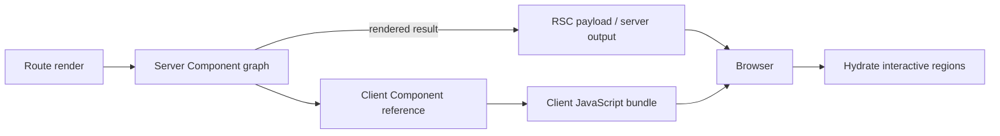
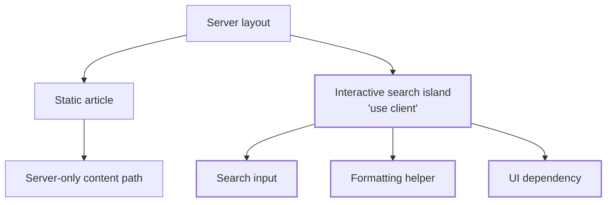

# Server and Client Components: Choosing the Execution Boundary

## TL;DR

Server and Client Components answer a different question from SSR and CSR.

**SSR/CSR describe where HTML is produced. Server/Client Components describe where component code is allowed to execute and which modules must become browser JavaScript.** These axes can be combined: a Client Component may contribute HTML to an initial server-rendered response and later hydrate in the browser, while a Server Component itself is not shipped as component runtime to the browser.

<TermBox term="Execution boundary">
An **execution boundary** separates component work that stays in a server environment from work that must be available in the browser. It affects capabilities, data access, serialization, and shipped JavaScript.
</TermBox>



## Do not collapse this into SSR versus CSR

It is tempting to say "Server Component means SSR" and "Client Component means CSR." That mental model is wrong.

React Server Components are rendered in a separate server-side environment before their result is sent to the client. Frameworks can then optionally use that result in an SSR pass that produces initial HTML. Client Components can also participate in that initial HTML and then hydrate later.

So ask two independent questions:

1. **Rendering placement:** where and when is HTML produced?
2. **Execution ownership:** which component modules need to execute in the browser?

The first is the CSR/SSR/SSG lesson. The second is this lesson.

<TermBox term="Client graph">
The **client graph** is the set of modules that must be bundled for browser evaluation. A client boundary does not only affect one component function; its transitive client-side dependencies can join that graph too.
</TermBox>

## `'use client'` is a module boundary

In React Server Component systems, `'use client'` marks a module as an entry into client-evaluated code. When server code imports that module, compatible bundlers treat the import as a server/client boundary.

Crucially, dependencies imported by a client module are also evaluated on the client unless the framework provides another supported boundary mechanism. This means placing `'use client'` high in the tree can pull a much larger dependency graph into the browser than the visible interactive widget suggests.



The directive is therefore not "make this file render in the browser only." It defines a client module boundary and a bundle ownership decision.

## What belongs on the server side

Server Components are a strong fit for work that benefits from server capabilities and does not require browser-local interaction:

- reading from a database or server-side data source;
- accessing the filesystem or private infrastructure available only to the server environment;
- composing mostly static or content-heavy UI;
- using server-side credentials internally;
- reducing browser JavaScript by keeping render-only dependencies out of the client graph.

Server Components do not persist browser state and cannot directly own browser event handlers such as `onClick`. They also cannot use browser-only APIs such as `window` or `localStorage` during their server execution.

A Server Component can fetch privileged data, but that does **not** make every fetched value safe to send to the browser. Only pass the minimum data the client actually needs.

## What belongs on the client side

Client Components are needed when UI behavior depends on browser execution, for example:

- `useState`, interactive transitions, or local ephemeral UI state;
- event handlers such as clicks, input, drag, focus, or keyboard interaction;
- browser APIs such as `window`, `navigator`, `localStorage`, observers, or media queries;
- effects and subscriptions tied to browser lifecycle;
- third-party UI libraries that require the DOM or browser runtime.

A Client Component is not automatically "bad for performance." Interactivity has to run somewhere. The design goal is to make the client graph intentional rather than letting server-only work cross the boundary accidentally.

## Data crossing the boundary must be representable

A Server Component may pass props to a Client Component, but those values cross an environment boundary. React therefore requires supported serializable values rather than arbitrary in-memory server objects.

<TermBox term="Serialization boundary">
A **serialization boundary** is a point where values must be represented in a transportable form rather than shared by reference. Across a Server-to-Client Component boundary, this rules out many arbitrary functions, class instances, open database connections, and other server-memory objects.
</TermBox>

Prefer passing small domain-shaped values such as IDs, strings, numbers, booleans, dates where supported, and plain serializable objects. Do not pass database clients, request objects, secrets, or a rich server model simply because the type checker allows a convenient local abstraction.

The security rule is simple: **anything serialized to a Client Component should be treated as browser-visible data.**

## Composition is different from importing server code into client code

A common misconception is that once you render a Client Component, everything visually inside it must also become a Client Component.

Not necessarily. A Server Component can render server-owned content and pass its rendered result as `children` or another supported JSX prop to a Client Component. The Client Component receives that result without importing and executing the original Server Component module in the browser.

```mermaid
sequenceDiagram
  participant S as Server Component
  participant C as Client Component boundary
  participant B as Browser
  S->>S: Fetch article + render ArticleBody
  S->>C: Pass rendered ArticleBody as children
  C->>B: Ship client code for interactive shell
  S->>B: Send rendered server result
  B->>B: Hydrate shell; keep server-rendered child content
```

This pattern is useful for shells such as modals, tabs, carts, providers, or interactive navigation that wrap server-rendered content.

The reverse direction is different: a Client Component cannot simply import arbitrary server-only code and expect it to remain on the server. Imports participate in the client dependency graph.

## Put client boundaries low enough, but not absurdly low

A useful default is to keep `'use client'` boundaries **low and small enough** that server-only rendering and dependencies stay out of the browser bundle.

That does not mean every button deserves its own microscopic file boundary. Excessive fragmentation can make ownership and data flow difficult to understand. Choose a cohesive interactive unit: a search box, editor, filter panel, cart control, or other region whose state and browser behavior belong together.

A good boundary has three properties:

- it contains the interaction that truly needs browser execution;
- it accepts a small, explicit serializable contract from the server;
- it does not import unrelated server-oriented or render-only modules into the client graph.

## Boundary placement changes hydration and bundle cost

Moving a boundary upward can increase:

- JavaScript bytes downloaded by the browser;
- modules parsed and evaluated on the main thread;
- the amount of UI that participates in hydration;
- client-side state ownership and data-fetching pressure;
- the chance that server-only libraries or sensitive assumptions leak into client-facing code.

Measure bundle composition and interaction readiness, not only server response time. A route can have excellent TTFB while still shipping an unnecessarily large client graph.

## Production scenario

An ecommerce team adds an interactive search button to a shared top-level layout. To make the button work, the developer adds `'use client'` to the entire layout module. The layout imports navigation helpers, formatting libraries, account UI, catalog chrome, and several components that previously needed no browser execution.

**Impact:** the route ships substantially more JavaScript, hydration work expands across a large subtree, low-end devices become slower to interactive, and server-oriented data flow starts being duplicated in client code.

**Root cause:** the team treated `'use client'` as a local switch for one button instead of a module boundary whose transitive dependencies become part of the client graph.

**Correct pattern:** keep the layout and data/content composition on the server, isolate the search interaction in a small Client Component, pass only the serializable values it needs, and compose server-rendered children around or through that interactive boundary where useful.

## A practical boundary review

When reviewing a component tree, ask:

1. Does this region need browser state, event handlers, effects, or browser APIs?
2. If not, can it remain server-owned?
3. If yes, where is the smallest cohesive client boundary?
4. Which transitive imports will join the client graph?
5. What values cross from server to client, and are they intentionally browser-visible?
6. Can server-rendered JSX be passed as `children` instead of importing more code into the client graph?
7. Did the boundary change bundle size or hydration work enough to measure?

## Self-check

A product page is server-rendered for fast initial HTML. Its `AddToCart` component is marked `'use client'` and appears in that server-produced HTML before hydration. Is `AddToCart` therefore a Server Component?

<details>
<summary>Show the reasoning</summary>

No. Initial HTML placement and component execution ownership are separate axes. A Client Component can contribute to server-generated initial HTML in a framework that combines RSC with SSR, but its interactive component code still belongs to the client graph and must be available for hydration in the browser.

</details>

## Boundary checklist

- [ ] Treat Server/Client Components as an execution and module-graph boundary, not as a synonym for SSR/CSR.
- [ ] Put `'use client'` at intentional client entry points rather than high in the tree by convenience.
- [ ] Inspect transitive imports that join the client graph.
- [ ] Keep server-only credentials, clients, and privileged objects behind the server boundary.
- [ ] Pass only explicit serializable, browser-safe values to Client Components.
- [ ] Use Client Components for state, events, effects, and browser APIs.
- [ ] Compose server-rendered `children` through Client Components when that preserves a smaller client graph.
- [ ] Measure client JavaScript and hydration cost after moving a boundary.

## Agent rule

When a UI needs interactivity, do not promote the nearest large ancestor to `'use client'` by default. Identify the smallest cohesive interactive region, inspect its dependency graph and serialization contract, and keep server-only rendering and data access outside that client boundary.

## Sources

Primary references verified on **2026-09-15**:

- [React — Server Components](https://react.dev/reference/rsc/server-components)
- [React — `'use client'`](https://react.dev/reference/rsc/use-client)
- [React — Directives](https://react.dev/reference/rsc/directives)
- [Next.js Learn — Server and Client Components](https://nextjs.org/learn/react-foundations/server-and-client-components)
