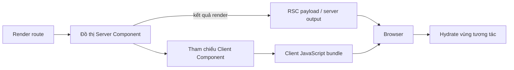
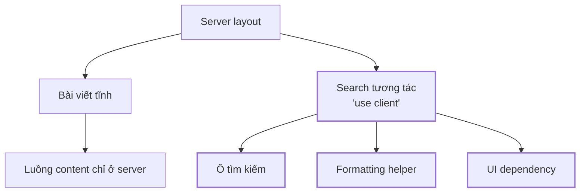
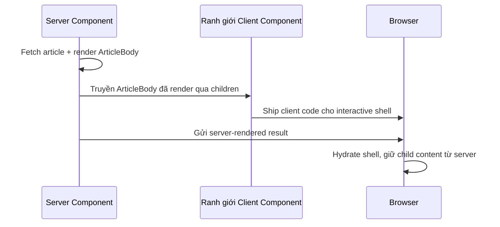

# Server và Client Components: Chọn ranh giới thực thi

## Tóm tắt

Server và Client Components trả lời một câu hỏi khác với SSR và CSR.

**SSR/CSR mô tả HTML được tạo ở đâu. Server/Client Components mô tả component code được phép chạy ở đâu và module nào phải trở thành JavaScript phía trình duyệt.** Hai trục này có thể kết hợp: một Client Component vẫn có thể góp HTML vào initial response do server render rồi hydrate trong browser, còn bản thân Server Component không được ship xuống browser như component runtime.

<TermBox term="Ranh giới thực thi">
**Ranh giới thực thi** tách phần công việc component ở lại môi trường server khỏi phần phải có mặt trong browser. Nó ảnh hưởng capability, quyền truy cập dữ liệu, serialization và lượng JavaScript được ship.
</TermBox>

## Đừng đồng nhất với SSR và CSR

Rất dễ suy luận rằng “Server Component = SSR” và “Client Component = CSR”. Mental model đó sai.

React Server Components chạy trong một môi trường phía server riêng trước khi kết quả được gửi sang client. Framework sau đó có thể dùng kết quả đó trong một bước SSR để tạo initial HTML. Client Components cũng có thể góp phần vào initial HTML đó rồi hydrate sau.

Vì vậy hãy tách hai câu hỏi:

1. **Vị trí rendering:** HTML được tạo ở đâu và lúc nào?
2. **Quyền sở hữu thực thi:** module component nào cần chạy trong browser?

Câu đầu thuộc bài CSR/SSR/SSG. Câu thứ hai là trọng tâm của bài này.

<TermBox term="Đồ thị client">
**Đồ thị client** là tập module phải được bundle để browser evaluate. Một ranh giới client không chỉ ảnh hưởng một component function; các dependency truyền tiếp của nó cũng có thể gia nhập đồ thị này.
</TermBox>

## `'use client'` là ranh giới module

Trong hệ thống React Server Components, `'use client'` đánh dấu một module là entry point vào code được evaluate phía client. Khi server code import module đó, bundler tương thích sẽ xem import này là ranh giới giữa server và client.

Điểm quan trọng là các dependency được import bởi client module cũng được evaluate ở client, trừ khi framework có một cơ chế boundary khác được hỗ trợ. Vì thế đặt `'use client'` quá cao trong tree có thể kéo một đồ thị dependency lớn xuống browser dù widget thật sự tương tác rất nhỏ.

Vì vậy directive này không có nghĩa “chỉ render file này trong browser”. Nó xác định ranh giới module client và là một quyết định về quyền sở hữu bundle.

## Phần nào nên ở phía server

Server Components phù hợp với phần việc hưởng lợi từ capability phía server và không cần browser-local interaction:

- đọc database hoặc data source phía server;
- truy cập filesystem hay private infrastructure chỉ server có;
- compose UI thiên về content hoặc mostly static;
- dùng server-side credentials ở bên trong;
- giảm JavaScript phía browser bằng cách giữ render-only dependency ngoài client graph.

Server Components không giữ browser state và không thể trực tiếp sở hữu browser event handler như `onClick`. Chúng cũng không thể dùng browser-only API như `window` hay `localStorage` trong quá trình chạy phía server.

Server Component có thể fetch dữ liệu đặc quyền, nhưng điều đó **không** có nghĩa mọi field đã fetch đều an toàn để gửi xuống browser. Chỉ truyền phần dữ liệu tối thiểu client thật sự cần.

## Phần nào nên ở phía client

Client Components cần thiết khi UI phụ thuộc vào browser execution, ví dụ:

- `useState`, transition tương tác hoặc local ephemeral state;
- event handler như click, input, drag, focus hay keyboard;
- browser API như `window`, `navigator`, `localStorage`, observer hay media query;
- effect và subscription gắn với lifecycle của browser;
- UI library bên thứ ba cần DOM hoặc browser runtime.

Client Component không tự động là “xấu cho performance”. Interactivity buộc phải chạy ở đâu đó. Mục tiêu thiết kế là làm client graph có chủ đích thay vì để server-only work tràn qua boundary ngoài ý muốn.

## Dữ liệu đi qua boundary phải biểu diễn được

Server Component có thể truyền props cho Client Component, nhưng các value đó đi qua ranh giới môi trường. React vì thế yêu cầu kiểu dữ liệu được hỗ trợ cho serialization, thay vì arbitrary object đang sống trong memory của server.

<TermBox term="Ranh giới tuần tự hóa">
**Ranh giới tuần tự hóa** là nơi value phải được biểu diễn dưới dạng có thể truyền đi thay vì chia sẻ theo reference. Qua ranh giới Server-to-Client Component, nhiều arbitrary function, class instance, database connection đang mở và server-memory object sẽ không hợp lệ.
</TermBox>

Ưu tiên truyền các value nhỏ, có hình dạng domain rõ ràng như ID, string, number, boolean và plain serializable object. Không truyền database client, request object, secret hay rich server model chỉ vì abstraction cục bộ nhìn tiện.

Security rule đơn giản là: **bất cứ thứ gì được serialize sang Client Component phải được xem là dữ liệu browser có thể thấy.**

## Composition khác với import server code vào client code

Một hiểu nhầm phổ biến là hễ render Client Component thì mọi thứ nằm bên trong nó về mặt giao diện cũng phải trở thành Client Component.

Không nhất thiết. Server Component có thể render content do server sở hữu rồi truyền kết quả render đó qua `children` hoặc một JSX prop được hỗ trợ vào Client Component. Client Component nhận kết quả mà không cần import và execute module Server Component gốc trong browser.

Pattern này hữu ích cho modal, tab, cart, provider hay interactive navigation cần bọc server-rendered content.

Chiều ngược lại khác hẳn: Client Component không thể import arbitrary server-only code rồi kỳ vọng code đó vẫn ở server. Import tham gia vào client dependency graph.

## Đặt ranh giới client đủ thấp, nhưng không cực đoan

Một default tốt là giữ `'use client'` boundary **đủ thấp và đủ nhỏ** để server-only rendering cùng dependency không bị kéo xuống browser bundle.

Điều đó không có nghĩa mỗi button phải có một file boundary siêu nhỏ. Chia vụn quá mức làm ownership và data flow khó hiểu. Hãy chọn một interactive unit có cohesion: search box, editor, filter panel, cart control hoặc vùng mà state và browser behavior thật sự thuộc về nhau.

Một boundary tốt có ba tính chất:

- chứa đúng interaction thật sự cần browser execution;
- nhận một contract serializable nhỏ và explicit từ server;
- không import module thiên về server hoặc render-only không liên quan vào client graph.

## Vị trí boundary thay đổi chi phí bundle và hydration

Đẩy boundary lên cao có thể làm tăng:

- lượng JavaScript browser phải download;
- số module phải parse/evaluate trên main thread;
- phạm vi UI tham gia hydration;
- ownership của client state và áp lực data fetching phía client;
- nguy cơ server-only library hoặc assumption nhạy cảm rò vào client-facing code.

Hãy đo bundle composition và thời điểm interaction ready, không chỉ server response time. Một route có TTFB rất tốt vẫn có thể ship client graph lớn không cần thiết.

## Tình huống production

Một team ecommerce thêm search button tương tác vào shared top-level layout. Để button hoạt động, developer thêm `'use client'` vào toàn bộ layout module. Layout này import navigation helper, formatting library, account UI, catalog chrome và nhiều component trước đó không cần browser execution.

**Hậu quả:** route ship nhiều JavaScript hơn đáng kể, hydration work lan ra subtree lớn, thiết bị yếu chậm tương tác hơn, và data flow vốn nên thuộc server bắt đầu bị duplicate ở client code.

**Nguyên nhân cốt lõi:** team xem `'use client'` như local switch cho một button thay vì ranh giới module khiến transitive dependencies gia nhập client graph.

**Cách khắc phục chuẩn:** giữ layout cùng data/content composition ở server, cô lập search interaction thành Client Component nhỏ, chỉ truyền các serializable value cần thiết, và compose server-rendered children qua interactive boundary khi điều đó giúp client graph nhỏ hơn.

## Cách review boundary thực tế

Khi review component tree, hãy hỏi:

1. Vùng này có cần browser state, event handler, effect hay browser API không?
2. Nếu không, nó có thể tiếp tục do server sở hữu không?
3. Nếu có, ranh giới client nhỏ nhất nhưng vẫn cohesive nằm ở đâu?
4. Những transitive import nào sẽ gia nhập client graph?
5. Value nào đi từ server sang client, và chúng có chủ đích là browser-visible không?
6. Có thể truyền server-rendered JSX qua `children` thay vì import thêm code vào client graph không?
7. Boundary mới có làm bundle size hoặc hydration work thay đổi đủ để cần đo không?

## Tự kiểm tra

Một product page được server render để có initial HTML nhanh. `AddToCart` được đánh dấu `'use client'` và xuất hiện trong HTML do server tạo trước hydration. Vậy `AddToCart` có phải Server Component không?

Xem giải thích chi tiết

Không. Vị trí tạo initial HTML và quyền sở hữu thực thi component là hai trục độc lập với SSR/CSR. Một Client Component có thể góp HTML vào initial output do server tạo trong framework kết hợp RSC với SSR, nhưng interactive component code của nó vẫn thuộc client graph và phải có mặt trong browser để hydrate.

## Checklist ranh giới

- [ ] Xem Server/Client Components là ranh giới thực thi và module graph, không phải từ đồng nghĩa của SSR/CSR.
- [ ] Đặt `'use client'` ở client entry point có chủ đích thay vì đặt cao trong tree vì tiện.
- [ ] Kiểm tra transitive import sẽ gia nhập client graph.
- [ ] Giữ credential, client và privileged object chỉ ở server phía sau boundary.
- [ ] Chỉ truyền value serializable, explicit và an toàn cho browser sang Client Components.
- [ ] Dùng Client Components cho state, event, effect và browser API.
- [ ] Compose server-rendered `children` qua Client Components khi điều đó giữ client graph nhỏ hơn.
- [ ] Đo JavaScript phía client và hydration cost sau khi di chuyển boundary.

## Agent rule

Khi UI cần interactivity, đừng mặc định nâng ancestor lớn gần nhất thành `'use client'`. Hãy xác định interactive region nhỏ nhất nhưng vẫn cohesive, kiểm dependency graph cùng serialization contract, rồi giữ server-only rendering và data access ở ngoài ranh giới client đó.

## Nguồn tham khảo

Các nguồn chính được kiểm tra ngày **2026-09-15**:

- [React — Server Components](https://react.dev/reference/rsc/server-components)
- [React — `'use client'`](https://react.dev/reference/rsc/use-client)
- [React — Directives](https://react.dev/reference/rsc/directives)
- [Next.js Learn — Server and Client Components](https://nextjs.org/learn/react-foundations/server-and-client-components)
