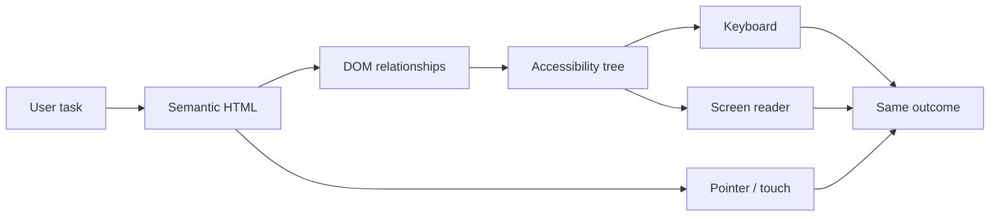
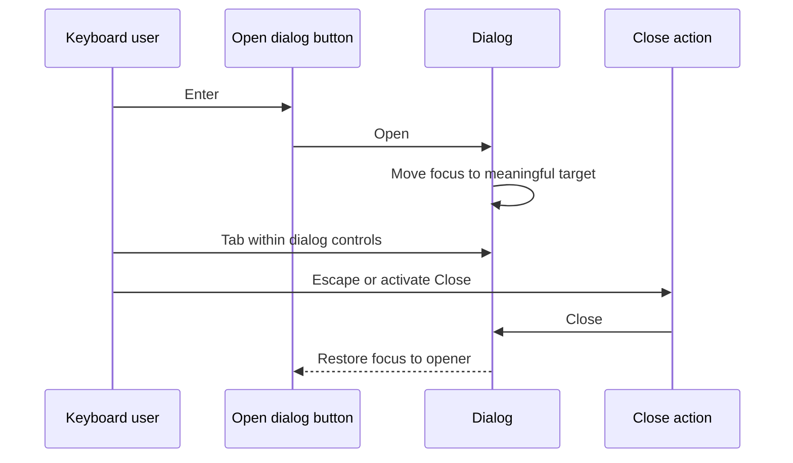
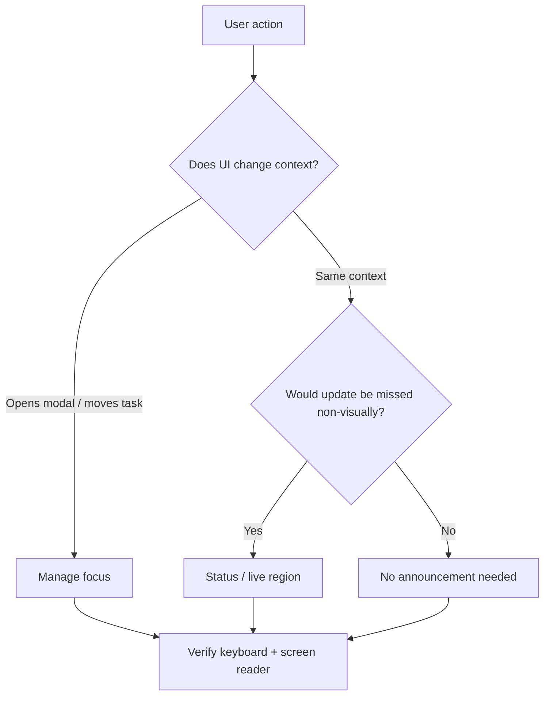
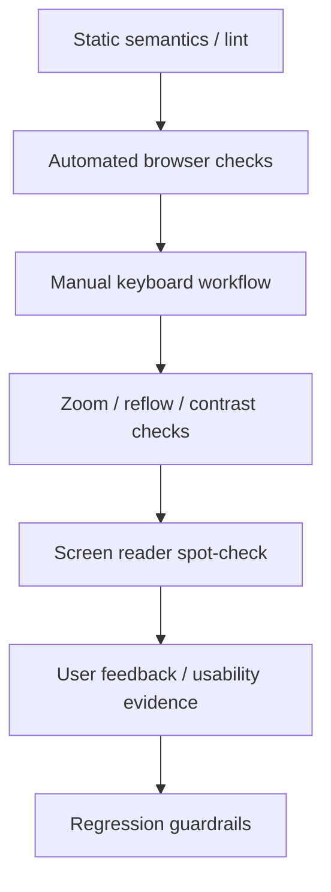

# Web Accessibility: Operate Interfaces Beyond the Happy Path

## TL;DR

Web accessibility is not a polish pass after the interface is visually complete. It is an operating discipline for making the same user task work across different input methods, output modes, vision, hearing, motor ability, cognition, browser settings, and assistive technologies.

A practical workflow is:

1. start from the **user task**, not from a screenshot;
2. use semantic HTML and native controls before inventing custom widgets;
3. verify names, roles, states, relationships, and reading order;
4. operate the task with a keyboard and keep focus visible and predictable;
5. make forms, errors, loading, and success states perceivable without relying on color or sight alone;
6. provide text alternatives for meaningful non-text content;
7. check zoom, reflow, touch targets, and layout resilience;
8. combine automated checks with manual keyboard and assistive-technology testing;
9. keep accessibility regressions inside the normal release loop.

<TermBox term="Accessible name">
An **accessible name** is the text assistive technology uses to identify a control or region. It can come from visible text, a `<label>`, `aria-labelledby`, or in narrower cases `aria-label`. A control that looks obvious visually can still be unusable if its accessible name is missing, vague, or different from the visible label.
</TermBox>



## Accessibility is a product contract, not a checklist at the end

A feature is not complete merely because its pixels match a design file. The user needs to perceive the relevant information, understand what controls do, operate them, recover from errors, and know when the system changes state.

That means accessibility spans several layers at once:

- **semantics:** what an element is;
- **name and description:** how a user identifies it;
- **interaction:** how keyboard, pointer, touch, and assistive technology operate it;
- **state:** what is selected, expanded, invalid, busy, or complete;
- **focus:** where keyboard interaction is currently anchored;
- **perception:** whether information survives low vision, zoom, color differences, or non-visual output;
- **feedback:** whether errors and asynchronous changes are communicated;
- **verification:** how the team notices regressions before users do.

WCAG 2.2 gives testable success criteria, but engineering work still requires translating those criteria into component contracts and release habits.

## Start with semantic HTML before ARIA

Native HTML already carries behavior that is expensive to recreate correctly.

Use a `<button>` for an action, an `<a href>` for navigation, a real `<input>` for text entry, a `<label>` for a form control, and headings and landmarks that describe page structure. Native controls bring established semantics, keyboard behavior, focusability, and platform integration.

A custom element like this is visually button-like but behaviorally incomplete:

```html
<div class="button" onclick="save()">Save</div>
```

Adding a role improves only part of the contract:

```html
<div role="button" tabindex="0" onclick="save()">Save</div>
```

The author still owns keyboard activation, disabled semantics, focus styling, and future behavior. WAI-ARIA Authoring Practices describes this as a key rule: a role carries behavioral expectations; ARIA does not make a custom widget behave like the native control automatically.

Prefer:

```html
<button type="button" onclick="save()">Save</button>
```

Use ARIA when native HTML cannot express the required semantics or state, and implement the complete interaction pattern when you do.

## Names, roles, states, and relationships must agree

A screen reader does not infer intent from icon shape, spacing, or color. Controls need programmatic meaning.

Common naming patterns:

```html
<label for="email">Email address</label>
<input id="email" name="email" type="email" />
```

```html
<button type="button" aria-label="Close dialog">
  <svg aria-hidden="true">...</svg>
</button>
```

```html
<h2 id="billing-title">Billing address</h2>
<section aria-labelledby="billing-title">...</section>
```

Keep the accessible name aligned with what sighted users see. A visible button labeled **Delete project** should not expose an unrelated name such as **Remove item** unless there is a deliberate reason.

For controls with additional help or validation text, relationships matter too:

```html
<input
  id="password"
  aria-describedby="password-help password-error"
  aria-invalid="true"
/>
<p id="password-help">Use at least 12 characters.</p>
<p id="password-error">Password is too short.</p>
```

The interface now exposes not just pixels near an input, but a relationship assistive technology can navigate.

## Keyboard behavior is part of the component API

Every interactive workflow should be operable without a mouse. That does not mean every key does the same thing everywhere. Native controls provide their expected keyboard model; composite custom widgets such as tabs, menus, listboxes, and grids need the keyboard behavior defined by their pattern.

Operate a page with only the keyboard and ask:

- can every required action be reached?
- is focus order consistent with the visual and logical order?
- is the current focus indicator easy to see?
- can a user escape overlays and temporary UI?
- does focus land somewhere meaningful after an action removes or replaces content?
- are custom widgets using the expected arrow-key, Enter, Space, Escape, Home, or End behavior for that widget rather than inventing a new model?

Avoid positive `tabindex` values as a way to "fix" order. They create a second focus order that diverges from the DOM and becomes fragile as the interface changes. Prefer a logical DOM order and use `tabindex="0"` or native focusability only where needed.

<TermBox term="Focus management">
**Focus management** is the deliberate placement and restoration of keyboard focus when UI structure changes. Good focus management keeps the user's current context understandable; bad focus management leaves focus behind hidden content, jumps to an unrelated control, or silently resets to the page start.
</TermBox>



### Focus should follow meaning, not implementation detail

When a dialog opens, focus should move into it so keyboard and screen-reader users know the context changed. When it closes, focus usually returns to the control that opened it. When deleting the focused row from a list, move focus to a predictable surviving neighbor or the list container rather than letting it disappear.

Do not move focus merely because data refreshed. A silent focus jump can be more disruptive than leaving focus in place and announcing the update separately.

## Forms must explain both requirements and failure

Forms combine semantics, data entry, validation, async work, and recovery. They are a frequent source of accessibility regressions because the happy path is much easier to test than the error path.

A robust field should provide:

- a persistent label, not placeholder-only identification;
- clear instructions when format or requirements matter;
- programmatic association between the field and supporting text;
- an error message that says what is wrong and how to fix it;
- `aria-invalid="true"` when the current value is invalid;
- focus or an error summary strategy for failed submission;
- server-side validation even if client validation also exists.

Do not communicate validation only with a red border. Add text and, where useful, an icon or status that does not depend on color alone.

For a failed multi-field submit, an error summary can help users understand the scope of the failure and navigate to each invalid field. If focus moves to the summary, make that behavior intentional and restore a sensible reading/interaction path from there.

## Dynamic interfaces need perceivable state changes

Single-page applications often update content without a navigation. Sighted users may notice a toast, spinner disappearing, or table row changing. A screen reader user may receive no signal unless the update is exposed appropriately.

<TermBox term="Live region">
A **live region** tells assistive technology that text may change asynchronously and that relevant changes should be announced. Use it for concise status information such as "Saved" or "3 results loaded"—not as a substitute for focus management or as a way to make every DOM update noisy.
</TermBox>

For non-critical status updates, native or ARIA status semantics can be appropriate:

```html
<p role="status">Profile saved.</p>
```

For framework-controlled text that already exists as a stable region:

```html
<div aria-live="polite" aria-atomic="true">
  3 matching projects loaded.
</div>
```

Choose announcements deliberately:

- announce important state changes the user would otherwise miss;
- keep messages short and actionable;
- avoid announcing every keystroke or render;
- do not use an assertive interruption for routine success messages;
- preserve a stable region when possible instead of repeatedly mounting unrelated announcers.



## Non-text content needs an equivalent purpose

For images, the question is not "does every `` have words in `alt`?" The question is whether the same purpose survives without the pixels.

- informative image: describe the information or purpose concisely;
- functional image inside a control: name the control's action, not the visual shape;
- decorative image: use an empty text alternative such as `alt=""` so it does not add noise;
- chart or diagram: provide the key conclusion and, when users need exact data, a table or structured alternative;
- audio/video: provide captions, transcripts, or audio description when the content requires them.

Do not stuff filenames or phrases such as "image of" into alt text unless that wording itself matters.

## Perception must survive color, zoom, reflow, and touch

Accessibility bugs often appear only after users change the environment.

### Contrast and non-color cues

Text, controls, focus indicators, and meaningful graphics need sufficient contrast for their WCAG level. More importantly, do not encode state only by color. If a required field is red, also expose text or semantics that identify the error. If a chart uses red and green series, also use labels, patterns, shapes, or direct annotations.

### Zoom and reflow

Test the workflow at high browser zoom and narrow effective widths. Content should reflow instead of forcing two-dimensional scrolling for ordinary reading, except where the content genuinely requires it, such as a large data table or diagram.

Do not lock text into fixed-height containers. Avoid controls that disappear because labels wrap to two lines. Keep overlays usable when viewport height shrinks.

### Target size

WCAG 2.2 includes a minimum target-size criterion for pointer targets, with defined exceptions. Tiny icon buttons placed tightly together are error-prone even when they technically expose names. Give controls a usable hit area and enough spacing, then verify the real rendered target rather than only the SVG dimensions.

## Automated checks are a filter, not proof

Accessibility testing works best as layers because each layer sees different failures.



### Layer 1: static checks

Linters and framework warnings can catch invalid attributes, missing labels in some patterns, duplicate IDs, and obvious misuse before the page runs.

### Layer 2: automated browser checks

Tools such as axe can detect many rule-based violations in the rendered DOM. They are excellent regression filters, but a passing scan cannot prove that a custom widget's keyboard model makes sense, that focus moves correctly, or that an announcement is useful.

### Layer 3: manual keyboard operation

Complete the real task with Tab, Shift+Tab, Enter, Space, Escape, and the widget-specific keys that apply. Test error and loading paths, not just successful submission.

### Layer 4: display resilience

Check browser zoom, narrow layouts, OS/browser contrast modes where relevant, and reduced-motion behavior for motion-heavy interactions.

### Layer 5: assistive technology

Use a representative screen reader/browser combination such as VoiceOver with Safari or NVDA with Firefox/Chrome for focused smoke tests. Verify names, roles, state changes, reading order, form errors, and dynamic announcements.

The goal is not to test every screen reader on every commit. The goal is a repeatable risk-based loop that catches the classes of failure your automation cannot observe.

## Production scenario

A checkout team replaces native fields and buttons with a custom design-system layer. The shipping-address dialog opens visually, but the opener remains focused behind the overlay. Address suggestions are clickable `<div>` elements. Invalid fields get only a red outline. After a user chooses a suggestion, the "Address selected" toast appears visually but is never announced.

**Impact:** mouse users on the happy path can finish checkout, while keyboard users can tab behind the modal, screen-reader users cannot identify or select suggestions reliably, low-vision users miss color-only errors, and asynchronous success state is silent. The team sees conversion complaints that are difficult to reproduce from visual QA screenshots.

**Root cause:** the component contract modeled visual state but not semantic role, keyboard behavior, focus ownership, error relationships, or non-visual feedback. Accessibility was treated as a late audit rather than part of the interaction architecture.

**Correct pattern:** prefer native form controls and buttons where possible; if the suggestion control must be a custom combobox/listbox, implement the appropriate ARIA/APG semantics and keyboard model; move focus into the dialog and restore it on close; connect labels, help, and errors programmatically; expose invalid state and textual error messages; announce concise async status; then protect the workflow with automated scans plus keyboard and screen-reader regression checks.

## Accessibility review

- [ ] **Task:** Can the complete user goal be finished without a mouse?
- [ ] **Semantics:** Is each interactive element the correct native element before ARIA is added?
- [ ] **Name:** Does every control expose an accessible name that matches visible intent?
- [ ] **Structure:** Do headings, landmarks, labels, and relationships describe the page logically?
- [ ] **Focus:** Is focus visible, ordered, and deliberately managed when UI structure changes?
- [ ] **Forms:** Are requirements, errors, and recovery paths programmatically connected to fields?
- [ ] **Updates:** Are important dynamic changes announced without creating notification noise?
- [ ] **Alternatives:** Does meaningful non-text content have an equivalent text or structured alternative?
- [ ] **Perception:** Does meaning survive without color alone and at high zoom/narrow reflow?
- [ ] **Targets:** Are pointer/touch targets realistically operable, not just visually present?
- [ ] **Automation:** Do static and browser accessibility checks run where they can prevent regression?
- [ ] **Manual proof:** Has the risky workflow been exercised with keyboard and representative assistive technology?

## Self-check

A custom tab interface has correct `role="tablist"`, `role="tab"`, `aria-selected`, and `aria-controls` attributes. Every tab is in the normal Tab order, but Left/Right Arrow do nothing, focus styling is nearly invisible, and activating a tab replaces content without preserving a predictable focus model. Is the component accessible because its ARIA is correct?

<details><summary>Show the reasoning</summary>
No. ARIA exposes semantics and state, but the role also implies an interaction contract. A tab pattern needs a coherent keyboard model and discernible focus, and the team must decide whether activation follows focus or requires explicit activation. Correct attributes cannot compensate for missing keyboard behavior. Prefer an established native pattern where possible; when a custom composite widget is justified, implement and test the complete APG interaction model rather than only its roles.
</details>

## Agent rule

- [ ] Prefer semantic HTML and native controls before adding ARIA.
- [ ] Treat an ARIA role as a promise to implement the matching interaction behavior.
- [ ] Never remove a visible focus indicator without replacing it with an equally discernible one.
- [ ] Keep DOM order, reading order, and keyboard focus order aligned unless a deliberate pattern requires otherwise.
- [ ] Connect form labels, help, invalid state, and errors programmatically; do not rely on proximity or color alone.
- [ ] Distinguish focus management from live announcements: moving focus changes interaction context, while a live region reports a change in the current context.
- [ ] Include loading, empty, error, and success states in accessibility checks, not only the happy path.
- [ ] Use automated accessibility tools as regression filters, then verify keyboard and assistive-technology behavior manually for high-risk flows.
- [ ] When fixing an accessibility bug, add the strongest practical machine-checkable regression guardrail without pretending automation can prove usability.

## Sources

Primary guidance verified on **2026-09-16**:

- [W3C — Web Content Accessibility Guidelines (WCAG) 2.2](https://www.w3.org/TR/WCAG22/)
- [W3C WAI — What's New in WCAG 2.2](https://www.w3.org/WAI/standards-guidelines/wcag/new-in-22/)
- [W3C WAI-ARIA Authoring Practices — Read Me First](https://www.w3.org/WAI/ARIA/apg/practices/read-me-first/)
- [W3C WAI-ARIA Authoring Practices — Developing a Keyboard Interface](https://www.w3.org/WAI/ARIA/apg/practices/keyboard-interface/)
- [W3C WAI-ARIA Authoring Practices — Providing Accessible Names and Descriptions](https://www.w3.org/WAI/ARIA/apg/practices/names-and-descriptions/)
- [MDN — HTML: A good basis for accessibility](https://developer.mozilla.org/en-US/docs/Learn_web_development/Core/Accessibility/HTML)
