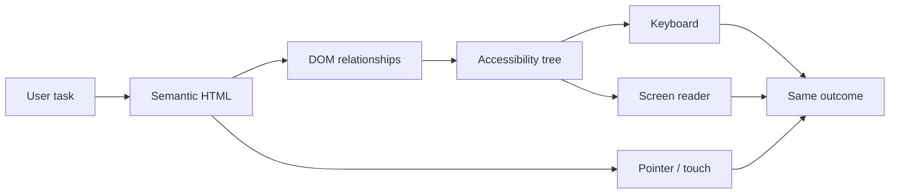
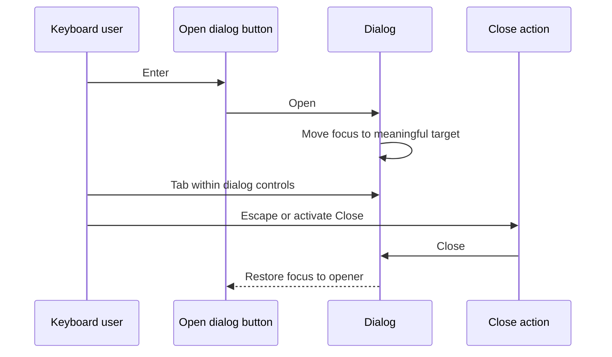
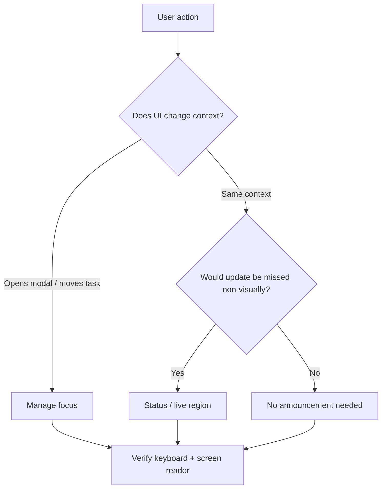
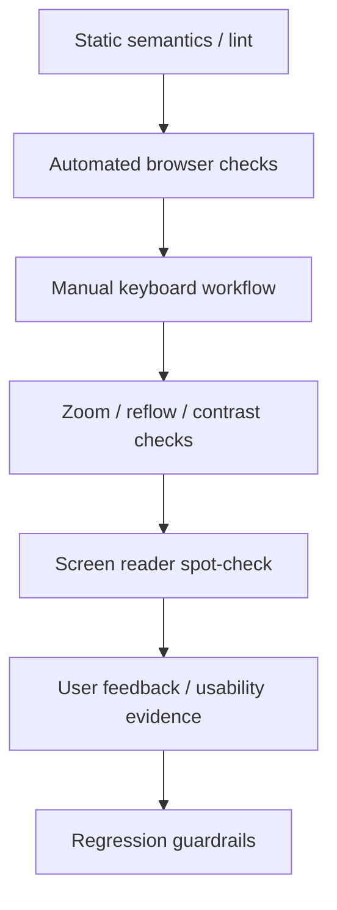

# Web Accessibility: Operate Interfaces Beyond the Happy Path

## TL;DR

Web accessibility is not a polish pass after the pixels are finished. It is an operating discipline for making the same user task work across different input methods, output modes, vision, hearing, motor ability, cognition, browser settings, and assistive technologies.

A practical workflow is:

1. start from the **user task**, not from a screenshot;
2. use semantic HTML and native controls before inventing custom widgets;
3. verify names, roles, states, relationships, and reading order;
4. operate the task with a keyboard and keep focus visible and predictable;
5. make forms, errors, loading, and success states perceivable without relying on color or sight alone;
6. provide text alternatives for meaningful non-text content;
7. check zoom, reflow, target size, and layout resilience;
8. combine automated checks with manual keyboard and assistive-technology testing;
9. keep accessibility regressions inside the normal release loop.

<TermBox term="Accessible name">
An **accessible name** is the text assistive technology uses to identify a control or region. It can come from visible text, a `<label>`, `aria-labelledby`, or in narrower cases `aria-label`. A control that looks obvious visually can still be unusable if its accessible name is missing or misleading.
</TermBox>



## Treat accessibility as a product contract

A feature is not complete merely because its pixels match a design. The user must be able to perceive the relevant information, understand what controls do, operate them, recover from errors, and know when the system changes state.

WCAG 2.2 provides testable success criteria, but engineering work still requires translating those criteria into component contracts and release habits.

Think in layers:

- **semantics:** what an element is;
- **name and description:** how users identify it;
- **interaction:** how keyboard, pointer, touch, and assistive technology operate it;
- **state:** what is selected, expanded, invalid, busy, or complete;
- **focus:** where keyboard interaction is anchored;
- **perception:** whether meaning survives low vision, zoom, color differences, or non-visual output;
- **feedback:** whether errors and asynchronous changes are communicated;
- **verification:** how regressions become visible before release.

## Start with semantic HTML before ARIA

Native HTML already supplies behavior that is expensive to recreate correctly.

Use a `<button>` for an action, an `<a href>` for navigation, a real `<input>` for text entry, a `<label>` for a form control, and meaningful headings and landmarks for page structure.

This looks button-like but is behaviorally incomplete:

```html
<div class="button" onclick="save()">Save</div>
```

Adding ARIA improves only part of the contract:

```html
<div role="button" tabindex="0" onclick="save()">Save</div>
```

The author still owns keyboard activation, disabled semantics, focus behavior, and future interaction changes. ARIA describes semantics; it does not automatically create native behavior.

Prefer:

```html
<button type="button" onclick="save()">Save</button>
```

Use ARIA when native HTML cannot express the required semantics or state, and implement the complete interaction pattern when you do.

## Names, roles, states, and relationships must agree

A screen reader does not infer intent from icon shape, spacing, or color. Controls need programmatic meaning.

```html
<label for="email">Email address</label>
<input id="email" name="email" type="email" />
```

```html
<button type="button" aria-label="Close dialog">
  <svg aria-hidden="true">...</svg>
</button>
```

Keep the accessible name aligned with visible intent. A visible **Delete project** button should not expose an unrelated name such as **Remove item** without a deliberate reason.

For supporting text and validation, expose relationships rather than relying on proximity:

```html
<input
  id="password"
  aria-describedby="password-help password-error"
  aria-invalid="true"
/>
<p id="password-help">Use at least 12 characters.</p>
<p id="password-error">Password is too short.</p>
```

## Keyboard behavior is part of the component API

Every required workflow should be operable without a mouse. Native controls provide established keyboard behavior; custom composite widgets such as tabs, menus, listboxes, and grids need the keyboard behavior defined by their pattern.

Operate a page with only the keyboard and ask:

- can every required action be reached?
- is focus order consistent with logical and visual order?
- is the focus indicator easy to see?
- can the user escape overlays and temporary UI?
- after content is removed, does focus land somewhere meaningful?
- do custom widgets implement their expected Arrow, Enter, Space, Escape, Home, or End behavior?

Avoid positive `tabindex` values as a shortcut for ordering. Prefer a logical DOM order and native focusability.

<TermBox term="Focus management">
**Focus management** is the deliberate placement and restoration of keyboard focus when UI structure changes. Good focus management preserves context; bad focus management leaves focus behind hidden content, jumps to unrelated controls, or silently resets to the page start.
</TermBox>



When a dialog opens, focus should move into its interaction context. When it closes, focus usually returns to the opener. When deleting the focused row from a list, move focus to a predictable surviving target rather than letting it disappear.

Do not move focus merely because data refreshed. A status announcement can communicate an update without destroying the user's current position.

## Forms must explain both requirements and failure

A robust form field should provide:

- a persistent label, not placeholder-only identification;
- instructions when format or requirements matter;
- programmatic association between the field and supporting text;
- an error message that says what is wrong and how to fix it;
- `aria-invalid="true"` when the current value is invalid;
- an intentional focus or error-summary strategy after failed submission;
- server-side validation even when client validation exists.

Do not communicate validation only with a red border. Add text and semantics so the error is not encoded by color alone.

## Dynamic interfaces need perceivable state changes

Single-page applications often update content without navigation. A sighted user may notice a toast or spinner disappearing while a screen-reader user receives no signal.

<TermBox term="Live region">
A **live region** tells assistive technology that text may change asynchronously and that relevant changes should be announced. Use it for concise status information such as "Saved" or "3 results loaded"—not as a substitute for focus management or as a way to announce every render.
</TermBox>

```html
<p role="status">Profile saved.</p>
```

```html
<div aria-live="polite" aria-atomic="true">
  3 matching projects loaded.
</div>
```

Choose announcements deliberately:

- announce important changes users would otherwise miss;
- keep messages concise;
- avoid announcing every keystroke or render;
- reserve assertive interruptions for genuinely urgent information;
- keep the live region stable when practical.



## Non-text content needs an equivalent purpose

The question is not merely whether every image has an `alt` attribute. The same purpose should survive without the pixels.

- informative image: provide a concise text alternative;
- functional image inside a control: name the action, not the visual shape;
- decorative image: use `alt=""` so it does not add noise;
- chart or diagram: provide the key conclusion and a structured/table alternative when exact data matters;
- audio/video: provide captions, transcripts, or audio description when needed.

## Perception must survive color, zoom, reflow, and touch

### Contrast and non-color cues

Text, controls, focus indicators, and meaningful graphics need sufficient contrast for the applicable WCAG level. Do not encode state only by color. Pair color with text, shape, iconography, labels, or semantics.

### Zoom and reflow

Test at high browser zoom and narrow effective widths. Content should reflow instead of forcing two-dimensional scrolling for ordinary reading except where the content genuinely requires it, such as a wide data table or diagram.

Avoid fixed-height text containers and controls that disappear when labels wrap.

### Target size

WCAG 2.2 includes a minimum target-size criterion for pointer targets with defined exceptions. Tiny icon buttons packed together are error-prone even when their accessible names are correct. Verify the rendered hit area and spacing, not only SVG dimensions.

## Automated checks are a filter, not proof

Accessibility testing works best as layers because each layer sees different failures.



Static checks and tools such as axe can catch many rule-based problems. A passing scan cannot prove that a custom widget's keyboard model makes sense, that focus moves correctly, or that an announcement is useful.

Complete the risky workflow manually with keyboard input, test error/loading/success states, verify high zoom and narrow layout, then spot-check names, roles, reading order, errors, and dynamic announcements with a representative screen reader/browser combination such as VoiceOver with Safari or NVDA with Firefox/Chrome.

The goal is not exhaustive assistive-technology coverage on every commit. The goal is a repeatable risk-based loop that catches failure classes automation cannot observe.

## Production scenario

A checkout team replaces native fields and buttons with a custom design-system layer. The shipping-address dialog opens visually, but the opener remains focused behind the overlay. Address suggestions are clickable `<div>` elements. Invalid fields get only a red outline. After a suggestion is selected, a success toast appears visually but is never announced.

**Impact:** mouse users on the happy path can finish checkout, while keyboard users tab behind the modal, screen-reader users cannot identify or select suggestions reliably, low-vision users miss color-only errors, and asynchronous success state is silent.

**Root cause:** the component contract modeled visual state but not semantic role, keyboard behavior, focus ownership, error relationships, or non-visual feedback. Accessibility was treated as a late audit instead of interaction architecture.

**Correct pattern:** prefer native form controls and buttons where possible; when a custom combobox/listbox is justified, implement the appropriate ARIA/APG semantics and keyboard model; move focus into the dialog and restore it on close; connect labels, help, and errors programmatically; expose textual invalid state; announce concise asynchronous status; then protect the workflow with automated scans plus keyboard and screen-reader regression checks.

## Accessibility review

- [ ] **Task:** Can the complete user goal be finished without a mouse?
- [ ] **Semantics:** Is each interactive element the correct native element before ARIA is added?
- [ ] **Name:** Does every control expose an accessible name that matches visible intent?
- [ ] **Structure:** Do headings, landmarks, labels, and relationships describe the page logically?
- [ ] **Focus:** Is focus visible, ordered, and deliberately managed when UI structure changes?
- [ ] **Forms:** Are requirements, errors, and recovery paths programmatically connected to fields?
- [ ] **Updates:** Are important dynamic changes announced without creating notification noise?
- [ ] **Alternatives:** Does meaningful non-text content have an equivalent text or structured alternative?
- [ ] **Perception:** Does meaning survive without color alone and at high zoom/narrow reflow?
- [ ] **Targets:** Are pointer/touch targets realistically operable?
- [ ] **Automation:** Do static and browser accessibility checks run where they prevent regressions?
- [ ] **Manual proof:** Has the risky workflow been exercised with keyboard and representative assistive technology?

## Self-check

A custom tab interface has correct `role="tablist"`, `role="tab"`, `aria-selected`, and `aria-controls`. Every tab is in the normal Tab order, but Left/Right Arrow do nothing, focus styling is nearly invisible, and activating a tab replaces content without a predictable focus model. Is the component accessible because its ARIA is correct?

<details>
<summary>Show the reasoning</summary>

No. ARIA exposes semantics and state, but the role also implies an interaction contract. A tab pattern needs a coherent keyboard model and discernible focus. Correct attributes cannot compensate for missing keyboard behavior. Prefer native behavior where possible; when a custom composite widget is justified, implement and test the complete APG interaction model rather than only its roles.

</details>

## Agent rule

- [ ] Prefer semantic HTML and native controls before adding ARIA.
- [ ] Treat an ARIA role as a promise to implement matching interaction behavior.
- [ ] Never remove a visible focus indicator without replacing it with an equally discernible one.
- [ ] Keep DOM order, reading order, and keyboard focus order aligned unless a deliberate pattern requires otherwise.
- [ ] Connect form labels, help, invalid state, and errors programmatically; do not rely on proximity or color alone.
- [ ] Distinguish focus management from live announcements: moving focus changes interaction context, while a live region reports a change in the current context.
- [ ] Include loading, empty, error, and success states in accessibility checks, not only the happy path.
- [ ] Use automated accessibility tools as regression filters, then verify keyboard and assistive-technology behavior manually for high-risk flows.
- [ ] When fixing an accessibility bug, add the strongest practical machine-checkable regression guardrail without pretending automation can prove usability.

## Sources

Primary guidance verified on **2026-09-16**:

- [W3C — Web Content Accessibility Guidelines (WCAG) 2.2](https://www.w3.org/TR/WCAG22/)
- [W3C WAI — What's New in WCAG 2.2](https://www.w3.org/WAI/standards-guidelines/wcag/new-in-22/)
- [W3C WAI-ARIA Authoring Practices — Read Me First](https://www.w3.org/WAI/ARIA/apg/practices/read-me-first/)
- [W3C WAI-ARIA Authoring Practices — Developing a Keyboard Interface](https://www.w3.org/WAI/ARIA/apg/practices/keyboard-interface/)
- [W3C WAI-ARIA Authoring Practices — Providing Accessible Names and Descriptions](https://www.w3.org/WAI/ARIA/apg/practices/names-and-descriptions/)
- [MDN — HTML: A good basis for accessibility](https://developer.mozilla.org/en-US/docs/Learn_web_development/Core/Accessibility/HTML)
