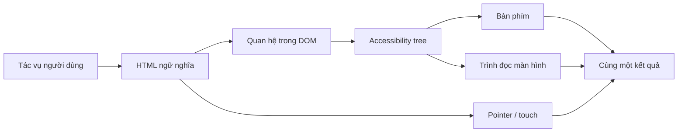
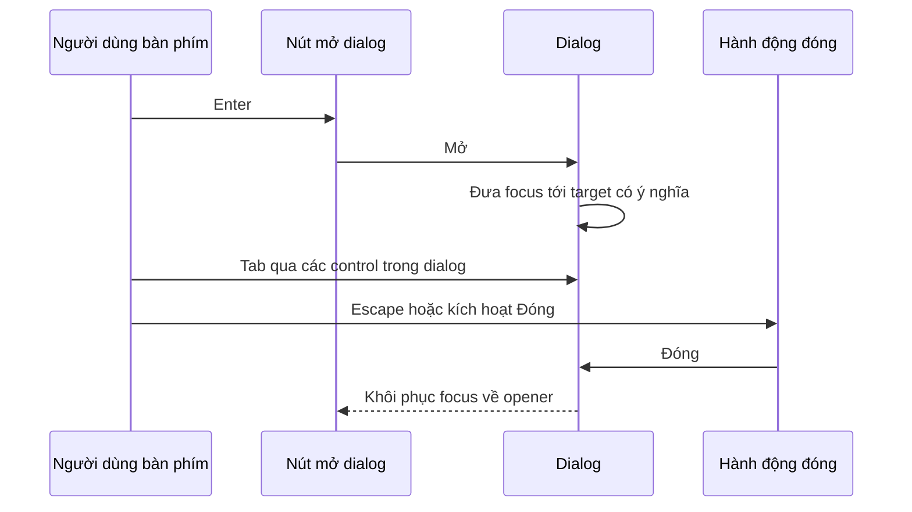
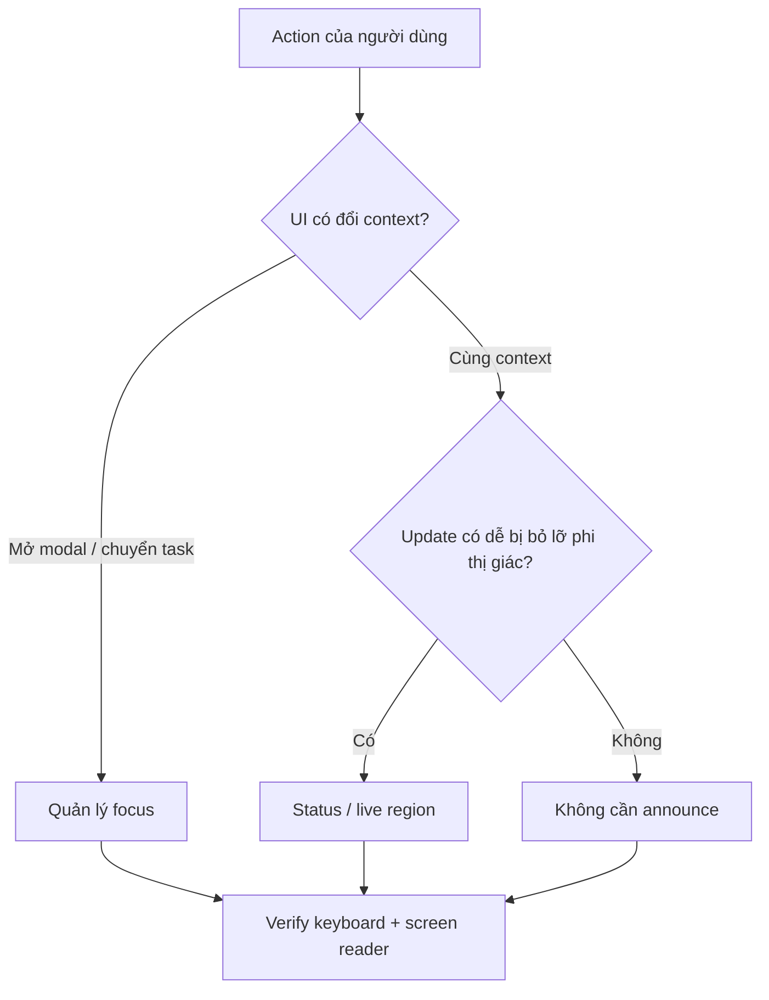
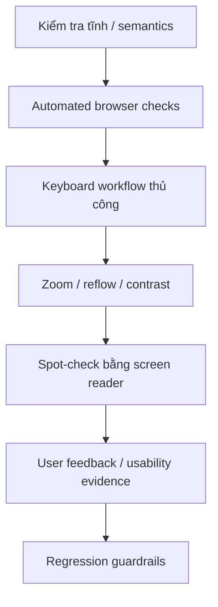

# Khả năng truy cập Web: Vận hành Giao diện Ngoài Happy Path

## TL;DR

Khả năng truy cập Web không phải bước đánh bóng sau khi giao diện đã hoàn tất về mặt thị giác. Đây là kỷ luật vận hành để cùng một tác vụ người dùng vẫn hoạt động qua nhiều cách nhập liệu, cách nhận đầu ra, mức thị lực/thính lực/vận động/nhận thức, cài đặt trình duyệt và công nghệ hỗ trợ khác nhau.

Một workflow thực tế:

1. bắt đầu từ **tác vụ người dùng**, không phải screenshot;
2. ưu tiên HTML ngữ nghĩa và control gốc trước khi tự xây widget;
3. kiểm tra tên, role, state, relationship và reading order;
4. vận hành toàn bộ tác vụ chỉ bằng bàn phím, đồng thời giữ focus hiển thị rõ và có thể dự đoán;
5. làm cho biểu mẫu, lỗi, loading và success state có thể nhận biết mà không phụ thuộc riêng vào màu hoặc thị giác;
6. cung cấp văn bản thay thế cho nội dung phi văn bản có ý nghĩa;
7. kiểm tra phóng to, tái bố cục, touch target và độ bền của layout;
8. kết hợp kiểm tra tự động với keyboard test và kiểm thử bằng công nghệ hỗ trợ;
9. giữ regression về accessibility trong cùng release loop với các lỗi chức năng khác.

<TermBox term="Accessible name">
**Accessible name** là tên mà công nghệ hỗ trợ dùng để nhận diện control hoặc region. Nó có thể đến từ text hiển thị, `<label>`, `aria-labelledby` hoặc trong trường hợp hẹp hơn là `aria-label`. Một control nhìn rất rõ bằng mắt vẫn có thể không dùng được nếu tên có thể truy cập bị thiếu, mơ hồ hoặc không khớp với nhãn hiển thị.
</TermBox>



## Accessibility là contract của sản phẩm, không phải checklist cuối quy trình

Một feature chưa hoàn tất chỉ vì pixel khớp design. Người dùng cần nhận biết thông tin cần thiết, hiểu control làm gì, thao tác được, phục hồi sau lỗi và biết khi hệ thống đổi trạng thái.

Vì vậy accessibility chạy xuyên nhiều lớp:

- **semantics:** element này thực sự là gì;
- **name và description:** người dùng nhận diện nó bằng cách nào;
- **interaction:** keyboard, pointer, touch và công nghệ hỗ trợ vận hành nó ra sao;
- **state:** control đang selected, expanded, invalid, busy hay complete;
- **focus:** tương tác bàn phím hiện neo ở đâu;
- **perception:** thông tin có còn tồn tại khi low vision, zoom, khác biệt nhận biết màu hoặc output phi thị giác hay không;
- **feedback:** lỗi và async change có được truyền đạt hay không;
- **verification:** team phát hiện regression trước người dùng bằng cách nào.

WCAG 2.2 cung cấp các success criterion có thể kiểm chứng, nhưng công việc kỹ thuật vẫn cần chuyển chúng thành component contract và release habit cụ thể.

## Bắt đầu bằng HTML ngữ nghĩa trước ARIA

Native HTML đã có sẵn nhiều hành vi rất tốn kém nếu phải tự dựng lại đúng.

Dùng `<button>` cho action, `<a href>` cho navigation, `<input>` thật cho nhập liệu, `<label>` cho form control, và heading/landmark để mô tả cấu trúc trang. Native control mang theo semantics, keyboard behavior, focusability và platform integration quen thuộc.

Element sau trông giống button nhưng behavior chưa đầy đủ:

```html
<div class="button" onclick="save()">Lưu</div>
```

Thêm role chỉ cải thiện một phần contract:

```html
<div role="button" tabindex="0" onclick="save()">Lưu</div>
```

Author vẫn phải tự chịu trách nhiệm cho keyboard activation, disabled semantics, focus styling và behavior tương lai. WAI-ARIA Authoring Practices nhấn mạnh nguyên tắc quan trọng: role đi kèm kỳ vọng hành vi; ARIA không tự biến custom widget thành native control.

Ưu tiên:

```html
<button type="button" onclick="save()">Lưu</button>
```

Chỉ dùng ARIA khi native HTML không diễn đạt được semantics hoặc state cần thiết, và khi dùng thì phải triển khai đầy đủ interaction pattern tương ứng.

## Name, role, state và relationship phải nhất quán

Trình đọc màn hình không tự suy ra intent từ hình icon, khoảng cách hay màu sắc. Control cần meaning có thể truy cập bằng chương trình.

Các pattern naming phổ biến:

```html
<label for="email">Địa chỉ email</label>
<input id="email" name="email" type="email" />
```

```html
<button type="button" aria-label="Đóng hộp thoại">
  <svg aria-hidden="true">...</svg>
</button>
```

```html
<h2 id="billing-title">Địa chỉ thanh toán</h2>
<section aria-labelledby="billing-title">...</section>
```

Giữ accessible name khớp với intent người dùng nhìn thấy. Button hiển thị **Xóa dự án** không nên expose tên không liên quan như **Bỏ mục** nếu không có lý do cụ thể.

Với control có help text hoặc validation text, relationship cũng quan trọng:

```html
<input
  id="password"
  aria-describedby="password-help password-error"
  aria-invalid="true"
/>
<p id="password-help">Dùng ít nhất 12 ký tự.</p>
<p id="password-error">Mật khẩu quá ngắn.</p>
```

Lúc này UI không chỉ đặt vài pixel gần input mà còn expose quan hệ mà công nghệ hỗ trợ có thể điều hướng.

## Hành vi bàn phím là một phần của component API

Mọi workflow tương tác cần có thể vận hành mà không cần chuột. Điều đó không có nghĩa mọi phím đều làm cùng một việc ở mọi nơi. Native control đã có keyboard model tương ứng; composite widget như tab, menu, listbox và grid phải triển khai keyboard behavior theo pattern của chính widget đó.

Hãy vận hành trang chỉ bằng bàn phím và hỏi:

- mọi action bắt buộc có thể reach được không?
- focus order có khớp visual/logical order không?
- chỉ báo focus có nhìn thấy rõ không?
- người dùng có thoát khỏi overlay và temporary UI được không?
- sau action xóa hoặc thay content, focus có rơi vào vị trí còn ý nghĩa không?
- custom widget có dùng đúng Arrow key, Enter, Space, Escape, Home hoặc End theo pattern hay tự phát minh model mới?

Tránh dùng `tabindex` dương để "sửa" thứ tự. Cách đó tạo focus order thứ hai tách khỏi DOM và trở nên mong manh khi layout thay đổi. Ưu tiên DOM order hợp lý và chỉ dùng `tabindex="0"` hoặc native focusability khi thật sự cần.

<TermBox term="Quản lý focus">
**Quản lý focus** là việc đặt và khôi phục keyboard focus có chủ đích khi cấu trúc UI thay đổi. Focus management tốt giữ context hiện tại dễ hiểu; focus management tệ để focus mắc lại sau content bị ẩn, nhảy sang control không liên quan hoặc âm thầm quay về đầu trang.
</TermBox>



### Focus phải đi theo meaning, không theo implementation detail

Khi dialog mở, focus nên đi vào dialog để người dùng bàn phím và screen reader biết context đã đổi. Khi dialog đóng, focus thường quay lại control đã mở nó. Khi xóa row đang focus trong list, đưa focus tới item lân cận còn tồn tại hoặc container phù hợp thay vì để focus biến mất.

Không di chuyển focus chỉ vì data vừa refresh. Một silent focus jump có thể phá context nhiều hơn việc giữ focus tại chỗ và announce update riêng.

## Biểu mẫu phải giải thích cả yêu cầu lẫn failure

Form kết hợp semantics, nhập dữ liệu, validation, async work và recovery. Đây là nguồn accessibility regression phổ biến vì happy path dễ test hơn error path rất nhiều.

Một field bền vững nên có:

- label cố định, không dùng placeholder làm cách nhận diện duy nhất;
- instruction rõ nếu format hoặc requirement quan trọng;
- quan hệ programmatic giữa field và supporting text;
- thông báo lỗi cho biết sai gì và cách sửa;
- `aria-invalid="true"` khi value hiện không hợp lệ;
- chiến lược focus hoặc error summary khi submit thất bại;
- server-side validation ngay cả khi đã có client validation.

Không báo validation chỉ bằng viền đỏ. Thêm text và, khi hữu ích, icon hoặc status không phụ thuộc màu sắc như tín hiệu duy nhất.

Với submit có nhiều field lỗi, error summary giúp người dùng hiểu phạm vi failure và nhảy tới từng field. Nếu focus được đưa tới summary, behavior đó phải có chủ đích và tạo lại reading/interaction path hợp lý từ đó.

## Giao diện động cần truyền đạt state change

Single-page application thường cập nhật content mà không navigation. Người dùng nhìn thấy có thể nhận ra toast, spinner biến mất hoặc row thay đổi. Người dùng screen reader có thể không nhận tín hiệu nào nếu update không được expose đúng.

<TermBox term="Live region">
**Live region** báo cho công nghệ hỗ trợ rằng text có thể thay đổi bất đồng bộ và các thay đổi phù hợp nên được announce. Dùng nó cho status ngắn như "Đã lưu" hoặc "Đã tải 3 kết quả"—không dùng để thay focus management hoặc biến mọi DOM update thành tiếng ồn.
</TermBox>

Với status update không khẩn cấp, semantic status có thể phù hợp:

```html
<p role="status">Đã lưu hồ sơ.</p>
```

Với text do framework kiểm soát trong một region ổn định:

```html
<div aria-live="polite" aria-atomic="true">
  Đã tải 3 dự án phù hợp.
</div>
```

Chọn announcement có chủ đích:

- announce state change quan trọng mà người dùng phi thị giác dễ bỏ lỡ;
- giữ message ngắn và có thể hành động;
- tránh announce mỗi keystroke hoặc render;
- không dùng assertive interruption cho success message thường ngày;
- ưu tiên region ổn định thay vì liên tục mount các announcer không liên quan.



## Nội dung phi văn bản cần phương án thay thế cùng mục đích

Với image, câu hỏi không phải "mọi `` đều có chữ trong `alt` chưa?" mà là cùng mục đích có còn tồn tại nếu không thấy pixel hay không.

- image cung cấp thông tin: mô tả information hoặc purpose ngắn gọn;
- image mang chức năng bên trong control: đặt tên action của control, không chỉ mô tả hình dạng;
- decorative image: dùng văn bản thay thế rỗng như `alt=""` để không thêm noise;
- chart hoặc diagram: nêu kết luận chính và, nếu user cần data chính xác, cung cấp table hoặc structured alternative;
- audio/video: cung cấp caption, transcript hoặc audio description khi nội dung yêu cầu.

Không nhét filename hoặc cụm "hình ảnh của" vào alt text nếu câu đó không mang ý nghĩa thực sự.

## Perception phải sống sót qua màu, zoom, reflow và touch

Accessibility bug thường chỉ lộ ra sau khi người dùng thay đổi môi trường.

### Độ tương phản và tín hiệu không chỉ bằng màu

Text, control, focus indicator và graphic có ý nghĩa cần đủ contrast cho mức WCAG tương ứng. Quan trọng hơn, không encode state chỉ bằng màu. Nếu field required chuyển đỏ, hãy thêm text hoặc semantics nhận diện lỗi. Nếu chart dùng series đỏ và xanh, thêm label, pattern, shape hoặc annotation trực tiếp.

### Phóng to và tái bố cục

Test workflow ở mức browser zoom cao và effective width hẹp. Content nên reflow thay vì buộc scroll hai chiều cho nội dung đọc thông thường, ngoại trừ nơi bản chất nội dung cần điều đó như data table lớn hoặc diagram.

Không khóa text trong fixed-height container. Tránh control biến mất khi label wrap thành hai dòng. Giữ overlay còn dùng được khi viewport height giảm.

### Kích thước mục tiêu

WCAG 2.2 có criterion về kích thước mục tiêu tối thiểu cho pointer target cùng các ngoại lệ cụ thể. Icon button cực nhỏ đặt sát nhau dễ gây thao tác nhầm ngay cả khi accessible name đã đúng. Cần hit area đủ dùng và khoảng cách hợp lý, rồi verify target render thật chứ không chỉ kích thước SVG.

## Kiểm tra tự động là bộ lọc, không phải bằng chứng hoàn chỉnh

Accessibility testing hiệu quả nhất khi dùng nhiều lớp vì mỗi lớp phát hiện loại failure khác nhau.



### Lớp 1: kiểm tra tĩnh

Linter và framework warning có thể bắt invalid attribute, thiếu label trong một số pattern, duplicate ID và misuse rõ ràng trước khi trang chạy.

### Lớp 2: automated browser check

Tool như axe có thể phát hiện nhiều violation dựa trên rule trong rendered DOM. Chúng rất hữu ích làm regression filter, nhưng scan pass không thể chứng minh keyboard model của custom widget hợp lý, focus di chuyển đúng hoặc announcement có ích.

### Lớp 3: keyboard test thủ công

Hoàn tất tác vụ thật bằng Tab, Shift+Tab, Enter, Space, Escape và widget-specific key cần thiết. Test cả error/loading path, không chỉ success submit.

### Lớp 4: display resilience

Kiểm tra browser zoom, layout hẹp, chế độ contrast của OS/browser khi phù hợp và reduced-motion behavior cho interaction có nhiều chuyển động.

### Lớp 5: công nghệ hỗ trợ

Dùng tổ hợp đại diện như VoiceOver + Safari hoặc NVDA + Firefox/Chrome cho focused smoke test. Verify name, role, state change, reading order, form error và dynamic announcement.

Mục tiêu không phải test mọi screen reader trên mọi commit. Mục tiêu là một risk-based loop lặp lại được để bắt những failure mà automation không quan sát được.

## Production scenario

Một team checkout thay native field và button bằng custom design-system layer. Shipping-address dialog mở đúng về mặt thị giác nhưng opener vẫn giữ focus phía sau overlay. Address suggestion là các `<div>` click được. Field lỗi chỉ có viền đỏ. Sau khi chọn suggestion, toast "Đã chọn địa chỉ" xuất hiện trên màn hình nhưng không được announce.

**Hậu quả:** người dùng chuột trên happy path vẫn checkout được, trong khi người dùng bàn phím có thể tab ra sau modal, người dùng screen reader khó nhận diện/chọn suggestion, người dùng low vision bỏ lỡ lỗi chỉ báo bằng màu và async success state hoàn toàn im lặng. Team nhận complaint về conversion nhưng visual QA screenshot khó tái hiện.

**Nguyên nhân cốt lõi:** component contract chỉ mô hình visual state mà không mô hình semantic role, keyboard behavior, focus ownership, error relationship hoặc non-visual feedback. Accessibility bị coi là late audit thay vì một phần của interaction architecture.

**Cách khắc phục chuẩn:** ưu tiên native form control và button khi có thể; nếu suggestion bắt buộc là custom combobox/listbox, triển khai đúng semantics và keyboard model theo ARIA/APG; đưa focus vào dialog và khôi phục khi đóng; nối label/help/error bằng quan hệ programmatic; expose invalid state cùng text lỗi; announce async status ngắn gọn; sau đó bảo vệ workflow bằng automated scan kết hợp keyboard và screen-reader regression check.

## Review accessibility

- [ ] **Task:** Toàn bộ mục tiêu người dùng có hoàn tất được mà không dùng chuột không?
- [ ] **Semantics:** Mỗi interactive element đã dùng native element phù hợp trước khi thêm ARIA chưa?
- [ ] **Name:** Mỗi control có accessible name khớp intent hiển thị không?
- [ ] **Structure:** Heading, landmark, label và relationship có mô tả cấu trúc logic của trang không?
- [ ] **Focus:** Focus có hiển thị rõ, đúng thứ tự và được quản lý có chủ đích khi UI đổi cấu trúc không?
- [ ] **Forms:** Requirement, error và recovery path có được nối programmatically tới field không?
- [ ] **Updates:** Dynamic change quan trọng có được announce mà không tạo notification noise không?
- [ ] **Alternatives:** Nội dung phi văn bản có ý nghĩa có text hoặc structured alternative tương đương không?
- [ ] **Perception:** Meaning có tồn tại nếu không dựa riêng vào màu và khi zoom/reflow mạnh không?
- [ ] **Targets:** Pointer/touch target có thực sự dễ thao tác, không chỉ hiện diện về mặt thị giác không?
- [ ] **Automation:** Static và browser accessibility check có chạy ở nơi chúng ngăn regression hiệu quả không?
- [ ] **Manual proof:** Workflow rủi ro đã được chạy bằng bàn phím và công nghệ hỗ trợ đại diện chưa?

## Self-check

Một custom tab có đúng `role="tablist"`, `role="tab"`, `aria-selected` và `aria-controls`. Mọi tab đều nằm trong Tab order bình thường, nhưng Left/Right Arrow không làm gì, focus styling gần như không nhìn thấy và khi activate tab thì content bị thay mà không có focus model dễ dự đoán. Component có accessible chỉ vì ARIA đúng không?

<details><summary>Show the reasoning</summary>
Không. ARIA expose semantics và state, nhưng role cũng kéo theo interaction contract. Tab pattern cần keyboard model mạch lạc và focus dễ nhận biết; team còn phải quyết định activation đi theo focus hay cần explicit activation. Attribute đúng không bù được keyboard behavior thiếu. Ưu tiên native pattern khi có thể; khi custom composite widget thật sự cần thiết, triển khai và test đầy đủ APG interaction model thay vì chỉ gắn role.
</details>

## Agent rule

- [ ] Ưu tiên HTML ngữ nghĩa và native control trước khi thêm ARIA.
- [ ] Xem ARIA role như lời hứa phải triển khai matching interaction behavior.
- [ ] Không xóa visible focus indicator nếu chưa thay bằng chỉ báo dễ phân biệt tương đương.
- [ ] Giữ DOM order, reading order và keyboard focus order thẳng hàng trừ khi pattern có lý do rõ ràng để khác.
- [ ] Nối form label, help, invalid state và error programmatically; không phụ thuộc vào proximity hoặc màu đơn lẻ.
- [ ] Phân biệt focus management với live announcement: di chuyển focus đổi interaction context, còn live region báo thay đổi trong context hiện tại.
- [ ] Đưa loading, empty, error và success state vào accessibility check, không chỉ happy path.
- [ ] Dùng automated accessibility tool như regression filter, rồi verify keyboard và assistive-technology behavior thủ công cho flow rủi ro cao.
- [ ] Khi sửa accessibility bug, thêm machine-checkable regression guardrail mạnh nhất có thể mà không giả vờ automation chứng minh được usability.

## Sources

Nguồn chính được kiểm chứng vào **2026-09-16**:

- [W3C — Web Content Accessibility Guidelines (WCAG) 2.2](https://www.w3.org/TR/WCAG22/)
- [W3C WAI — What's New in WCAG 2.2](https://www.w3.org/WAI/standards-guidelines/wcag/new-in-22/)
- [W3C WAI-ARIA Authoring Practices — Read Me First](https://www.w3.org/WAI/ARIA/apg/practices/read-me-first/)
- [W3C WAI-ARIA Authoring Practices — Developing a Keyboard Interface](https://www.w3.org/WAI/ARIA/apg/practices/keyboard-interface/)
- [W3C WAI-ARIA Authoring Practices — Providing Accessible Names and Descriptions](https://www.w3.org/WAI/ARIA/apg/practices/names-and-descriptions/)
- [MDN — HTML: A good basis for accessibility](https://developer.mozilla.org/en-US/docs/Learn_web_development/Core/Accessibility/HTML)
