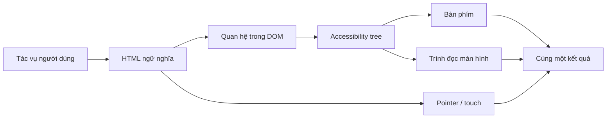
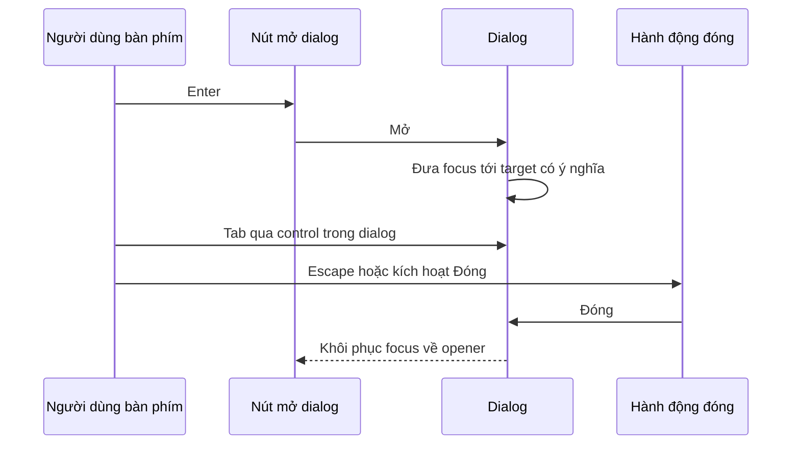
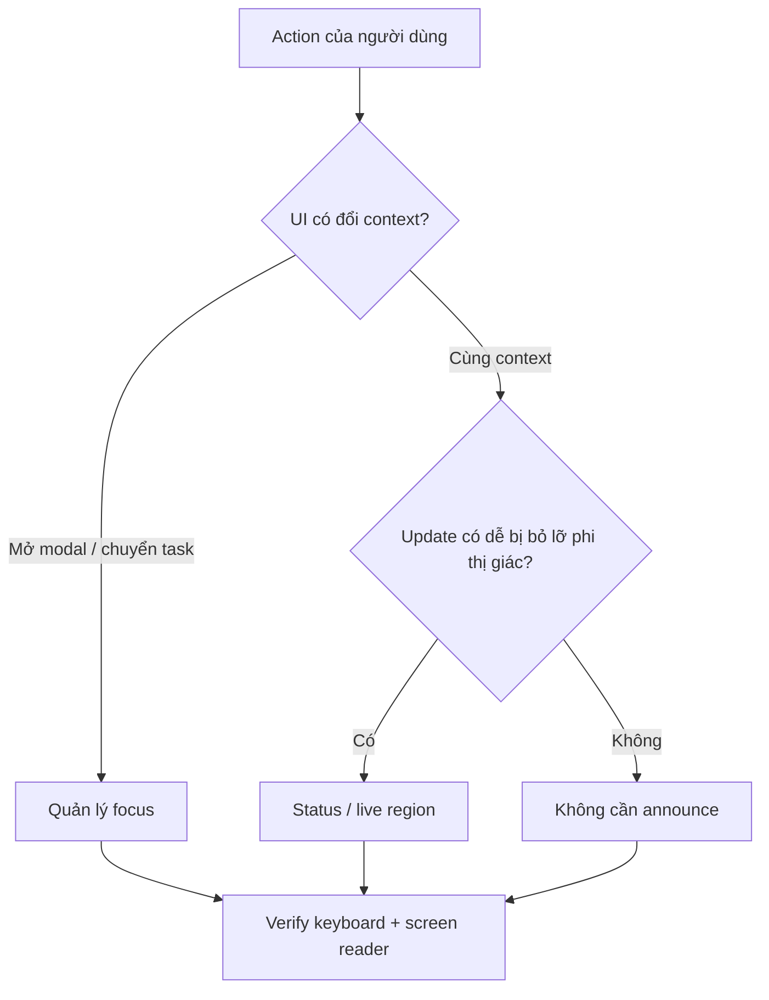
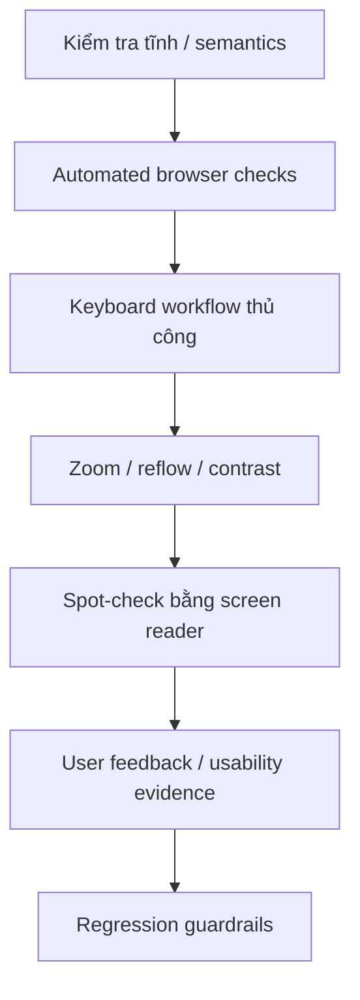

# Khả năng truy cập Web: Vận hành Giao diện Ngoài Happy Path

## TL;DR

Khả năng truy cập Web không phải bước đánh bóng sau khi pixel đã hoàn tất. Đây là kỷ luật vận hành để cùng một tác vụ người dùng vẫn hoạt động qua nhiều cách nhập liệu, cách nhận đầu ra, mức thị lực/thính lực/vận động/nhận thức, cài đặt trình duyệt và công nghệ hỗ trợ khác nhau.

Một workflow thực tế:

1. bắt đầu từ **tác vụ người dùng**, không phải screenshot;
2. ưu tiên HTML ngữ nghĩa và control gốc trước khi tự xây widget;
3. kiểm tra name, role, state, relationship và reading order;
4. vận hành toàn bộ tác vụ chỉ bằng bàn phím, đồng thời giữ focus hiển thị rõ và có thể dự đoán;
5. làm cho biểu mẫu, lỗi, loading và success state có thể nhận biết mà không phụ thuộc riêng vào màu hoặc thị giác;
6. cung cấp văn bản thay thế cho nội dung phi văn bản có ý nghĩa;
7. kiểm tra phóng to, tái bố cục, kích thước mục tiêu và độ bền của layout;
8. kết hợp kiểm tra tự động với keyboard test và kiểm thử bằng công nghệ hỗ trợ;
9. giữ regression accessibility trong cùng release loop với lỗi chức năng khác.

<TermBox term="Accessible name">
**Accessible name** là tên mà công nghệ hỗ trợ dùng để nhận diện control hoặc region. Nó có thể đến từ text hiển thị, `<label>`, `aria-labelledby` hoặc trong trường hợp hẹp hơn là `aria-label`. Một control nhìn rất rõ bằng mắt vẫn có thể không dùng được nếu tên có thể truy cập bị thiếu hoặc sai intent.
</TermBox>



## Xem accessibility như contract của sản phẩm

Một feature chưa hoàn tất chỉ vì pixel khớp design. Người dùng cần nhận biết thông tin cần thiết, hiểu control làm gì, thao tác được, phục hồi sau lỗi và biết khi hệ thống đổi trạng thái.

WCAG 2.2 cung cấp success criterion có thể kiểm chứng, nhưng công việc kỹ thuật vẫn cần chuyển các criterion đó thành component contract và release habit cụ thể.

Hãy suy luận theo nhiều lớp:

- **semantics:** element này thực sự là gì;
- **name và description:** người dùng nhận diện nó bằng cách nào;
- **interaction:** keyboard, pointer, touch và công nghệ hỗ trợ vận hành nó ra sao;
- **state:** control đang selected, expanded, invalid, busy hay complete;
- **focus:** tương tác bàn phím hiện neo ở đâu;
- **perception:** meaning có còn tồn tại khi low vision, zoom, khác biệt nhận biết màu hoặc output phi thị giác hay không;
- **feedback:** lỗi và async change có được truyền đạt hay không;
- **verification:** regression trở nên nhìn thấy trước release bằng cách nào.

## Bắt đầu bằng HTML ngữ nghĩa trước ARIA

Native HTML đã có sẵn nhiều behavior rất tốn kém nếu phải tự dựng lại đúng.

Dùng `<button>` cho action, `<a href>` cho navigation, `<input>` thật cho nhập liệu, `<label>` cho form control, và heading/landmark có ý nghĩa cho cấu trúc trang.

Element sau trông giống button nhưng behavior chưa đầy đủ:

```html
<div class="button" onclick="save()">Lưu</div>
```

Thêm ARIA chỉ cải thiện một phần contract:

```html
<div role="button" tabindex="0" onclick="save()">Lưu</div>
```

Author vẫn phải tự chịu trách nhiệm cho keyboard activation, disabled semantics, focus behavior và thay đổi interaction về sau. ARIA mô tả semantics; nó không tự tạo native behavior.

Ưu tiên:

```html
<button type="button" onclick="save()">Lưu</button>
```

Chỉ dùng ARIA khi native HTML không diễn đạt được semantics hoặc state cần thiết, và khi dùng thì phải triển khai interaction pattern đầy đủ.

## Name, role, state và relationship phải nhất quán

Trình đọc màn hình không tự suy ra intent từ icon, khoảng cách hay màu sắc. Control cần meaning có thể truy cập bằng chương trình.

```html
<label for="email">Địa chỉ email</label>
<input id="email" name="email" type="email" />
```

```html
<button type="button" aria-label="Đóng hộp thoại">
  <svg aria-hidden="true">...</svg>
</button>
```

Giữ accessible name khớp intent hiển thị. Button **Xóa dự án** không nên expose tên không liên quan như **Bỏ mục** nếu không có lý do cụ thể.

Với help text và validation, expose relationship thay vì chỉ dựa vào proximity:

```html
<input
  id="password"
  aria-describedby="password-help password-error"
  aria-invalid="true"
/>
<p id="password-help">Dùng ít nhất 12 ký tự.</p>
<p id="password-error">Mật khẩu quá ngắn.</p>
```

## Hành vi bàn phím là một phần của component API

Mọi workflow bắt buộc cần vận hành được mà không dùng chuột. Native control đã có keyboard behavior quen thuộc; custom composite widget như tab, menu, listbox và grid phải triển khai keyboard behavior theo pattern của chính widget đó.

Vận hành trang chỉ bằng bàn phím và hỏi:

- mọi action bắt buộc có reach được không?
- focus order có khớp logical/visual order không?
- chỉ báo focus có nhìn thấy rõ không?
- người dùng có thoát khỏi overlay và temporary UI được không?
- sau khi content bị xóa, focus có rơi vào nơi còn ý nghĩa không?
- custom widget có implement đúng Arrow, Enter, Space, Escape, Home hoặc End theo pattern không?

Tránh dùng `tabindex` dương như shortcut để sửa thứ tự. Ưu tiên DOM order hợp lý và native focusability.

<TermBox term="Quản lý focus">
**Quản lý focus** là việc đặt và khôi phục keyboard focus có chủ đích khi cấu trúc UI thay đổi. Focus management tốt giữ context; focus management tệ để focus mắc lại sau content bị ẩn, nhảy sang control không liên quan hoặc âm thầm quay về đầu trang.
</TermBox>



Khi dialog mở, focus nên đi vào interaction context của dialog. Khi đóng, focus thường quay lại opener. Khi xóa row đang focus trong list, đưa focus tới target còn tồn tại có thể dự đoán thay vì để focus biến mất.

Không di chuyển focus chỉ vì data refresh. Status announcement có thể truyền đạt update mà không phá vị trí hiện tại của người dùng.

## Biểu mẫu phải giải thích cả requirement lẫn failure

Một form field bền vững nên có:

- label cố định, không dùng placeholder làm cách nhận diện duy nhất;
- instruction khi format hoặc requirement quan trọng;
- quan hệ programmatic giữa field và supporting text;
- thông báo lỗi cho biết sai gì và cách sửa;
- `aria-invalid="true"` khi value hiện không hợp lệ;
- chiến lược focus hoặc error summary có chủ đích sau failed submission;
- server-side validation ngay cả khi đã có client validation.

Không báo validation chỉ bằng viền đỏ. Thêm text và semantics để error không phụ thuộc vào màu sắc như tín hiệu duy nhất.

## Giao diện động cần truyền đạt state change

Single-page application thường update content mà không navigation. Người dùng nhìn thấy có thể nhận ra toast hoặc spinner biến mất, trong khi người dùng screen reader không nhận tín hiệu nào.

<TermBox term="Live region">
**Live region** báo cho công nghệ hỗ trợ rằng text có thể thay đổi bất đồng bộ và các thay đổi phù hợp nên được announce. Dùng nó cho status ngắn như "Đã lưu" hoặc "Đã tải 3 kết quả"—không dùng để thay focus management hoặc announce mọi render.
</TermBox>

```html
<p role="status">Đã lưu hồ sơ.</p>
```

```html
<div aria-live="polite" aria-atomic="true">
  Đã tải 3 dự án phù hợp.
</div>
```

Chọn announcement có chủ đích:

- announce thay đổi quan trọng mà người dùng phi thị giác dễ bỏ lỡ;
- giữ message ngắn;
- tránh announce mỗi keystroke hoặc render;
- chỉ dùng assertive interruption cho thông tin thật sự khẩn cấp;
- giữ live region ổn định khi có thể.



## Nội dung phi văn bản cần phương án thay thế cùng mục đích

Câu hỏi không chỉ là mọi image đã có `alt` chưa. Cùng purpose phải tồn tại nếu không thấy pixel.

- image cung cấp thông tin: cung cấp văn bản thay thế ngắn gọn;
- image mang chức năng trong control: đặt tên action, không chỉ mô tả hình dạng;
- decorative image: dùng `alt=""` để không thêm noise;
- chart/diagram: nêu kết luận chính và structured/table alternative khi exact data quan trọng;
- audio/video: cung cấp caption, transcript hoặc audio description khi cần.

## Perception phải sống sót qua màu, zoom, reflow và touch

### Độ tương phản và tín hiệu không chỉ bằng màu

Text, control, focus indicator và graphic có ý nghĩa cần đủ contrast cho mức WCAG áp dụng. Không encode state chỉ bằng màu. Ghép màu với text, shape, icon, label hoặc semantics.

### Phóng to và tái bố cục

Test ở mức browser zoom cao và effective width hẹp. Content nên reflow thay vì buộc scroll hai chiều cho nội dung đọc thông thường, ngoại trừ nơi bản chất nội dung cần điều đó như data table rộng hoặc diagram.

Tránh fixed-height text container và control biến mất khi label wrap.

### Kích thước mục tiêu

WCAG 2.2 có criterion về kích thước mục tiêu tối thiểu cho pointer target cùng các ngoại lệ cụ thể. Icon button cực nhỏ đặt sát nhau dễ gây thao tác nhầm ngay cả khi accessible name đúng. Verify hit area render thật và spacing, không chỉ kích thước SVG.

## Kiểm tra tự động là bộ lọc, không phải bằng chứng hoàn chỉnh

Accessibility testing hiệu quả nhất khi dùng nhiều lớp vì mỗi lớp phát hiện failure khác nhau.



Static check và tool như axe có thể bắt nhiều rule-based problem. Scan pass không thể chứng minh keyboard model của custom widget hợp lý, focus di chuyển đúng hoặc announcement có ích.

Hoàn tất workflow rủi ro bằng keyboard, test error/loading/success state, verify zoom cao và layout hẹp, rồi spot-check name, role, reading order, error và dynamic announcement bằng tổ hợp đại diện như VoiceOver + Safari hoặc NVDA + Firefox/Chrome.

Mục tiêu không phải test mọi screen reader trên mọi commit. Mục tiêu là risk-based loop lặp lại được để bắt failure class automation không quan sát được.

## Production scenario

Một team checkout thay native field và button bằng custom design-system layer. Shipping-address dialog mở đúng về mặt thị giác nhưng opener vẫn giữ focus phía sau overlay. Address suggestion là các `<div>` click được. Field lỗi chỉ có viền đỏ. Sau khi chọn suggestion, success toast xuất hiện trên màn hình nhưng không được announce.

**Hậu quả:** người dùng chuột trên happy path vẫn checkout được, trong khi người dùng bàn phím tab ra sau modal, người dùng screen reader khó nhận diện/chọn suggestion, người dùng low vision bỏ lỡ lỗi chỉ báo bằng màu và async success state hoàn toàn im lặng.

**Nguyên nhân cốt lõi:** component contract chỉ mô hình visual state mà không mô hình semantic role, keyboard behavior, focus ownership, error relationship hoặc non-visual feedback. Accessibility bị coi là late audit thay vì interaction architecture.

**Cách khắc phục chuẩn:** ưu tiên native form control và button khi có thể; khi custom combobox/listbox thật sự cần thiết, triển khai đúng semantics và keyboard model theo ARIA/APG; đưa focus vào dialog và khôi phục khi đóng; nối label/help/error programmatically; expose invalid state cùng text lỗi; announce async status ngắn gọn; sau đó bảo vệ workflow bằng automated scan kết hợp keyboard và screen-reader regression check.

## Review accessibility

- [ ] **Task:** Toàn bộ mục tiêu người dùng có hoàn tất được mà không dùng chuột không?
- [ ] **Semantics:** Mỗi interactive element đã dùng native element phù hợp trước khi thêm ARIA chưa?
- [ ] **Name:** Mỗi control có accessible name khớp intent hiển thị không?
- [ ] **Structure:** Heading, landmark, label và relationship có mô tả cấu trúc logic không?
- [ ] **Focus:** Focus có hiển thị rõ, đúng thứ tự và được quản lý có chủ đích khi UI đổi cấu trúc không?
- [ ] **Forms:** Requirement, error và recovery path có được nối programmatically tới field không?
- [ ] **Updates:** Dynamic change quan trọng có được announce mà không tạo notification noise không?
- [ ] **Alternatives:** Nội dung phi văn bản có ý nghĩa có text hoặc structured alternative tương đương không?
- [ ] **Perception:** Meaning có tồn tại nếu không dựa riêng vào màu và khi zoom/reflow mạnh không?
- [ ] **Targets:** Pointer/touch target có thực sự dễ thao tác không?
- [ ] **Automation:** Static và browser accessibility check có chạy ở nơi ngăn regression hiệu quả không?
- [ ] **Manual proof:** Workflow rủi ro đã được chạy bằng bàn phím và công nghệ hỗ trợ đại diện chưa?

## Self-check

Một custom tab có đúng `role="tablist"`, `role="tab"`, `aria-selected` và `aria-controls`. Mọi tab đều nằm trong Tab order bình thường, nhưng Left/Right Arrow không làm gì, focus styling gần như không nhìn thấy và khi activate tab thì content bị thay mà không có focus model dễ dự đoán. Component có accessible chỉ vì ARIA đúng không?

<details>
<summary>Xem giải thích chi tiết</summary>

Không. ARIA expose semantics và state, nhưng role cũng kéo theo interaction contract. Tab pattern cần keyboard model mạch lạc và focus dễ nhận biết. Attribute đúng không bù được keyboard behavior thiếu. Ưu tiên native behavior khi có thể; khi custom composite widget thật sự cần thiết, triển khai và test đầy đủ APG interaction model thay vì chỉ gắn role.

</details>

## Agent rule

- [ ] Ưu tiên HTML ngữ nghĩa và native control trước khi thêm ARIA.
- [ ] Xem ARIA role như lời hứa phải triển khai matching interaction behavior.
- [ ] Không xóa visible focus indicator nếu chưa thay bằng chỉ báo dễ phân biệt tương đương.
- [ ] Giữ DOM order, reading order và keyboard focus order thẳng hàng trừ khi pattern có lý do rõ ràng để khác.
- [ ] Nối form label, help, invalid state và error programmatically; không phụ thuộc vào proximity hoặc màu đơn lẻ.
- [ ] Phân biệt focus management với live announcement: di chuyển focus đổi interaction context, còn live region báo thay đổi trong context hiện tại.
- [ ] Đưa loading, empty, error và success state vào accessibility check, không chỉ happy path.
- [ ] Dùng automated accessibility tool như regression filter, rồi verify keyboard và assistive-technology behavior thủ công cho flow rủi ro cao.
- [ ] Khi sửa accessibility bug, thêm machine-checkable regression guardrail mạnh nhất có thể mà không giả vờ automation chứng minh usability.

## Sources

Nguồn chính được kiểm chứng vào **2026-09-16**:

- [W3C — Web Content Accessibility Guidelines (WCAG) 2.2](https://www.w3.org/TR/WCAG22/)
- [W3C WAI — What's New in WCAG 2.2](https://www.w3.org/WAI/standards-guidelines/wcag/new-in-22/)
- [W3C WAI-ARIA Authoring Practices — Read Me First](https://www.w3.org/WAI/ARIA/apg/practices/read-me-first/)
- [W3C WAI-ARIA Authoring Practices — Developing a Keyboard Interface](https://www.w3.org/WAI/ARIA/apg/practices/keyboard-interface/)
- [W3C WAI-ARIA Authoring Practices — Providing Accessible Names and Descriptions](https://www.w3.org/WAI/ARIA/apg/practices/names-and-descriptions/)
- [MDN — HTML: A good basis for accessibility](https://developer.mozilla.org/en-US/docs/Learn_web_development/Core/Accessibility/HTML)
