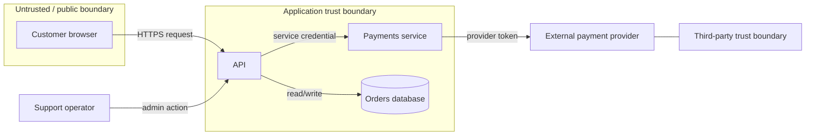
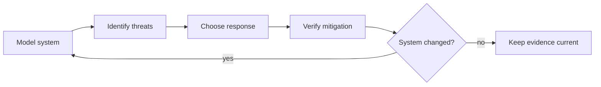
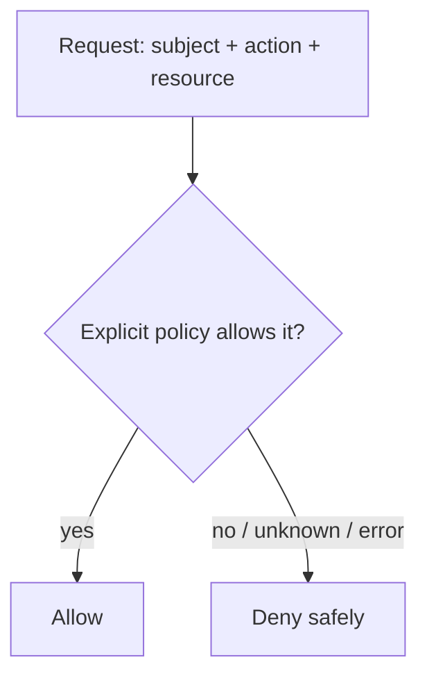
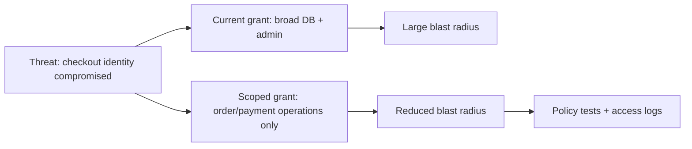

# Threat Modeling & Least Privilege: Design Security Before the Incident

## TL;DR

Threat modeling is a repeatable engineering loop for answering four questions: **what are we building, what can go wrong, what will we do about it, and did we do enough?** Least privilege turns part of that analysis into an enforceable rule: every human, service, process, and token gets only the resources and actions needed for its current function.

A useful threat model is not a document that says “use authentication.” It exposes **data flows and trust boundaries**, names plausible abuse paths, assigns concrete mitigations, and creates checks that can fail when the design drifts.

For authorization, two invariants matter repeatedly:

- **deny-by-default**: access requires an explicit reason to allow it;
- validate authorization on **every request** and for the specific action and resource being requested.

Authentication proves or establishes identity. **Authorization** decides what that identity may do. Confusing the two is a common path to broken access control.

## Model the system before listing threats

Start with the real system, not a generic vulnerability checklist.



Record at least:

- external actors and workloads;
- processes/services;
- sensitive data stores;
- data flows and protocols;
- credentials or identities crossing each boundary;
- trust assumptions that would be dangerous if false.

<TermBox term="Trust boundary">
A **trust boundary** is a place where data or control crosses between contexts with different trust assumptions or authorities.

**Why it matters:** every boundary crossing is a prompt to ask who is authenticated, what is authorized, what input is accepted, which credentials are exposed, and what happens if the other side is compromised.
</TermBox>

## Use a four-question threat-model loop

A practical threat model can stay lightweight while still being rigorous:

1. **What are we working on?** Build a system model with flows, assets, identities, and trust boundaries.
2. **What can go wrong?** Identify abuse cases or threats against those concrete flows. STRIDE can be a prompt, but it is not the goal.
3. **What are we going to do about it?** Choose actionable mitigations with an owner and testable outcome.
4. **Did we do a good enough job?** Review the model, verify mitigations, and update it when the system changes.



A threat model should evolve when you add a new data store, identity provider, queue, admin path, third-party integration, privilege, or network boundary. “Reviewed once before launch” is not a durable security control.

## Turn threats into testable mitigations

Consider the flow `GET /accounts/:accountId`.

A weak mitigation is:

> Users must be authenticated.

That does not answer whether Alice may read Bob's account.

A stronger mitigation is:

- authenticate the caller;
- authorize the `read` action against the **specific account**;
- deny if no policy grants that action;
- perform the check server-side on every request;
- log authorization failures without leaking sensitive data;
- test allowed and denied object relationships.

The threat model becomes useful when the mitigation can be implemented and verified.

## Authentication is not authorization

<TermBox term="Authorization">
**Authentication** establishes who or what an entity is. **Authorization** verifies whether that entity may perform a requested action on a particular resource.

**Why it matters:** a valid session, JWT, mTLS identity, or API key does not imply permission to read every record or invoke every administrative operation.
</TermBox>

A secure request path looks like:

```text
authenticate(identity)
resource = load(request.resource_id)
if !authorize(identity, action, resource):
    deny
perform(action, resource)
```

The authorization decision belongs at a server-side boundary that cannot be bypassed by changing client code. Hiding buttons is user experience, not access control.

### Validate permissions on every request

Do not assume that an earlier page load, gateway check, or authenticated session permanently grants access. Authorization-relevant attributes can change, and alternate routes may reach the same resource.

Check both dimensions:

- **horizontal authorization**: can one ordinary user access another user's resource?
- **vertical authorization**: can a less privileged identity invoke an admin or elevated action?

For APIs, authorize both the operation and the object. An unpredictable UUID does not replace an ownership or policy check.

## Deny-by-default closes policy gaps

Under **deny-by-default**, a request that matches no explicit allow rule is denied.



This matters because policy sets evolve. If a new route or resource type appears without a matching policy, the safer failure mode is denial rather than accidental exposure.

Do not silently fall back to allow when:

- an authorization dependency times out;
- an attribute is missing;
- a policy cannot be parsed;
- a new action has no rule yet.

Availability decisions can be nuanced, but an authorization error should not become a privilege grant by accident.

## Least privilege is about scope and lifetime

NIST describes least privilege as restricting users or processes to the minimum authorizations and resources needed to perform their function.

Apply that principle to more than human roles:

| Identity | Over-broad grant | Better scope |
| --- | --- | --- |
| checkout service | admin on all databases | read/write only required order/payment tables or APIs |
| image worker | full cloud storage account | read input prefix, write output prefix |
| CI job | permanent production owner token | short-lived deployment identity for one environment |
| support user | global customer export | explicit support actions for assigned cases |

Three useful dimensions are:

- **resource scope** — which objects, tenants, projects, tables, buckets, or namespaces?
- **action scope** — read, write, delete, deploy, impersonate, rotate, administer?
- **time scope** — permanent, session-bound, task-bound, or just-in-time?

<TermBox term="Blast radius">
**Blast radius** is the amount of system capability or data that can be affected when one identity, credential, component, or boundary is compromised.

**Why it matters:** least privilege does not guarantee that compromise cannot happen. It limits what the compromise can reach next.
</TermBox>

## Threat modeling and least privilege reinforce each other

A threat model might identify: “If the checkout service is compromised, its database credential can modify customer profiles and IAM records.”

The mitigation is not simply “protect the credential better.” Ask whether checkout needs those privileges at all.



Security controls become stronger when the threat model explains **why** a privilege exists and automated checks prove it has not broadened accidentally.

## Production scenario: authenticated support user reads every tenant

A support portal introduces `GET /customers/:customerId`. The UI only shows customers assigned to the signed-in support agent, and the endpoint requires a valid employee session.

**Impact:** an authenticated agent changes `customerId` in the URL and retrieves another tenant's customer record. The same service credential can also query unrelated billing tables, expanding the impact if the service is compromised.

**Root cause:** the design treated authentication as sufficient authorization. The API did not validate the caller's relationship to the requested customer on every request. The threat model captured “employee access” but did not model the customer-object boundary or horizontal privilege escalation. The service identity also had broader database privileges than the feature required.

**Correct pattern:** model the support-agent → API → customer-record data flow and trust boundaries; authorize every request for the specific customer/action; deny-by-default when no relationship or policy grants access; test cross-tenant denial; and restrict the service identity to only the data and operations needed by the portal. Those controls reduce both the immediate access-control bug and the blast radius of a later compromise.

## Self-check

A background export job uses a long-lived cloud credential with read access to every production bucket because “it may need more datasets later.” The job currently reads one reports prefix. Its threat model lists stolen credentials as a threat but the mitigation says only “rotate secrets regularly.”

What is missing?

<details>
<summary>Show the reasoning</summary>

The mitigation does not address blast radius. Apply least privilege now: give the job a task-appropriate identity that can read only the required reports scope, preferably with short-lived credentials. Then make that boundary testable through IAM policy checks or integration tests. Rotation can reduce credential lifetime, but it does not justify unnecessary resource and action permissions.

The threat model should also be updated when the job genuinely needs another dataset instead of pre-granting speculative future access.

</details>

## Production checklist

- [ ] Model actors, services, data stores, data flows, identities, and every important trust boundary.
- [ ] Identify threats against the actual architecture, not only generic vulnerability categories.
- [ ] Convert important threats into actionable mitigations with owners and verification evidence.
- [ ] Keep authentication and authorization as separate decisions.
- [ ] Enforce authorization server-side for the requested action and resource on every request.
- [ ] Use deny-by-default when no explicit allow rule matches or the authorization decision cannot be made safely.
- [ ] Test horizontal and vertical privilege boundaries, including cross-tenant/object access.
- [ ] Scope human, service, CI, and automation privileges by resource, action, and lifetime.
- [ ] Remove unused privileges instead of accumulating them for hypothetical future work.
- [ ] Revisit the threat model when trust boundaries, integrations, data flows, or privileges change.

## Agent rule

When changing an identity, route, data flow, integration, or privileged action, identify the affected trust boundary and authorization decision before coding. Prefer **deny-by-default**, verify permissions on every request for the concrete action/resource, minimize privilege scope and lifetime, and add machine-checkable evidence for the mitigation. Do not treat successful authentication as proof of authorization.

## References

- OWASP Cheat Sheet Series, **Threat Modeling**: https://cheatsheetseries.owasp.org/cheatsheets/Threat_Modeling_Cheat_Sheet.html
- OWASP Cheat Sheet Series, **Authorization**: https://cheatsheetseries.owasp.org/cheatsheets/Authorization_Cheat_Sheet.html
- NIST CSRC Glossary, **Least Privilege**: https://csrc.nist.gov/glossary/term/least_privilege
- OWASP Top 10:2025, **A01 Broken Access Control**: https://owasp.org/Top10/2025/A01_2025-Broken_Access_Control/
